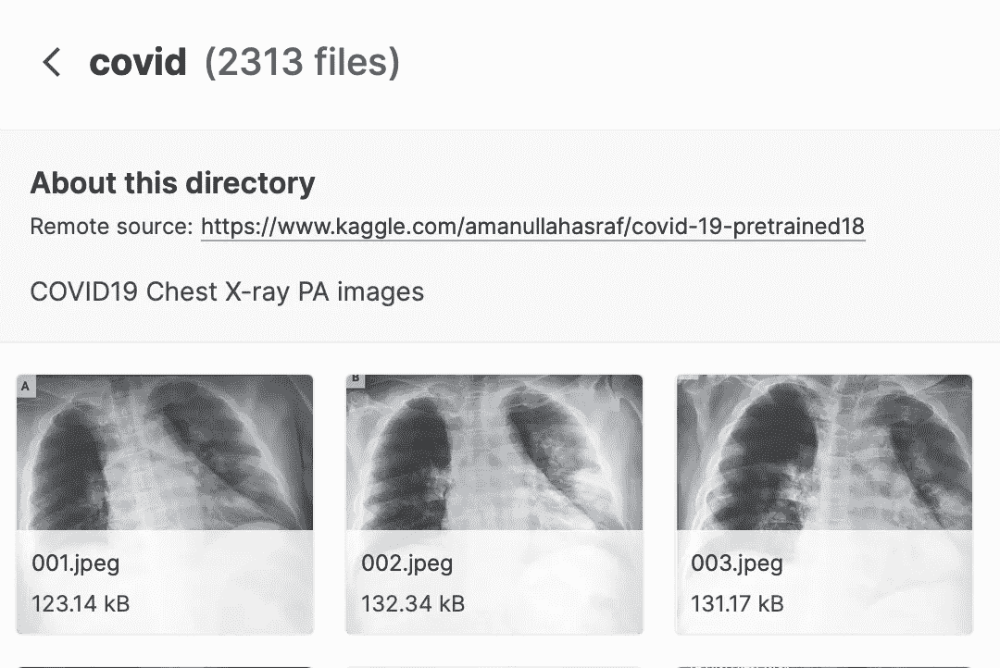
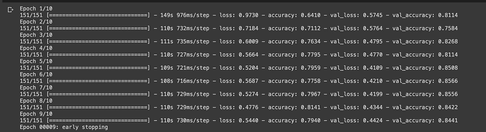

# 提前停止的影像分类—快速教程

> 原文：<https://towardsdatascience.com/image-classification-with-early-stopping-a-quick-tutorial-58d3d346184c?source=collection_archive---------13----------------------->

## 用不到 50 行代码构建和训练一个 Keras 模型


由[亚历克斯·帕杜拉瑞](https://unsplash.com/@alexpadurariu?utm_source=medium&utm_medium=referral)在 [Unsplash](https://unsplash.com?utm_source=medium&utm_medium=referral) 拍摄的照片

Keras 是一个深度学习库，作为数据科学家，我们可能会经常遇到。它是最容易实现和最容易学习的深度学习框架，如果这还不够，锦上添花的是，自从 Tensorflow 2.0 的发展以来，随着它与 Tensorflow 捆绑在一起，使用 Keras 学习和构建变得更加容易。

这篇文章描述了一个项目，它将帮助你明确基础知识，并迅速掌握它们。

所以说，让我们着手建立一个深度神经网络，用于对新冠肺炎胸部 X 射线进行多类分类。

# 数据

我们将使用[这个](https://www.kaggle.com/amanullahasraf/covid19-pneumonia-normal-chest-xray-pa-dataset)数据集，可在 Kaggle 上获得，可在公共领域下获得，与我在上一部分提到的标题相同。

<https://www.kaggle.com/amanullahasraf/covid19-pneumonia-normal-chest-xray-pa-dataset>  

对于分类问题，我们有三种类型的 X 射线——正常的、肺炎的和冠状的。我们的目标是快速开发一个模型，并利用它学习 Keras 深度学习库的基础知识。



来自 [Kaggle](https://www.kaggle.com/amanullahasraf/covid19-pneumonia-normal-chest-xray-pa-dataset) 页面的数据集图像

为了方便起见，请将下载的数据保存在`**‘data/’**`文件夹下。

让我们开始导入我们需要的包:

```
from tensorflow.keras.layers import Conv2D, Flatten, Dense, MaxPooling2D, Dropoutfrom tensorflow.keras.models import Sequentialfrom tensorflow.keras.preprocessing import imagefrom tensorflow.keras.callbacks import EarlyStoppingimport os
```

通常，我们的项目会采用以下结构:

```
image_classification_project/
    classifier.ipynb
    data/
        train/
             normal/
             covid/
             pneumonic/
        valid/
             normal/
             covid/
             pneumonic/
        test/
             normal/
             covid/
             pneumonic/
```

现在，我们继续构建模型并导入数据。

# 导入数据

启动您的本地环境，或者更好的是，运行时设置为“GPU”的 colab 笔记本。

让我们从定义训练和测试数据生成器对象开始:

```
# Data Generators for some data preprocessing and augmentationtrain_datagen = image.ImageDataGenerator(rescale = 1./255, shear_range = 0.2, zoom_range = 0.2, horizontal_flip = True)test_datagen = image.ImageDataGenerator(rescale = 1./255)
```

**ImageDataGenerator** 类为我们的图像分类任务提供了一种简单的加载、预处理和批量扩充图像的方法。

我们现在继续从上一节定义的目录中导入数据:

```
# importing datatraining_set= train_datagen.flow_from_directory(**os.path.join(data, "train"**), target_size = (128, 128), batch_size = 32, class_mode='binary') test_set = test_datagen.flow_from_directory(**os.path.join(data, "valid"**), target_size = (128, 128), batch_size = 32, class_mode='binary')
```

如果您正在使用不同的目录结构，请确保根据您自己的特定设置更改上面代码片段中的粗体部分。

执行上面几行代码后，您将得到以下输出:

```
Found 4830 images belonging to 3 classes. 
Found 1039 images belonging to 3 classes.
```

现在，我们准备检查我们的训练指数。

```
print(training_set.class_indices, test_set.class_indices)
```

您将在执行时看到以下输出:

```
({'covid': 0, 'normal': 1, 'pneumonia': 2},  {'covid': 0, 'normal': 1, 'pneumonia': 2})
```

这与我们的三个图像类可以在以后被引用的方式有关，它有助于看到它们对于训练集和测试集是相同的。

现在，让我们开始建立模型！

# 模型

我们从**序列**对象开始，用 32 个 3x3 内核大小的过滤器(或神经元)添加 2D 卷积层。

我们对每张图片的输入形状是:128x128 像素，3 代表我们的图片是 RGB。

我们将激活函数定义为“ReLU”。

```
# the modelmodel = Sequential()model.add(Conv2D(32, (3, 3), input_shape = (128, 128, 3), activation = 'relu'))model.add(MaxPooling2D(pool_size = (2, 2)))model.add(Conv2D(32, (3, 3), input_shape = (128, 128, 3), activation = 'relu'))model.add(Flatten())model.add(Dense(units = 256, activation = 'relu'))model.add(Dropout(0.5))model.add(Dense(units = 128, activation = 'relu'))model.add(Dense(units = 3, activation = 'softmax'))model.compile(optimizer = 'adam', loss =  'sparse_categorical_crossentropy', metrics = ['accuracy'])model.summary()
```

然后我们添加一个池 **(MaxPooling2D** )层，另一个卷积层和一个全连接(**密集**)层。 **Dropout** 层旨在确保我们的模型不会过度拟合。

我们的最后一层是另一个密集层，在 **softmax** 激活函数的帮助下，也作为我们的输出层，输出 3 个加起来等于 1 的类概率。

# 提前停止

Tensorflow 文档将提前停止描述为:

> 当受监控的指标停止改善时，停止训练。

因为我们想最小化我们的**验证损失**，我们监控它，以便我们的**耐心**参数可以定义在哪个时期停止训练，以防它在许多时期都没有改善。

```
early_stopping = EarlyStopping(monitor='val_loss', mode='min', verbose=1, patience=4)
```

这是我们将在下一步拟合(或训练)模型时包括的回调。

# 训练模型

拟合模型很简单，只需用我们的必要参数调用模型上的拟合函数，例如用于随机梯度下降更新的**批量大小**，以及我们希望整个训练发生的时期数。

```
# Model trainingclassifier = model.fit(training_set, batch_size = 128, epochs = 10, validation_data = test_set, callbacks=[early_stopping])
```

您会注意到，我们还将回调指定为我们之前定义的**提前停止**对象。



详细的训练时期

正如你所看到的，我们的回调产生了必要的效果，没有过度训练我们的模型，并在第九纪元停止。

**作为奖励**，你现在可以用下面的 Keras 内置**保存**功能保存你的模型:

```
model_save_full_path = os.path.join(ROOT, 'saved_models', 'conv2d_version_1_acc_79_84')model.save(model_save_full_path)
```

# 后续步骤

感谢您的阅读！

如果你觉得这个教程很有帮助，并遵循了，下面是我建议在这个教程之后做的事情:

—构建混淆矩阵，直观地表示正确和错误分类的标签数量。

—探索用于评估模型的其他指标，如精确度、召回率和 F1 分数。

—衡量模型在测试数据集上的表现。

如果你想看本教程的下一部分，在其中我描述了上述进一步的步骤，甚至为分类器构建了一个前端，请关注我并保持关注！

[在这里获得我的免费“从模型到生产电子书”](https://yashprakash13.gumroad.com/l/from-model-to-prod-handbook/Limited?_ga=2.51564846.609740814.1637425800-47624061.1637425800&_gl=1*1ge51g1*_ga*NDc2MjQwNjEuMTYzNzQyNTgwMA..*_ga_6LJN6D94N6*MTYzNzQyNTgwMi4xLjEuMTYzNzQyNzM4MC4w),其中我教授了构建深度学习模型并将其部署为 API 的最快方法。

快乐学习！:)