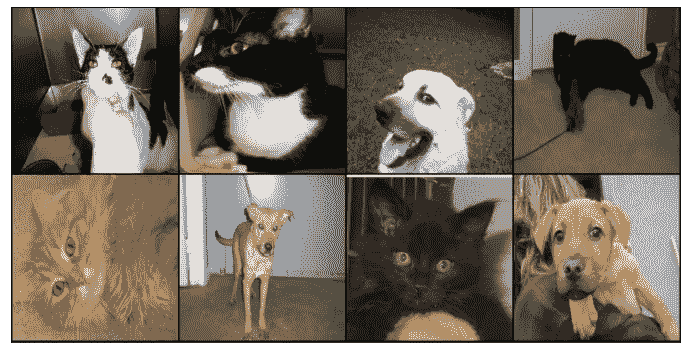
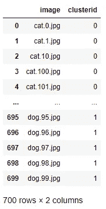

# 基于 k-均值的图像聚类

> 原文：<https://towardsdatascience.com/image-clustering-using-k-means-4a78478d2b83?source=collection_archive---------6----------------------->

## 利用迁移学习模型从图像中提取特征

在图像分类问题中，我们必须将给定的一组图像分类成给定数量的类别。在分类问题中训练数据是可用的，但是当没有训练数据时该怎么办，为了解决这个问题，我们可以使用聚类将相似的图像分组在一起。

聚类是一种无监督的机器学习，我们将相似的特征分组在一起。它解释输入数据，并在特征空间中找到自然组或聚类。

这里我使用了 k-means 进行图像聚类。我拿了猫和狗的数据集。

我已经将猫和狗的图片放在不同的文件夹中，并展示了如何在图片中进行聚类。



数据集的图像

我在 InceptionV3 中使用迁移学习模型从图像中提取特征，并使用这些特征进行聚类。

首先，让我们得到所有需要的库，

```
from tensorflow.keras.applications.inception_v3 import InceptionV3
from tensorflow.keras.applications.inception_v3 import preprocess_input
from tensorflow.keras.preprocessing import image
from tensorflow.keras.preprocessing.image import img_to_array
from sklearn.cluster import KMeans
import pandas as pd
import numpy as np
from tqdm import tqdm
import os
import shutil
```

数据集在 Kaggle 上可用，可以从[这里](https://www.kaggle.com/biaiscience/dogs-vs-cats)下载。我只取了 700 张图片用于聚类，每类 350 张图片。

这些图像放在一个文件夹中，使用迁移学习模型提取特征。下面是使用 InceptionV3 模型从图像中提取特征的方法，我保存了图像名称，以便辨别哪个图像属于哪个聚类。

```
# Function to Extract features from the images
def image_feature(direc):
    model = InceptionV3(weights='imagenet', include_top=False)
    features = [];
    img_name = [];
    for i in tqdm(direc):
        fname='cluster'+'/'+i
        img=image.load_img(fname,target_size=(224,224))
        x = img_to_array(img)
        x=np.expand_dims(x,axis=0)
        x=preprocess_input(x)
        feat=model.predict(x)
        feat=feat.flatten()
        features.append(feat)
        img_name.append(i)
    return features,img_name
```

使用上面的函数，我提取了特征和名称，并将它们存储在 img_features，img_name 中。

```
img_path=os.listdir('cluster')
img_features,img_name=image_feature(img_path)
```

现在，这些提取的特征被用于聚类，k-Means 聚类被使用。下面是 k 均值聚类的代码，k 的值是 2，因为只有 2 个类。

```
#Creating Clusters
k = 2
clusters = KMeans(k, random_state = 40)
clusters.fit(img_features)
```

创建了两个群集，提取的 img_name 被转换为 dataframe，我添加了另一列来显示哪个映像属于哪个群集，之后，我将映像保存在它们各自的群集中。

```
image_cluster = pd.DataFrame(img_name,columns=['image'])
image_cluster["clusterid"] = clusters.labels_
image_cluster # 0 denotes cat and 1 denotes dog
```



集群信息

现在我把猫和狗的图片保存在一个单独的文件夹里。

```
# Made folder to seperate images
os.mkdir('cats')
os.mkdir('dogs')# Images will be seperated according to cluster they belong
for i in range(len(image_cluster)):
    if image_cluster['clusterid'][i]==0:
        shutil.move(os.path.join('cluster', image_cluster['image']               [i]), 'cats')
    else:
        shutil.move(os.path.join('cluster', image_cluster['image'][i]), 'dogs')
```

上面的代码将根据 clusterid 将不同文件中的图像分开。

在这篇博客中，我们讨论了如何使用迁移学习从图像中提取特征，然后执行聚类以将不同文件夹中的猫和狗的图像分开。它可以在我们不知道图像类别的情况下用于标记，因为手动标记将是一个挑战。

本文中的所有代码都驻留在这个 Github [链接](https://github.com/shubham7169/Projects/blob/master/Image_Clustering.ipynb)上:

<https://github.com/shubham7169/Projects/blob/master/Image_Clustering.ipynb> 