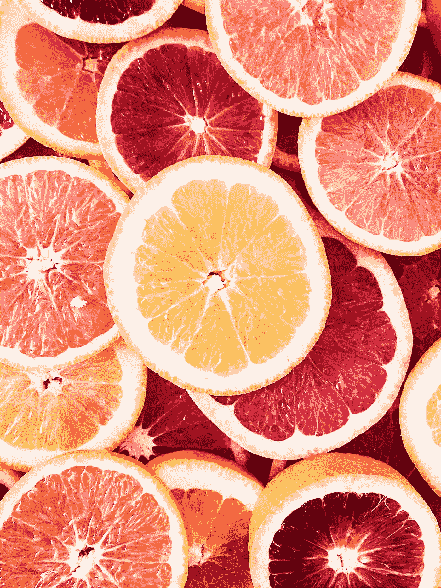

# 图像颜色识别与机器学习和图像处理，使用 Python

> 原文：<https://towardsdatascience.com/image-color-identification-with-machine-learning-and-image-processing-using-python-f3dd0606bdca?source=collection_archive---------16----------------------->

拉娅·索德伯格在 [Unsplash](/s/photos/fruit?utm_source=unsplash&utm_medium=referral&utm_content=creditCopyText) 上的照片

## 用几行代码识别图像的颜色

计算机视觉中一个非常常见的任务就是识别颜色。

更一般地说，学习的一个迷人的方面是，有时我们知道一些事情，但我们无法解释它们。例如，如果我让你描述“红色”,你唯一的选择是给我看一个红色的物体，就像上面报道的红橙色……但是你不能真正解释“红色”是什么。

**为此，需要付出一定的努力将颜色的定义传输给计算机。**

我们开始吧！

## 1.图像

第一步是得到一个图像。我用过这个:

照片由[丹妮拉·奎瓦斯](https://unsplash.com/@danielacuevas?utm_source=unsplash&utm_medium=referral&utm_content=creditCopyText)在 [Unsplash](/s/photos/landscape?utm_source=unsplash&utm_medium=referral&utm_content=creditCopyText) 上拍摄

***这种算法的最大优点是，正如你将看到的，它非常健壮，并且它给出的令人满意的输出完全独立于输入图像，所以你可以选择你自己的照片。***

## 2.图书馆

让我们召唤一些恶魔。您将需要用于机器学习部分的 **Sklearn** 库、用于矢量转换的 **Numpy** 、用于最终摘要的 Pandas 和一些图像处理典型库 **(cv2、skimage、matplotlib.pyplot、…)**

## 3.机器学习部分

[这篇伟大的文章](/color-identification-in-images-machine-learning-application-b26e770c4c71) **给了我们一个非常好的提示**。事实上，主要思想是可以将图像用作(N_rows X N_columns X N_channels)向量。**考虑到** **这个向量，有可能应用 K 均值算法，识别 K 个聚类，那将是我们的颜色。**

**这非常有趣，原因有几个**。首先，它不需要对大量图像进行任何特定的训练。第二个是你可以增加聚类的数量(从而增加颜色的数量)，选择更少或更多的色调。

为此，您将需要以下功能:

这些命令:

*这最后几行可能需要一段时间，但没那么长。此外，这是该过程中唯一“计算量大”的部分。*

一旦完成，你将拥有你的 10 种颜色(我通过设置“颜色数量=10”来选择它们为 10)

他们来了。

特别是，采用颜色的 rgb 编码(rgb_colors list)是很有用的…但我们将在稍后实现。

## 3.图像处理部分

所以我们有自己的颜色。困难的是，虽然我们可以看到它们并识别它们，但我们无法将“标签”列表中的每个元素与其对应的颜色联系起来。实际上， **K Means 是一种无监督的学习方法**。

因此，如果我们想自动检测天空的颜色，并将其与饼图中的一种颜色相关联，我们需要更有创意一些。

主要的想法是非常基本的。事实上，图像是 RGB 编码的。**这意味着，如果我们计算图像和 10 种颜色之一的 rgb 表达式之间的差异，当图像等于颜色时，我们会得到[0，0，0]。**

让我告诉你，这不是正统。其实你会有负像素。但是有用，有用就别碰:)

第一步是技术性的，它基于将 RGB 转换为整数值。

然后，如果我们想要识别图像的颜色，**想法是将这个图像分成更小的方块**。在这种情况下，我选择每个正方形的维数为 N_rows/10 X N_columns/10，因此得到 100 个正方形。这些正方形是通过使用下面的函数得到的。

当然，方块不是单色的。这意味着每个方块将有多种颜色。尽管如此，图像之间的平均距离是我们需要的指标:**我们选择平均来说比其他颜色更接近 0 的颜色**。具体来说，我们通过使用以下函数来实现:

**使用此功能，我们可以为每个方块绘制“最佳颜色”。**

让我展示给你看:

太棒了！不是吗？

## 4.最后的结果

为了**获得该实验对图像所有方块的总结**，可以使用以下函数:

这就是:

> 附注:每一栏下的数字是该特定方块的颜色百分比

# 结论

我们被生活在一个拥有“能看见”的机器的世界的想法吓坏了。虽然这种想法可能令人担忧，因为它是可以理解的，但同时我忍不住认为它非常迷人。我喜欢认为我们在某种程度上是新世界和新自然的创造者…或者也许我只是太累了。

如果你喜欢这篇文章，你想知道更多关于机器学习的知识，或者你只是想问我一些你可以问的问题:

A.在 [**Linkedin**](https://www.linkedin.com/in/pieropaialunga/) 上关注我，在那里我发布我所有的故事
B .订阅我的 [**简讯**](https://piero-paialunga.medium.com/subscribe) 。这会让你了解新的故事，并给你机会发短信给我，让我收到你所有的更正或疑问。
C .成为 [**推荐会员**](https://piero-paialunga.medium.com/membership) ，这样你就不会有任何“本月最大数量的故事”，你可以阅读我(以及成千上万其他机器学习和数据科学顶级作家)写的任何关于最新可用技术的文章。

再见。:)