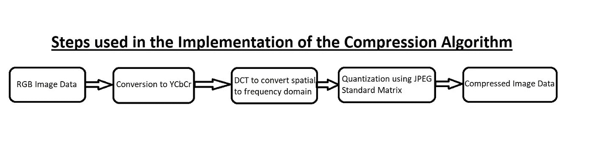
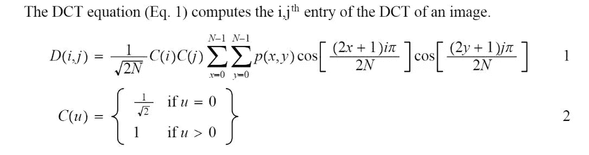
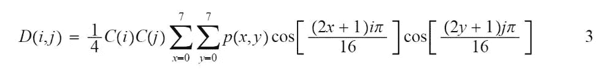
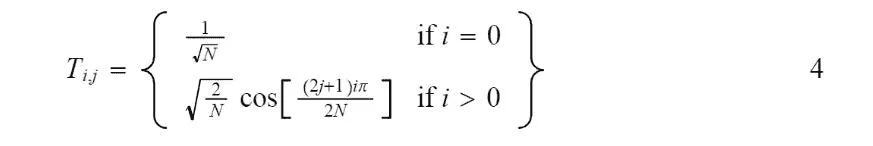
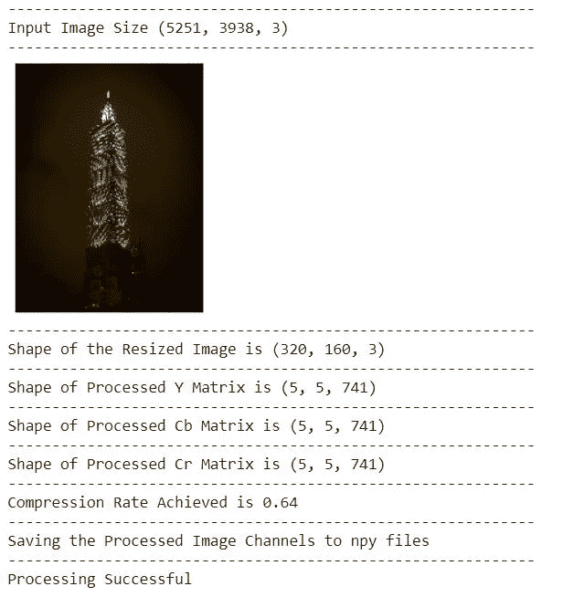
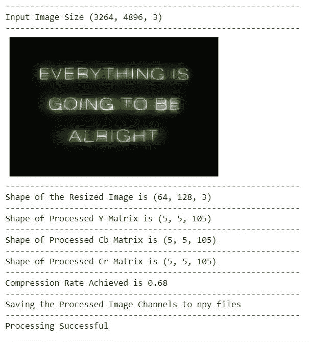

# 图像压缩— DCT 方法

> 原文：<https://towardsdatascience.com/image-compression-dct-method-f2bb79419587?source=collection_archive---------6----------------------->

## 基于 DCT 的图像压缩

[上图显示了实施以下算法](https://github.com/ojaashampiholi/DCT_Analysis/blob/main/dct_equations/block_diagram.jpg)的步骤流程

我们可以看到，近年来计算资源和数据呈指数级增长。尽管计算资源和数据都在增长，但二者的增长率形成了鲜明的对比。我们现在有大量的数据，但没有足够的计算资源来在相当长的时间内处理这些数据。这让我们想到了当今世界面临的一个主要问题。我们如何压缩数据信息，同时保持数据中的大部分信息？

在这个项目中，我们将处理图像信息。应用于图像的压缩主要有两种类型——[无损压缩和有损压缩](https://www.geeksforgeeks.org/difference-between-lossy-compression-and-lossless-compression/)。无损压缩标准的一些例子是 PNG(便携式网络图形)和 PCX(图片交换)。无损压缩保留了所有信息，但压缩率较低。如果我们需要更高的压缩，我们必须考虑有损压缩算法。广泛使用的有损压缩算法之一是 JPEG 压缩算法。 [JPEG 算法](https://www.image-engineering.de/library/technotes/745-how-does-the-jpeg-compression-work#:~:text=The%20JPEG%20compression%20is%20a,setting%20(or%20chose%20presets).)作用于 DCT，这是本项目讨论的主题。

DCT 代表[离散余弦变换](http://fourier.eng.hmc.edu/e161/lectures/dct/node1.html)。它是一种快速计算傅立叶变换，将实信号映射到频域中的相应值。DCT 仅对复信号的实部起作用，因为大多数真实信号是没有复分量的真实信号。我们将在此讨论 DCT 算法在图像数据上的实现及其潜在用途。该项目已被托管在 GitHub 上，你可以在这里查看它。

## 实现图像压缩的 DCT 的步骤:

如果我们有多通道图像，我们需要将算法分别应用于每个通道。在进行 DCT 处理之前，我们必须将 RGB 图像转换成等效的 YCbCr 格式。这里的另一个重要步骤是将像素值的范围从-128 更改为 127，而不是 8 位图像的标准值范围 0 到 255。

图像被分成 N*N 个块。我们这里取 N=8，因为这是 JPEG 算法标准。

接下来，连续地对每个块应用 DCT。

量化用于限制在不丢失信息的情况下可以保存的值的数量。

量化块的子集被存储到一个数组中，可以从该数组中提取该子集以供进一步处理。

我们可以将 IDCT 应用于量化的块，然后按顺序排列 8*8 的块，以获得 YCbCr 图像，然后可以将其转换为 RGB，以获得压缩形式的原始图像。该步骤尚未作为该项目的一部分实施。

## 图像压缩算法实现:

下图给出了 2D DCT 的 DCT 公式。这里，P(x，y)表示输入图像中的像素。

[点击此处阅读更多关于方程式的信息](https://www.math.cuhk.edu.hk/~lmlui/dct.pdf)

然而，当我们处理 JPEG 压缩时，我们总是取 N = 8，这修改了等式并得到下面的等式:

[在这里阅读更多关于方程式的内容](https://www.math.cuhk.edu.hk/~lmlui/dct.pdf)

但是在图像的 8*8 块的每个点上应用这种复杂的标量计算可能是耗时的，因此我们可以进一步简化方程以得出相同的矢量表示。其矢量表示可以如下给出:

[在这里阅读更多关于方程式的内容](https://www.math.cuhk.edu.hk/~lmlui/dct.pdf)

我们通过以下公式计算 DCT

d = DCT _ Matrix @ Image _ Block @ DCT _ MatrixT

8*8 DCT 的量化块已经被直接编码到函数中。然而，用户可以根据进一步的应用选择所需的压缩率。

与高频分量相比，人类视觉系统对图像的低频分量更敏感。因此，我们可以很容易地从图像中丢弃高频分量，而仍然保留图像中的大部分信息内容。在量化之后，大小为 8*8 的经处理的阵列可以被减少到更低的维度。我们在这里取块的 5*5 子集，它仍然保留了大约 95%的信息，同时大小减少了 60.9%(1-(25/64))。这也有助于我们根据输入图像的大小实现 60%到 67%之间的整体压缩率。

## 实验结果:

这里可以找到[输入图像](https://unsplash.com/photos/UEoKkhdkp9I?utm_source=unsplash&utm_medium=referral&utm_content=creditShareLink)(在 Unsplash 上)，这里可以找到[结果](https://github.com/ojaashampiholi/DCT_Analysis/blob/main/results/result_1.JPG)。

这里可以找到[输入图像](https://unsplash.com/photos/aV5bDaal6UE?utm_source=unsplash&utm_medium=referral&utm_content=creditShareLink)(在 Unsplash 上)，这里可以找到[结果](https://github.com/ojaashampiholi/DCT_Analysis/blob/main/results/result_2.JPG)。

## 应用:

图像可以以压缩格式保存，当必须显示时，可以重新转换为 RGB 版本。

经过处理的信息块可以通过通信信道发送，从而消耗较少的带宽。

这种经过处理的 DCT 信息可以作为基于深度学习的计算机视觉任务的输入，这些任务通常需要大量高质量的数据。

作为一名具有电子和电信背景的数据科学家，我主要关注信号处理，我已经看到并研究了应用部分提到的前两部分。我的最终目标是现在实现第三部分。

## 参考资料:

【https://www.math.cuhk.edu.hk/~lmlui/dct.pdf 

[http://fourier.eng.hmc.edu/e161/lectures/dct/node1.html](http://fourier.eng.hmc.edu/e161/lectures/dct/node1.html)