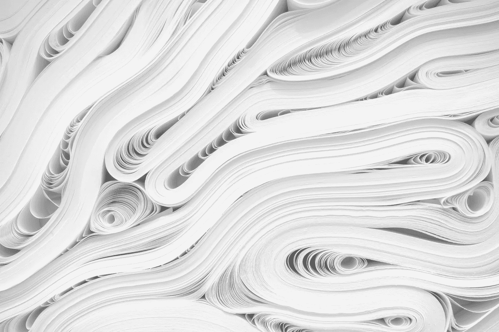
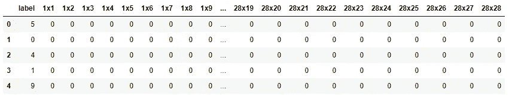
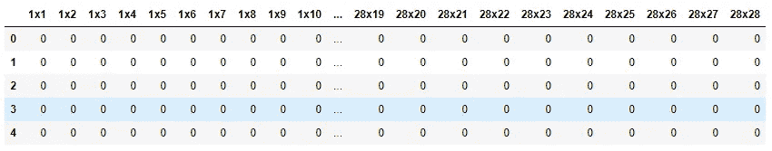
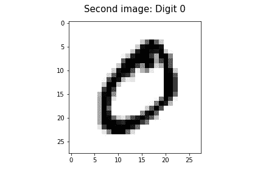
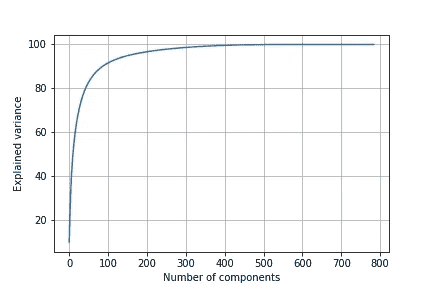
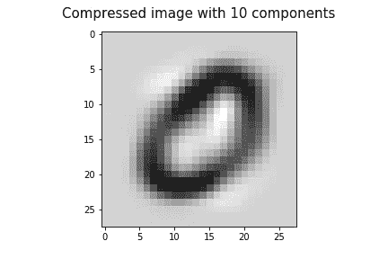
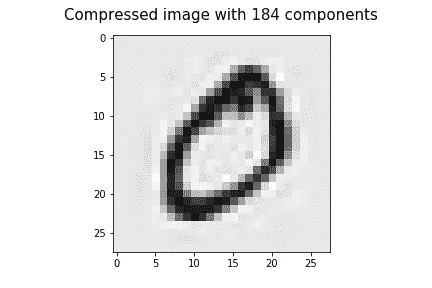
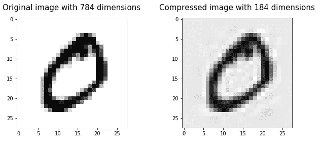

# 使用主成分分析(PCA)的图像压缩

> 原文：<https://towardsdatascience.com/image-compression-using-principal-component-analysis-pca-253f26740a9f?source=collection_archive---------4----------------------->

## 行动中的维度缩减



照片由 [JJ 英](https://unsplash.com/@jjying?utm_source=unsplash&utm_medium=referral&utm_content=creditCopyText)在 [Unsplash](https://unsplash.com/?utm_source=unsplash&utm_medium=referral&utm_content=creditCopyText)

**主成分分析(PCA)** 是一种线性降维技术(算法)，它将一组相关变量(p)转化为更小的 k (k < p)个不相关变量，称为 ***主成分*** ，同时尽可能保留原始数据中的可变性。

PCA 的一个用例是，它可以用于 ***图像压缩***——一种在尽可能保持图像质量的同时最小化图像字节大小的技术。在本帖中，我们将通过使用手写数字的 [MNIST 数据集](https://drive.google.com/file/d/1hboV-OLFfazEzV9tRqz7Nf1uoHU9jYO3/view?usp=sharing)来讨论这项技术。阅读完本文后，您将获得使用 Python 和 Scikit-learn 进行 PCA 图像压缩的实践经验。

我们开始吧！

# 加载数据集

[MNIST 数据集](https://drive.google.com/file/d/1hboV-OLFfazEzV9tRqz7Nf1uoHU9jYO3/view?usp=sharing)包含手写数字的图像数据。因为它是 CSV 文件格式，所以让我们使用 Pandas **read_csv()** 函数加载它。

```
import pandas as pd
mnist = pd.read_csv('mnist.csv')
mnist.head()
```



MNIST 数据集的一部分(图片由作者提供)

每行包含一个单一图像的像素值。构成图像的像素可以被认为是图像数据的维度(列/变量)。**‘标签’**列包含数字的值(0-9)。我们的分析不需要该列，因为 PCA 是一种无监督的机器学习任务，不处理标记为的*数据。因此，我们可以简单地删除该列。*

```
mnist.drop(columns='label', inplace=True)
mnist.head()
```



移除**标签**栏后的 MNIST 数据(图片由作者提供)

现在，数据集的形状是:

```
mnist.shape
#(60000, 784)
```

该数据集包含 60，000 张 28x28 (784)像素的图像！

# 显示图像

让我们显示 MNIST 数据集中的第二幅图像(第二行)。该图像应包含**数字“0”**，因为第 2 行的标签列值为“0”。

等到加载 Python 代码！



图片 1(作者图片)

哇！是数字 0！

# 特征缩放

由于 PCA 方向对数据的尺度高度敏感，如果数据不是在相似的尺度上测量的，我们必须在应用 PCA 之前进行特征缩放。

在 MNIST 数据集中，每幅图像的像素值范围为 0 到 255(相似的比例)。例如:

```
#2nd image
print(mnist.iloc[1].min())
print(mnist.iloc[1].max())
#0
#255
```

因为我们的数据是在相似的尺度上测量的，所以我们不需要对 PCA 进行特征缩放。

# 应用 PCA

## **选择正确的维度数量**

首先，我们需要选择正确的维数(即正确的主成分数)。为此，我们应用具有原始维数(即 784)的 PCA，并创建 scree 图，以查看 PCA 如何捕捉数据的方差。

等到加载 Python 代码！



将方差解释为组件数量的函数(图片由作者提供)

让我们尝试使用前 10 个组件来压缩图像。这些组件没有捕捉到原始数据中的很多可变性。所以，我们不会得到一个清晰的图像。

等到加载 Python 代码！



(图片由作者提供)

将此与我们之前获得的图像 1(原始图像)进行比较。这个图像不是很清晰，缺乏信息。

让我们尝试使用前 184 个组件来压缩图像。最初的 184 个成分捕获了原始数据中大约 96%的可变性。所以，这一次，我们将得到一个非常清晰的图像，与原始图像非常相似。

等到加载 Python 代码！



(图片由作者提供)

我们还可以计算 184 个成分的解释方差:

```
np.cumsum(pca_184.explained_variance_ratio_ * 100)[-1]
#96.11980535398752
```

是 96.1%。

将压缩图像与原始图像进行比较:



(图片由作者提供)

这就是我们如何使用 PCA 进行图像压缩。左边的图片是 784 维的原图。右边的图像是 184 维的压缩图像。在对图像数据应用 PCA 后，维数减少了 600 维，同时保持了原始图像数据中约 96%的可变性！通过比较这两幅图像，可以看到图像质量略有损失，但压缩后的图像内容仍然可见！

# 摘要

今天，我们讨论了如何使用 PCA 进行图像压缩。当维度或组件的数量增加时，图像质量损失减少。我们应该始终努力保持最佳数量的组件，以平衡解释的可变性和图像质量。

*pca* 对象的 **inverse_transform()** 方法用于将缩减的数据集解压缩回 784 维。这对于可视化压缩图像非常有用！

感谢阅读！

本教程由[*Rukshan Pramoditha*](https://www.linkedin.com/in/rukshan-manorathna-700a3916b/)*，*数据科学 365 博客作者设计创作。

在[https://rukshanpramoditha.medium.com](https://rukshanpramoditha.medium.com/)阅读我的其他文章

2021–04–12