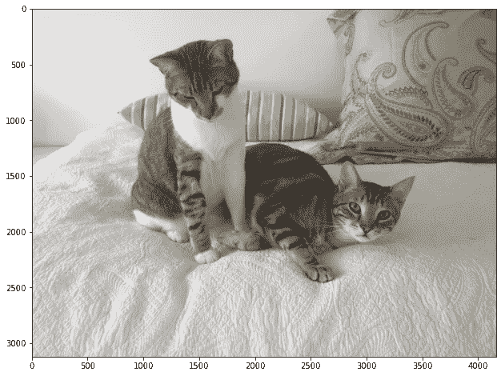
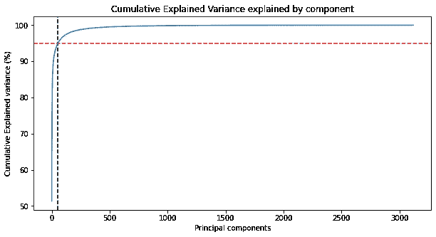
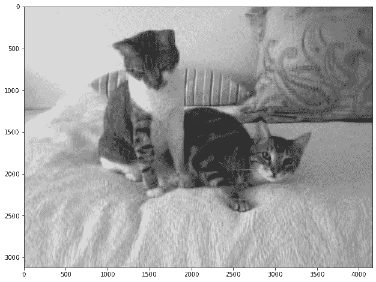
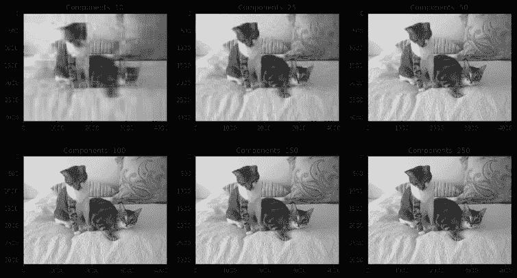

# 通过图像压缩实现主成分分析的魔力

> 原文：<https://towardsdatascience.com/image-compression-with-pca-a0595f57940c?source=collection_archive---------14----------------------->

## 利用图像精美演示 PCA


Erik Mclean 在 [Unsplash](https://unsplash.com?utm_source=medium&utm_medium=referral) 上拍摄的照片

# 什么是 PCA？

主成分分析(PCA)是一种*降维技术*，用于具有许多*连续*(数字)特征或维度的数据集。它使用线性代数来确定数据集最重要的特征。在识别出这些特征之后，你可以只使用这些特征来训练机器学习模型，并在不牺牲准确性的情况下提高性能。正如我的一个好朋友兼导师所说:

> “PCA 是你机器学习工具箱中的主力。”

PCA 找到具有最大方差的轴，并将这些点投影到该轴上。PCA 使用线性代数中的一个概念，称为特征向量和特征值。 [**栈交换**](https://stats.stackexchange.com/questions/2691/making-sense-of-principal-component-analysis-eigenvectors-eigenvalues/140579) 上有个帖子很漂亮的解释了一下。

# 图像压缩

PCA 在用于压缩图像时得到了很好的演示。图像只不过是一个像素网格和一个颜色值。让我们将一个图像加载到一个数组中，并观察它的形状。我们将使用来自`matplotlib`的`imread`。

```
import numpy as np
import matplotlib.pyplot as plt
from matplotlib.image import imread

image_raw = imread("cat.jpg")
print(image_raw.shape)
```

```
(3120, 4160, 3)
```

```
plt.figure(figsize=[12,8])
plt.imshow(image_raw)
```



作者图片

结果显示一个矩阵的大小`(3120, 4160, 3)`。第一个是图像的高度，第二个是宽度，第三个是 RGB 值的三个通道。考虑到这张图片的维度数量，您可以看到与经典的表格数据集相比，这是相当大的，尤其是当我们想到 3120 个*列*时。

在我们继续之前，让我们把它改成灰度图像，去掉 RGB 值。

```
# Show the new shape of the image
image_sum = image_raw.sum(axis=2)
print(image_sum.shape)

# Show the max value at any point.  1.0 = Black, 0.0 = White
image_bw = image_sum/image_sum.max()
print(image_bw.max())
```

```
(3120, 4160)
1.0
```

# 计算解释方差

接下来，我们可以`fit`使用 Scikit-Learn 中的 PCA 处理我们的灰度图像。在图像拟合之后，我们有了方法`pca.explained_variance_ratio_,`，它返回由每个主成分解释的方差的百分比。利用`np.cumsum`，我们可以累加每个分量的每个方差，直到它达到`100%`。我们将把它画在一条线上，并显示解释方差的`95%`在哪里。

```
import numpy as np
from sklearn.decomposition import PCA, IncrementalPCA

pca = PCA()
pca.fit(image_bw)

# Getting the cumulative variance
var_cumu = np.cumsum(pca.explained_variance_ratio_)*100

# How many PCs explain 95% of the variance?
k = np.argmax(var_cumu>95)
print("Number of components explaining 95% variance: "+ str(k))
#print("\n")

plt.figure(figsize=[10,5])
plt.title('Cumulative Explained Variance explained by component')
plt.ylabel('Cumulative Explained variance (%)')
plt.xlabel('Principal components')
plt.axvline(x=k, color="k", linestyle="--")
plt.axhline(y=95, color="r", linestyle="--")
ax = plt.plot(var_cumu)
```

```
Number of components explaining 95% variance: 54
```



作者图片

首先，我想指出一些事情。通过打印组件的长度，我们可以看到总共有`3120`个组件，显示了组件的数量与图像宽度的关系。

```
len(pca.components_)
```

```
3120
```

通过绘制这个图，我们可以看到曲线是如何戏剧性地向`100%`加速，然后变平。疯狂的是，我们只需要用原来`3120`组件的`54`来解释图像中方差的`95%`！这太不可思议了。

# 利用主成分分析降低维数

我们将使用来自`IncrementalPCA`模块的`fit_transform`方法，首先找到`54`主成分，并转换和表示这些`54`新成分中的数据。接下来，我们将使用`inverse_transform`方法从这些`54`组件中重建原始矩阵。最后，我们将绘制图像，从视觉上评估其质量。

```
ipca = IncrementalPCA(n_components=k)
image_recon = ipca.inverse_transform(ipca.fit_transform(image_bw))

# Plotting the reconstructed image
plt.figure(figsize=[12,8])
plt.imshow(image_recon,cmap = plt.cm.gray)
```



作者图片

我们可以清楚地看到图像的质量降低了，但我们可以将其识别为原始图像。当 PCA 与机器学习模型(如图像分类)一起应用时，两种训练时间都显著减少，对新数据的预测时间产生几乎一样好的结果，但数据更少。

# 显示 k 维的其他值

接下来，让我们对我们的图像的六个不同的 k 值进行迭代，显示在每个数字上逐渐提高的图像质量。我们将只去`250`组件，仍然只是原始图像的一小部分。

```
def plot_at_k(k):
    ipca = IncrementalPCA(n_components=k)
    image_recon = ipca.inverse_transform(ipca.fit_transform(image_bw))
    plt.imshow(image_recon,cmap = plt.cm.gray)

ks = [10, 25, 50, 100, 150, 250]

plt.figure(figsize=[15,9])

for i in range(6):
    plt.subplot(2,3,i+1)
    plot_at_k(ks[i])
    plt.title("Components: "+str(ks[i]))

plt.subplots_adjust(wspace=0.2, hspace=0.0)
plt.show()
```



作者图片

# 结论

就是这样！少到`10`的组件甚至让我们分辨出图像是什么，在`250`很难说出原始图像和 PCA 缩小图像之间的区别。

PCA 是一个非常强大的工具，可以集成到您的工作流程中(通过[管道](https://scikit-learn.org/stable/auto_examples/compose/plot_column_transformer_mixed_types.html#sphx-glr-auto-examples-compose-plot-column-transformer-mixed-types-py))，以大幅减少数据集中*维度*的数量，而不会丢失太多信息。请记住，PCA 是为连续或数字数据使用而设计的。查看这篇文章， [PCA 清楚地解释了](/pca-clearly-explained-how-when-why-to-use-it-and-feature-importance-a-guide-in-python-7c274582c37e)，了解更多细节和 PCA 背后的数学原理。感谢阅读，并享受！

如果你喜欢阅读这样的故事，并想支持我成为一名作家，可以考虑报名成为一名媒体成员。一个月 5 美元，让你可以无限制地访问成千上万篇文章。如果你使用[我的链接](https://medium.com/@broepke/membership)注册，我会赚一小笔佣金，不需要你额外付费。