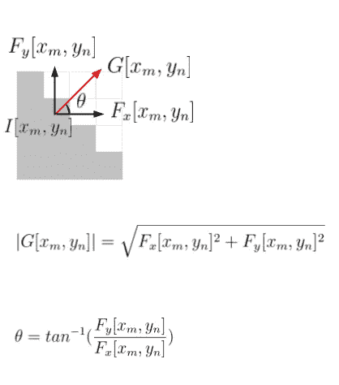

# 图像导数

> 原文：<https://towardsdatascience.com/image-derivative-8a07a4118550?source=collection_archive---------9----------------------->

图片来源[链接](https://www.instagram.com/p/BrxcygVFiNI/)，经作者允许编辑

## [思想和理论](https://towardsdatascience.com/tagged/thoughts-and-theory)

## 图像一阶导数的分析

在卷积网络中，靠近输入的图层用于提取空间要素。这种行为受到了当我们被叫去识别一个物体时，人类视觉系统中发生的事情的启发。我们大脑解码的第一个信息是形状、颜色、纹理的存在、光线的方向和边缘。我们从世界中提取一般信息，当我们处理这些信息时，将允许我们获得越来越多的抽象信息来识别物体。

在本文中，我们将重点关注边缘检测，或者说图像一阶导数的计算，看看连续世界和离散世界之间的差异。最后，我们将通过两个求导算子来分析卷积过程，并突出它们的优缺点。

# 1.连续微分的概念

在数学上，导数表达了函数相对于发展方向的局部可变性的**率。关于这一点，让我们考虑一个信号 *f* :只有一个发展方向 *x* 的ℝ→ ℝ，让 *xi* 成为其定义域中的一个点。我们想要获得的信息是在工作点 *xi* ( *局部可变性*)的信号 f 是发生变化(*增加或减少*)还是保持恒定。这个想法可以是研究工作点的周围或者更好的:(I)评估 *xi* 中的*f*(ii)评估 *xi* 中的 *f* 加上一个无穷小量*ε*(iii)计算两者之间的差。这是在一阶导数的计算中发生的，我们可以用公式(1)来形式化。**

公式(1)

> 如果函数的增量比的极限存在并且是有限的，则函数 f 在工作点 xi 是可导的，因为自变量的ε增量趋于零。

**多维**函数对下面的讨论特别重要。设 *f* : ℝ^n → ℝ是定义在 *n* 发展方向上的标量场，导数的计算通过考虑**偏一阶导数**，或者更确切地说是关于每个 *n* 方向的导数来完成。后者构成了**梯度** ∇( *f* ) : ℝ^n → ℝ，一个关联到标量场 a 矢量的每个 *n* 维点的矢量场。梯度为每个点提供了三条重要的信息。第一个是*模数*，表示函数 *f* 在工作点附近的变化量，第二个是函数在计算点的增长*对*，第三个是*方向*，与标量场的轮廓线正交。在图 1 中可以找到图形表示，其中考虑了ℝ的标量场 *f(x，y)* = *x* + *y* 。

图 1: (a)示出了在函数 f(x，y) = x +y 的 C1 水平曲线上取的点(xi，yj)的梯度向量∇f(xi,yj 的微积分。我们注意到，梯度向量在该点的模由沿 x 和 y 的变化的和(PitagoraTheorem)给出，而方向通过计算角度θ给出。另一方面，相对取决于 f 的最大变化(在这种情况下，朝向曲线外侧)。在(b)中，我们展示了函数 f(x，y) = x +y 的向量场∇f 的构造。我们注意到，当我们沿着 x 和 y 增长时，这次在水平曲线上的不同点计算的梯度向量趋向于更大(更高的模数)。这是因为，由于梯度模数高于梯度模数，梯度向量趋向于更大。
这是因为，由于点中梯度的大小就是变化量，x 和 y 的值增加得越多，f 的变化就越大。(来源:图片由我提供)

# 2.边缘检测

设 I[x，y]为我们在两个发展方向上的形象，分别为 x ( *宽*和 y ( *高*)。我们将边缘定义为 I[x，y]的一个区域，在该区域中颜色强度发生了**变化**图 2

图 2 .我们可以在图像分析中找到的三种边缘的表示(图片由我提供，灵感来自 source [link](http://vision.stanford.edu/teaching/cs131_fall1718/files/05_edges.pdf) pg.90)

*边缘检测*旨在通过计算图像的*梯度来突出这种变化。我们知道，梯度是由偏导数组成的。如第 1 节所述，它们的形式化在连续世界中是有效的。另一方面，图像是一个离散的**多维信号**。*

**2.1 离散偏导数**

*离散多维度*的特征包括通过**有限差分**对**连续偏一阶导数**的近似，其中ε增量不趋向于抵消(ϵ → 0)而是呈现有限值。在我们的离散信号 I[x，y]的情况下，增量值等于一个像素。**对于给定的像素[ *xm，yn* ]，我们可以在它周围移动以评估局部变化率的最小量**正是该像素。形式化，我们可以区分三种有限差分:( *a* )向前(b)向后(c)中心。

当我们谈论图像时，最著名的运算之一是*卷积*。给定一个矩阵 K ( *核*),**卷积**使 K 沿着图像 I 的高度和宽度滑动一定的**步距**，对核的值和图像的重叠区域进行加权求和。通过适当的核变换，这种技术是我们通过**计算在两个发展方向上的偏一阶导数**来对图像应用有限差分的技术。表 1 给出了上述内容的总结和形式化。在*计算机视觉*领域，特别是对于*边缘检测*，使用了中心或也称为**对称微分**。

表 1:发展方向 x 和 y 上的向前、向后和中心三类有限差分以及二维工作点[xm，yn]的形式化。每一个都与对应的发展方向 x 的 1×3 维和发展方向 y 的 3×1 的核表示相关联

**2.2 离散梯度**

卷积产生新的图像，称为*特征图(F)* ，在高度和宽度方面具有与 I 相同的尺寸(**跨距= 1 和填充=‘相同’**)，并且其中强调了 I 的具体特征。作为一个例子，如果我们计算 I[x，y]和 Kx 之间的卷积(*关于 x* 的导出核)，结果将是新的图像 Fx，其中*垂直边缘*将具有非零强度值，这对水平边缘*不利。*特别是，我们可以说:

> 像素 Fx[xm，yn]的**强度值**对应于点 I[xm，yn]处的**偏一阶导数**的**值**。

考虑 Ky ( *关于 y* 的求导核)也可以进行同样的分析。

图 3:使用图像 I[x，y]作为离散信号计算梯度的模数和方向。(图片来源:图片由我提供)

一旦获得偏导数的值，我们就可以计算**梯度 G** 。后者将把关于*模数*的信息与每个像素 I[xm，yn]相关联，该信息将指示围绕[xm，yn]的图像的变化量或幅度，以及关于*方向*的信息，该信息将表示感兴趣的像素周围的颜色强度的增长 h **的**方向。图 3 显示了已经说过的内容的几何表示。因为我们是在离散的世界中，在图 4 中可以找到一个更正确的表示****

图 4: (a)示出了图像 I[x，y],在相应的发展方向上具有两个边缘。(b)表示 Fx = I*Kx，或者更确切地说,( a)相对于 x 的导数。我们注意到垂直边缘相对于水平边缘是如何突出显示的。在(c)中，Fy = I*Ky，或者更确切地说，表示相对于 y 的导数。在这种情况下，行为与我们在(b)中看到的相反。图(d)、(e)、(f)报告了关于梯度的信息。特别地，对于(d ),我们有 Fx 和 Fy 的 Pitagora 和。结果是幅度或模数|G[x，y]|。在(e)和(f)中，表示了梯度的增长方向。正如我们所看到的，(e)显示了边缘上每个像素的梯度的预期方向。后者用于指示感兴趣像素周围的颜色强度的增长**，在这种情况下，颜色强度从 0 到 255。我们可以通过图像(f)来表示这些信息。角度θ表示渐变的方向，它将左上角的像素视为笛卡尔轴和 y 轴的交点，方向与标准方向相反。(图片来源:图片由我提供)**

为了讨论的完整性，下面给出了用于获得图 5 中的示例的代码。可以看出，Kx 和 Ky 都是值-1 的预乘。更多详情请见附录 2。

# 3.噪音

图像可能呈现**颜色强度的随机变化。**这种现象被称为**数字噪声**，尤其发生在光线较暗的情况下，在高 ISO 值或其他情况下，可以由传感器本身引入( *ex* : CMOS)。对于边缘检测，**噪声可以消除边缘**的存在。

在这方面，让我们考虑添加了噪声的图像 I[x，y](在本例中为*椒盐噪声*)并绘制强度直方图(表 2)。我们注意到，与没有噪声的情况相比，曲线更加波动，呈现出几个称为*假边缘*的峰值。导数将突出显示它们中的每一个，丢失关于*真实边缘*的信息。

表 2:在有和没有椒盐噪声的情况下对相同图像 I[x，y]计算的导数的比较(来源:Image by me)

减少*假边缘*的一种方法是模糊图像。模糊的类型和数量取决于噪声的强度。下面介绍一些与 Kx 和 Ky *衍生内核*相结合的图像模糊技术。

**3.1 移动平均模糊:Prewitt 算子**

图 5:识别垂直边缘的 Prewitt 算子

从图 5 中可以看出，Prewitt 算子由几个大小为 1×3 的对称导数核堆叠而成。具体来说，可以通过三像素移动*平均核*和*导数核之间的矩阵乘积进行分解。*在文献中，我们可以找到这个算符被 1/9 而不是 1/3 预乘。在这种情况下，我们将考虑 3x3 衍生内核的所有像素来执行*平均*，从而减少噪声量。对于沿 y 方向的导数核，可以进行相同的考虑。

**3.2 高斯滤波器模糊:索贝尔算子**

图 6:用于垂直边缘识别的 Sobel 算子(来源:me 提供的图片)

**Sobel 算子**通过计算高斯滤波器的导数得到。特别是可以通过*离散高斯滤波器*和*导数核*之间的矩阵乘积进行分解。图 6 给出了一个沿 x 轴的大小为 3×3 的 Sobel 算子的例子。对于沿 y 轴方向的导数核，可以进行同样的考虑。

# 4.衍生内核导致的问题

假设我们的图像中有一个*阶梯边缘*。应用*衍生内核*，特别是*中心*，边缘由最少两个像素表示。如果我们有一个*斜坡*或一个*根部边缘*，像素的数量就会增加。同样的现象不仅可以由边缘本身的性质引起，而且首先可以由图像的模糊引起，因此使用 Sobel 和 Prewitt 算子。

同样，如前一节所述，噪声的存在会导致边缘信息的丢失和*假边缘*的识别。模糊可以减少这种现象，但不能完全消除它。图 7 给出了一个例子，其中在模糊处理之后*错误边缘*仍然存在。

图 7:在对图 4 (a)的图像应用 Sobel 算子执行模糊和推导过程之后的错误边缘的识别，其中添加了椒盐噪声和二进制阈值处理(来源:Image by me)

这些影响可以通过使用 *Canny、*边缘检测器来减少，该边缘检测器将非最大抑制和边缘链接过程应用于由 Sobel 算子获得的结果，分别减少边缘的厚度和假阳性的存在。

# 附录

1.  **计算|G[xm，yn]|**

如第 2.2 段所述，梯度模量的计算考虑了关于 *x* 和 *y* 发展方向的导数值之间的皮塔哥拉和。如果我们认为必须在 25/30 *fps* ( *帧每秒*)上应用后者，则后者在计算方面可能是昂贵的，除非进行二次采样。为了减轻计算负荷，梯度的模数可以使用公式(2)来近似。

公式(2)

**2。卷积**

在连续世界中，两个信号 *f(t)* 和 *g(t)* 之间的卷积导致(I)在支持变量(*例如* τ)中表达两个函数，(ii)假设沿着新方向滑动的是 g(τ)，相对于其 y 轴翻转函数*g*(*g*(-τ))(iii)添加变量 t 以允许滑动(iv)此时，计算 dτ [3][4]中的 *f* (τ) g(t-τ)的积分。

*scipy.ndimage* 库的 *convolve()* 方法实现了这一点。因此，为了正确计算内核 *Kx* 和 *Ky* ，我们需要将它们预乘-1。此时，应用*卷积()*方法，特别是点( *ii* )，我们得到了正确的滤波器值(表 3)

表 3:翻转和执行 scipy.ndimage.convolve()方法后的衍生内核表示。(图片来源:图片由我提供)

不反转导数核并执行卷积将导致误读导数值和梯度方向的信息。梯度的模数不受影响，因为它是由正和形成的。图 8 中显示了一个示例。正如我们所看到的，对于从强度值 255 过渡到 0 的左边缘，我们预计导数为负，但我们得到的是增长值。对于右边缘可以进行同样的考虑。

图 8:没有导数核 Kx 翻转的导数计算的表示。(图片来源:图片由我提供)

# 参考

[1] [衍生—维基百科](https://en.wikipedia.org/wiki/Derivative)

[2] [第五讲:边缘检测——斯坦福大学](http://vision.stanford.edu/teaching/cs131_fall1718/files/05_edges.pdf)

[3] [卷积:定义—维基百科](https://en.wikipedia.org/wiki/Convolution#Definition)

[4] [卷积:举例—维基百科](https://en.wikipedia.org/wiki/File:Convolution3.svg)