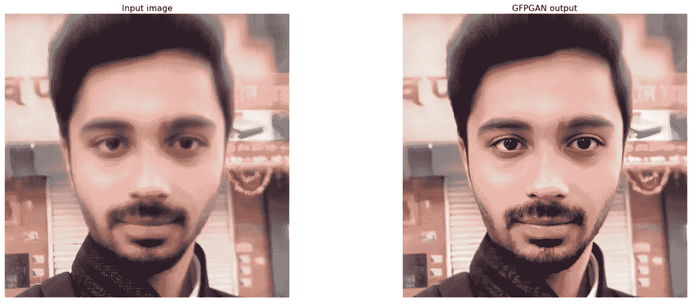
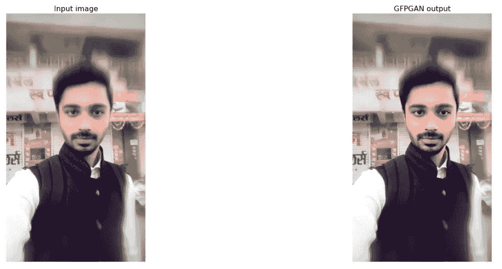

# 使用 GFPGAN 的图像增强

> 原文：<https://towardsdatascience.com/image-enhancement-using-gfpgan-4210d6815055?source=collection_archive---------7----------------------->

## 利用 GFPGAN 恢复模糊图像



来源:作者

随着使用深度学习的图像处理的出现，我们已经看到了 N 个预训练模型，它们不仅处理图像，还增强了它们的属性，你可能已经看到了多个为图像带来生命的深度赝品视频。

深度学习领域的主要进步之一，神经网络是生成性对抗网络的引入，它是深度假货和所有主要图像处理背后的大脑，增强了功能。

GAN 是一类机器学习框架，有助于生成与训练数据具有相同统计属性的新数据。监督学习模型由两个子模型组成，生成器模型用于生成新数据，鉴别器模型用于从训练数据中鉴别新数据。

如今，GAN 因其增强图像、创建新图像或视频等功能而广受欢迎。有多个预先训练好的 GAN 模型，任何人都可以直接使用。有多种基于 GAN 的图像增强应用非常受欢迎。

在本文中，我们将讨论一个这样的预训练 GAN 模型，即生成面部先验生成对抗网络，它有助于恢复面部图像并在图像模糊时对其进行增强。它很容易使用，因为它是一个预先训练的模型，我们不需要再次训练它。我们将使用这个模型，并增强模糊的图像。

让我们开始吧…

# 安装所需的库

我们将从使用 pip 安装安装依赖项和克隆 Github 存储库 GFPGAN 开始。下面给出的命令可以做到这一点。

```
# Clone GFPGAN and enter the GFPGAN folder
%cd /content
!rm -rf GFPGAN
!git clone [https://github.com/TencentARC/GFPGAN.git](https://github.com/TencentARC/GFPGAN.git)
%cd GFPGAN# Set up the environment
# Install basicsr - [https://github.com/xinntao/BasicSR](https://github.com/xinntao/BasicSR)
# We use BasicSR for both training and inference
!pip install basicsr
# Install facexlib - [https://github.com/xinntao/facexlib](https://github.com/xinntao/facexlib)
# We use face detection and face restoration helper in the facexlib package
!pip install facexlib
# Install other depencencies
!pip install -r requirements.txt
!python setup.py develop
!pip install realesrgan  # used for enhancing the background (non-face) regions
# Download the pre-trained model
!wget [https://github.com/TencentARC/GFPGAN/releases/download/v0.2.0/GFPGANCleanv1-NoCE-C2.pth](https://github.com/TencentARC/GFPGAN/releases/download/v0.2.0/GFPGANCleanv1-NoCE-C2.pth) -P experiments/pretrained_models
```

# 导入所需的库

在这一步中，我们将导入 GFPGAN 和映像恢复所需的所有库。

```
import os
from google.colab import files
import shutil
```

# 上传图像

现在，我们将从读取用户的图像开始。

```
# upload your own images
upload_folder = 'inputs/upload'if os.path.isdir(upload_folder):
    shutil.rmtree(upload_folder)
os.mkdir(upload_folder)# upload images
uploaded = files.upload()
for filename in uploaded.keys():

  dst_path = os.path.join(upload_folder, filename)
  print(f'move {filename} to {dst_path}')
  shutil.move(filename, dst_path)
```

# 图像恢复

上传图像后，让我们使用 GFPGAN 来恢复模糊的图像并增强它。

```
# Now we use the GFPGAN to restore the above low-quality images
!rm -rf results
!python inference_gfpgan.py --upscale 2 --test_path inputs/upload --save_root results --model_path experiments/pretrained_models/GFPGANCleanv1-NoCE-C2.pth --bg_upsampler realesrgan!ls results/cmp
```


来源:作者

# 可视化增强的图像

现在最后一步是可视化增强的图像，为了可视化我们将使用 cv2 和 matplotlib。

```
# Now we use the GFPGAN to restore the above low-quality images
# We use [Real-ESRGAN]([https://github.com/xinntao/Real-ESRGAN](https://github.com/xinntao/Real-ESRGAN)) for enhancing the background (non-face) regions
!rm -rf results# We first visualize the cropped faces
# The left are the inputs images; the right are the results of GFPGANimport cv2
import matplotlib.pyplot as plt
def display(img1, img2):
  fig = plt.figure(figsize=(25, 10))
  ax1 = fig.add_subplot(1, 2, 1) 
  plt.title('Input image', fontsize=16)
  ax1.axis('off')
  ax2 = fig.add_subplot(1, 2, 2)
  plt.title('GFPGAN output', fontsize=16)
  ax2.axis('off')
  ax1.imshow(img1)
  ax2.imshow(img2)
def imread(img_path):
  img = cv2.imread(img_path)
  img = cv2.cvtColor(img, cv2.COLOR_BGR2RGB)
  return img# display each image in the upload folder
import os
import globinput_folder = 'results/cropped_faces'
result_folder = 'results/restored_faces'
input_list = sorted(glob.glob(os.path.join(input_folder, '*')))
output_list = sorted(glob.glob(os.path.join(result_folder, '*')))
for input_path, output_path in zip(input_list, output_list):
  img_input = imread(input_path)
  img_output = imread(output_path)
  display(img_input, img_output)!python inference_gfpgan.py --upscale 2 --test_path inputs/upload --save_root results --model_path experiments/pretrained_models/GFPGANCleanv1-NoCE-C2.pth --bg_upsampler realesrgan!ls results/cmp
```



复原图像(来源:作者)

这里你可以看到我们使用 GFPGAN 恢复模糊图像是多么容易。

用不同的图片试试，让我知道你在回复部分的评论。

本文是与 [Piyush Ingale](https://medium.com/u/40808d551f5a?source=post_page-----4210d6815055--------------------------------) 合作完成的。

# 在你走之前

***感谢*** *的阅读！如果你想与我取得联系，请随时通过 hmix13@gmail.com 联系我或我的* [***LinkedIn 个人资料***](http://www.linkedin.com/in/himanshusharmads) *。可以查看我的*[***Github***](https://github.com/hmix13)**简介针对不同的数据科学项目和包教程。还有，随意探索* [***我的简介***](https://medium.com/@hmix13) *，阅读我写过的与数据科学相关的不同文章。**