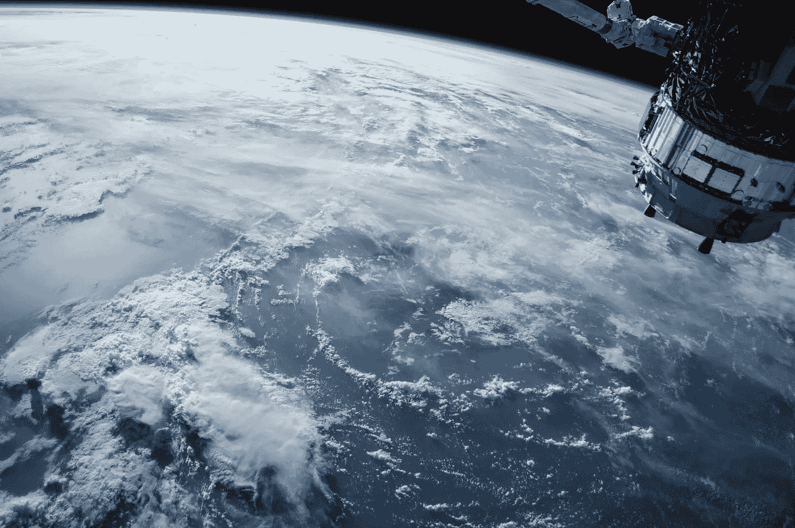
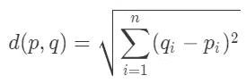

# 基于 PyTorch 的图像特征提取

> 原文：<https://towardsdatascience.com/image-feature-extraction-using-pytorch-e3b327c3607a?source=collection_archive---------5----------------------->

## 案例研究:使用 K-Means 算法的图像聚类

美国宇航局在 [Unsplash](/s/photos/space?utm_source=unsplash&utm_medium=referral&utm_content=creditCopyText) 拍摄的照片

> 总之，本文将向您展示如何使用 PyTorch 实现用于特征提取的卷积神经网络(CNN)。此外，我将向您展示如何使用 K-Means 算法根据图像的特征对图像进行聚类。尽情享受吧！

# 介绍

假设你看到一只猫的图像。在几秒钟内，你可以看到里面有一只猫。如果我们给电脑同样的图片会怎么样？电脑无法识别它。也许我们可以在电脑上打开图像，但它不识别它。

如你所知，计算机处理数字。他们看到的和我们不一样。因此，计算机处理的一切都应该用数字来表示。

我们如何将图像表示为数字？图像实际上由数字组成，每个数字代表颜色或亮度。不幸的是，当我们想做一些机器学习任务时，例如图像聚类，这种表示是不合适的。

聚类基本上是一项机器学习任务，我们根据数据的特征对数据进行分组，每个组都由彼此相似的数据组成。当我们想要像图像一样对数据进行聚类时，我们必须将其表示形式转换为一维向量。

但是我们不能直接把图像转换成矢量。假设您有一个彩色图像，大小为 512×512 像素，有三个通道，每个通道代表红色、绿色和蓝色。

当我们将三维矩阵转换成一维向量时，向量将由 786.432 个值组成。这是一个巨大的数字！

如果我们全部使用它们，将会使我们的计算机处理数据变慢。因此，我们需要一种方法来提取这些特征，这就是卷积神经网络(CNN)的用处。

## 卷积神经网络

CNN 是最受欢迎的深度学习模型之一。该模型主要用于图像数据。这个模型将对图像进行卷积处理，用一种叫做内核的东西过滤图像，这样我们就可以从中获得一个模式。

由于其分层结构和各种过滤器尺寸，CNN 可以捕捉高、中、甚至低水平的特征。此外，它还可以通过使用一种称为池化的机制将信息压缩成较小的大小。

CNN 模型的优势在于，它可以捕捉到任何位置的特征。因此，这种神经网络是处理图像数据的理想类型，特别是用于特征提取[1][2]。

## k-均值算法

在我们使用 CNN 提取特征向量之后，现在我们可以根据我们的目的来使用它。在这种情况下，我们希望将图像分成几个组。我们如何对图像进行分组？

我们可以使用一种叫做 K-Means 的算法。首先，K-Means 将初始化几个称为质心的点。质心是数据进入组的参考点。我们可以任意初始化质心。

初始化质心后，我们将测量每个数据到每个质心的距离。如果距离值最小，则该数据属于该组。它随时间变化，直到聚类没有显著变化。

为了测量距离，我们可以使用一个叫做欧几里德距离的公式。公式看起来像这样，

现在我们知道了 CNN 和 K-Means 的概念。让我们开始实施吧！

# 履行

## 数据

在这种情况下，我们将使用来自人工智能人群的数据集进行一场名为人工智能闪电战 7:阶段预测的比赛。你可以在这里访问数据集[。](https://www.aicrowd.com/challenges/ai-blitz-7/problems/stage-prediction)

数据集由一个包含图像的文件夹和一个 CSV 文件组成，该文件显示了一个提交给 AI Crowd 的示例。文件夹里有 1799 张图片，里面没有标签。因此，这是一个无监督的学习问题，特别是聚类。

下载数据集的代码如下所示。

## 建立模型

下载完数据后，我们就可以建立模型了。该模型基于 VGG-16 架构，并且已经使用 ImageNet 进行了预训练。代码看起来像这样，

因为我们只想提取要素，所以我们只提取要素图层、平均池图层和一个输出 4096 维向量的全连接图层。这是我们修改 VGG 模型之前的蓝图。

基于上面的蓝图，我们如何在 PyTorch 中使用这些特性？我们可以使用点(。)运算符来执行此操作。我们对上面提到的每一层都这样做。

在我们提取了每一层之后，我们创建了一个继承了 nn 的名为 FeatureExtractor 的新类。PyTorch 的模块。做这些事情的代码看起来像这样。

在我们这样做之后，我们会得到一个看起来像这样的蓝图。

## 特征抽出

现在我们已经建立了模型。是时候用它来提取特征了。步骤是打开图像，变换图像，最后提取特征。代码如下所示。

## 使聚集

现在我们有了特征。下一步是将其分组。为此，我们将使用 scikit-learn 库。代码如下所示。

## 保存结果

不错！我们已经拿到标签了。最后一步是将结果保存到数据帧。代码如下所示。

# 结论

干得好！您已经使用 CNN 进行了特征提取，还使用 K-Means 进行了聚类。我希望这篇文章对你有用，如果你想问什么，你可以在 LinkedIn 上联系我。

## 参考

[1] Simonyan，k .，& Zisserman，A. (2015 年)。用于大规模图像识别的非常深的卷积网络。ArXiv:1409.1556 [Cs]。http://arxiv.org/abs/1409.1556

[2] VGG16 —用于分类和检测的卷积网络。(2018 年 11 月 20 日)。【https://neurohive.io/en/popular-networks/vgg16/ 