# 图像处理综合指南:基础

> 原文：<https://towardsdatascience.com/image-processing-4391c5bcef78?source=collection_archive---------9----------------------->

## [图像处理要领](https://towardsdatascience.com/tagged/image-processing-projects)

## 用 MATLAB 或 Python 实现的一步一步的图像处理流程

对数字图像执行的所有操作都要经过图像处理。尽管通过对图像执行各种操作来改变图像有各种目的，但计算机视觉是图像处理使用最多的领域之一。在这个系列中，我将提到不同的术语和操作，拉菲尔·冈萨雷斯和理查德·e·伍兹的《T2 数字图像处理第三版》是我在教学过程中和准备这些文章时使用的原始资料。

以下是本系列每篇文章的内容列表——点击这里开始学习吧！

## 图像处理第 1 部分(从下面开始🏃)

*   什么是图像？&图像采集
*   采样和量化
*   利用灰度变换的图像增强
*   直方图处理
*   MATLAB 从头开始实现这些程序

## [图像处理第二部分](https://yagmurcigdemaktas.medium.com/image-processing-part-2-1fb84931364a)

2.1

*   非线性空间滤波
*   最小最大中值滤波
*   填料
*   这些程序从零开始的 Python 实现和 PIL 库

2.2

*   线性空间滤波
*   卷积和相关
*   平滑过滤器
*   锐化滤镜
*   边缘检测过滤器
*   噪声消除滤波器
*   Python 从头开始实现这些过程和 OpenCV 库

## [图像处理部分 3](https://medium.com/image-processing-part-1/image-processing-part-3-dbf103622909)

*   形态学算子
*   侵蚀和膨胀
*   结合形态学算子的噪声去除和边缘检测
*   对图像应用这些操作的 OpenCV 示例，对 2D 矩阵应用这些操作的 Scipy 示例。

## [图像处理工具](https://medium.com/image-processing-part-1/image-processing-tool-a1b8fe66c957)

一个在 QT Creator 上使用 OpenCV 3.2.0 和 C++实现的工具，可以应用这些帖子中讨论的几乎所有图像处理操作。

你可以访问我的[**github**](https://github.com/YCAyca/Image-Processing)**链接来访问这里使用的所有代码💻**

**让我们开始第一部分吧！**

# **图像处理第一部分**

**一个场景，一个我们用眼睛看到的景象，其实是用电磁能谱得到的连续信号。我们眼睛中的受体所感知的这种信号的值基本上由两个主要因素决定:落入环境中的光量和从物体反射回我们眼睛的光量。**

**我们知道，地球上有各种不同波长的光源，我们只能用眼睛分辨某一种波长的光。在这里，我们可以将所有由于这个范围内的光线而能够感知到的场景，称为“**图片**”。我们说这个光源到达我们眼睛的信息是“**连续**”。当我们想将这些信息转移到数字媒体并将其存储在这个环境中时，这意味着我们在谈论数字图像的概念，即“**离散**信号。[1]**

**也就是说，数字图像是一个二维矩阵，矩阵的每个元素实际上携带了该离散信号的相关部分的值。**

**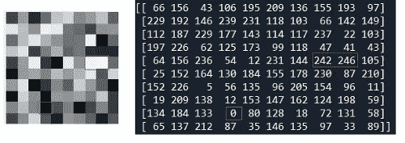**

**图 2“作者图片”**

**相应地，您是否注意到，随着信号中光量的增加(因此图片中的颜色值从黑色变为白色)，矩阵中的值也在增加？**

**那么图 1 所示的转换实际上是如何完成的呢？以连续信号形式获得的信号如何转换成离散信号，即转换成数字图像？为了回答这些问题，我们将提到两个基本概念:**

****采样&量化****

**采样是将确定要获得的图像的大小的过程。它处理数字图像的像素数量，即矩阵大小。增加数字图像的尺寸被命名为“*上采样*，而减小被命名为“*下采样*”。研究采样过程时经常可以看到 *spatial* 这个词。采样是一个空间过程。因为它处理的是图片的大小，完全独立于图片的内容或者它将拥有的值。**

**量化是决定图像中每个像素值的过程。首先，确定基本灰度级，即像素可以具有的值的范围。然后，根据来自连续信号的值，计算数字图像中像素的值。如果一张图片的*灰度级*为 *n 位*，其*灰度范围*将具有 *2ⁿ* 的值。例如，像素在 3 位灰度中的取值范围是[0–7]，而像素在 8 位灰度中的取值范围是[0–255]。像素所具有的值也被称为该像素的“*强度*”。**

****！！！**我们提到过，当一个场景被转移到数字图像环境中时，连续信号被转换成离散信号。这里的另一个要点是，离散信号并不携带连续信号中的所有信息。例如，如图 3 所示，我们没有接收连续信号中的所有信息，而是只接收了 16 条信息，因此我们获得了一个 16 像素的图片作为输出图片。输出画面尺寸越大，即采样做的越大，输出画面越接近场景，信息损失越少。同样，灰度等级越大，输出图像中的像素值就越接近实际场景中的值。**

**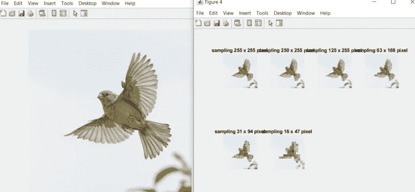**

**图 4“作者图片”**

****！！！**数字图像的采样或量化属性可以重复改变，从而导致同一图像的不同输出。**

****

**图 5“作者图片”**

**虽然上面的左图显示了图片的原始版本，但我们在图 4 中看到了该图片的不同采样示例。随着用于采样的像素数的减少，输出图像的尺寸减小，我们得到的图像质量也降低。其实过程无非就是从同一个场景得到的信息越来越少，得到一张新的图片！**

**上面的左图显示了黑白 uint8 类型的图片(因此图片矩阵的值可以是 0–255 之间的任何值)，而图 5 显示了同一图片在不同量化级别下的输出。当我们检查图 5 时，当灰度级为 1 位，即图像矩阵中的值只能取 0 或 1 中的一个值时，输出显示图像的对比度处于最高水平，图像的质量处于最低水平。当灰度级达到 8 位时，我们看到输出图像与输入图像具有相同的质量，因为量化级别与原始图像处于相同的级别。**

****！！！**在图 5 中，我们看到从 5 位灰度级开始，图像质量几乎相同。但是，如果您想检查图片矩阵，可以看到矩阵值在 5 位灰度级时在 0–32 的范围内，在 7 位灰度级时在 0–64 的范围内，在 7 位灰度级时在 0–128 的范围内。**

**如果想对这个题目和图片做更多的练习，可以点击[采样&量化](https://github.com/YCAyca/Image-Processing/blob/main/Part1/sampling_quantization.m)访问相关的 Matlab 代码。**

****图像增强****

**用于在本质上没有任何变形的图像上获得图像的不同版本的过程包括在图像增强类别的操作中。这些可以包括改变图片的光强度、改变其对比度、操纵颜色设置等。没错，这些正是你在 Instagram 等应用中一键看到自己不同颜色、不同设置的图片背后的操作。！**

**我们将研究两个不同类别的图像增强。如果逐个像素地处理图像，也就是说，如果该过程单独应用于每个像素，则在灰度转换中检查该图像；如果该过程应用于大于 1 个像素的像素组，则在过滤类别中检查该图像。**

****！！！**强度变换、映射变换或点处理的名称也与灰度级变换含义相同。你也可能在网上或不同的书中碰到这些名字。**

****灰度变换****

**在本节中，我们将通过对下面的基本图片应用不同的操作来查看输出图片。**

**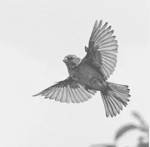**

**“作者提供的图像”**

1.  ****线性变换****

**当我们考虑一个取值在 0-255 之间的图片矩阵时，我们说越接近 0 的像素越接近黑色，越接近 255 的像素越接近白色。因此，当我们想使图片变亮时，增加像素值，当我们想使图片变暗时，减少像素值是明智的，对吗？将每个像素的值增加或减少一个常数 x 是一个线性过程。**

**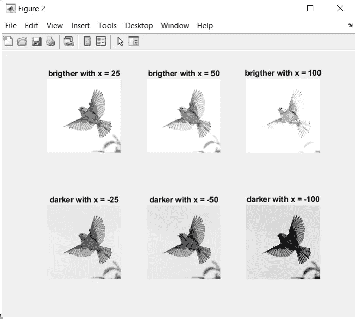**

**“作者提供的图像”**

**另一个线性过程是拍摄照片的底片。这个过程是将每个像素从其补数(图片中的一个像素根据灰度范围可以获得的最大值)中减去。例如，取 8 位灰度级图像的负片等于从 255 中减去每个像素。**

**2.**对数变换****

**用于改变光强度的另一个过程是对数变换。通过将每个像素应用于以下过程来获得输出画面的像素:s = clog(1+r)。这里 c 是决定处理效果的系数，r 是相关像素。**

**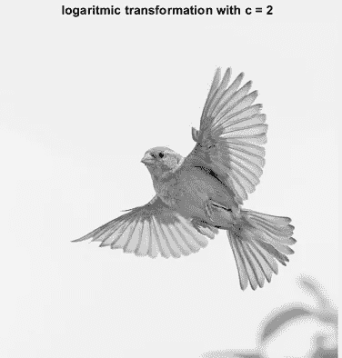**

**“作者提供的图像”**

**3.**幂律变换—伽马校正****

**另一种用于改变图片光线的过程是幂律变换，也称为伽马校正。输出图像的像素通过用以下过程操作每个像素来获得:**

**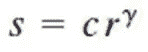**

**这里 c 和γ是两个不同的系数，r 是各自的像素。**

**伽玛校正不仅改变光量，还改变图像的对比度设置。因为对每个像素取γ系数的幂，并且它根据这个数是在 0 -1 的范围内还是大于 1 来减小或增大像素值之间的距离。**

**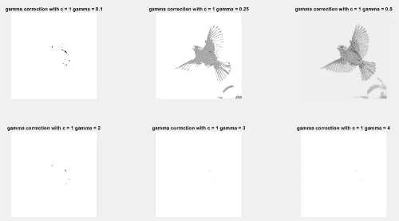**

**“作者提供的图像”**

**当我们对相同的基础图片应用伽马校正时，我们看到，在伽马> 1 的情况下，我们得到无用的图片，因为图片的原始对比度已经很高，而在
0 <伽马< 1 的情况下，我们得到具有更低对比度的图片。**

**4.**对比变换****

**图片的对比度是其像素之间的亮度值差异。如果像素值彼此接近，则图像的对比度低，如果像素值彼此远离，则对比度高。用于增加或减少对比度的基本过程具有以下公式。**

**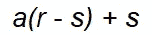**

**在这个公式中，r:相关像素 s: a 系数 a:> 1 是将应用的过程转换为对比度增强的系数，if 0 <= a <1, the applied process to contrast reduction.**

**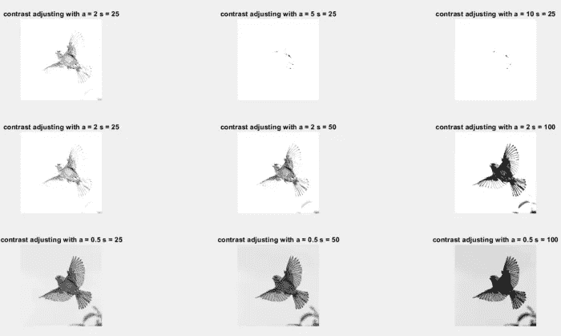**

**“Image by Author”**

**One of the operations used to change the contrast settings of the picture is **对比度拉伸**。它改变了图像中像素值的分布范围和比率，使得图像的直方图(将在下一小节中详细讨论)具有更成比例的分布。综上所述，可以表述为平衡而不是增减对比度。这个过程应用于下面的公式。**

**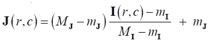**

**m:画面中最小像素值
M:画面中最大像素值
mj:输出画面中一个像素可以拥有的最小值
Mj:画面中一个像素可以拥有的最大值
I (r，c):画面中任意像素值**

**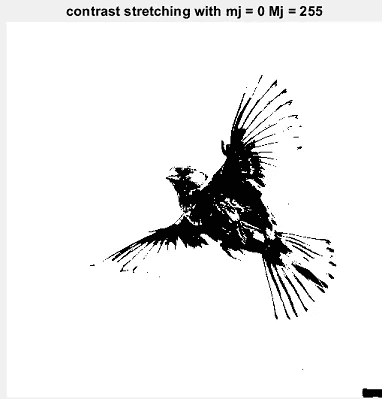**

**“作者提供的图像”**

**另一个操作是**对比度阈值**。在该过程中，选择固定值作为阈值，并且通过将 1 分配给高于该阈值的值，将 0 分配给较低值，获得高对比度二进制输出图像。有两种常用的方法来确定阈值。第一种是简单地选择一个固定的数(全局阈值)，第二种是使用像素值的平均值作为阈值(平均全局阈值)。**

**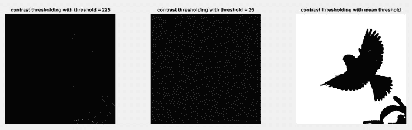**

**“作者提供的图像”**

**您可以从[gray _ level _ transformations](https://github.com/YCAyca/Image-Processing/blob/main/Part1/gray_level_transformations.m)链接访问相关的 Matlab 代码，自己应用这些过程并检查用不同值获得的输出。**

**5.**直方图处理****

**图片的直方图是一个离散函数，x 轴是灰度级，y 轴是图像中具有相应灰度位的像素总数。虽然直方图让我们了解与我们所拥有的图像相关的各种问题，但是它们形成了在空间域中执行的许多操作的基础。**

****

**图 9“作者图片”**

**在图 9 中，我们看到了黑白(单通道)图像的直方图。这张图片的灰度等级是 8 位，也就是说，它的像素可以取 0–255 之间的值。因此，x 轴的范围是 0–255，而 y 轴由描述该范围内每个值有多少像素的数字组成。例如，在这张图片中，我们看到没有像素值为 0，而有超过 1500 个像素值为 14。**

****！！！**在 MATLAB 中获得这些数字后，您可以在坐标轴上导航，并通过单击它来检查(x，y)对在您想要的点上的值。**

**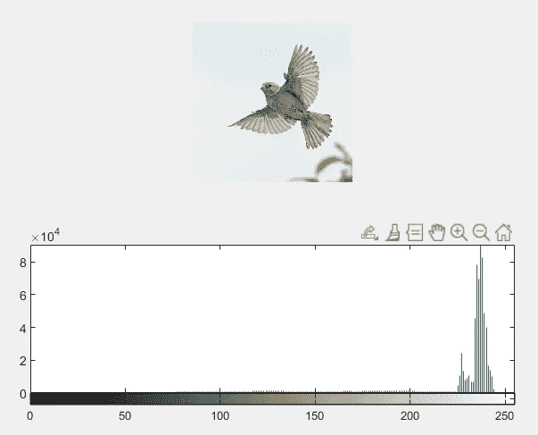**

**图 10“作者图片”**

**在图 10 中，我们看到了 RGB(三通道)图像的直方图。灰度级也是 8 位。与上面的黑白图片不同的是，组成 y 轴的数字是为 3 个不同通道中的像素单独计算和收集的。例如，x = 69 y = 10780 的值告诉我们，这张图片在 3 个不同的通道中总共有 10780 个像素，值为 69。**

**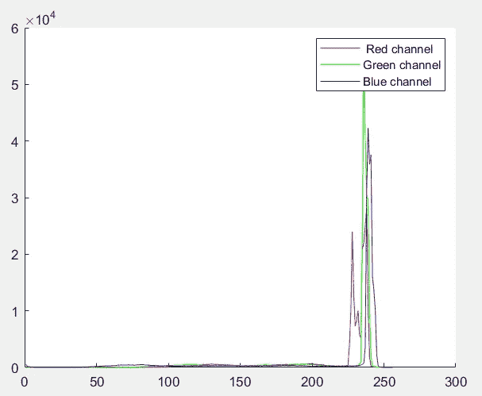**

**“作者提供的图像”**

**也可以在 RGB 图片中单独查看每个通道的直方图。所以在上面的图像中，我们看到的是每个通道本身的总数，而不是 y 轴上 3 个通道的像素总数。**

****RGB 图像****

**彩色图片，我们在日常生活中习惯于看到的不仅仅是黑白图片，实际上是 3 种不同的矩阵组合在一起形成 1 幅数字图片的图像。我们眼睛看到的所有不同颜色实际上是三种基本颜色的混合:红色、绿色和蓝色。RGB 图像是具有用于这三种主色的单独矩阵的图像，并且 x 位置的像素值是从这三个矩阵中的值的混合中获得的。我们说在黑白图片中，一个像素越接近 0，越接近黑色，一个像素越接近 255，越接近白色。对于 3 通道图像，在红色通道中，越接近 0 的像素越接近黑色，越接近 255 的像素越接近红色；在绿色通道中，越接近 0 的像素越接近黑色，越接近 255 的像素越接近绿色；在蓝色通道中，越接近 0 的像素越接近黑色，越接近 255 的像素越接近蓝色。在这 3 个通道的混合中，无论哪个矩阵具有相关像素的最高值，该颜色都将在该像素中占主导地位。我们看到图像像素接近白色，其中 3 种颜色具有相同的高值像素，而 3 种颜色具有相同的低值像素，图像像素接近黑色。**

**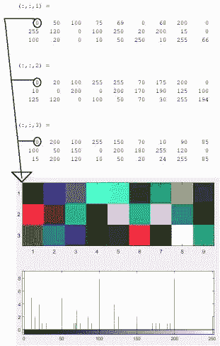**

**“作者提供的图像”**

**在上面的图片中，我们看到 3 个不同的 3 x 9 大小的矩阵，依次形成了图片的红色、绿色和蓝色通道，以及最终的 3x9 像素图片。您可以检查由 3 个通道中不同像素值的组合所创建的颜色，并且您可以从本节末尾共享的代码链接中进行自己的实验。**

****直方图均衡化****

**这是平衡图片直方图分布的过程。图片中的每个像素都经过下面描述的步骤，从而产生一个更平衡的直方图，然后是一个更平衡的图片。如果图像的对比度分布已经足够平衡，则在图像中观察不到太多变化。**

1.  **对于每个灰度值，计算图片中的像素总数。(这其实是图片的直方图吧？！)**
2.  **对于每个灰度值，计算在随机像素中出现的概率。对于这种计算，前一步骤中每个灰度值的总数除以图片中的像素总数。这个计算被称为**“概率密度函数”**计算，显示在 **pdf** 中。**
3.  ****“累积密度函数”**对概率密度函数值进行计算。通过将每个灰度值的概率值与先前值相加来计算累积密度值，由 **cdf 表示。****
4.  **将每个灰度值的累积值乘以最高灰度值，并四舍五入到最接近的整数值，计算出**“累积分布函数”**，用 **CDF 表示。****

**此时，相对于灰度值获得的值与源灰度值交换，并且像素值通过新图片的平衡直方图获得。下面我们看到一个简单的 3x3 图片矩阵，其中所有这些步骤都是一个接一个地完成的，以及如何获得平衡的图片。**

**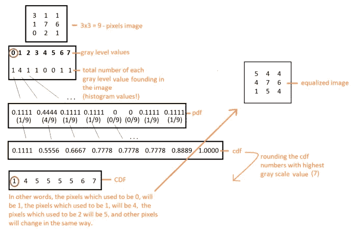**

**“作者提供的图像”**

**图 11 显示了我们的初始图像及其直方图，随后是输出(均衡)图像直方图和图像。您可以从[直方图 _ 处理](https://github.com/YCAyca/Image-Processing/blob/main/Part1/histogram_processing.m)链接访问相关的 Matlab 代码，用您自己的样本矩阵或图片进行实验，并检查这些步骤的功能。在这个链接的代码中，有函数包含了我准备的所有这些步骤。我建议你检查一下这些函数。除此之外，使用 MATLAB 的函数，均衡是在同一张图片上完成的，结果在屏幕上显示为图片+直方图。您可以检查两种使用方式。**

**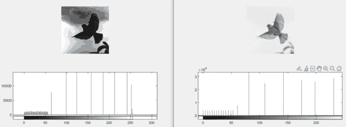**

**“作者提供的图像”**

****直方图匹配****

**如果图片的直方图要比作目标图片的直方图，而不仅仅是平衡，这就是直方图匹配。直方图匹配与直方图均衡的主要区别在于，在对两幅图片进行 pdf 和 cdf 计算后，不是将源图片的 cdf 值乘以最高灰度值，而是与目标图片的 cdf 中最接近的值进行匹配。然后，查看该值来自哪个灰度级值，并将该值与源图像中的灰度级值进行交换。**

**下面我们看到一个简单的 3x3 图片矩阵，所有这些步骤一个接一个地完成，匹配的图片就获得了。**

**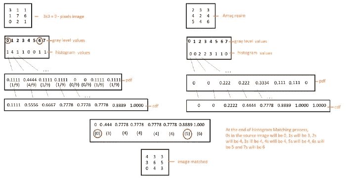**

**“作者提供的图像”**

**图 12 显示了我们的直方图匹配应用程序得到的匹配图片和直方图，其中 bird.jpg 是源图片，pepper.jpg 是目标图片。(每个直方图属于上面显示的图像)**

**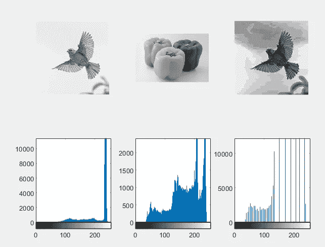**

**图 12“作者图片”**

**您可以从 [histogram_processing](https://github.com/YCAyca/Image-Processing/blob/main/Part1/histogram_processing.m) 链接访问相关的 Matlab 代码，用您自己的样本矩阵和图片进行实验，并检查这些步骤的功能。在这个链接的代码中，有函数包含了我准备的所有这些步骤。我建议你检查一下这些函数。但除此之外，使用 Matlab 的功能，对同一张图片进行匹配，结果在屏幕上显示为图片+直方图。您可以检查两种使用方式。**

**恭喜你！您已经完成了图像处理第 1 部分。下一节再见！对于你的问题和建议，你可以从 aktas.yagmur@gmail.com 的[联系我，也可以从这个](mailto:aktas.yagmur@gmail.com) [**github 链接**](https://github.com/YCAyca/Image-Processing/tree/main/Part1) **下载源代码。****

**在本帖中，用于观察不同手术结果的源图像取自 unsplash.com**