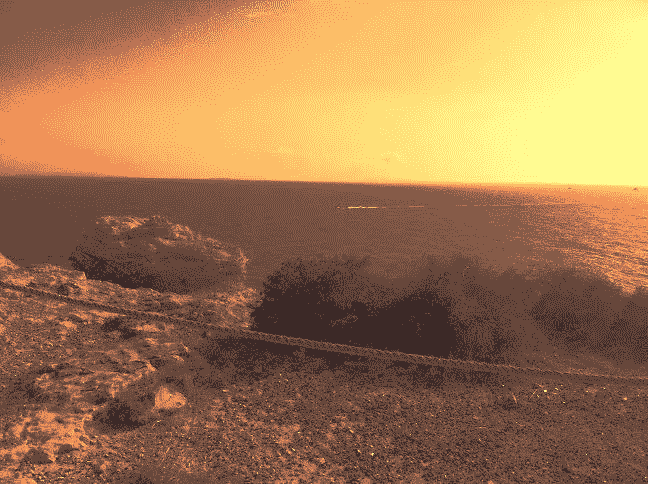
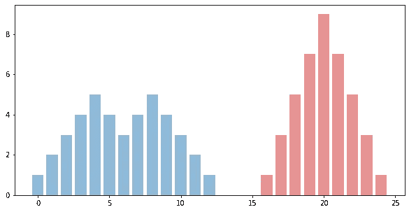
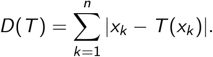
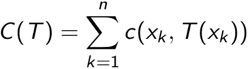
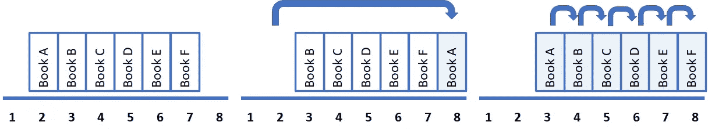
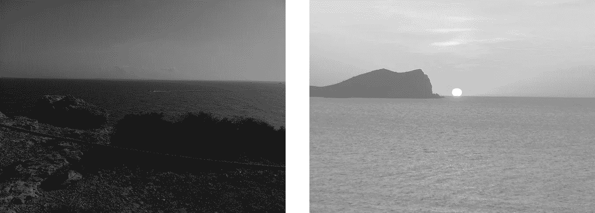
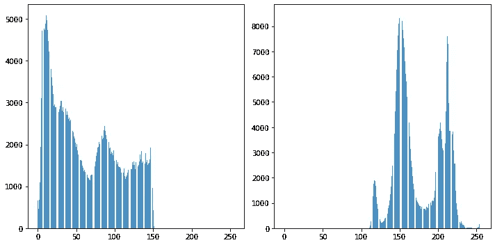
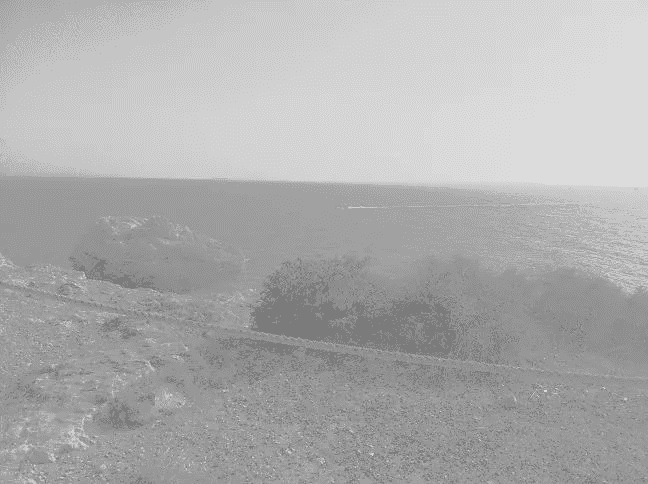

# 图像处理和最佳运输

> 原文：<https://towardsdatascience.com/image-processing-and-optimal-transport-f707c7296b67?source=collection_archive---------32----------------------->

图 1:伊比沙岛的日落？作者照片

一个计算机视觉领域的数据科学家和一个在海边玩铲子的孩子有什么共同点？两者都在某个点传输质量。

对孩子来说，这一团显然是沙子，但数据科学家呢？如果我们把一幅画的颜色看作质量，颜色的变化就对应着质量的转移。

看似牵强的类比通过最优运输领域联系起来，当看一个例子时更有意义。

假设我们有两张图片，想要将第二张图片的颜色更改为第一张图片的颜色，同时保持相同的结构。*(例如，在图 1 中我们可以看到图 2 中右图的颜色被转移到了左图中。)*这可能是必要的，以使图像具有可比性或协调一天中不同时间拍摄的照片的颜色。

我们如何做到这一点？我们怎么知道哪种颜色的*将*传输到哪个像素？在我们能够理解这个过程并看到 Python 中的实现之前，我们先来看看一些基础理论。

图 2:白天(左)和日落(右)的伊比沙岛海岸，作者拍摄的照片

# 最佳运输

想象一下，我们有一堆含有 n 颗沙粒的沙子，想要用它来建造一座沙堡。我们可能想知道这需要多少努力。所以我们从计算每粒沙子需要移动的距离开始(*因为这是我们建造沙堡时要做的，对吗？*)。例如，我们可能有一堆图 3 中蓝色物质形式的沙子，并想把它做成红色物质的形状。

图 3:同样质量的“一堆堆沙子”；作者图片

我们有很多方法来运输质量，我们希望能有效地做到。如果 *xₖ* 是第*颗*到第*颗*沙粒移动前的位置，而 *yₖ = T(xₖ)* 是其最终位置，则总距离可计算为

当然，我们可能不仅对距离感兴趣，还对时间或任何其他我们在计算交通费用时要考虑的因素感兴趣。因此，与其计算总距离 *D(T)* ，我们可能想计算总成本 *C(T)* 定义为

对于文献中的一些代价函数 *c.* ，函数 *T* 常被称为运输图。如前所述，有很多方法可以移动物体，所以我们想找到一个最小化 C(T)的运输图。数学上，我们想求*T * = arg min { C(T):T transport map }。*

*注:在文献中，优化问题往往是用可分度量空间 X，Y 上的测度来定义的，其中 T 从 X 映射到 Y，不清楚是否存在一个最优映射 T*以及它是否唯一。可以证明它确实存在，并且在某些假设下可能是唯一的。此外，如果 c 是度量的第 p 阶矩，则关于最优映射的成本的第 p 个根被称为*瓦瑟斯坦距离*。这个理论在数学上很好，但是我们不要去* [*那里*](https://www.springer.com/gp/book/9783030384371) *…*

在这一点上，你可能想知道为什么我们引入了成本函数 *c* 并使事情变得更加困难。成本函数是至关重要的，并且取决于应用。让我们考虑一个例子，看看它为什么重要。

假设我们有一个书架，上面有 6 本书，如下图所示，我们想把书移到书架的最右边。我们有两种选择来“运输质量”。我们可以将书 A 向右移动六个位置，或者将每本书向右移动一个位置。什么叫多劳多得？你喜欢移动书 A 还是所有的书？答案可能因个人偏好而异，因为每个人可能有不同的成本函数。

图 4:放有 6 本书的书架；作者图片

“那么，”你可能会想，“对于给定的成本函数，我们如何找到最佳映射 *T** ？”

坏消息是没有简单的答案，这个问题是运输理论领域的研究课题。

好消息是，对于某些情况，我们知道答案。

一维成本函数的常见选择是绝对值(在这种情况下等于欧几里德距离)。让我们假设一下，在图 3 的例子中，运输成本仅取决于 x- 轴上的距离，也就是说，我们仅在一个维度上运输质量，并且将绝对值作为成本函数 *c* 。在这个例子中，最佳映射 *T** 存在，但不是唯一的。也许最简单和最直观的传输图是从沙堆的最右边开始，移动到目标的最右边，重复这个过程，直到我们移动了整个质量。*(对于图 4 中的图书，这意味着我们首先移动图书 F，然后移动到图书 a)。*这定义了相对于绝对值的最佳运输图。

# 图像处理

“好吧，好吧，我们有所有这些运输理论的东西，但它是如何从一开始就与图片联系在一起的？”

很高兴你这么问，让我解释一下。

图 5:作者拍摄的深色(左)和亮色(右)的伊比沙岛海岸

为了简单起见，我们只考虑灰度图像。在这种情况下，只有 0 到 255 之间的强度与每个像素相关联，这使得它是一维的(与三维 RGB 表示相反)。我们可能得到了图 5 中的两张图片，并希望将图片从左边的图片传输到右边的图片。帮助的运输理论怎么样？

在高层次上，我们希望尽可能少地改变颜色以保持结构。我们可以获取强度，并用两张图片中的颜色制作直方图，如图 6 所示。瞧，我们有如图 3 所示的质量堆，可以像以前一样继续执行策略。

图 6:图 5 中图片的像素强度的直方图；x 轴:强度，y 轴:像素数量；作者图片

“将强度从左直方图移动到右直方图”的结果是:

图 7:图 5 中左图的形状和右图的颜色；作者图片

# 履行

很好。现在我们已经讨论了(一小部分)理论，但是我们怎样才能真正的传输颜色呢？最简单的方法是使用 Python 的[最优传输](https://pythonot.github.io/)包。但是现在我们已经通过了理论，所以我们不想要最简单的方法，而是从我们自己之前实现最优映射。

因此，首先，我们需要加载包和图片，并将后者转换为 numpy 数组(因为我们处理灰度图像，所以我们只需要 RGB 表示的一维—因此[:，:，0])。

接下来，我们定义两个辅助函数 *pic_as_list* 和 *transport_colors* 。第一个函数将 numpy 数组转换为按亮度排序的像素列表[x，y，color],其中 x 和 y 是坐标，color 是给定像素的亮度。第二个函数用上面例子中的最佳映射“传输颜色”。

最后，我们将所有内容放在一起并保存结果。结果如图 7 所示。

## RGB 图像

在一维中定义一个最佳映射很容易，在三维中定义它就不那么简单了，而且肯定更具技术性。然而，作为第一近似值，我们可以使用前面的程序分别应用于红色、绿色和蓝色。结果并不是一张与目标*颜色相同的图片(因为我们考虑的是颜色的一维边缘分布而不是三维联合分布)*，但这是一个很好的近似。

以下代码的输入是图 2 中的照片，其输出是图 1 中的图片。

# 结论

最优运输是一个迷人的话题，我们只讨论了最基本的内容。如果你想进一步了解它以及它在统计学中的应用，我可以推荐[《瓦瑟斯坦空间的统计邀请》](https://www.springer.com/gp/book/9783030384371)。

如果你想看更多的图片和彩色照片的(适当的)最佳传输结果，请查看[“切片和氡瓦瑟斯坦测量重心”](https://link.springer.com/article/10.1007/s10851-014-0506-3)(特别是图 14 令人惊讶)。