# 图像处理和像素操作:照片滤镜

> 原文：<https://towardsdatascience.com/image-processing-and-pixel-manipulation-photo-filters-5d37a2f992fa?source=collection_archive---------6----------------------->

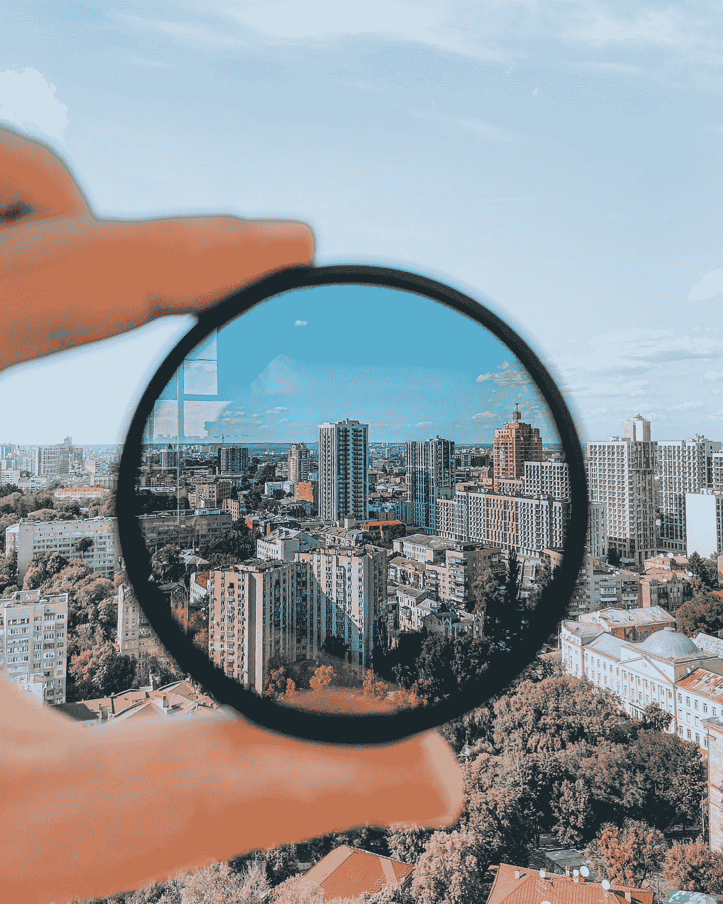

由[尤金·希斯蒂科夫](https://unsplash.com/@eugenechystiakov?utm_source=medium&utm_medium=referral)在 [Unsplash](https://unsplash.com?utm_source=medium&utm_medium=referral) 上拍摄的照片

我们一直在使用滤镜，从 Instagram 和 Snapchat 这样的社交媒体应用程序到 Photoshop 这样的专业软件。但是你有没有想过过滤器是如何工作的？在本文中，我将尝试回答这个问题，并用 Python 实现基本的过滤器。

# 像素和色彩空间

迈克尔·马森在 [Unsplash](https://unsplash.com?utm_source=medium&utm_medium=referral) 上的照片

图像以数字形式存储为像素的**阵列。像素(图片元素的简称)是图像的最小元素。每个像素都有一种颜色，定义颜色的方式称为**颜色空间**。**

最常用的色彩空间是 **RGB 色彩空间**。在该模型中，每种颜色都由三个值定义，一个值代表**红色**，一个值代表**绿色**，一个值代表**蓝色**。通常，这些值是 8 位无符号整数(范围为 0–255)，这被称为**色深**。颜色 **(0，0，0)** 为**黑色**， **(0，255，0)** 为**绿色**， **(127，0，127)** 为**紫色**。

# 打开图像

用 python 导入图像非常简单。为此，我们将使用一个名为`Pillow`的模块。我们用`pip install **pillow**` 安装。

要访问图像的像素，我们有两个选项。

# 过滤

滤镜是数学函数，它将图像作为输入，并将新图像作为输出返回。

可以在像素级应用滤波器，即 **(x，y)** 处的输出像素仅取决于 **(x，y)** 处的输入像素。或者在全局水平上，其中某个像素的输出取决于多个输入像素。

滤镜也可以应用于通道级别，即分别应用于每个颜色通道(红色、绿色和蓝色)。例如，红色通道的输出只取决于红色通道的输入。

我们将通过创建与输入图像尺寸相同的新图像来应用过滤器，然后编辑其像素。

从现在开始，过滤器将由*过滤器魔法*部分定义。

我们将介绍以下过滤器:

*   **灰度**
*   **亮度**
*   **对比**
*   **饱和度**
*   **伽马校正**
*   **模糊**

以下示例中使用的图片来自 [Marvz Etcoban](https://www.pexels.com/@marvz-etcoban-3367353)

# 灰度等级

将图像转换成灰度非常简单。我们需要将三个颜色值转换成一个颜色值。我们可以通过取它们的平均值(也称为亮度)来做到这一点。

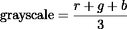

然后，我们将把这个值放在新图像的红色、绿色和蓝色中。但是，我们必须确保新值仍然是整数，所以我们将使用函数`int()`。

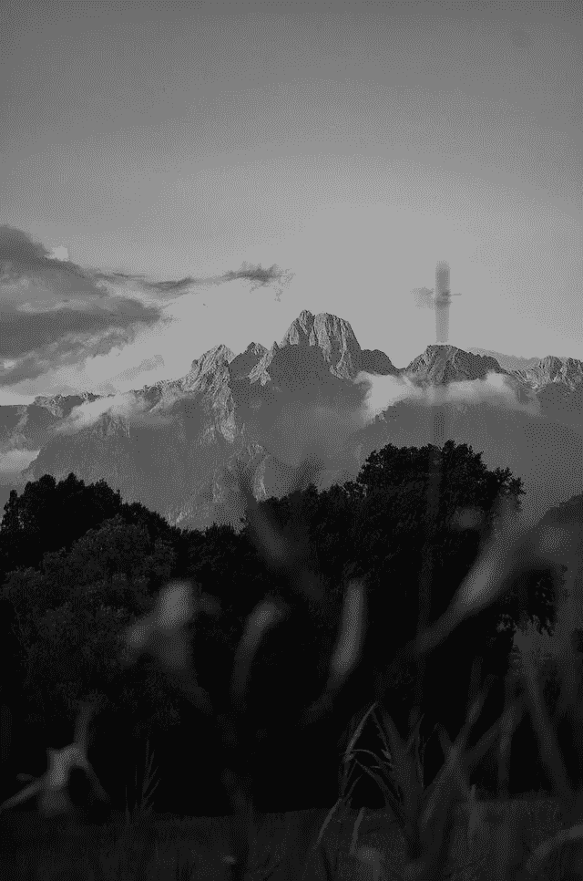

原稿(左)，灰度(右)

另一种方法是对红色、绿色和蓝色值进行加权求和。

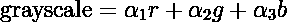

其中 **α₁** 、 **α₂** 、 **α₃** 为正常数，这样 **α₁ + α₂ + α₃ = 1** 。

这些值通常被选择为(YUV 颜色编码系统):

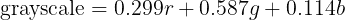

为了获得准确的灰度，我们必须考虑**伽马校正**，但我们将在稍后讨论。

# 聪明

像素 **μ** 的亮度是 0 到 255 之间的值。定义如下:

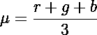

要将 **μ** 增加**δμ**，我们可以将每种颜色增加**δμ**。

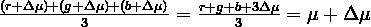

但是我们必须确保这些值仍然在 0 到 255 之间，使用的函数如下:

亮度增加量**δμ**在-255 和 255 之间，负值表示图像变暗，正值表示图像变亮。

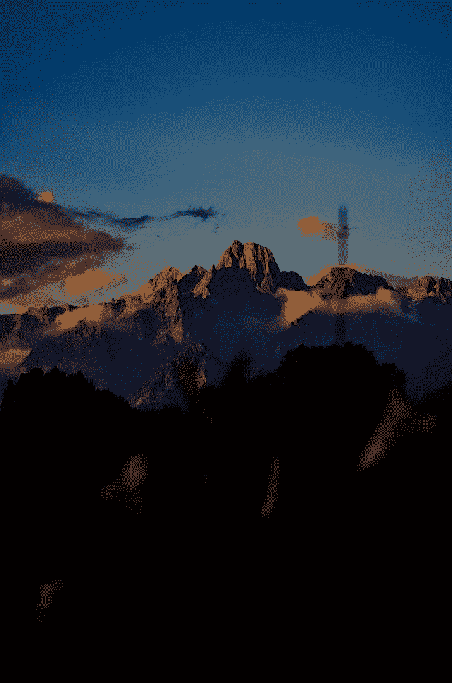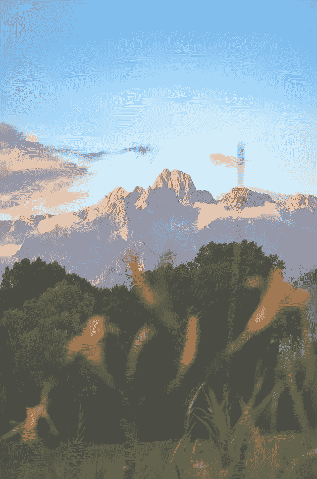

-64 亮度(左)、+0 亮度(中)和+64 亮度(左)

# 对比

图像 **C** 的对比度定义如下:

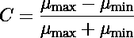

对比度值为 **0** 意味着所有像素具有相同的亮度值。 **1** 的对比度值表示最高亮度和最低亮度之差为 255(最大差值)。

有许多方法可以用来增加或减少对比度。一种方法是将亮度值从 128(0–255 的中间值)展开，使用公式:

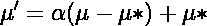

其中 **μ*** 是整个图像的平均亮度。该公式扩展或缩放 **μ*** 周围的亮度值，因子 **α** 大于或等于 **0** 。

一个因子 **α=1** 什么都不改变， **α < 1** 降低对比度， **α > 1** 增加对比度。

**α** 没有上限可能不切实际。为了克服这一点，我们使用-1 和 1 之间的系数 **β** ，即:

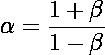

这意味着当 **β** 从-1 变为 1 时， **α** 从 0 变为无穷大。而对于 **β=0** ， **α=1** 。

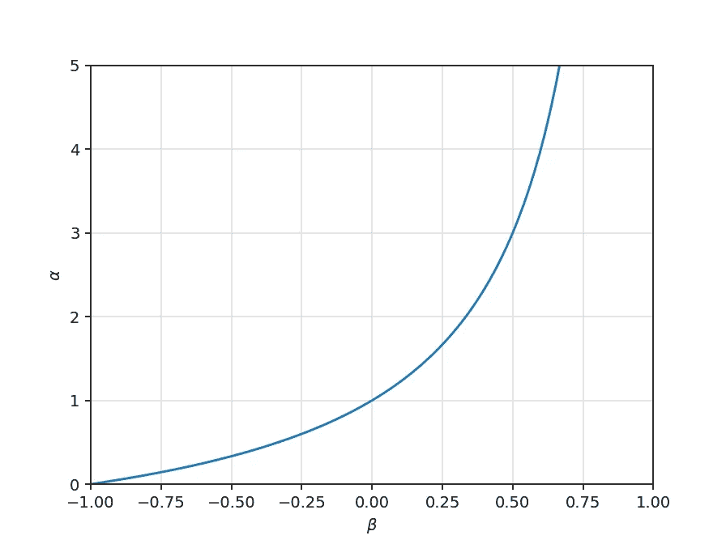

如果我们希望它在-255 和 255 之间，我们可以用 **β/255** 代替 **β** ，这产生了下面的公式:

我们必须确保隔离出 **β=255** 的情况，因为我们不能除以 0，在这种情况下，我们设置 **α=** ∞。

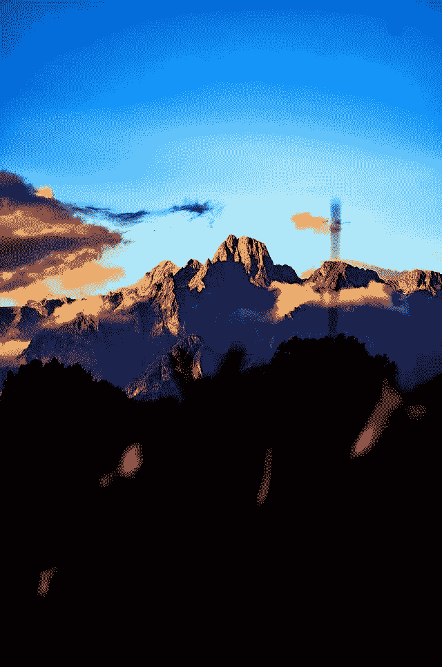

-100 对比度(左)、+0 对比度(中)和+100 对比度(右)

# 浸透

要改变像素的饱和度，可以考虑将 **RGB** 颜色转换成 **HSV/HSL** (其中 **S** 代表饱和度)，改变饱和度值，然后转换回 **RGB** 。虽然这种方法是精确的，但是它是复杂的并且计算量很大。我提出一个更简单(不太准确)的方法。

改变饱和度不应该影响颜色的亮度。因此，如果我们将颜色值分散在它们的亮度周围(它们的 **rgb** 分量的平均值，不同于在整个图像上拍摄的对比度平均值)，这不会改变它。

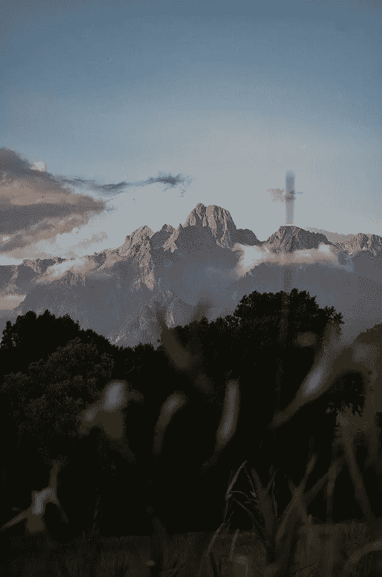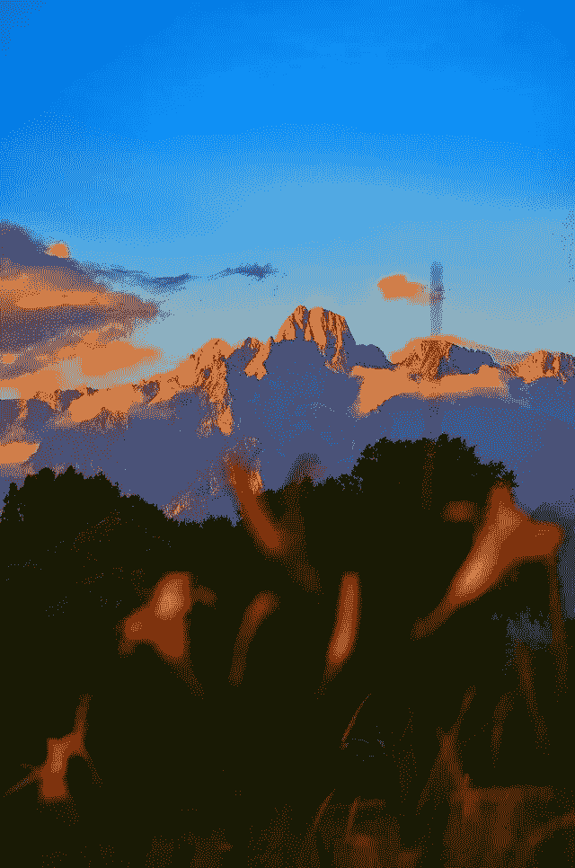

-100 饱和度(左)、+0 饱和度(中)和+100 饱和度(右)

# 伽马校正

人类对光的感知不是线性的。我们往往对深色比浅色更敏感。通过储存伽玛编码值而不是原始值，伽玛校正被设定为给阴影分配比高光更多的位。我们不会详细讨论如何节省空间，但我们将实现一个伽马校正滤波器。

伽马滤波器是这样操作的:

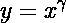

其中指数**γ**(γ)是正实数。 **𝑥** 是一个介于 0 和 1 之间的数字。

对于 **γ > 1** 低值被挤压，高值被拉伸，反之亦然对于 **γ < 1。**

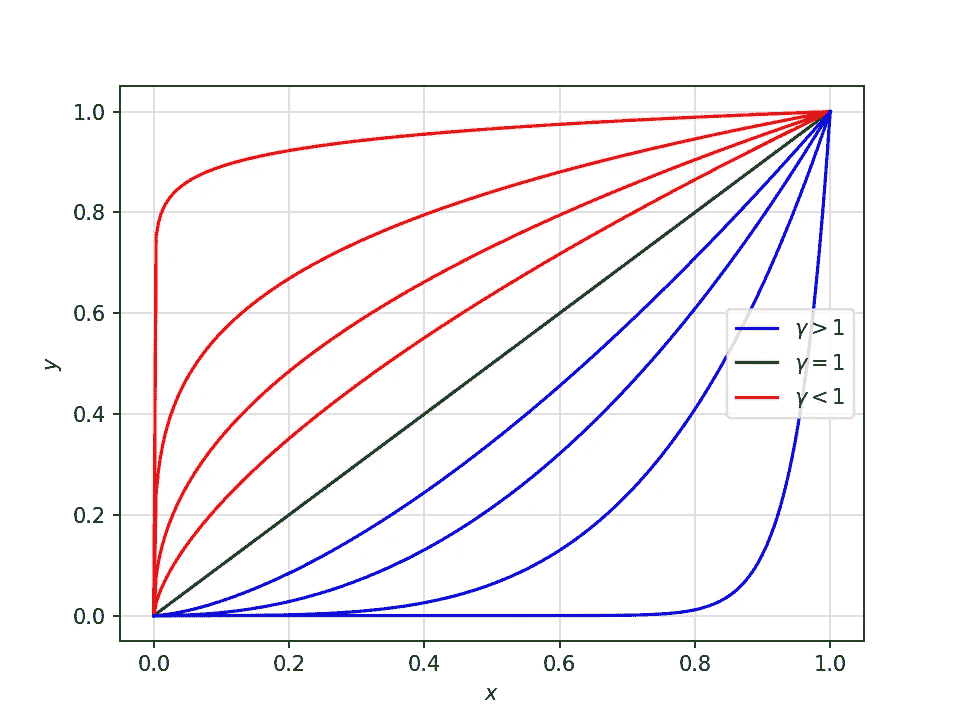

如果我们将颜色值除以 255，我们得到的数字在 0 和 1 之间。然后应用 gamma 后，我们可以乘以 255。因此，应用伽马滤波器是这样的操作:

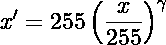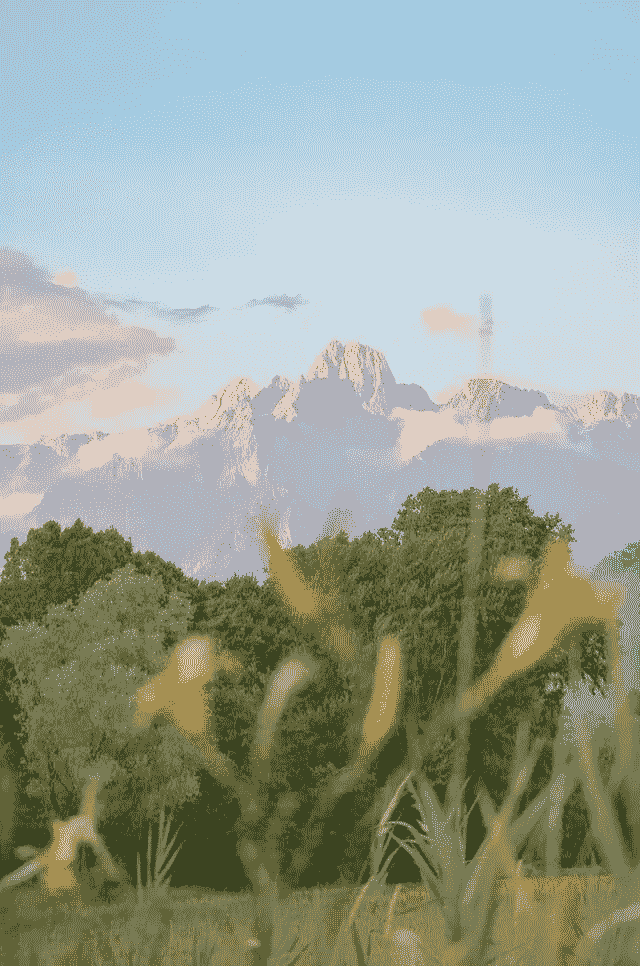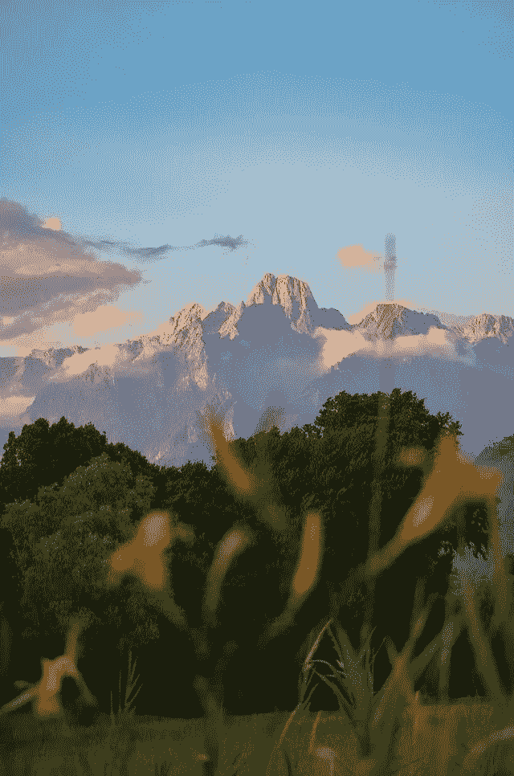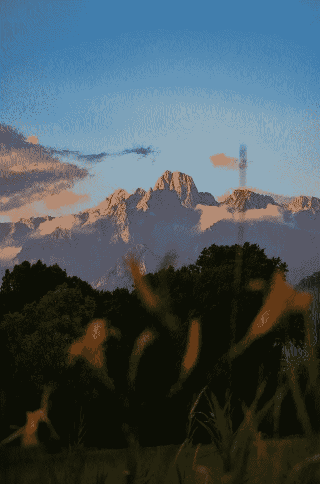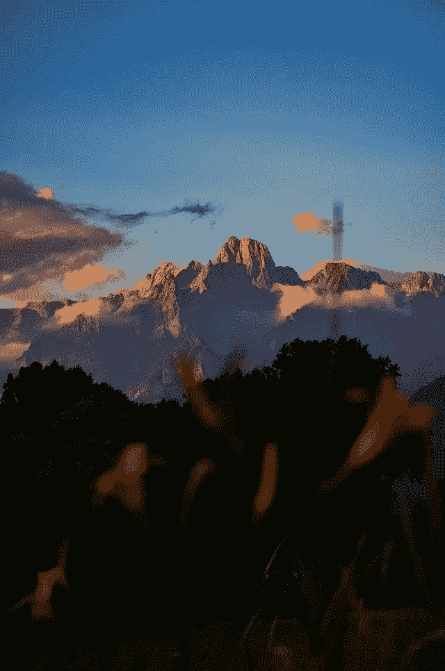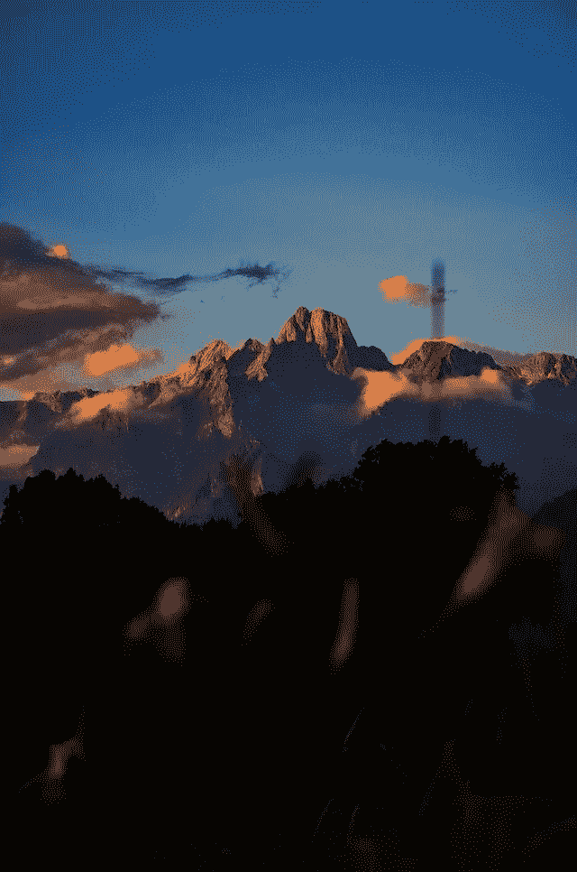

伽玛值(从左到右，从上到下)0.33，0.66，1.00，1.33，1.66 和 2

# 虚化

模糊滤镜有很多种。最常见的是**方框模糊**和**高斯模糊**。我们将实现框模糊。

框模糊包括将某个像素周围的某个大小(称为**内核大小**)的正方形内的像素的平均颜色作为该像素的颜色值。

我们不能在靠近边缘的像素周围画一个正方形，所以我们将取它周围像素的平均值(在图像边界内)。

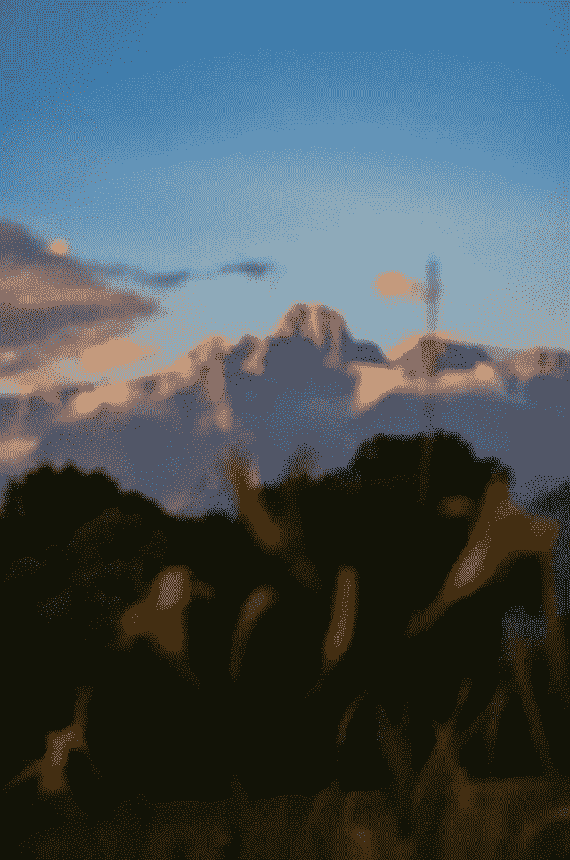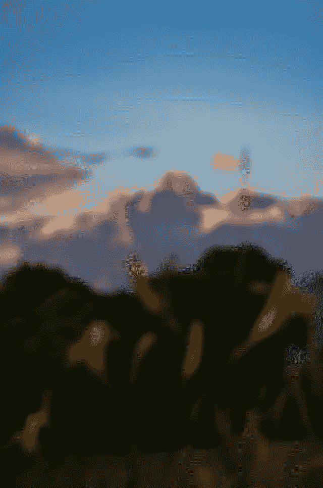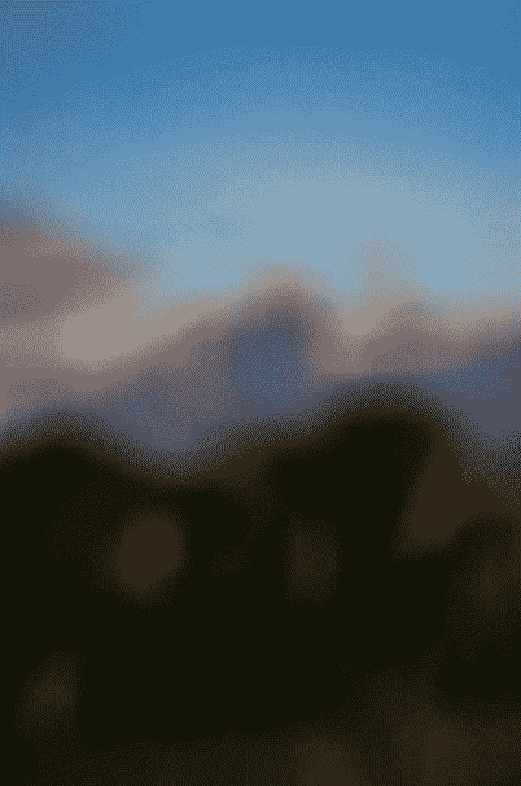

11 模糊(左)，21 模糊(中)，71 模糊(右)

# 结论

这些滤波器可以同时串联(一个滤波器的输出是另一个滤波器的输入)或并联(输出是两个滤波器输出的加权和)使用，以产生更复杂的滤波器。

本文中没有提到的涉及像素操作的其他滤镜包括:

*   级别
*   曲线
*   乌贼的墨
*   色彩平衡(包括白平衡)
*   振动
*   暴露
*   磨刀

由于计算的原因，Python 中通常不实现基于像素操作的过滤器。它们是用 C/C++这样的语言实现的，在这种语言中对数据结构有更多的控制，或者用 GPU 着色器来实现最佳速度(实时)。