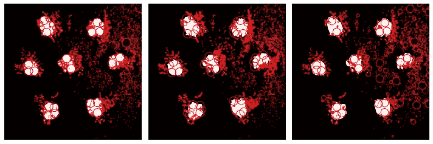

# 图像处理—斑点检测

> 原文：<https://towardsdatascience.com/image-processing-blob-detection-204dc6428dd?source=collection_archive---------4----------------------->

## 找到联系！



作者图片

图像处理主要用于提取图像中的不同特征。由于数字图像包含不同的对象和信息，显然这种信息是从这样的图像中提取的。

为了做到这一点，我们可以执行图像处理技术来挑选和检测这样的特征和对象。最有前途的技术之一被称为斑点检测。

在某种意义上，一个斑点是任何被认为是一个大的物体或任何黑暗背景中的明亮物体，在图像中，我们可以将其概括为一组像素值，形成一个群体或一个大的物体，可以从其背景中区分出来。使用图像处理，我们可以检测图像中的这种斑点。

Scikit-Image 具有不同的功能，可用于显示图像中的不同斑点。让我们逐一看一下。

让我们首先加载示例图像:

```
import numpy as np
from skimage.io import imshow, imread
from skimage.color import rgb2gray
import matplotlib.pyplot as pltsample = imread('flowers2.png')
sample_g = rgb2gray(sample)fig, ax = plt.subplots(1,2,figsize=(10,5))
ax[0].imshow(sample)
ax[1].imshow(sample_g,cmap='gray')
ax[0].set_title('Colored Image',fontsize=15)
ax[1].set_title('Grayscale Image',fontsize=15)
plt.show()
```


图 1:样本图像(作者提供的图像)

现在，让我们将图像二值化:

```
fig, ax = plt.subplots(1,3,figsize=(15,5))sample_b = sample_g > 0.6ax[0].set_title('Grayscale Image',fontsize=20)
ax[0].imshow(sample_g,cmap='gray')ax[1].plot(sample_g[600])
ax[1].set_ylabel('Pixel Value')
ax[1].set_xlabel('Width of Picture')
ax[1].set_title('Plot of 1 Line',fontsize=15)ax[2].set_title('Binarized Image',fontsize=15)
ax[2].imshow(sample_b,cmap='gray')
```


图 2:二值化图像(作者提供的图像)

对于二值化，我们在像素值上使用阈值 0.6，因为我们可以在样本绘图线上看到在该值内有一个分离。

我们通常在斑点检测之前二值化我们的图像，因为它更容易处理较小的维度和归一化的值。

scikit-image 中有一些漂亮的函数，可以使用不同的方法来检测图像中的斑点，其中一些如下:

## **拉普拉斯高斯(LOG)**

使用高斯拉普拉斯方法确定斑点

```
from skimage.feature import blob_dog, blob_log, blob_dohfig, ax = plt.subplots(1,2,figsize=(10,5))
ax[0].set_title('Binarized Image',fontsize=15)
ax[0].imshow(sample_g,cmap='gray')blobs = blob_log(sample_b, max_sigma=30, threshold=0.01)ax[1].imshow(sample_b, cmap='gray')
for blob in blobs:
    y, x, area = blob
    ax[1].add_patch(plt.Circle((x, y), area*np.sqrt(2), color='r', 
                            fill=False))
ax[1].set_title('Using LOG',fontsize=15)
plt.tight_layout()
plt.show()
```


图 3:使用日志(图片由作者提供)

请注意，我们能够检测到图像中的圆形斑点，即使是最小的斑点也能检测到。

## 高斯差分(DOG)

通过使用两个高斯平滑图像的差异来确定斑点

代码和上面的一样，只是通过使用 scikit-image 中的直接函数 blob_dog 对 blobs 变量进行了修改。

```
blobs = blob_dog(sample_b, max_sigma=30, threshold=0.01)
```


图 4:使用狗(图片来自作者)

将 DOG 的结果与 LOG 进行比较，我们可以看到 DOG 方法可以检测到大得多的斑点，并且与 LOG 相比，斑点的中心坐标更加居中。

## 黑森行列式

通过使用 Hessian 行列式的矩阵中的最大值来确定 bob。

```
blobs = blob_doh(sample_b, max_sigma=30, threshold=0.01)
```


图 5:使用 DOH(图片由作者提供)

将 DOH 的结果与 DOG 和 LOG 进行比较，与 DOG 不同，DOH 的斑点坐标更加集中在圆形地面真实斑点的边缘，并且与 LOG 相比，DOH 检测到更多的小斑点。

## 连接组件(标签)

处理斑点检测的另一种方法是通过使用图像中的连通分量。使用这种方法，我们可以很容易地检测到所有的形状。

要做到这一点，我们需要确保我们的二值化图像有点干净。我们可以对二值化图像执行形态学操作，以轻松清理它。以下示例:

```
sample_c = im_cleaned = multi_ero(multi_dil(sample_b,5),5)
```


图 6:变形图像(作者提供的图像)

请注意，当我们使用膨胀效果时，我们能够使白玫瑰更加完整。这将使我们的标签更容易和最小化。

scikit-image 库中已经有一个漂亮的函数，可以用来标记变形的图像。示例代码和图形如下:

```
sample_l = label(sample_c)
```


图 7:标记图片(作者图片)

请注意，在标记的图像上，我们能够标记每个斑点。所有的小斑点实际上也被标记了。我们可以通过执行以下操作来检查检测到了多少斑点:

```
sample_rp=regionprops(sample_l)print('How many Blobs detected?:', len(sample_rp))
```

检测到多少斑点？: 1541

我们能够检测到几乎一千个斑点，这是因为标签函数也将标记甚至最小的斑点，因为它只需要满足一个条件，如果它是与其周围不同的像素值。如果它有相同的像素值，那么它将把它连接到整个组，形成一个更大的斑点。

我们可以使用函数 region props 来进一步分割斑点，下面是一些代码示例:

```
list1 = []
for x in sample_rp:
    list1.append(x.area)
list2  = sorted(list(enumerate(list1)),key=lambda x: x[1], reverse=True)[:7]
fig, ax = plt.subplots(1,4,figsize=(15,10))
ax[0].imshow(sample_l)
ax[0].set_title('Labelled Image',fontsize=15)
for x,y in enumerate(list2[:3]):
    ax[x+1].imshow(sample_rp[y[0]].image)
    ax[x+1].set_title('Biggest Blob'+str(x+1))
```


图 8:图像的区域化(作者的图像)

请注意，我们能够通过使用连接组件的像素区域来分割图像中最大的 3 个斑点。

# 摘要

在本文中，我们能够展示不同种类的函数用于圆形斑点检测，它们是 LoG、DoG 和 DoH。我们还能够看到连接的组件如何能够更容易地简化斑点检测，最后，我们能够通过使用区域道具来分割图像上看到的斑点。

敬请期待下一篇文章！