# 图像处理:图像缩放算法

> 原文：<https://towardsdatascience.com/image-processing-image-scaling-algorithms-ae29aaa6b36c?source=collection_archive---------1----------------------->

## 了解不同的图像缩放方法并在 Python 中实现它们

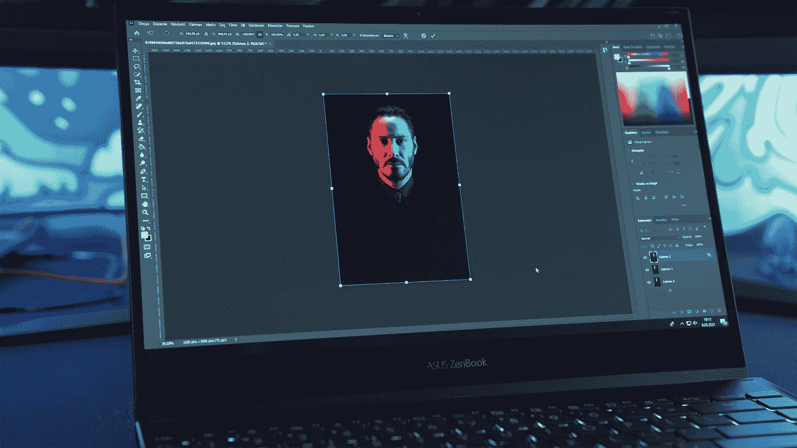

照片由 [Onur Binay](https://unsplash.com/@onurbinay?utm_source=medium&utm_medium=referral) 在 [Unsplash](https://unsplash.com?utm_source=medium&utm_medium=referral) 上拍摄

图像缩放是图像处理的重要组成部分。由于多种原因，图像需要放大或缩小。在本文中，我们将研究不同的图像缩放方法，并用 Python 实现它们。

本文是讨论图像处理概念的系列文章的一部分。查看以前的文章:

1.  [图像处理和像素操作:照片滤镜](/image-processing-and-pixel-manipulation-photo-filters-5d37a2f992fa)
2.  [如何在 Python 中创建照片马赛克](/how-to-create-a-photo-mosaic-in-python-45c94f6e8308)

我们将假设我们有一个分辨率为`width×height`的图像，我们希望将它的大小调整为`new_width×new_height`。首先，我们将引入比例因子`scale_x`和`scale_y`，定义如下:

```
scale_x = new_width / width
scale_y = new_height / height
```

比例因子 **< 1** 表示缩小，比例因子 **> 1** 表示拉伸。

我们必须将图像导入到一个数组中，为此我将使用`PIL`。

从现在开始，我只说`magic`部分。

我们将以这两张照片(第一张由来自 [Unsplash](https://unsplash.com/photos/NslBwDGhCf0) 的[John-mark Smith](https://unsplash.com/@mrrrk_smith)拍摄，第二张由来自 [Pexels](https://www.pexels.com/photo/selective-focus-photography-of-pink-petaled-flower-in-bloom-1179863/?utm_content=attributionCopyText&utm_medium=referral&utm_source=pexels) 的[hiếu·洪](https://www.pexels.com/@hieu?utm_content=attributionCopyText&utm_medium=referral&utm_source=pexels)拍摄)为例。原始图片的分辨率为`1920×1080`(~ 200 万像素)。

我们将这些图像缩小到`500×281`并放大到`7373×4147`，比例因子为`1/3.84`和`3.84`。重要的是不要使用漂亮的数字，如比例因子 2、4、0.5，因为它们可能是边缘情况，算法给出的有吸引力的结果不能反映一般情况。

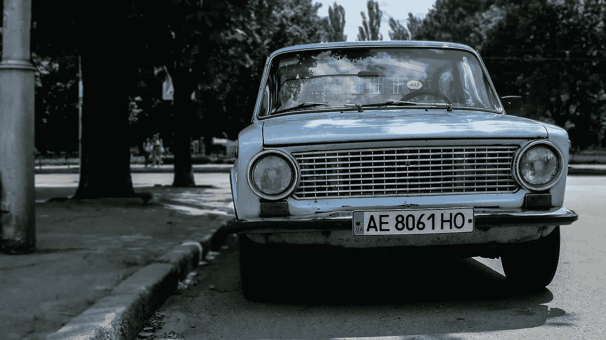

约翰-马克·史密斯照片来自 [Unsplash](https://unsplash.com/photos/NslBwDGhCf0)


照片由[hiếu·洪](https://www.pexels.com/@hieu?utm_content=attributionCopyText&utm_medium=referral&utm_source=pexels)从[派克斯](https://www.pexels.com/photo/selective-focus-photography-of-pink-petaled-flower-in-bloom-1179863/?utm_content=attributionCopyText&utm_medium=referral&utm_source=pexels)拍摄

# 最近邻插值

这可能是最简单的图像缩放方法。每个输出像素都被其在输入中最近的像素替换。

在一维中， **x** 处的值是其最近点的值。

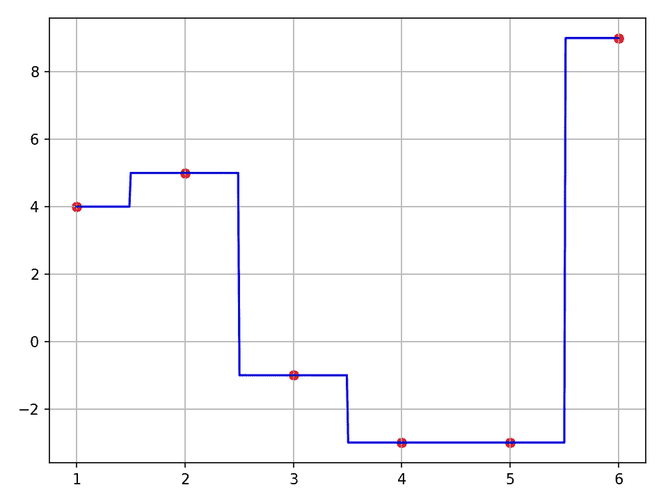

蓝线是红点的最近邻插值。图片作者。

在 2D，输出图像中具有坐标 **(x，y)** 的像素在输入图像中具有坐标 **(x/scale_x，y/scale_y)** 。由于这些坐标并不总是存在(如果它们有小数部分)，我们将把坐标四舍五入到最接近的整数，从而四舍五入到最近的邻居。

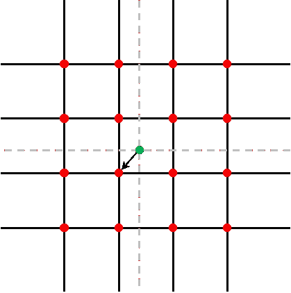

绿色像素与其最近的邻居近似。图片作者。

这种方法的实现如下所示:

结果:

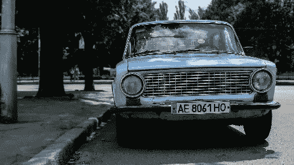

图片由来自 [Unsplash](https://unsplash.com/photos/NslBwDGhCf0) 的[约翰-马克·史密斯](https://unsplash.com/@mrrrk_smith)按比例缩小(左)和放大(右)的照片

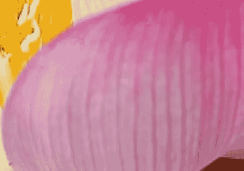

来自 [Pexels](https://www.pexels.com/photo/selective-focus-photography-of-pink-petaled-flower-in-bloom-1179863/?utm_content=attributionCopyText&utm_medium=referral&utm_source=pexels) 的[hiếu·洪](https://www.pexels.com/@hieu?utm_content=attributionCopyText&utm_medium=referral&utm_source=pexels)按比例缩小(左)和放大(右)的图片

相反，你可以使用`PILLOW`的`resize`方法:

```
im.resize(size, Image.NEAREST)
```

# 双线性插值

线性插值(又名 **lerp** )相当于在每两个连续点之间画一条线。这也可以认为是取相邻点的平均值，这些点按它们的距离加权。

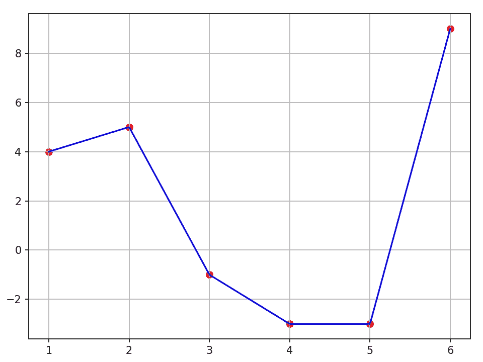

蓝线是红点的线性插值。图片作者。

在二维中，这种插值涉及 4 个相邻点。对顶部 2 点( **Q11** 和 **Q12** )和底部 2 点( **Q21** 和 **Q22** )进行线性插值，得到两个新点( **P1** 和 **P2** )。然后，对新点进行线性插值，得到插值点 **P** 。

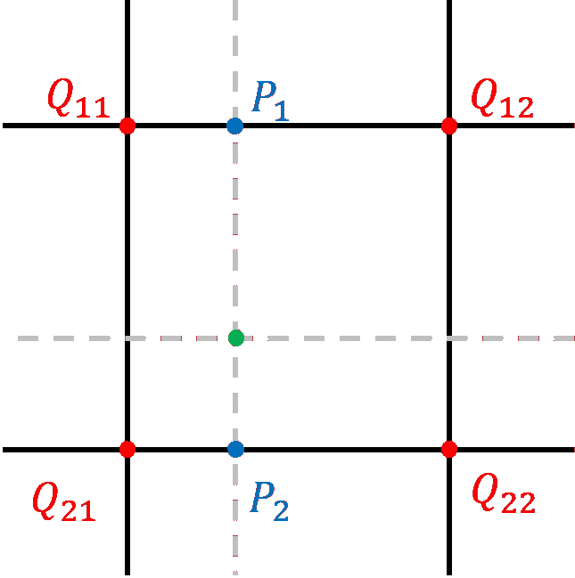

绿点是红点的双线性插值。图片作者。

用 python 实现这一点:

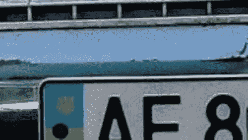

来自 [Unsplash](https://unsplash.com/photos/NslBwDGhCf0) 的[约翰-马克·史密斯](https://unsplash.com/@mrrrk_smith)按比例缩小(左)和放大(右)的照片

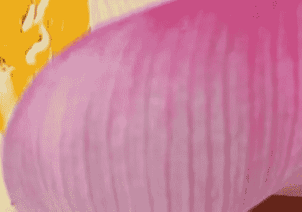

来自 [Pexels](https://www.pexels.com/photo/selective-focus-photography-of-pink-petaled-flower-in-bloom-1179863/?utm_content=attributionCopyText&utm_medium=referral&utm_source=pexels) 的[hiếu·洪](https://www.pexels.com/@hieu?utm_content=attributionCopyText&utm_medium=referral&utm_source=pexels)按比例缩小(左)和放大(右)的照片

相反，您可以使用`PILLOW`的`resize`方法:

```
im.resize(size, Image.BILINEAR)
```

# 双三次插值

双三次插值的一维等价物是三次样条插值。

三次样条插值绘制平滑曲线，而不是在点之间绘制直线。这些平滑曲线是三次多项式。

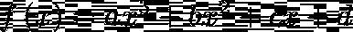

三次样条插值需要 4 个相邻点。并且在以下条件下计算 4 个系数:

*   两个内部相邻点的导数是内部相邻点和外部相邻点之间的梯度。
*   内部邻居必须是曲线的一部分。

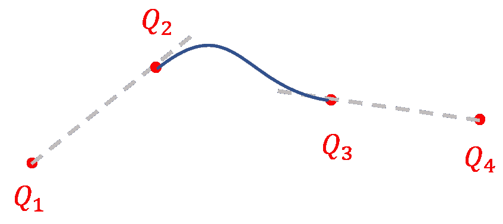

4 个点的双三次插值示例。图片作者。

通过计算导数并将其设置为等于梯度，以及通过在内部相邻点评估三次公式，可以将条件转化为公式。

我们可以使用`scipy`的`interpolate.**CubicSpline**`函数来计算。

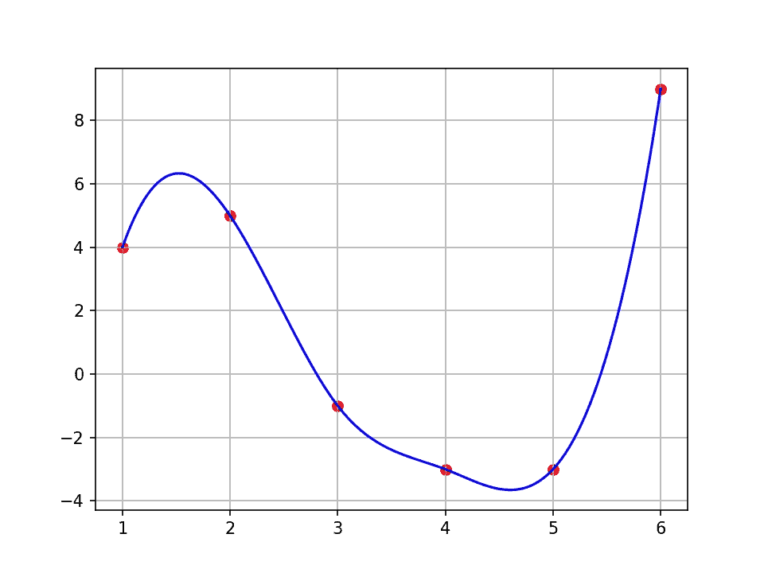

蓝线是红点的双三次插值。图片作者。

在 2D，这将涉及 16 分。我们将对 4 行点执行三次样条插值，然后对新的 4 个插值点执行最后一次三次样条插值:

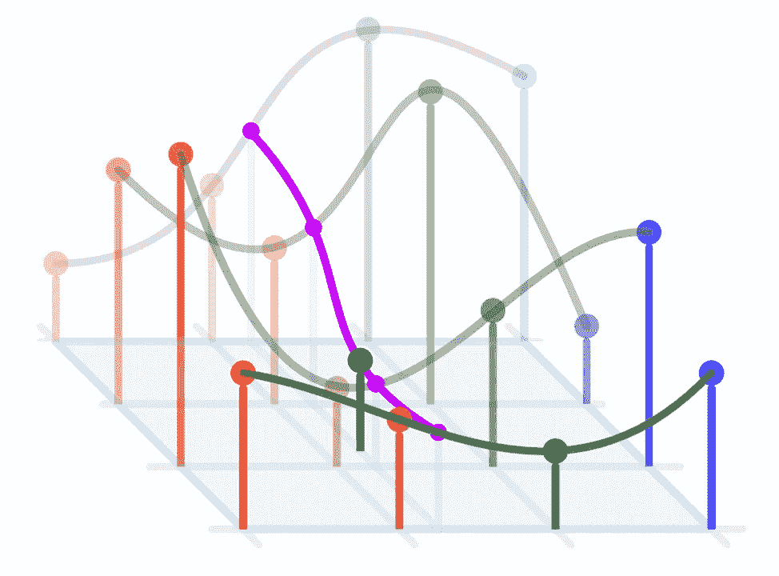

维基媒体 [Cmglee](https://commons.wikimedia.org/wiki/User:Cmglee) 的双三次插值图

高效地实现这种算法是非常困难的。相反，你可以使用`PILLOW`的`resize`方法:

```
im.resize(size, Image.BICUBIC)
```

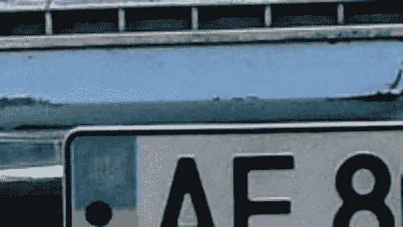

图片缩小(左)和放大(右)照片由[约翰-马克·史密斯](https://unsplash.com/@mrrrk_smith)从 [Unsplash](https://unsplash.com/photos/NslBwDGhCf0) 拍摄

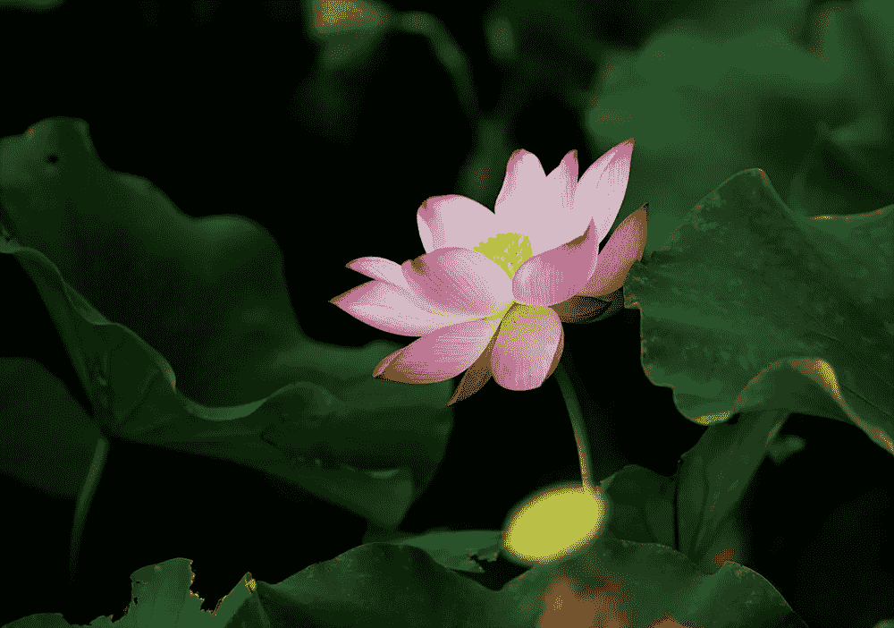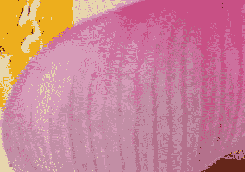

图像缩小(左)和放大(右)照片由[hiếu·洪](https://www.pexels.com/@hieu?utm_content=attributionCopyText&utm_medium=referral&utm_source=pexels)从[像素](https://www.pexels.com/photo/selective-focus-photography-of-pink-petaled-flower-in-bloom-1179863/?utm_content=attributionCopyText&utm_medium=referral&utm_source=pexels)拍摄

# 箱式取样


图片作者。

这种方法专门用于缩小规模。当使用上述算法之一进行缩小时，一些像素被完全忽略。这导致缩减质量很差。为了克服这一点，框采样将缩小图像中的每个像素都视为原始图像中的一个框。它的颜色是盒子内部颜色的平均值。


使用箱式采样缩小图像。约翰-马克·史密斯从 [Unsplash](https://unsplash.com/photos/NslBwDGhCf0) 拍摄(左)[hiếu·洪](https://www.pexels.com/@hieu?utm_content=attributionCopyText&utm_medium=referral&utm_source=pexels)从 [Pexels](https://www.pexels.com/photo/selective-focus-photography-of-pink-petaled-flower-in-bloom-1179863/?utm_content=attributionCopyText&utm_medium=referral&utm_source=pexels) 拍摄(右)

相反，你可以使用`PILLOW`的`resize`方法:

```
im.resize(size, Image.BOX)
```

还有其他图像缩放算法，如[**【Sinc】**](https://www.wikiwand.com/en/Whittaker%E2%80%93Shannon_interpolation_formula)**和** [**Lanczos**](https://www.wikiwand.com/en/Lanczos_resampling) **重采样**或**基于深度卷积神经网络的算法**，但它们稍微复杂一些。

图像缩放是图像处理的重要组成部分。在本文中，我只讨论了简单的图像缩放算法及其背后的原理。实时视频缩放算法通常在硬件(GPU)上完成，以获得更快的性能。