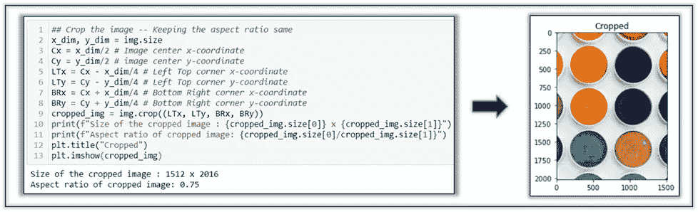

# 图像处理— OpenCV 与 PIL

> 原文：<https://towardsdatascience.com/image-processing-opencv-vs-pil-a26e9923cdf3?source=collection_archive---------6----------------------->

## 辅导的

## 利用 Python 库从图像中提取信息


莫琳·斯格罗在 [Unsplash](https://unsplash.com/s/photos/color-palette?utm_source=unsplash&utm_medium=referral&utm_content=creditCopyText) 上的照片

数据分析师的工作不仅限于处理现成的数据，有时还需要从图像中挖掘数据。

这个故事是关于使用 Python 的不同类型的图像特征提取。此外，在这里你会发现两个图像处理库的 ***速度*** 的经典对比——OpenCV 和 PIL

> ____ OpenCV 比 PIL 快 1.4 倍 ___

📌想跟着去吗？这里是我的[*Jupyter——笔记本*](https://github.com/17rsuraj/data-curious/blob/master/TowardsDataScience/ImageProcessing_tds_v1.ipynb) 。
📌更多的资源总是与💡

在我最近的项目中，我每天需要处理 10000 多张图像，并从中提取数据。也只有 Python 能帮我做这个批量处理。我通常对图像做以下处理:
1。提取图像的纵横比。
2。裁剪图像。
3。将图像更改为灰度图像。
4。图像旋转。然而，我的工作不止于此。我做更多的特别分析。

在我的项目中，很多信息也隐藏在图像名称中。这里讨论的字符串操作方法在这样的任务中非常方便。

</five-must-know-string-methods-in-python-e97925d12eec> [## Python 中五个必须知道的字符串方法

towardsdatascience.com](/five-must-know-string-methods-in-python-e97925d12eec) 

# 什么是图像？

图像只是一个像素矩阵，每个像素是一个正方形的彩色光点。这可以用灰度图像很快解释。灰度图像是每个像素代表不同灰度的图像。


作为灰度值数组的图像|作者提供的图像

上图中，左边的原图实际上是一种灰色的深浅不同的分布。在右侧，在像素灰度值阵列中，值 0 代表黑色，值 255 代表白色。0 到 255 之间的所有值代表不同的灰色阴影。关于这方面的进一步信息可以在这里找到 [*。*](https://datacarpentry.org/image-processing/aio/index.html)

# OpenCV Vs PIL

一次随机的谷歌搜索🔍对于 Python 中的图像处理，指向这些常用的图像处理库。


Python 中的图像处理库|作者提供的图像

OpenCV 是用 C 和 C++写的，而 PIL 是用 Python 和 C 写的，因此仅从这些信息来看，OpenCV 似乎更快。在处理 1000 幅图像进行数据提取时，处理速度🚀事关重大。下面是这两个库的快速比较。


OpenCV 和 PIL 的区别|图片由作者提供

我主要使用 OpenCV 来完成我的任务，因为我发现它比 PIL 快 1.4 倍。首先，让我一步一步地向你展示如何使用 OpenCV 和 PIL 来处理图像。

# 用 OpenCV 进行图像处理

首先安装 OpenCV Python 包，将包导入 Jupyter-Notebook 或者 Python IDE。

```
pip install opencv-python
import cv2
```

仅在首次使用时需要安装。

## 将图像读入变量

`img = cv2.imread(path_to_the_image)`
使用这个方法从 OpenCV 包中读取图像到变量`img`中。正如我前面提到的，OpenCV 默认读取 BGR 格式的图像。

> 什么是 BGR 和 RGB 格式？
> 两者代表相同的颜色(R)红，(G)绿，(B)蓝，但排列这些颜色区域的顺序不同。在 BGR，红色通道被认为是最不重要的，在 RGB 中，蓝色通道是最不重要的。


使用 Python 中的 OpenCV 阅读图片|作者图片

为了这篇文章，我将使用`cvtColor`方法将其转换为 RGB 格式。

## 裁剪图像

让我们裁剪图像，保持纵横比不变。因此具有相同纵横比的区域将从图像的中心被裁剪。

> 图像的纵横比是其宽度与高度的比率。它通常用冒号分隔的两个数字表示，如 *width:height。比如 16:9。*


使用 Python 中的 OpenCV 裁剪图像|作者提供的图像

在 OpenCV 中，图像是一个 NumPy 数组，并以与 NumPy 数组切片相同的方式裁剪图像。这就是为什么它比 PIL 的 ***快 8210 倍****。*

## *旋转图像*

*图像旋转在这里非常简单。OpenCV 中的方法`rotate()`允许图像以 90°的倍数旋转。*

**

*使用 Python | Image by Author 中的 OpenCV 旋转图像*

*💡更多关于`rotate()`方法的信息可以在 [*这里*](https://www.geeksforgeeks.org/python-opencv-cv2-rotate-method/) 找到。*

## *将图像转换为灰度*

**灰度*图像是仅由不同灰度组成的图像，从黑色到白色不等。一幅 8 位图像有 256 种不同的灰度。这意味着图像的每个像素取 0 到 255 之间的值。再次使用方法`cvtColor()`将旋转后的图像转换为灰度。*

**

*使用 Python 中的 OpenCV 将图像转换为灰度|作者图片*

*💡所有的颜色转换代码都可以在 [*这里*](https://docs.opencv.org/3.4/d8/d01/group__imgproc__color__conversions.html#ga4e0972be5de079fed4e3a10e24ef5ef0) 找到。*

# *用 PIL 进行图像处理*

*枕头是目前使用的图书馆，这是来自 PIL。
第一次使用，从包安装开始。然后将包导入 Jupyter-Notebook 或 Python IDE。*

```
*pip install Pillow
from PIL import Image, ImageEnhance*
```

## *阅读图像*

*导入的图像模块有`open()`方法，在 PIL 读取图像时很方便。就像 OpenCV 一样，带有扩展名或完整路径的图像名可以传递给这个方法。*

**

*使用 PIL |作者图片阅读图片*

## *使用 PIL 进行图像裁剪*

*同类图像有方法`crop()`裁剪图像。PIL 的图像裁剪与 OpenCV 略有不同。*

**

*使用 PIL |作者图片裁剪图片*

*`Image.crop()`接受一个元组作为输入。这个元组包括要裁剪的区域的左上角和右下角的坐标。*

## *PIL 图像旋转*

*图像类还包括方法`rotate()`。而且与 OpenCV 不同的是，只有逆时针旋转的角度作为一个整数可以传递给这个方法。*

**

*使用 PIL |作者图片旋转图片*

## *将图像转换为灰度*

*就像 PIL 的其他任务一样，图像格式转换也很简单。方法`convert()`返回转换后的图像。*

**

*使用 PIL 的灰度图像|作者图片*

*图像数据挖掘的程序化方法通常用于批量图像处理。又来了 ***速度*** 的游戏⏳。*

*我下载了 880 张图片🎁从谷歌和处理每张图片 10 次，以有足够的程序负荷，找出在 OpenCV 和 PIL 的图像处理所需的时间。*

**

*OpenCV 与 PIL 对比|作者图片*

*正如所料，与 PIL 相比，OpenCV 花费的时间更少，即 OpenCV 比 PIL 更快。*

*💡关于 OpenCV 中如何进行图像处理的理论解释可以在这里找到 [*。*](https://docs.opencv.org/master/d7/da8/tutorial_table_of_content_imgproc.html)*OpenCV 的妙处在于，你可以在它的网站上看到无数用 Python、C++和 Java 编写的例子。**

**同样，更多关于 PIL 的信息可以在这里<https://pillow.readthedocs.io/en/stable/>**。*💡***

**这只是图像处理中最常用的两个 Python 包的概述，以及它们如何以不同的方式返回相同的结果。我希望你喜欢并从这本书中学到一些东西。**

**通常对于我的工作，我发现 OpenCV 更可靠和更快，然而，根据不同的图像处理，反过来也是可能的。**

**正如我常说的，我乐于接受建设性的反馈和通过 LinkedIn 分享知识。**

# **感谢您的时间和阅读！**

**📚在这里看看我关于数据分析的其他文章。**

1.  **[用 Power BI 可视化 SQLite 数据](/visualize-sqlite-data-with-power-bi-734856383643)**
2.  **[Python 中的标签编码器和 OneHot 编码器](/label-encoder-and-onehot-encoder-in-python-83d32288b592)**
3.  **[使用 Python 的 SQL 数据库](https://medium.com/analytics-vidhya/sql-database-with-python-5dda6c9a0c8d)**
4.  **[网页抓取—制作您自己的数据集](/web-scraping-make-your-own-dataset-cc973a9f0ee5)**
5.  **[假设检验& p 值](/hypothesis-testing-p-value-13b55f4b32d9)**
6.  **[加入表格](/join-the-tables-ab7fd4fac26b)**

# **如何看完所有的中篇文章？**

**立即成为媒体会员&获得⚡ ***无限制*** ⚡访问所有媒体故事的权限。**

> **[*在这里报名*](https://medium.com/@17.rsuraj/membership)*[*加入我的邮箱订阅*](https://medium.com/subscribe/@17.rsuraj)***

***当你在这里注册并选择成为付费媒介会员，我会从你的会员费中获得一部分作为奖励。***