# 图像处理综合指南:第 2 部分

> 原文：<https://towardsdatascience.com/image-processing-part-2-1fb84931364a?source=collection_archive---------14----------------------->

## [图像处理要领](https://towardsdatascience.com/tagged/image-processing-projects)

## 从线性(相关和卷积)和非线性空间滤波到用于平滑、锐化、噪声去除和边缘检测的特殊核

# 第 2.1 部分

空间操作直接在给定图像的像素上执行，我们将这些操作分为三类。“ ***空间域操作****”*是这个题目你能遇到的另一个词，这些是同一个术语！

1.  单像素操作
2.  邻域操作
3.  几何变换

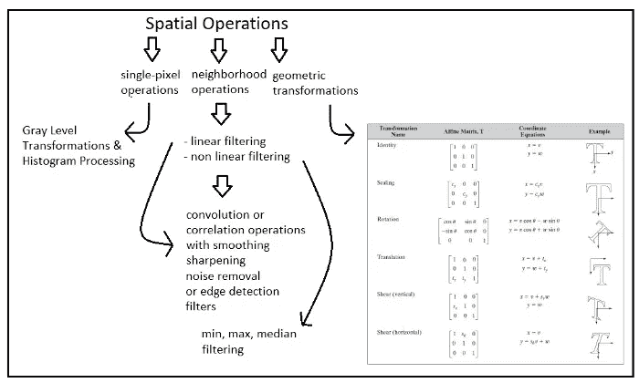

图 1“作者图片”

我们已经在 [**图像处理第一部分**](https://yagmurcigdemaktas.medium.com/image-processing-4391c5bcef78) 中看到了什么是单像素操作以及如何将它们应用于图像。在这篇文章中，我将解释“**邻域运算**是什么意思以及如何应用它们。

因此，到目前为止，我们已经了解了应用于图像的逐像素变换(单像素操作)。与单像素操作不同， ***“邻域操作”*** 代表应用于一组**像素**的操作，而不是 1 乘 1。为此，我们使用了一个 ***【滤波器】*** ，它是一个给定大小的**窗口**，我们通过应用所需的操作，使用这个滤波器遍历图像。

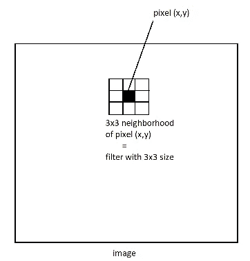

“作者提供的图像”

！！！因此，我们可以将邻域操作定义为具有 1 个过滤器(一个 ***窗口，另一个单词的内核或遮罩*** )和 1 个我们选择的特定操作的操作。

如图 1 所示，我们可以将邻域操作分为非线性过滤和线性过滤。让我们从非线性的开始！

**非线性空间滤波**

如果我们选择一种非线性操作来应用我们的滤波，则该操作被称为非线性空间滤波。让我们检查各种非线性空间滤波类型。

*最小滤波*

当我们使用我们的过滤器遍历图像时，我们在停留在该过滤器中的像素中选择具有最小值**的像素，并将该像素写入我们的输出图像。考虑到我们有一个 9x9 的输入图像和一个 3x3 的过滤器，我们将使用它来应用最小过滤，我们将有以下输出图像:**

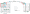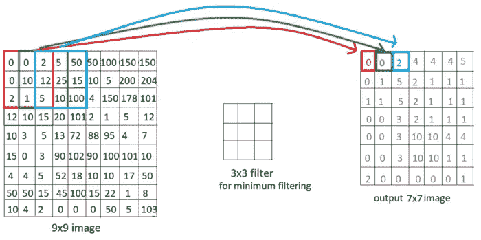

“作者提供的图像”

输出图像与输入图像大小不同，对吗？在我们想要输出尺寸完全相同的图像的情况下，我们应该应用 ***填充。***

*填充*

填充是在输入图像上添加额外像素的过程，以保持输出图像的大小与输入图像相同。最常见的填充技术是添加零(其被称为 ***零填充*** )。为了达到正确的大小，我们需要添加( **filter_size — 1) / 2** 额外的像素到我们的边界，如下所示(所以我们为每个边界添加 3–2 = 1 个额外的像素，并获得 2 个额外的列和 2 个额外的行)

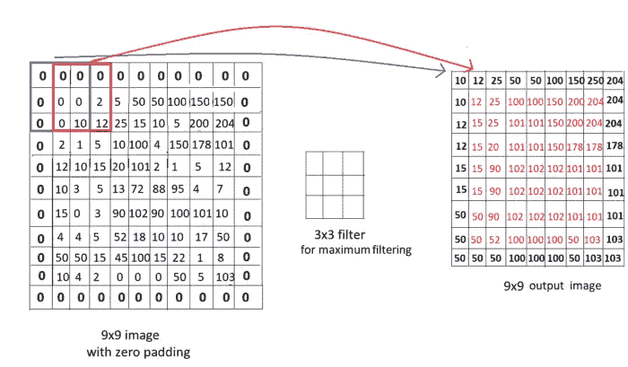

“作者提供的图像”

*最大过滤*

与最小过滤的唯一区别是，对于最大过滤，我们在窗口的像素中取最大值并将其传递给输出图像。我们可以很容易地再次使用 3x3 窗口获得相同输入图像的以下结果。

“作者提供的图像”

*中值滤波*

另一种类型的非线性空间滤波是中值滤波，其中**像素以升序排序，并且选择中间像素**。对于我们的示例情况(具有 0 填充的 9x9 输入图像)，我们获得的第一个窗口是{0，0，0，0，0，0，0，10}，因此它已经被排序，并且选择 **0** 作为输出图像的第一个像素。我们获得的第二个窗口是{0，0，0，0，20，10，12}，当我们对它排序时，我们获得{0，0，0，0，10，12，20}，因此我们输出图像的第二个像素又是 **0** 。让我们继续我们获得的更多窗口:

第三个窗口:{0，0，0，2，5，10，12，15}，这为输出图像的第三个像素提供了 **2** 。
第四个窗口:{0，0，2，5，50，12，25，15} - >顺序- > {0，0，0，2，5，12，15，25，50} - >拾取中间的像素- > **5**
第五个窗口:{0，0，0，5，50，50，25，15，10} - >顺序- >

最后，我们获得以下输出:

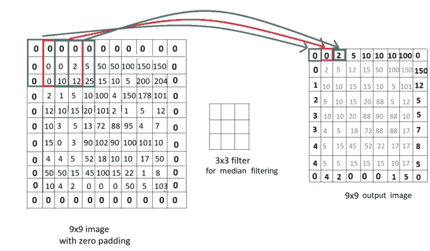

“作者提供的图像”

**实施**

我准备了一个 python 代码，你可以更近距离地处理图像，并进行这些操作。

1.  你可以创建一个你选择的 2D 列表，用任何填充和内核大小(过滤器大小)尝试上述操作，然后检查结果！
2.  您可以使用 OpenCV 读取图像，如下例所示，将其转换为 python 列表结构，并以相同的方式将其用于这些函数。
3.  同时，使用 Python 的 PIL 库，用几行代码就可以完成这些操作！

让我们来看看来自 Test_2D_list()的一些 2D 数组结果，其中我将这些函数应用于我们的示例案例:

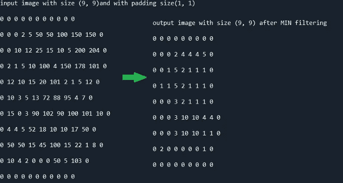

最小过滤“按作者分类的图像”

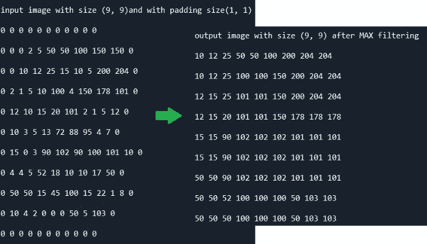

最大过滤“按作者分类的图像”

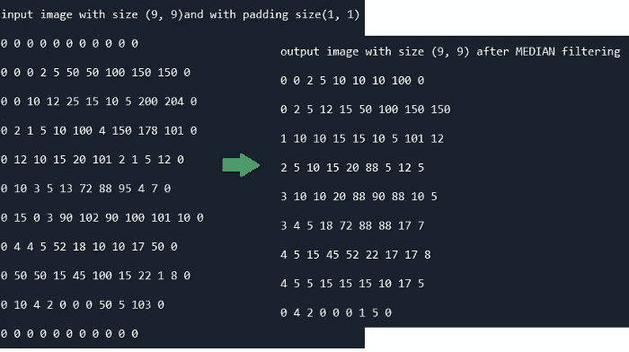

中值滤波“按作者分类的图像”

现在让我们对一幅真实的灰度图像使用这些函数，看看 Test_Image()函数的输出:

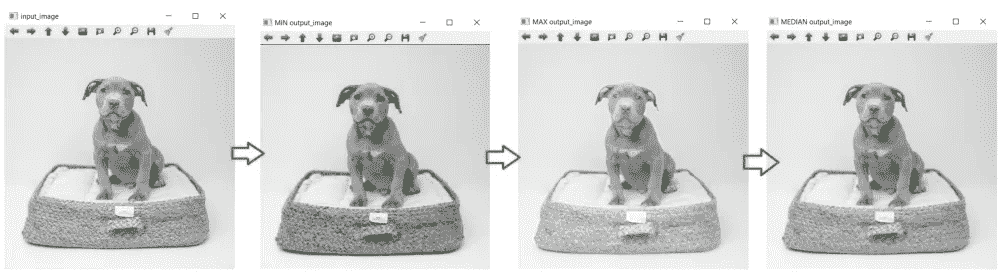

“作者提供的图像”

最后，让我们看看 PIL 库函数如何调用 PIL 比较()函数

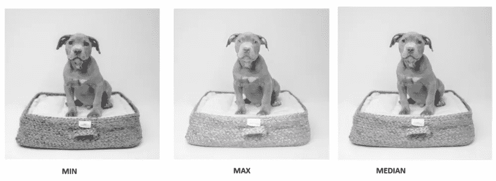

“作者提供的图像”

我实现的结果和 PIL 库函数看起来很相似！🎯﹡
你有没有意识到**最小滤波**使输出图像**变暗**，而**最大滤波**使输出图像**变亮**？因为正如我们在 [**图像处理 Part1**](https://yagmurcigdemaktas.medium.com/image-processing-4391c5bcef78) 中提到的，较小值的像素接近黑色，较高值的像素接近白色。此外，**中值滤波器**通常用于**去除噪声**而不是改变图像的强度。看看下面的输入图像，我在上面添加了一些椒盐噪声和最小、最大、中值滤波器的效果

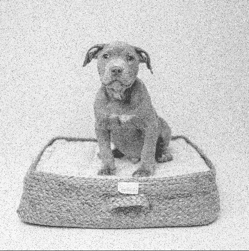

“作者提供的图像”

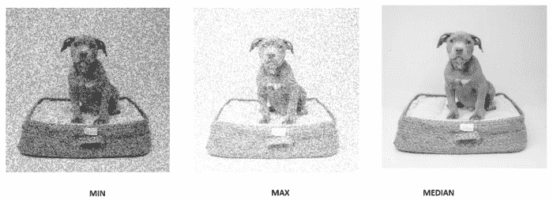

“作者提供的图像”

我们看到最小和最大滤波器对噪声没有影响，实际上它们对有噪声的图像效果很差，而中值滤波器成功地去除了噪声。

最后一点，你应该知道我们在这篇文章中使用的 **PIL 图像处理函数**在默认情况下使用了**零**T21 填充。所以输出图像的大小不会改变，你只需要给出你想要使用的图像和内核大小。

你可以从那个 [**github**](https://github.com/YCAyca/Image-Processing/tree/main/Part2) 链接到达完整的源代码。我们将在**第 2.2 部分**中继续线性空间滤波

# **第 2.2 部分**

在**图像处理部分 2.1** 中了解非线性空间滤波技术后，现在是时候检查线性空间滤波技术了。

我们将**仍然使用相同的过滤方法**(所以我们**仍然有一个过滤器/内核/窗口**用于线性空间过滤)但是我们将改变我们应用的操作类型。

**相关性**

相关地，我们有一个“加权滤波器”,此时我们在滤波像素中有值，我们将它们与图像中相应的像素相乘。我们对这些乘法求和，**得到**我们的**一个输出像素！**

让我们想象一下这个操作:

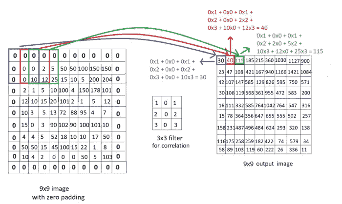

“作者提供的图像”

**卷积**

这是与相关相同的过程，除了只有 1 个不同。这里，我们在应用相关之前将滤波器旋转 180°。因此我们得到以下结果:

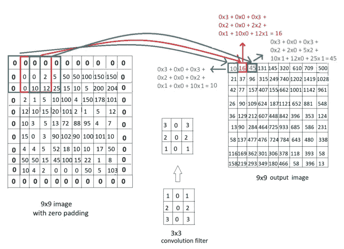

“作者提供的图像”

检查下面的代码和 Test _ Correlation _ Convolution _ 2D()函数的输出，在这里我实现了卷积和相关运算，并把它们应用到我们的示例图像中，使用了与上面解释中相同的滤镜。请不要被整个代码弄糊涂了。下面会一步步讲解。目前，我们只做了 120 个。线条

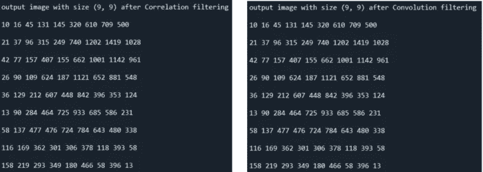

“作者提供的图像”

**！！！**当你在谷歌上查找卷积和相关性时，你会遇到很多卷积被解释为相关性的情况，可能根本没有提到相关性。你应该知道这是一个*巨大的*用词不当，特别是用在神经网络卷积层。

现在是时候学习一些**特定的过滤器**用于卷积和相关操作，以处理我们的图像。当然，你可以创建自己的过滤器，做任何你想做的事情，但是你也需要学习一些常见类型的过滤器。基本上，我们将这些过滤器分为 4 组:

***平滑(模糊)滤镜***

平滑滤波器用于平滑图像。基本上，当我们将该滤波器应用于图像时，例如通过卷积运算，我们得到了输入图像的更平滑版本。

*   **高斯滤波器(高斯低通滤波器)**是一种基于高斯分布的常用平滑滤波器，高斯分布的公式如下，σ =标准差:

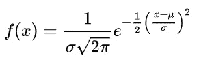

我们可以按照这个公式创建任意大小的高斯滤波器。σ = 1 的两个例子如下:

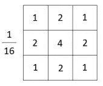

“作者提供的图像”

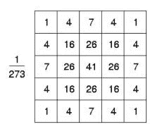

“作者提供的图像”

让我们看看使用这两个高斯滤波器和我们的 linear_filtering 函数的示例输出。对应代码中的**“平滑”**副标题

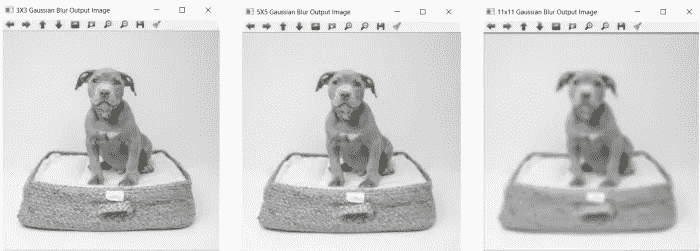

“作者提供的图像”

！！！作为一个预期的结果，随着**更高的内核大小**，我们获得了更突出的(**更模糊的**)结果。但是内核大小仍然彼此接近。使用 **gkern** 函数[1]已经在代码中找到并使用了几次，我们可以自动创建任何大小(实际上甚至是任何标准偏差！)来观察不同核大小和标准差的不同效果。

作为一个附加信息，你也可以使用 OpenCV 的 GaussianBlur 函数来做同样的工作，如代码中的**“OpenCV 平滑”**副标题所示

***锐化滤镜***

锐化滤波器用于锐化图像。基本上，当我们将该滤波器应用于图像时，例如通过卷积运算，我们得到输入图像更清晰的版本。

*   **反锐化和高增强滤波**是一种使用平滑滤波器来锐化图像的技术。是的，这也是一种常见的技术！我们从我们的输入图像中减去我们的输入图像的“平滑”版本，以获得“**中间遮罩**”。然后，我们将这个掩模乘以一个系数添加到我们的输入图像，以获得最终的输出图像。

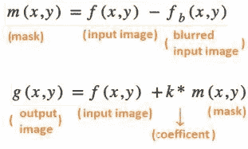

对于模糊步骤，我们基本上可以使用高斯模糊(高斯平滑滤波器)。让我们来看看**“反锐化掩模和高增强”**部分代码的输出示例:

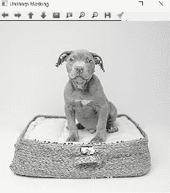

模糊核大小= 5，k= 1 的反锐化掩模和高增强过滤“作者的图像”

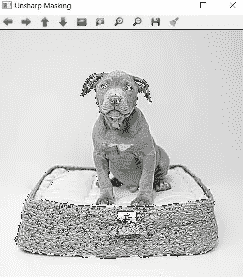

模糊核大小= 5，k= 2 的反锐化掩模和高增强过滤“作者提供的图像”

我们可以简单的认识到**随着** **增加 k** ，**锐化效果**也随着**增加**。您可以使用 OpenCV 的函数实现反锐化和高增强过滤，如代码中的**“OpenCV 反锐化掩模&高增强”**部分所示

***去噪滤镜***

有时，我们需要处理有一些噪声的图像——不需要的像素。为了消除噪声，我们可以使用一个噪声消除滤波器。去噪的重要之处在于，这些滤镜同时具有模糊效果。因此，选择一个好的内核大小来消除一些噪声而不丢失图像中的所有细节是非常重要的。出于同样的原因，你可能会遇到噪声消除滤波器被用于模糊，它们可以被归类为不同来源的模糊滤波器。

无论如何，为此有 4 个特定的噪声消除滤波器，每个滤波器都能更好地处理特定类型的噪声。

*   最小滤波是我们在上面第 2.1 部分看到的非线性滤波类型之一。我不会再提这个话题了，但是你应该知道，那个滤波器对于**盐噪声去除**！
*   **最大过滤**是我们在上面第 2.1 部分**中看到的非线性过滤类型之一。我不会再提这个话题了，但是你应该知道那个过滤器对去除**胡椒噪声**有好处！**
*   **中值滤波**是我们在上面**的第 2.1 部分看到的非线性滤波类型之一。**我不会再提到这个话题，但你应该知道，该滤波器对**去除椒盐噪声**很好，而且它比均值滤波更好**去除噪声，而不会使图像变得太模糊！**
*   **均值(平均)滤波**最后是一个线性滤波器，用来去除噪声。目标是取停留在内核中的像素的平均值，并将该平均值作为输出像素。因此，我们可以通过使用以下公式来创建任何平均核:

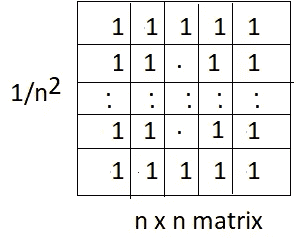

“作者提供的图像”

基本上，对于 3×3 均值滤波器，我们有这样一个:

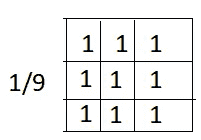

“作者提供的图像”

或者对于 5×5 均值滤波器:

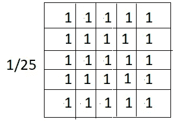

“作者提供的图像”

让我们看看不同均值滤波器的不同输出。你可以在“噪声去除均值滤波器”部分找到相关代码。

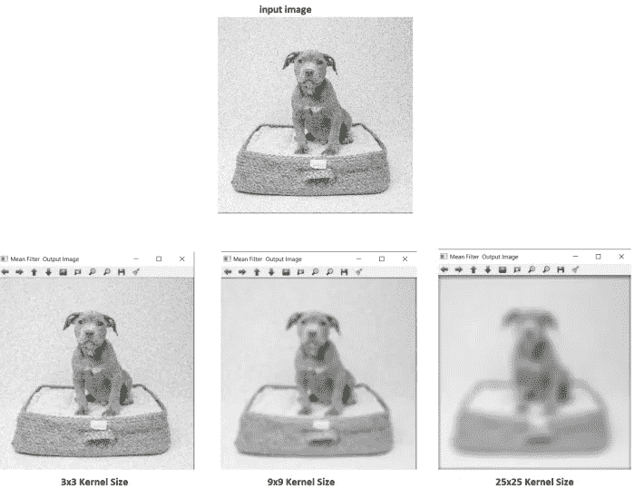

“作者提供的图像”

我们可以看出，3x3 的过滤器不足以消除所有的噪音，25x25 的内核大小太大，导致图像中所有的细节甚至边缘都丢失了。9x9 内核大小选择似乎更适合这种情况！

***边缘检测滤镜***

对于图像的边缘，我们也有一些特定的过滤器。如果你想知道“什么是优势”，“什么是特征，以及我们如何在计算机视觉中使用它们”，请与我进一步的帖子保持联系！现在我们将直接用不同的过滤器来检测边缘。

*   ***一阶导数边缘检测滤波器***

这些滤波器基于对图像进行一阶导数的思想。当您将图像视为信号时，只需在 x 或 y 方向上求导，这里我们有“离散”滤波器，它是通过在一个 n x n 矩阵中近似这一概念而获得的。

**索贝尔内核**

3x3 Sobel 核如下，其中 Gx 用于水平边缘检测，Gy 用于垂直边缘检测。

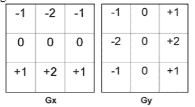

3x3 Sobel 核

我们再仔细看看 Gx 的结构:
中间一行由全零组成，其他行的中心像素有半行的和值，矩阵的上半部分由负值组成而下半部分由正值组成。同样的逻辑适用于只有方向差异的 Gy。

有了这个算法，你可以创建一个更大的 Sobel 核，如下所示:

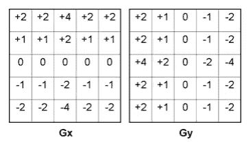

5x5 Sobel 内核

**Prewitt 内核**

另一个基于一阶导数的核，与 Sobel 只有一个不同，如下所示:

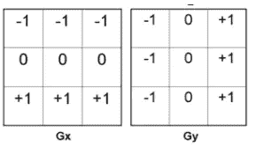

3x3 Prewitt 内核

这里，我们有一行(在水平核中)或一列(在垂直核中)的中心像素，与相关行或列中的其他像素相同。所以，基本上你可以有一个 5x5 的 Prewitt 内核，如下所示:

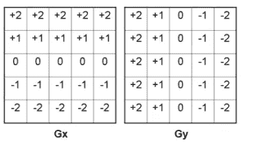

5x5 Prewitt 内核

让我们看看这两种不同内核大小的内核类型的输出。您可以在代码中的**“一阶导数边缘检测”**部分找到相关实现:

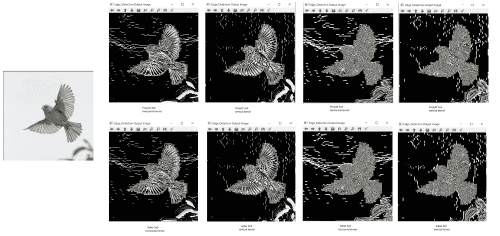

“作者提供的图像”

结果似乎有太多的优势，对不对？看起来我们得到了一个充满噪声的输出图像，而不是检测所需的边缘。为了处理边缘检测核的强烈效果，在使用这些边缘检测核之前，我们需要模糊输入图像！

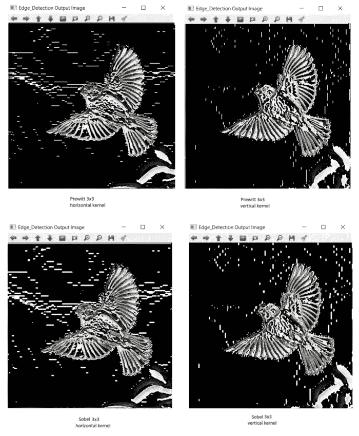

使用 5x5 高斯模糊内核模糊图像后检测到的边缘。“作者提供的图像”

我们看到了更好的结果，但是模糊处理对于 5x5 边缘检测内核是不够的。因此，我们可以理解，我们需要增加模糊内核的大小来处理它。

您可以使用 OpenCV 的函数来应用一阶导数核，并将 x 和 y 方向边的结果相加，以获得 1 个一般输出。Prewitt 内核没有实现，但是您可以应用它，如代码中的 **First_Derivative_Opencv()函数**所示。

作为一个额外的信息，你需要知道**与 Sobel 相比，Prewitt** 面具**实现**更简单，但**对噪音非常敏感。**

*   ***二阶导数*** ***边缘检测滤波器***

这些滤波器基于对图像进行二阶导数的想法。

**拉普拉斯核**

这是最常见的二阶导数内核之一，它使用以下公式来计算图像的二阶导数的梯度。

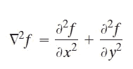

**二阶导数的梯度**

“二阶导数的**梯度**是指拉普拉斯**混合**已经由二阶导数检测到的 x 和 y 方向边缘。因此，我们不需要像上面那样对来自 Sobelx 和 Sobely 内核的图像进行求和和混合。

现在让我们深入这个公式，更好地了解对图像求二阶导数意味着什么:

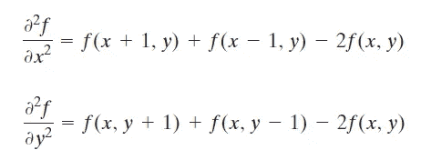

二阶导数的展开

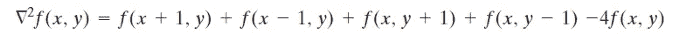

最终方程

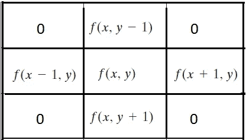

拉普拉斯核模板“作者的图像”

因此，基本上我们可以使用这个拉普拉斯核模板来获得最常见的拉普拉斯核:

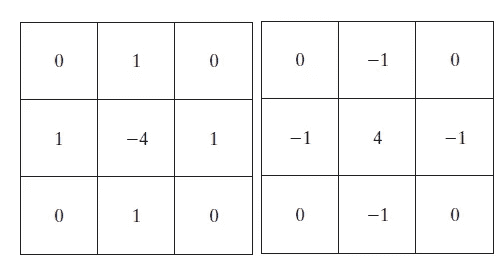

3x3 拉普拉斯核

还有另一个 2 拉普拉斯核是通过近似公式获得的，并且在实践中经常使用:

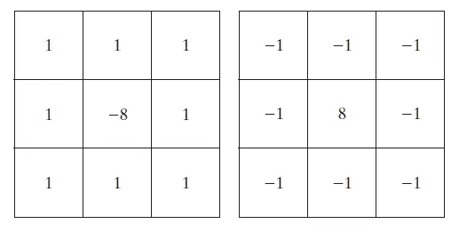

3x3 拉普拉斯核

让我们看看一些使用拉普拉斯核函数和 Edge_Detection()函数的输出示例，如**“二阶导数边缘检测”**部分所示。

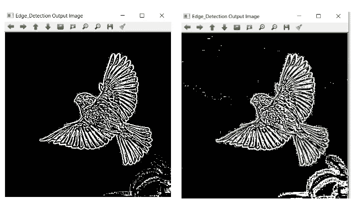

用拉普拉斯核进行边缘检测

您也可以轻松使用 OpenCV 的拉普拉斯函数，如**second derivative _ OpenCV()**函数所示:

**高斯核的拉普拉斯算子(LoG)**

这只不过是一个包含“高斯模糊”和“拉普拉斯核”的核。所以你可以直接使用日志，如果你不想应用“模糊图像”“检测边缘”步骤分开，但都在一个。结合这两种滤波器的公式如下:

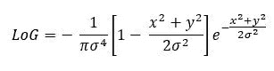

我不会深究将这个公式近似为离散核的细节，但是如果你搜索，你可以找到这个最常见的对数核，高斯标准差= 1.4

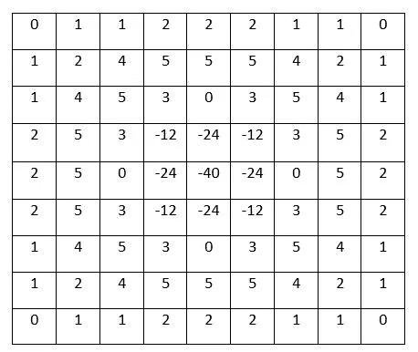

至于实现，如果你愿意，可以直接使用这个内核或者其他类型的日志内核。对于 OpenCV 端，没有 LoG 内核的实现，但是我们在上面通过 OpenCV 使用 after GaussianBlur 为拉普拉斯内核所做的工作是一样的！

**外卖**

*   在进行边缘检测之前，不要忘记模糊输入图像。选择一个合适的模糊内核和边缘检测内核大小适合你的目的。
*   你需要混合来自一阶导数核的 x 和 y 方向的检测边缘，但是通过使用拉普拉斯核，你已经获得了具有两者的一般图像。
*   你也可以使用噪声去除内核来模糊图像。但是反过来并不是一个好主意，因为当他们试图去除噪声时，他们有更大的风险去除图像中的重要特征
*   Prewitt 更容易实现，但比 Sobel 更敏感。
*   中值滤波是去除噪声的较好选择，因为它既适用于椒盐噪声，又比其他滤波器更能去除噪声而不模糊图像。

您可以在我的 [**github**](https://github.com/YCAyca/Image-Processing/tree/main/Part2) 上找到完整的代码和示例图片，并使用不同大小、系数或标准偏差的不同内核进行自己的实验！[图像处理第三部分](https://medium.com/image-processing-part-1/image-processing-part-3-dbf103622909)见💃

[1]"来自[https://stack overflow . com/questions/29731726/how-to-calculate-a-Gaussian-kernel-matrix-in-numpy](https://stackoverflow.com/questions/29731726/how-to-calculate-a-gaussian-kernel-matrix-efficiently-in-numpy)的源代码"

源图像(狗和鸟)取自 unsplash.com，用于解释代码的实验。