# 图像处理综合指南:第 3 部分

> 原文：<https://towardsdatascience.com/image-processing-part-3-dbf103622909?source=collection_archive---------8----------------------->

## [图像处理要领](https://towardsdatascience.com/tagged/image-processing-projects)

## 形态学算子及其在 OpenCV Python 中的使用

在本图像处理系列的倒数第二部分，我们将考察**形态学图像处理。**

形态学图像处理(或称*形态学*)描述了一系列图像处理技术**处理图像中特征的形状(或形态学】**。形态学操作通常用于去除分割过程中引入的缺陷，并且它们通常对二进制(其中图像的像素只能是 0 或 1)图像进行操作。

**！！！**阅读更多关于什么是特征，什么是图像分割等内容。，与我即将出版的刊物保持联系。

***结构元素*** 是我们用于进行形态学运算的基本结构。结构元素的形状可以改变，这取决于我们在图像中寻找的形状类型。下面是 SE 及其矩形阵列形式的一些示例。(当然，我们需要将阿瑟转换成 2D 矩阵的形式，以便能够在编程中表现出来)

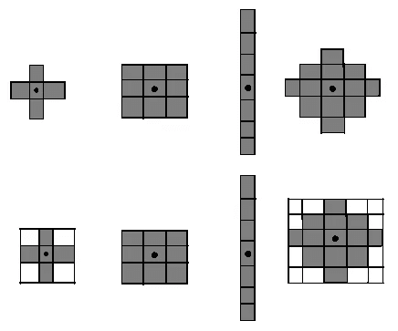

4 种不同的结构元素及其 2D 矩阵构成“作者的形象”

我们有 4 个主要的形态学操作:

*   侵蚀
*   扩张
*   开始
*   闭幕

**侵蚀**

在侵蚀中，结构元素在图像中穿行，当图像模式和结构元素模式**完全匹配**时，图像中结构元素的**种子点处的像素变为 1，如果不匹配，则变为 0。注意侵蚀操作通常由 **⊖** 表示**

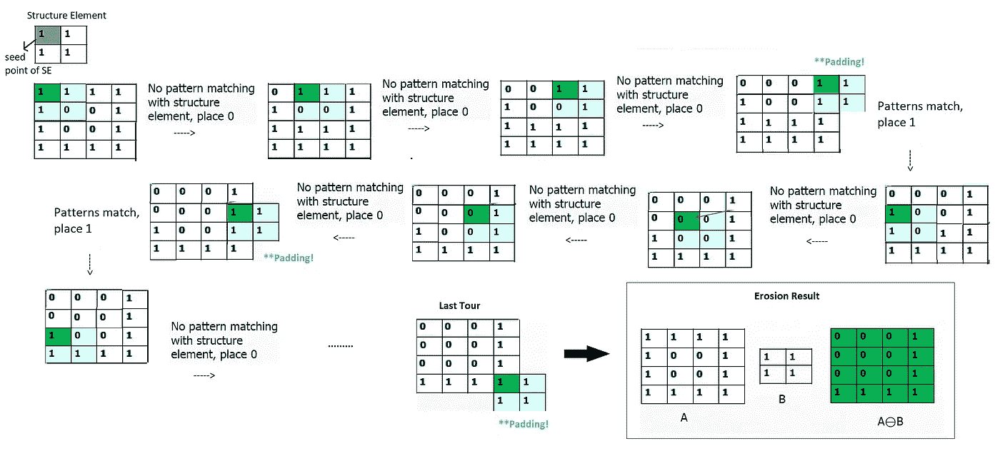

“作者塑造的形象”

边界像素是基于窗口操作的常见问题，正如我们在[图像处理 2](https://yagmurcigdemaktas.medium.com/image-processing-part-2-1fb84931364a) 中看到的卷积和相关操作一样。
侵蚀中，当需要对**结构元素种子** **进行**填充以应用于边界像素**时，我们应用**1-填充**。所以我们在边界增加了 1 个值。它是在 MATLAB、OpenCV 或 Scipy 的内置函数中自动完成的。**

***侵蚀特性***

*   侵蚀会移除对象边界上的像素。换句话说，它**缩小****前景对象**。
*   **放大**前景**孔**。
*   像在图像处理内核中一样，结构元素的尺寸越大，侵蚀的影响越大。
*   当然，不同的结构元素在相同的输入图像上给出不同的输出。

有了这些特性，腐蚀可以**分开连接的物体或者增加它们之间的距离**或者**移除一些多余的像素。**

让我们来看一些应用腐蚀后的输出图像:

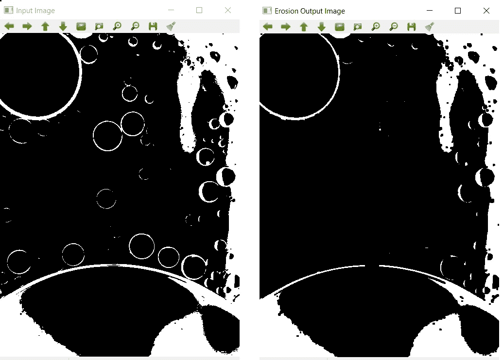

我们看到前景洞变得更大，前景物体消失“作者的图像”

使用 OpenCV 是一个非常简单的过程，如本文末尾代码的**“OpenCV 侵蚀”** **部分所示。**

如果你想用 2D 阵列来检查一些结果，与你的计算结果进行比较，你可以使用 Scipy 库，如本文末尾所附的代码的**“2D 阵列侵蚀”** **部分所示。**

**扩张**

在膨胀中，结构元素穿过图像，当图像模式和结构元素模式有 **1 个匹配像素**时，1 作为输出像素值写入，如果没有匹配像素，则为 0。注意，膨胀操作通常由 **⊕** 表示

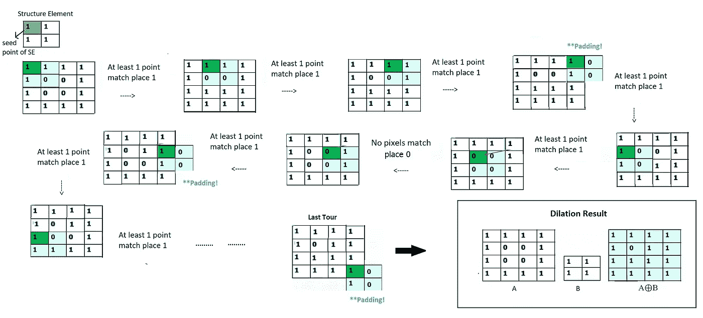

图 2“作者图片”

请注意，在膨胀中， **0 填充被应用**不同于腐蚀！

***膨胀的性质***

膨胀的效果与侵蚀相反。

*   膨胀增加了对象边界上的像素。
*   填充前景中的孔洞并**放大**前景**对象。**
*   但是以腐蚀的相同方式，较大的结构元素给出较大的膨胀效果，并且结果依赖于结构元素。

有了这些特性，膨胀可以修复前景物体中的断裂和缺失像素。

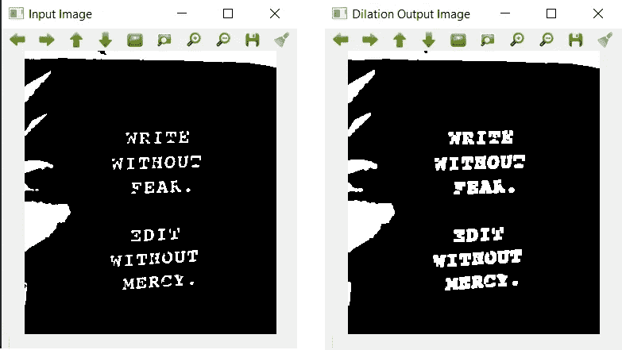

“作者提供的图像”

这是一个使用 OpenCV 的非常简单的过程，如本文末尾代码的**“用 OpenCV 扩展”** **部分所示。**

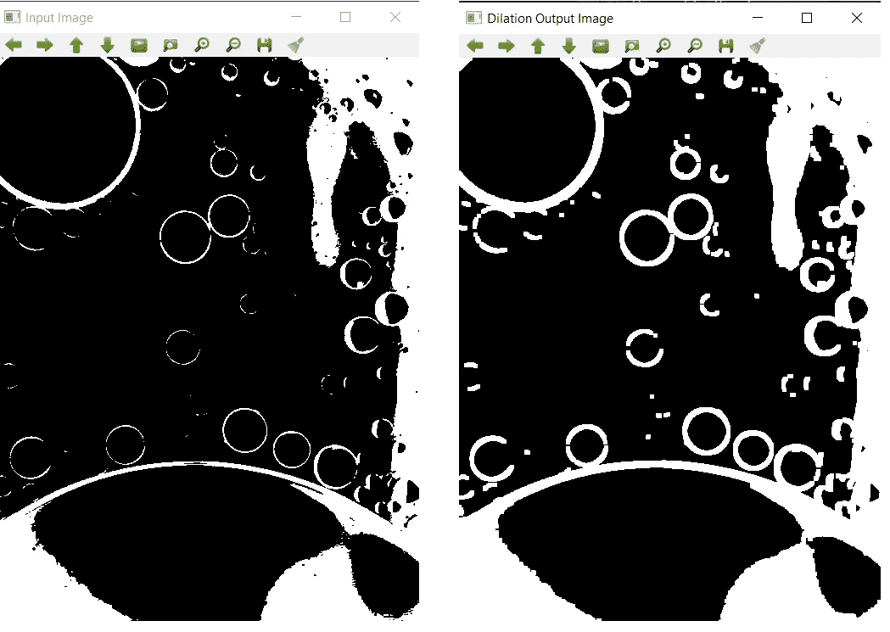

“作者提供的图像”

如果你想用 2D 阵列检查一些结果，并与你的计算结果进行比较，你可以再次使用 Scipy 库。请看附在这篇文章末尾的代码中的**“2D 数组膨胀”** **部分。下面是该代码部分的输出示例。**

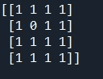

“作者提供的图像”

**结合侵蚀&扩张**

我们学习了形态学的基本运算。现在是时候使用它们来获得更复杂的形态学操作符了。复杂的用于执行许多不同的任务。

*   ***用形态学去除噪声***

**开幕(A⊖B) ⊕B**

开放只是膨胀后侵蚀的另一个名字。**去除盐噪声有效。**

**关闭(⊕甲 B) ⊖乙**

关闭只是腐蚀后膨胀的另一个名称。去除胡椒噪声**有效。**

让我们检查一些开始和结束输出:

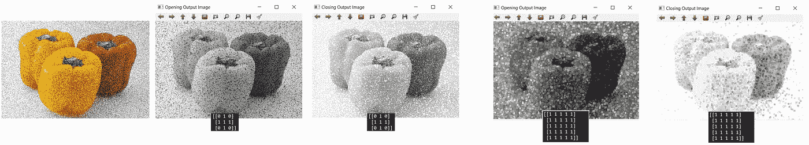

带有盐(白)和胡椒(黑)噪声的输入图像。使用了 2 种不同的结构元素。我们看到打开只消除盐噪声，而关闭只消除胡椒噪声

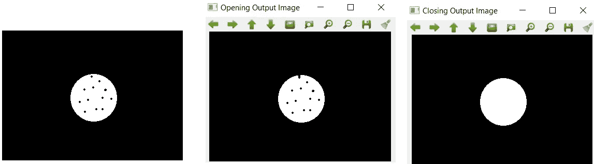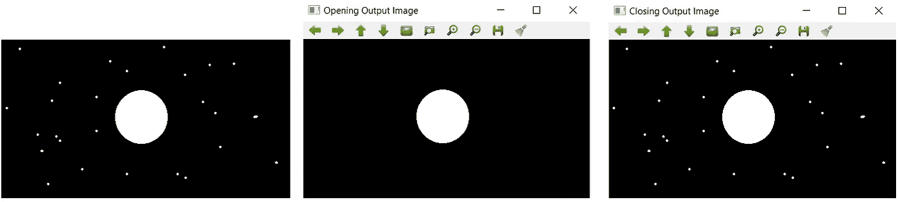

最左侧的图像是输入图像，我们看到中间给出了两个不同结构元素的打开或关闭操作的结果。请参考图下的注释，以便更好地理解这 3 个推论:

*   我们看到打开对盐噪声(白点)和关闭对胡椒噪声(黑点)的影响。
*   结果非常依赖于结构元素。如果你没有为你的图像选择一个好的，你可能得不到形态学操作符的预期效果。
*   在需要关闭的地方使用打开运算符，反之亦然，可能会破坏图像。

当然，如果你的图像同时有椒盐噪声，你可以先打开再关闭，这样可以更好地去除噪声。

你可以很容易地选择一个图像，并使用 Opencv 执行打开-关闭操作，如本文末尾的代码中的**“打开&关闭 OpenCV”部分所示**

*   ***用形态学进行边缘检测***

我们在[图像处理第 2 部分](https://yagmurcigdemaktas.medium.com/image-processing-part-2-1fb84931364a)中学习的另一个操作是如何使用空间线性滤波器，也可以使用组合形态学算子

**外部边界提取(A ⊕ B)-A**

我们对图像进行膨胀并减去原始输入图像以获得外部边缘。

**内部边界提取一- (A⊖B)**

我们取图像的腐蚀并从原始输入图像中减去它以获得内部边缘。

**形态梯度(⊕ B)-(A⊖B)**

我们从膨胀输出图像中减去腐蚀输出图像。虽然外部边界提取对于获得边缘的外侧像素是有效的，并且内部边界提取对于获得边缘的内侧像素是有效的，但是形态梯度为我们提供了边缘“上”的像素。这使得**比内部或外部边界提取的边缘**更厚。

看看外部和内部边界检测的相似性，其中形态学梯度给出较厚的边缘。

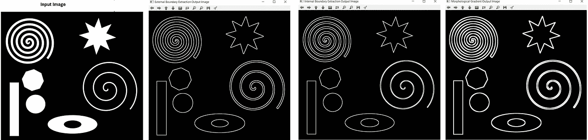

“作者提供的图像”

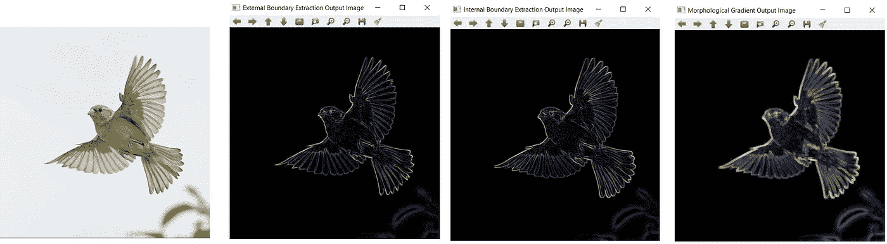

“作者提供的图像”

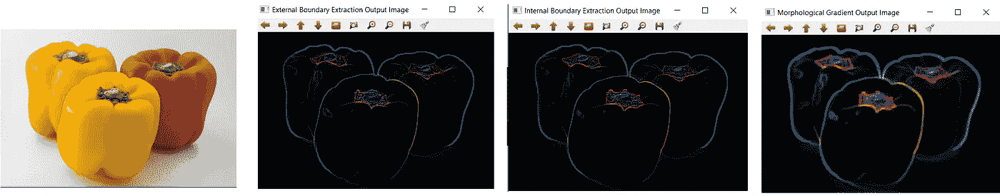

“作者提供的图像”

使用膨胀和侵蚀操作，您可以使用 OpenCV 实现您自己的边缘检测代码，如下面所附代码的**“形态学边缘检测”部分所示:**

这就是我们将在本主题中讨论的内容，但是如果您想进一步了解您可以使用形态学算子做什么，您可以搜索**区域(孔)填充**、**连通分量提取**、**骨架化**、**命中或未命中变换、**等。

点击 [**github**](https://github.com/YCAyca/Image-Processing/tree/main/Part3) 链接，找到我在这篇文章中使用的代码和图片，自己尝试一下！

您可以使用图像处理工具点击 [**进入最后一部分，这里是**](https://medium.com/image-processing-part-1/image-processing-tool-a1b8fe66c957) ！