# 图像处理综合指南:图像处理 GUI

> 原文：<https://towardsdatascience.com/image-processing-tool-a1b8fe66c957?source=collection_archive---------25----------------------->

## [图像处理要领](https://towardsdatascience.com/tagged/image-processing-projects)

## 一个包含 OpenCV、QT Creator 和 C++的图像处理工具

作为关于图像处理流程的这个系列的最后一部分，我想展示一个简单的图像处理工具，它是在带有 C++ 的 **QT Creator (5.12.10)上使用 **OpenCV 3.2.0** 实现的，可以应用前面帖子中讨论的几乎所有图像处理操作。**

要能使用，在 QT 上搭建 OpenCV 3.2.0，把一些绝对路径改成你的本地路径就够了。了解如何使用该工具的一些提示和示例:

*   主页

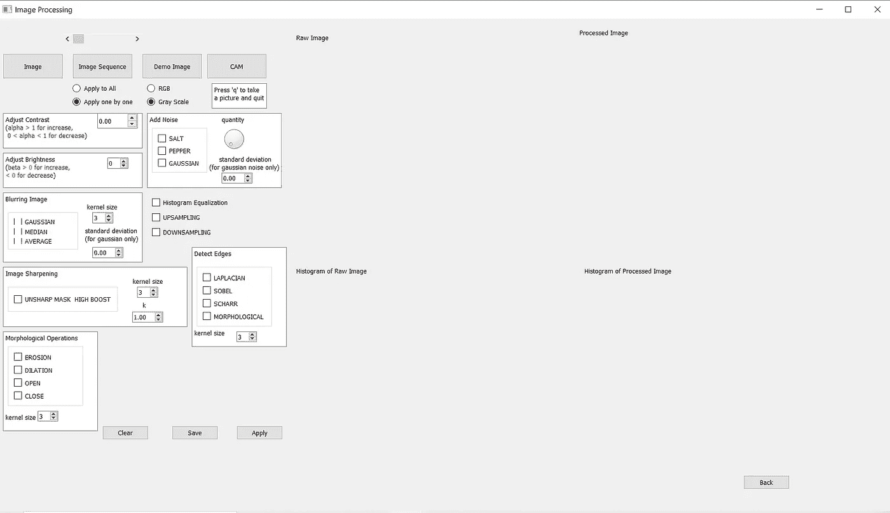

“作者提供的图像”

您可以选择演示图像来使用来自应用程序的默认图像，并开始使用这些功能。对于此选项，您可以选择是使用灰度默认图像还是 RGB 默认图像。

可以应用任何更改，但单击“应用”按钮，将在右侧看到结果图像和结果直方图。

**使用演示图像**

*   灰度

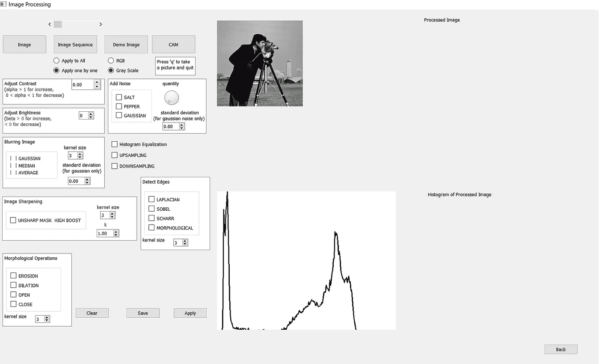

“作者提供的图像”

通过选择一个灰度演示图像，我们看到 cameraman.png 和它的初始直方图。现在，我们可以应用以下任何过程:

*   **增加 alpha 将增加对比度，在 0 和 1 之间减少将降低对比度。用箭头表示的每一步的尺寸为 0.25。在后台，应用功能如下:**

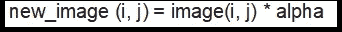

“作者提供的图像”

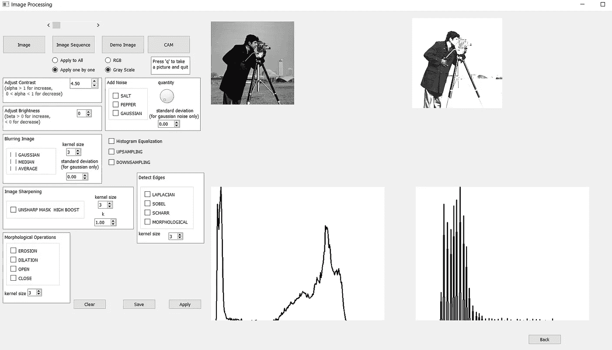

使用 alpha = 4.50 调整对比度的示例“作者提供的图像”

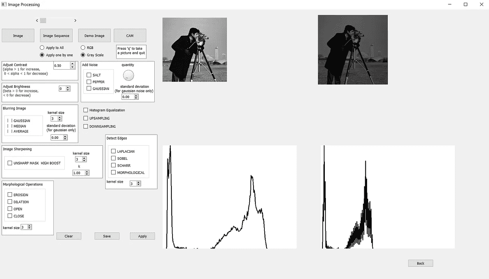

使用 alpha = 0.50 调整对比度的示例“作者提供的图像”

*   ***调节亮度****:*β的值可以用箭头改变，或者可以在调节亮度平面的右侧框中输入任何值。增加β将使亮度增加β>0，而减少β将使亮度减少β<0。箭头所指的每一步都是 10 码。在后台，应用功能如下:

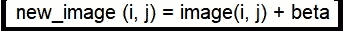

“作者提供的图像”

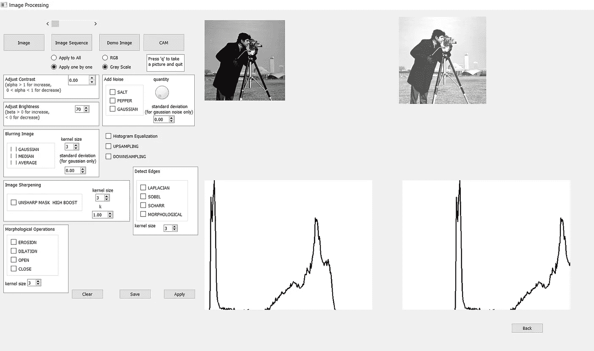

使用 beta = 70 调整亮度的示例“作者提供的图像”

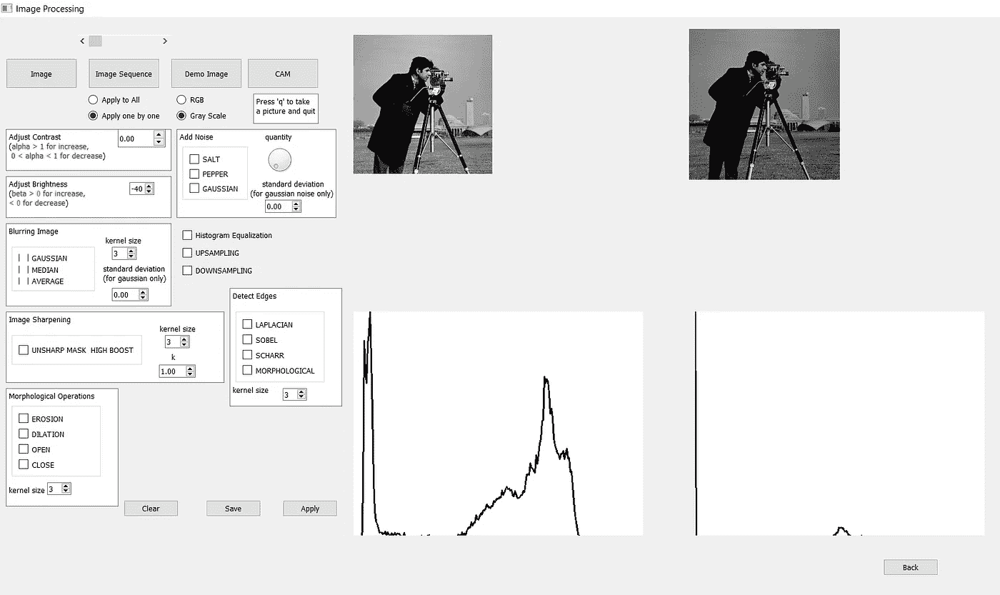

使用 beta = -40 调整亮度的示例“作者提供的图像”

*   **每个内核大小步长为 1。如果选择高斯滤波器，可以用右边的小方框确定标准偏差。**

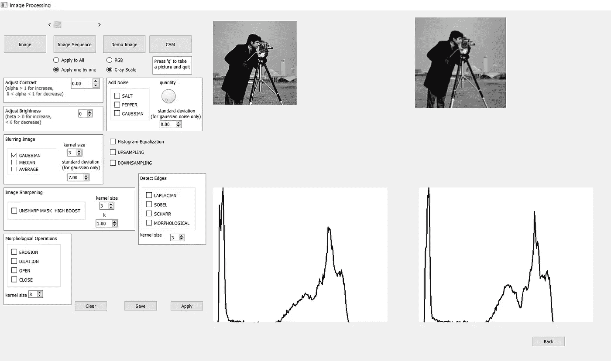

高斯滤波器核大小= 3，标准偏差= 7 的模糊图像的示例用法“作者提供的图像”

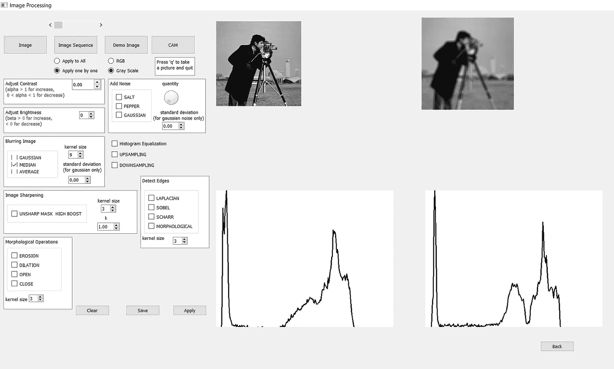

中值过滤器内核大小= 9 的模糊图像的示例用法“作者提供的图像”

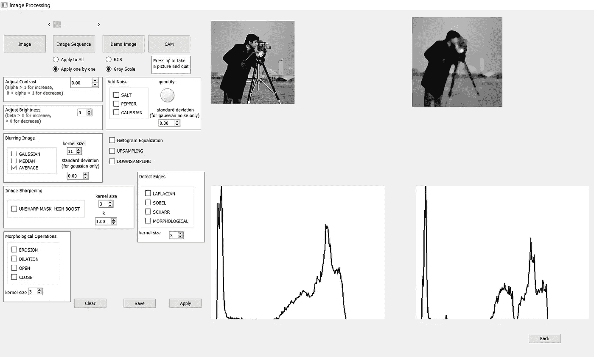

平均过滤器内核大小= 11 的模糊图像的使用示例“作者的图像”

**！！！**请记住，您也可以使用中值和平均值滤波器来消除噪声，通常中值滤波器比平均值滤波器更好。

*   ***图像锐化:*** 类似于模糊图像操作，用户可以选择内核大小来应用反锐化掩模&高增强。与图像模糊不同，每一步都将内核大小增加 2。原因是锐化内核需要一个奇数大小的值，否则会产生运行时错误。此外，默认为 1 的 k 值可以由用户给定。

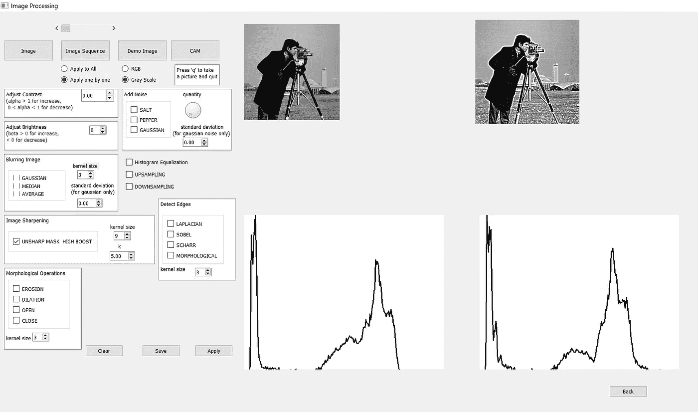

使用反锐化掩模和高增强内核大小= 9，k = 5 的图像锐化示例“作者提供的图像”

*   ***形态学操作*** :可以根据选择的内核大小应用膨胀、腐蚀、打开或关闭。

！！！请注意，创建结构元素将是下一版本中的一个选项。目前，结构要素是:

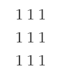

“作者提供的图像”

…默认情况下，您只能更改大小。

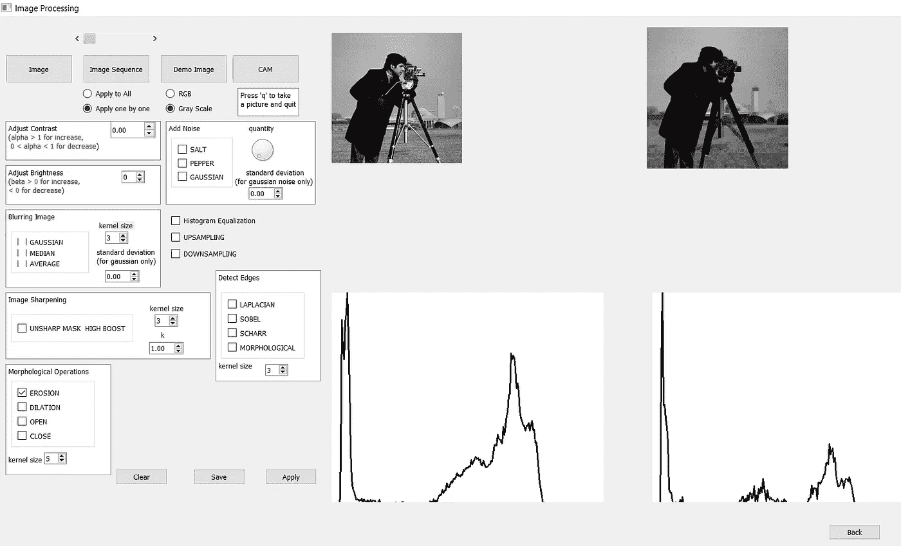

侵蚀和核大小= 5 的形态学运算的示例用法“作者提供的图像”

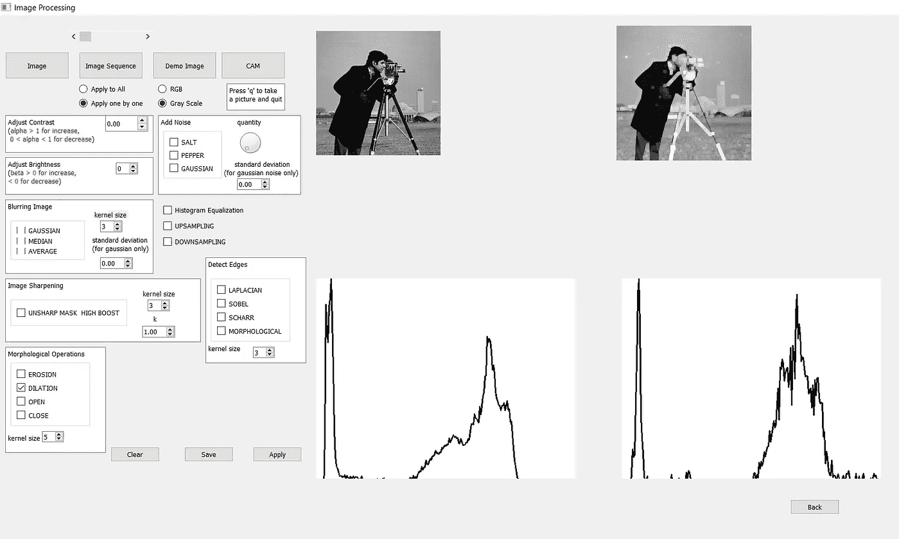

使用膨胀和核大小= 5 的形态学操作的示例“作者提供的图像”

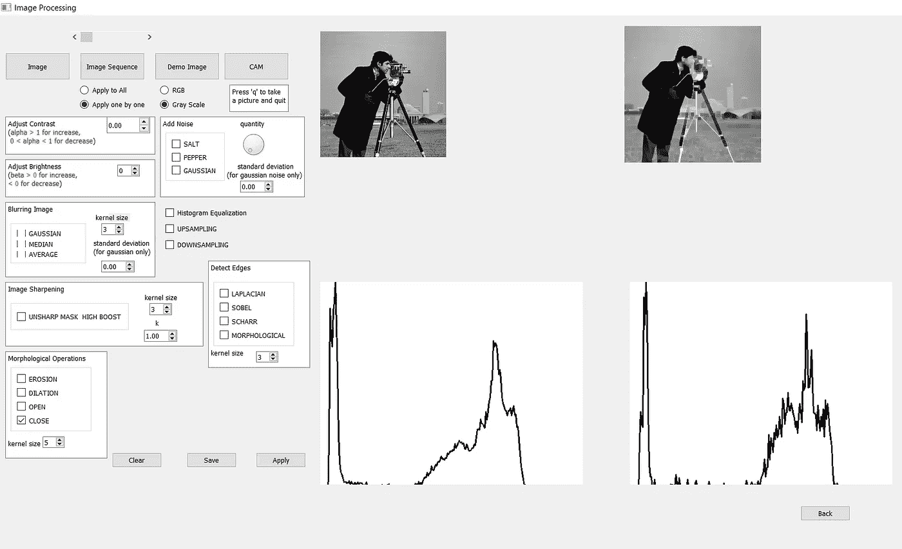

具有闭合和核大小= 5 的形态学操作的示例用法“作者的图像”

*   ***边缘检测*** :您可以通过调整内核大小(默认值和最小值均为 3)来使用拉普拉斯、索贝尔、沙尔或形态滤波器检测边缘。

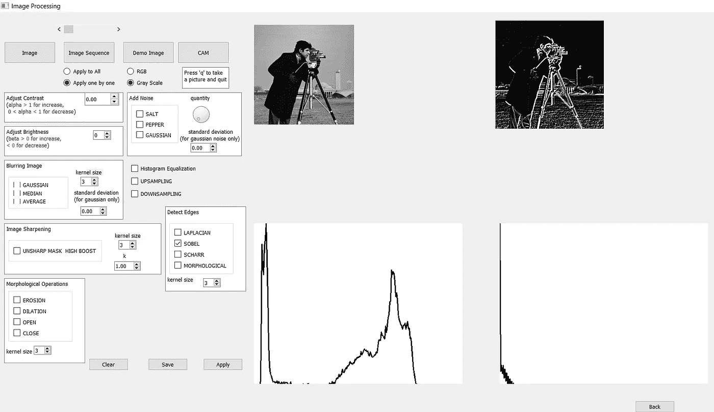

使用 Sobel 滤波器和核大小= 3 的边缘检测的示例使用“作者的图像”

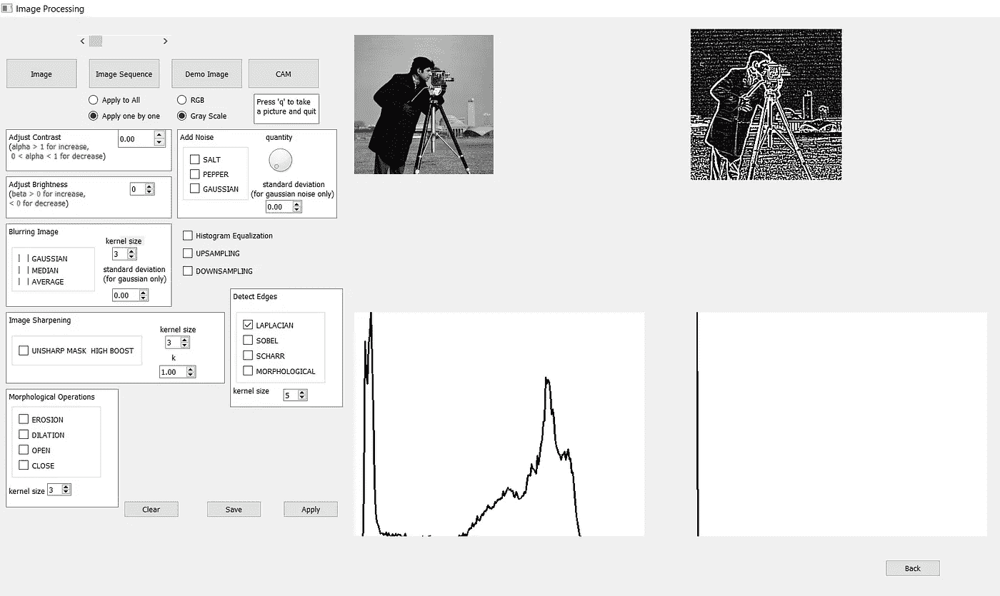

使用拉普拉斯滤波器和核大小= 5 的边缘检测的示例使用“作者的图像”

*   ***上采样和下采样:*** 您可以选择上采样或下采样框对图像进行上采样或下采样。向上采样会将图像大小调整 200%，向下采样会将图像大小调整 50%。

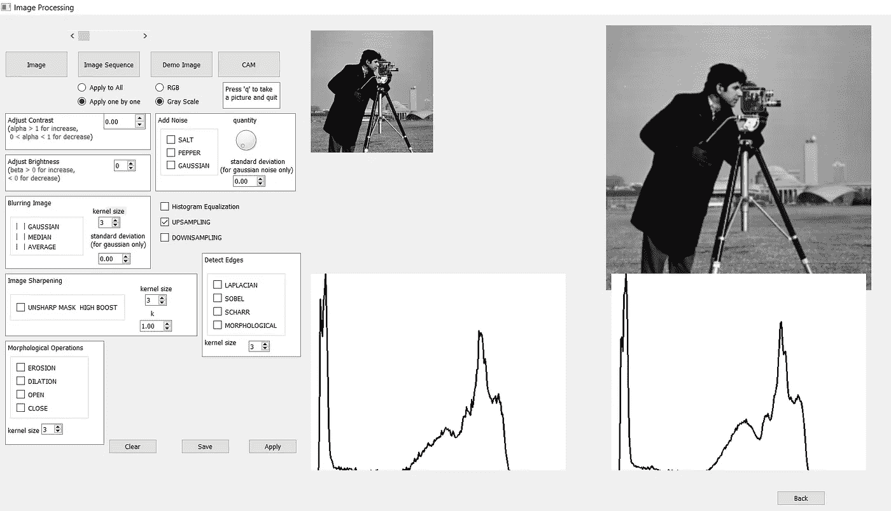

向上采样“按作者分类的图像”

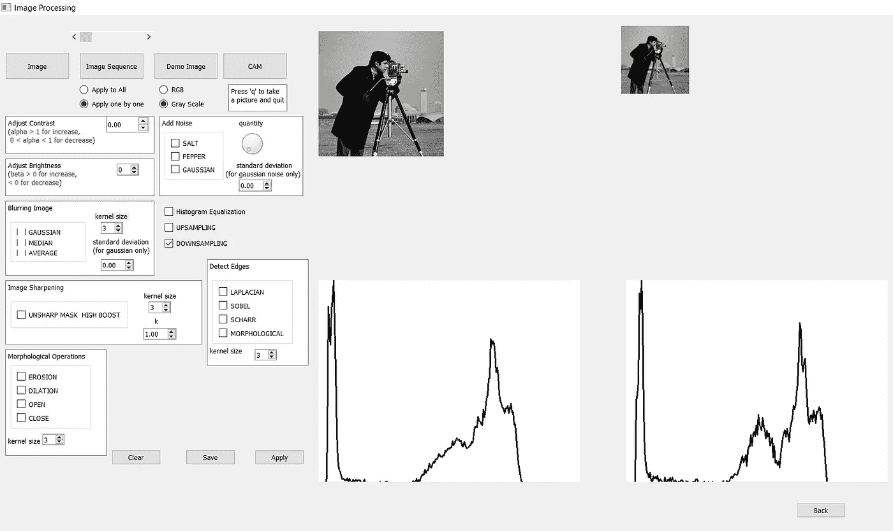

缩减像素采样“按作者排列的图像”

*   ***直方图均衡:*** 通过选择直方图均衡我们得到均衡后的图像和直方图。

直方图均衡化“按作者分类的图像”

*   ***添加噪波:*** 您可以选择相关框添加胡椒、盐或高斯噪波。使用右边的圆形按钮可以确定噪波的数量。这是将添加噪波的像素数。启用了多个选项，因此对于椒盐噪声，同时选择椒盐噪声就足够了。对于高斯噪声，用户也可以确定标准偏差。

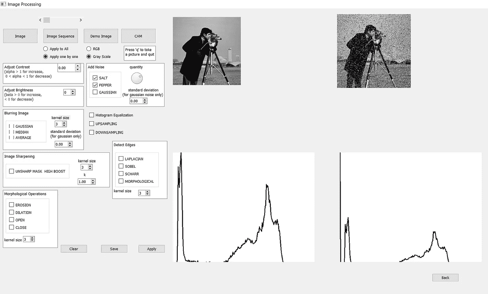

通过检查盐和胡椒框添加盐和胡椒噪声“作者图像”

*   ***保存按钮:*** 点击保存按钮可以保存任何输出图像。这会将输出图像保存到默认目录，并向主窗口发送一条消息。
*   ***清除按钮:*** 选择多个不同参数值的不同操作后，可能要转默认值。此按钮清除所有选择。
*   ***RGB* :** 灰度部分显示的每一项操作也适用于 RGB 图像。在选中 RGB 按钮的情况下，单击演示按钮将显示以下默认图像。我们看到在应用直方图均衡化、边缘检测、图像模糊和对比度调整之后获得的样本输出。

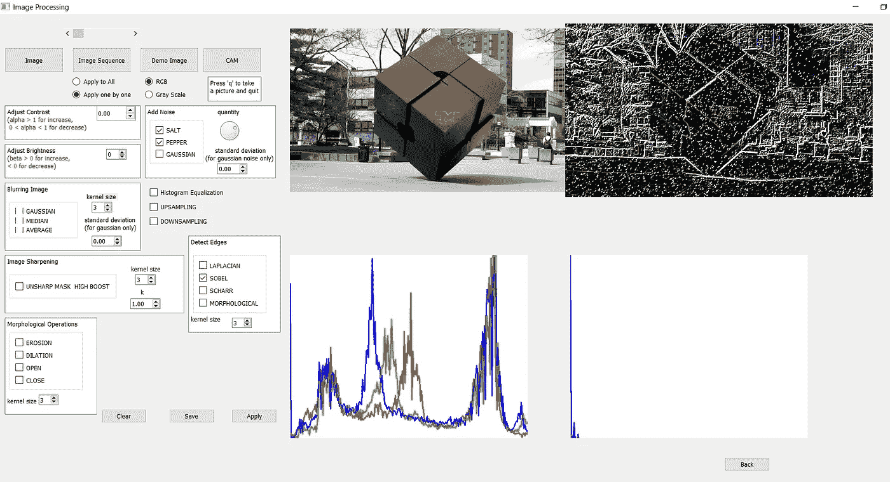

演示 RGB 图像“作者提供的图像”的边缘检测

**使用您自己的图像**

o 图像按钮

通过单击，会出现一个文件资源管理器窗口，用户可以从本地选择任何图像。

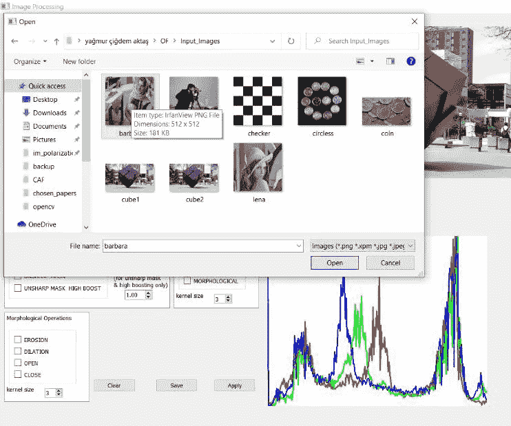

“作者提供的图像”

现在，我们在演示部分所做的任何操作都可以应用了。

o 图像序列按钮

此按钮允许用户上传多个图像，一次对上传的所有图像应用更改。通过选择“应用于所有”或“逐个应用”，用户可以随时改变决定是将操作应用于所有图像还是仅应用于当前图像。

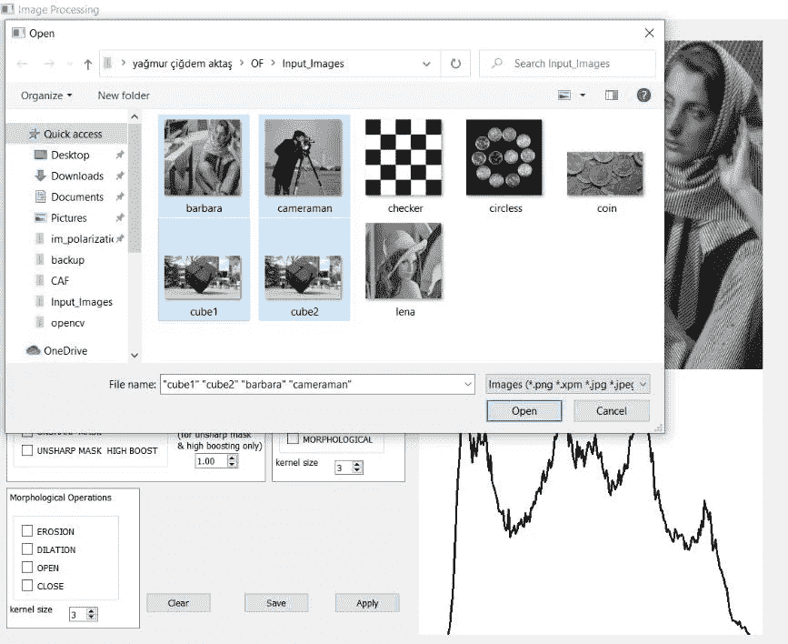

同时选择 4 幅图像，一起处理“按作者分类的图像”

例如，当我们选择以下 4 个不同的图像时，我们看到每个图像都已上传，我们可以使用红色标记的滑块前进和后退。

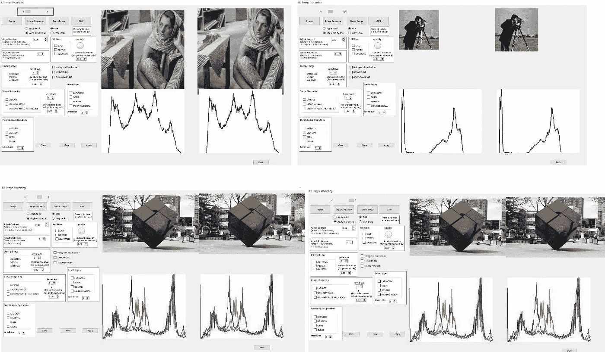

“作者提供的图像”

作为**“逐个应用”**选择的一个例子，当我们对当前屏幕上的最后一幅图像(立方体 2)应用对比度调整和腐蚀时，我们为立方体 2 获得一幅经过处理的输出图像，而对于其他图像，我们不应用任何改变。结果如下所示:

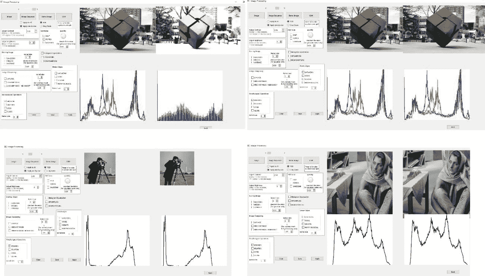

“作者提供的图像”

作为**“应用于所有”**选择的一个例子，当我们对当前屏幕上的第一幅图像(barbara)应用图像模糊和边缘检测时，我们获得所有图像的处理输出图像。结果如下所示:

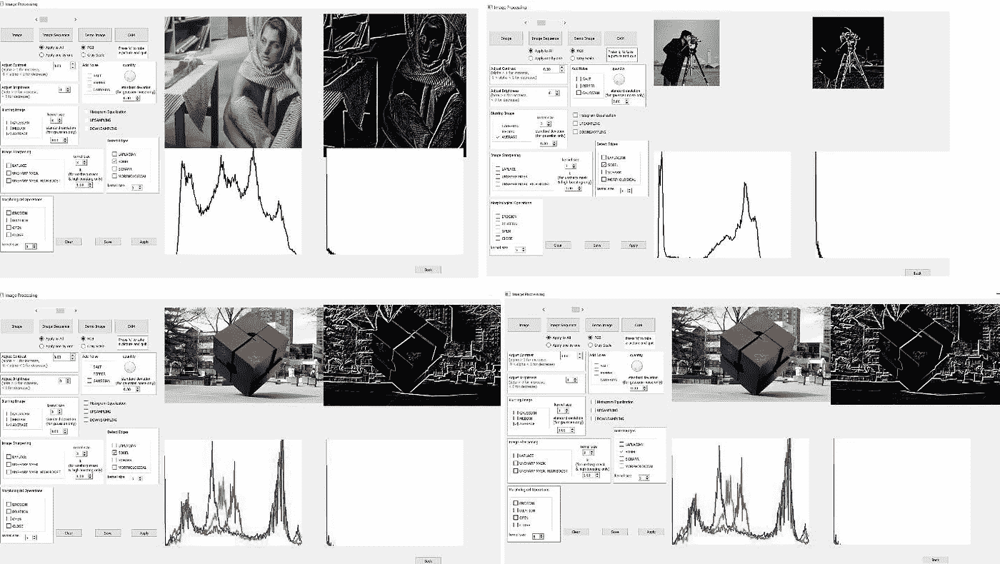

“作者提供的图像”

o 凸轮按钮

使用此按钮，可以使用本地网络摄像头，拍摄照片，并将其用作初始图像。当用户按“q”时拍摄图片，并上传到输入图像位置。在此步骤之后，可以应用任何操作。

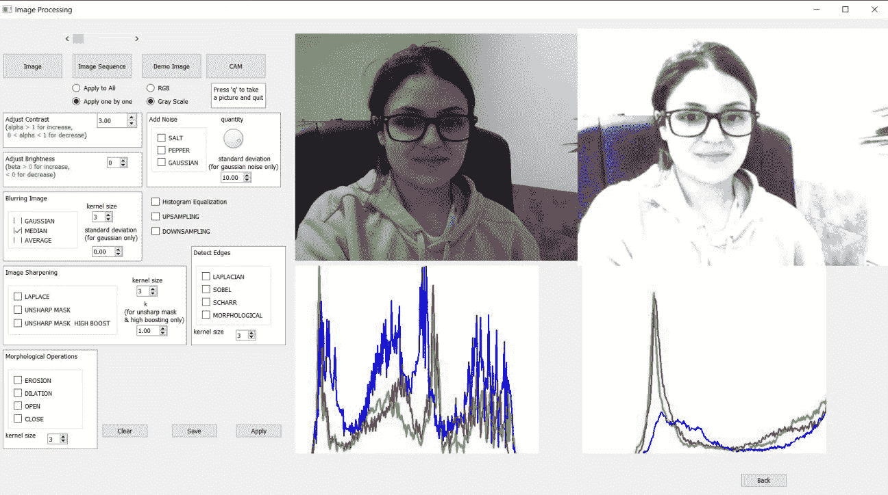

从相机中捕捉图片并处理“按作者排序的图像”

你可以在这个 [**github**](https://github.com/YCAyca/Image_Processing_GUI) 链接找到源代码。

**！！！**不要伪造用你的本地路径来改变这些路径:

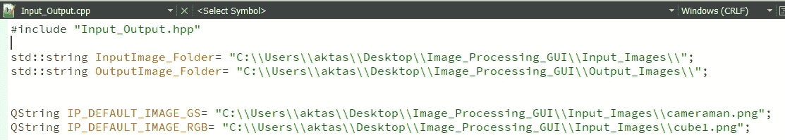

演示图像路径“按作者分类的图像”

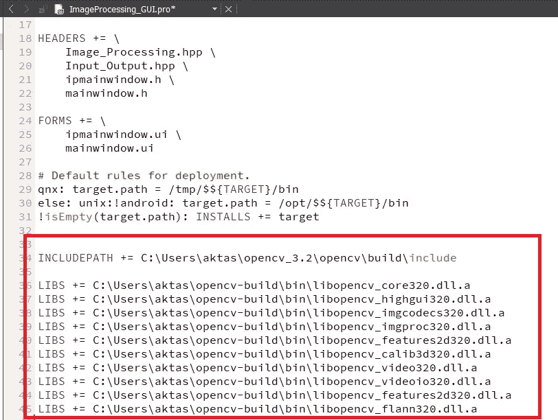

通用 Opencv 构建路径和需要添加的相关库。pro 文件“按作者分类的图像”

**！！！**另外很重要的一点是选择 Qt 5.12.10 MinGW 64 位作为编译器，运行 app 时不会有任何问题。

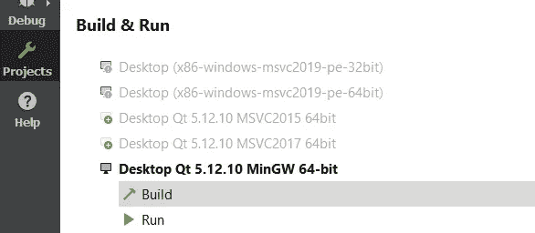

“作者提供的图像”

玩得开心！

我们已经到了图像处理基础博客的结尾！我们学习了“图像”的含义，我们可以对图像进行什么样的操作以及如何操作。以下是对您后续步骤的一些建议:

*   不要忘记每个图像都是不同的。内核大小、结构元素或内核类型可能会改变，以获得您需要的结果。
*   首先使用 2D 数组对于检查您是否真正理解了想要应用的操作的逻辑是非常重要的。因此，如果你有兴趣了解基础，请检查我从头实现的代码，以玩 2D 数组的每个操作。
*   如果您想进一步了解该主题，我建议您搜索“频域图像处理”主题，在该主题中，操作不像空间域图像处理那样直接应用于图像，而是首先转换到频域，在应用所要求的滤波器或操作后，我们重新转换“频域输出”以获得最终输出图像。

谢谢大家！