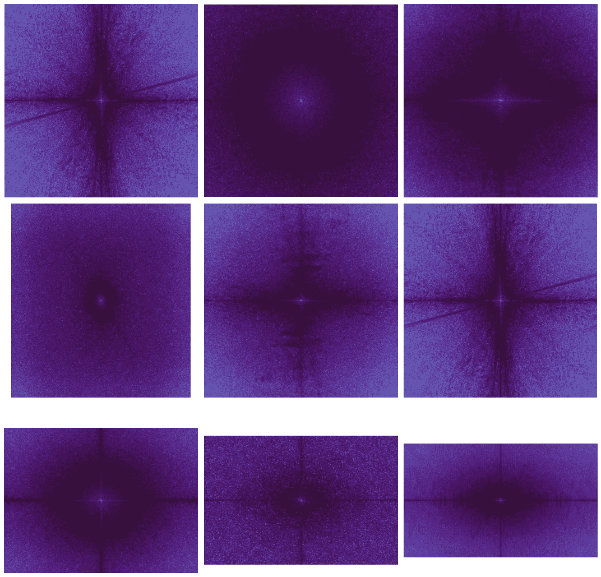
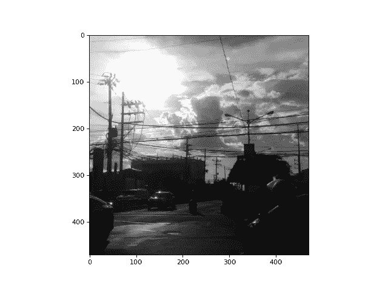
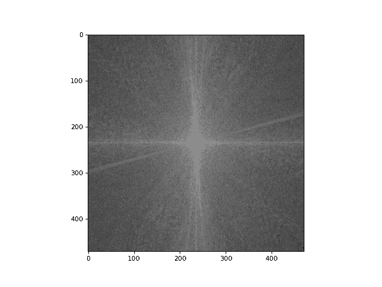
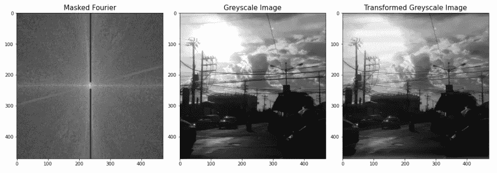
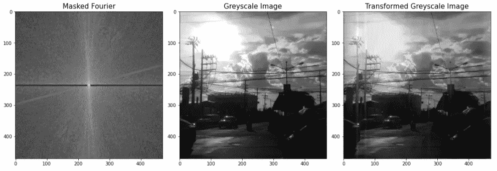
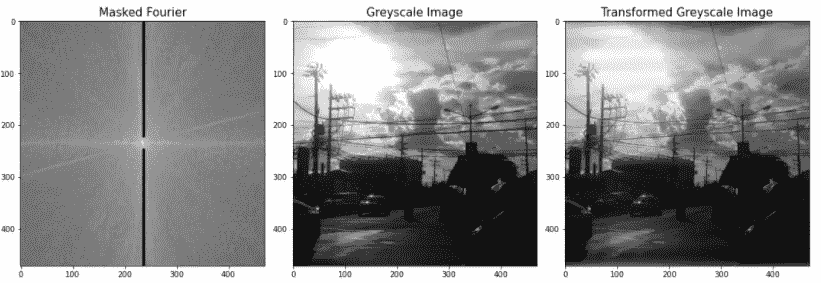
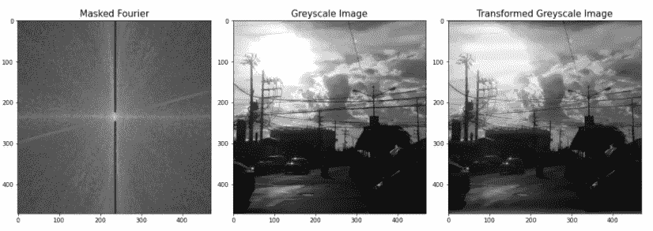
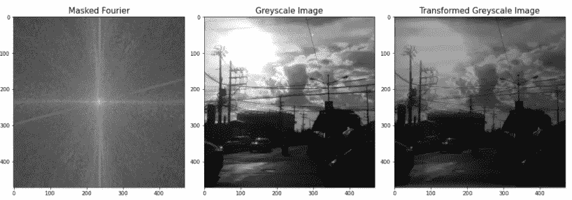
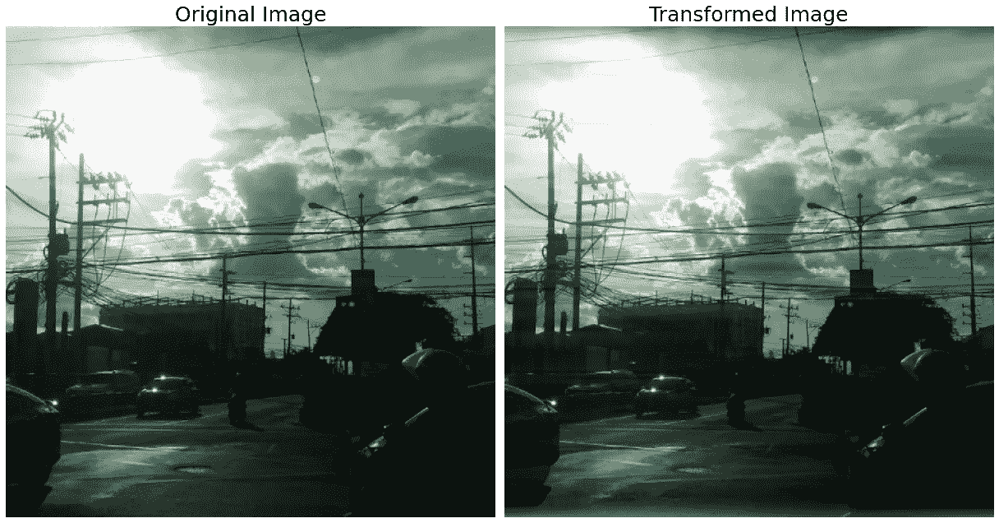

# 用 Python 进行图像处理——傅立叶变换的应用

> 原文：<https://towardsdatascience.com/image-processing-with-python-application-of-fourier-transformation-5a8584dc175b?source=collection_archive---------0----------------------->

## 如何利用傅立叶变换去除图像元素



傅立叶变换(图片由作者提供)

图像处理中更高级的主题之一与傅立叶变换的概念有关。简而言之，一些图像包含用户可能想要去除的系统噪声。如果这种噪声足够规则，采用傅立叶变换调整可能有助于图像处理。在这篇文章中，我们将看到如何做到这一点。

让我们开始吧。

和往常一样，首先导入所需的 Python 库。

```
import numpy as np
import matplotlib.pyplot as plt
from skimage.io import imread, imshow
from skimage.color import rgb2hsv, rgb2gray, rgb2yuv
from skimage import color, exposure, transform
from skimage.exposure import equalize_hist
```

首先，让我们加载将在本文中使用的图像。

```
dark_image = imread('against_the_light.png')
```


带有黑色水平线的图像

我们将使用的图像是上面的一个。这是当太阳直接面对相机时拍摄的街道图像。在这个简单的练习中，我们将设法消除(或至少大幅度减少)背面的电源线。

首先，让我们把图像转换成灰度。

```
dark_image_grey = rgb2gray(dark_image)
plt.figure(num=None, figsize=(8, 6), dpi=80)
plt.imshow(dark_image_grey, cmap='gray');
```



灰度图像

很好，从这里我们可以很容易地使用 Skimage 中的 *fft* 函数。

```
dark_image_grey_fourier = np.fft.fftshift(np.fft.fft2(dark_image_grey))
plt.figure(num=None, figsize=(8, 6), dpi=80)
plt.imshow(np.log(abs(dark_image_grey_fourier)), cmap='gray');
```



图像的傅立叶变换

在图像中，我们可以看到两个非常明显的失真。白色的垂直和水平线指的是图像中清晰的水平和垂直元素。让我们看看如果我们屏蔽其中一个会发生什么。

```
def fourier_masker_ver(image, i):
    f_size = 15
    dark_image_grey_fourier =
    np.fft.fftshift(np.fft.fft2(rgb2gray(image))) dark_image_grey_fourier[:225, 235:240] = i
    dark_image_grey_fourier[-225:,235:240] = i fig, ax = plt.subplots(1,3,figsize=(15,15))
    ax[0].imshow(np.log(abs(dark_image_grey_fourier)), cmap='gray')
    ax[0].set_title('Masked Fourier', fontsize = f_size)
    ax[1].imshow(rgb2gray(image), cmap = 'gray')
    ax[1].set_title('Greyscale Image', fontsize = f_size);
    ax[2].imshow(abs(np.fft.ifft2(dark_image_grey_fourier)), 
                     cmap='gray')
    ax[2].set_title('Transformed Greyscale Image', 
                     fontsize = f_size);

fourier_masker(dark_image, 1)
```



傅立叶变换垂直掩蔽图像

我们可以看到，水平电源电缆的尺寸显著减小。作为一个有趣的实验，让我们看看如果我们屏蔽水平线会发生什么。

```
def fourier_masker_hor(image, i):
    f_size = 15
    dark_image_grey_fourier =
    np.fft.fftshift(np.fft.fft2(rgb2gray(image))) dark_image_grey_fourier[235:240, :230] = i
    dark_image_grey_fourier[235:240,-230:] = i fig, ax = plt.subplots(1,3,figsize=(15,15))
    ax[0].imshow(np.log(abs(dark_image_grey_fourier)), cmap='gray')
    ax[0].set_title('Masked Fourier', fontsize = f_size)
    ax[1].imshow(rgb2gray(image), cmap = 'gray')
    ax[1].set_title('Greyscale Image', fontsize = f_size);
    ax[2].imshow(abs(np.fft.ifft2(dark_image_grey_fourier)), 
                     cmap='gray')
    ax[2].set_title('Transformed Greyscale Image', 
                     fontsize = f_size);
fourier_masker_hor(dark_image, 1)
```



傅立叶变换水平掩蔽图像

我们可以看到，图像的所有垂直方面都被弄脏了。这在电杆上非常明显。虽然在某些情况下很有帮助，但在这里显然没有帮助。

虽然我们将坚持掩蔽傅立叶变换的垂直线(再次记住，当转换回原始图像时，这会模糊*水平*线)，让我们试验不同程度的掩蔽。

```
def fourier_iterator(image, value_list):
    for i in value_list:
        fourier_masker_ver(image, i)

fourier_iterator(dark_image, [0.001, 1, 100])
```



屏蔽值的迭代

我们可以看到，减少该值对原始图像几乎没有影响，但是增加该值似乎使原始图像变暗。由于较小的值与 **1** 实际上没有区别，为了简单起见，我们还是坚持使用 **1** 。

最后，让我们进行傅立叶变换调整，同时保留原始图像的颜色。

```
def fourier_transform_rgb(image):
    f_size = 25
    transformed_channels = []
    for i in range(3):
        rgb_fft = np.fft.fftshift(np.fft.fft2((image[:, :, i])))
        rgb_fft[:225, 235:237] = 1
        rgb_fft[-225:,235:237] = 1
        transformed_channels.append(abs(np.fft.ifft2(rgb_fft)))

    final_image = np.dstack([transformed_channels[0].astype(int), 
                             transformed_channels[1].astype(int), 
                             transformed_channels[2].astype(int)])

    fig, ax = plt.subplots(1, 2, figsize=(17,12))
    ax[0].imshow(image)
    ax[0].set_title('Original Image', fontsize = f_size)
    ax[0].set_axis_off()

    ax[1].imshow(final_image)
    ax[1].set_title('Transformed Image', fontsize = f_size)
    ax[1].set_axis_off()

    fig.tight_layout()
```



傅立叶变换彩色图像

我们可以看到，水平电源线已经大大减少，而图像的其余部分基本保持不变。这展示了我们如何通过傅立叶变换对图像进行细微的改变。

**总之**

傅立叶变换是一种强大的工具，对于处理图像的数据科学家来说非常有用。在以后的文章中，我们将回顾如何以更有效的方式应用该技术。现在，我希望你能够对这个主题有一个基本的了解。