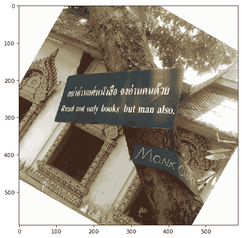
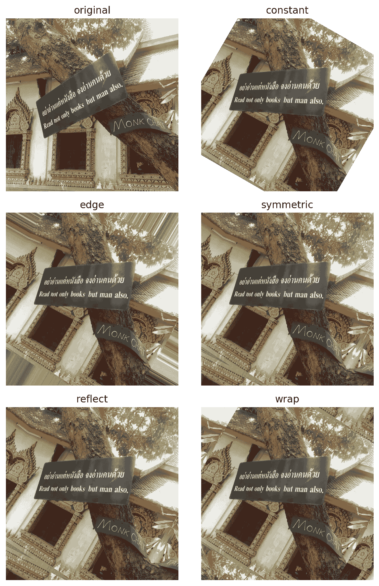
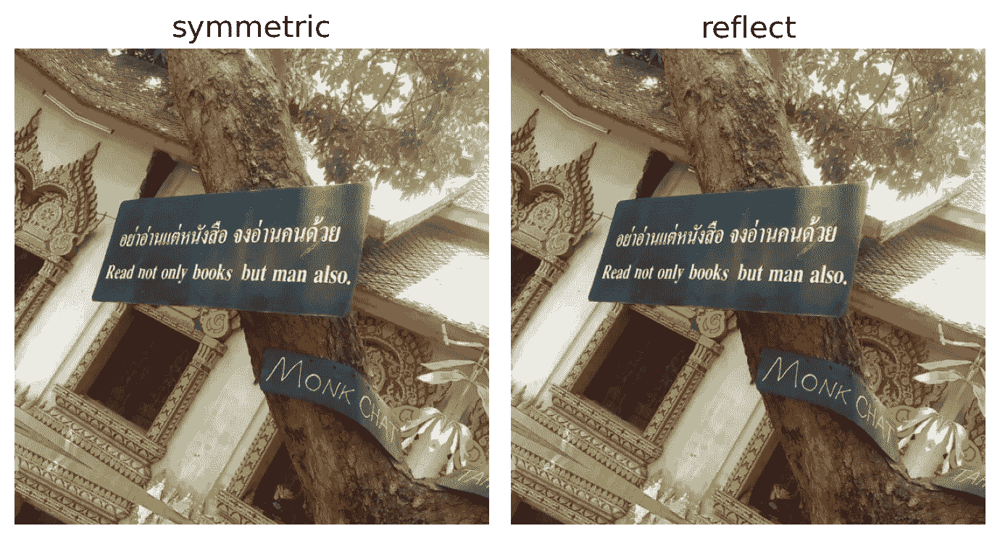
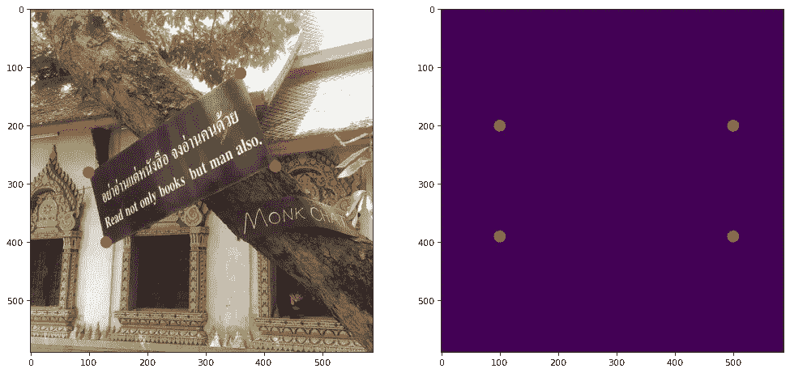
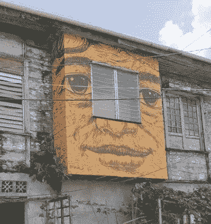
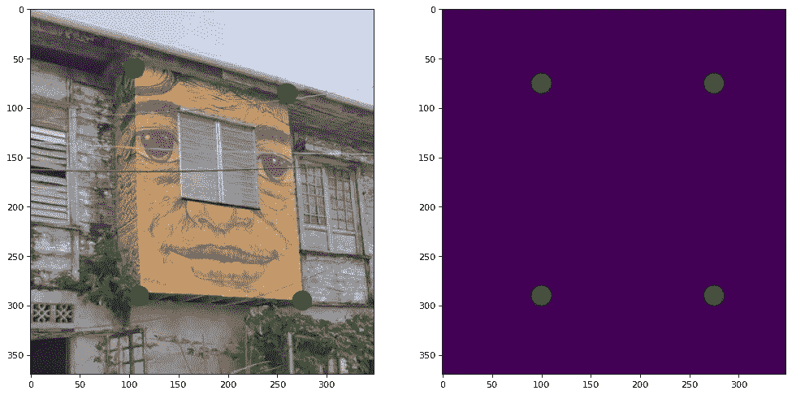
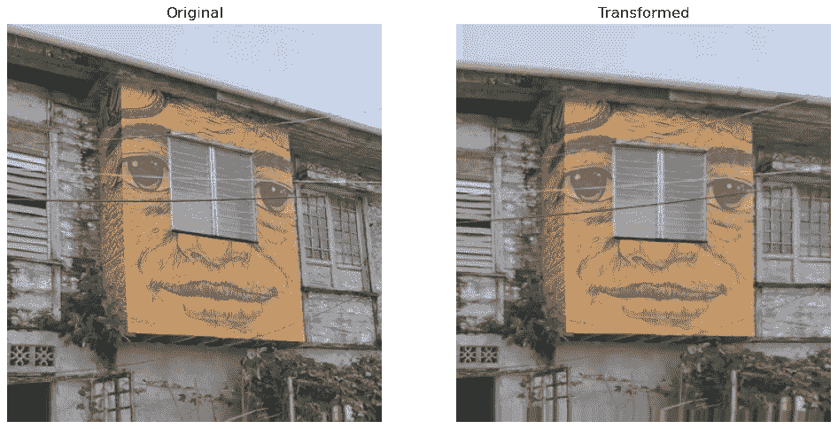

# 用 Python 处理图像——应用单应性进行图像变形

> 原文：<https://towardsdatascience.com/image-processing-with-python-applying-homography-for-image-warping-84cd87d2108f?source=collection_archive---------7----------------------->

## 如何获得更好的视角


更好的视角(作者图片)

旋转图像并不是什么新鲜事，大多数做过基本照片编辑的人在某个时候都不得不这么做。在这篇文章中，我们将解决调整图像的方法，使它看起来像是从不同的角度拍摄的。

我们开始吧！

和往常一样，首先导入所需的 Python 库。

```
import matplotlib.pyplot as plt
import numpy as np
from matplotlib.patches import Circle
from skimage import transform
from skimage.io import imread, imshow
```

很好，现在让我们导入将要使用的图像。

```
sign = imread('words_of_wisdom.png')
plt.figure(num=None, figsize=(8, 6), dpi=80)
```


获得更好视角的一种方法(图片由作者提供)

正如我们所见，上面的标志微开着。虽然我故意从那个角度拍了这张照片，让我们看看我们是否可以“纠正”它。一个非常基本的方法是通过 Skimage 中的 *transform.rotate* 函数。下面的代码正是这样做的。

```
sign_rotate = transform.rotate(sign, 330)
plt.figure(num=None, figsize=(8, 6), dpi=80)
imshow(sign_rotate);
```



旋转图像

正如我们所见，图像已经旋转，因此符号现在与 x 轴平行。然而，我们看到两个非常突出的问题。

第一个是，这本质上只是旋转图像(大惊喜吧？).第二个是图像原来的地方现在有了空白。让我们设法补救这一点。

我们使用的函数实际上有一个参数名为*模式*，这将有助于减少空白。让我们试验一下可以使用的不同模式。

```
def rotate_fills(image):
    modes = ['constant', 'edge','symmetric','reflect','wrap']
    fig, ax = plt.subplots(3,2, figsize=(7, 10), dpi = 200)
    for n, ax in enumerate(ax.flatten()):
        n = n-1
        if n == -1:
            ax.set_title(f'original', fontsize = 12)
            ax.imshow(image)
            ax.set_axis_off()
        else: 
            ax.set_title(f'{modes[n]}', fontsize = 12)
            ax.imshow(transform.rotate(image, 330, mode = modes[n]))
            ax.set_axis_off()

    fig.tight_layout();
rotate_fills(sign)
```



具有各种填充的旋转图像

我们可以看到，通过试验不同的填充方法，*反射*和*对称*都脱颖而出，成为首选。然而，它们有一个非常微妙的缺点。

```
def comparing_fills(image):
    modes = ['symmetric','reflect']
    fig, ax = plt.subplots(1,2, figsize=(7, 10), dpi = 200)
    ax[0].imshow(transform.rotate(image, 330, mode = modes[0]))
    ax[0].set_title(f'{modes[0]}', fontsize = 15)
    ax[0].set_axis_off()

    ax[1].imshow(transform.rotate(image, 330, mode = modes[1]))
    ax[1].set_title(f'{modes[1]}', fontsize = 15)
    ax[1].set_axis_off()

    fig.tight_layout();

comparing_fills(sign)
```



比较对称模式和反射模式

注意图像的右下角是如何被反射的。这使得这棵树看起来好像在那个角落有第二个分支。当然，当我们检查原始图像时，情况并非如此。

因此，尽管我们尽了最大努力，旋转似乎并不是我们任务的最佳功能。幸运的是，有一个函数我们可以使用，Skimage 中的 *transform.warp* 函数。

然而，与*旋转*相比，它确实需要更多的工作来实现。首先，我们必须得到我们关心的点，以及我们想把它们投射到哪里。请原谅下面的长代码，但我发现明确的编程很重要，这样就很容易理解。

```
points_of_interest =[[360, 110], 
                     [420, 270], 
                     [130, 400], 
                     [100, 280]]projection = [[500, 200],
              [500, 390],
              [100, 390],
              [100, 200]]color = 'red'
fig, ax = plt.subplots(1,2, figsize=(15, 10), dpi = 80)patch1 = Circle((points_of_interest[0][0],points_of_interest[0][1]),
                 10, facecolor = color)
patch2 = Circle((points_of_interest[1][0],points_of_interest[1][1]), 
                 10, facecolor = color)
patch3 = Circle((points_of_interest[2][0],points_of_interest[2][1]),
                 10, facecolor = color)
patch4 = Circle((points_of_interest[3][0],points_of_interest[3][1]), 
                 10, facecolor = color)patch5 = Circle((projection[0][0],projection[0][1]), 10, 
                 facecolor = color)
patch6 = Circle((projection[1][0],projection[1][1]), 10, 
                 facecolor = color)
patch7 = Circle((projection[2][0],projection[2][1]), 10, 
                 facecolor = color)
patch8 = Circle((projection[3][0],projection[3][1]), 10, 
                 facecolor = color)ax[0].add_patch(patch1)
ax[0].add_patch(patch2)
ax[0].add_patch(patch3)
ax[0].add_patch(patch4)ax[0].imshow(sign);ax[1].add_patch(patch5)
ax[1].add_patch(patch6)
ax[1].add_patch(patch7)
ax[1].add_patch(patch8)ax[1].imshow(np.ones((sign.shape[0], sign.shape[1])));
```



当前点和目标点

我们本质上所做的是确定标志的当前角的位置，并画出我们想要它们去的地方。

请注意，这一步只是为了澄清源位置和目标位置。为了实际实现这个函数，我们必须使用下面的代码。

```
points_of_interest = np.array([[360, 110], 
                               [420, 270], 
                               [130, 400], 
                               [100, 280]])projection = np.array([[500, 200],
                       [500, 390],
                       [100, 390],
                       [100, 200]])tform = transform.estimate_transform('projective', points_of_interest, projection)
tf_img_warp = transform.warp(sign, tform.inverse, mode = 'symmetric')
plt.figure(num=None, figsize=(8, 6), dpi=80)fig, ax = plt.subplots(1,2, figsize=(15, 10), dpi = 80)
ax[0].set_title(f'Original', fontsize = 15)
ax[0].imshow(sign)
ax[0].set_axis_off();ax[1].set_title(f'Transformed', fontsize = 15)
ax[1].imshow(tf_img_warp)
ax[1].set_axis_off();
```


变换图像

我们看到这是对我们以前方法的巨大改进。不仅标志的角度得到了纠正，而且我们不再需要处理令人讨厌的空白问题。

然而，请注意，尽管这种方法令人印象深刻，但它并不总是产生最佳结果。以下面的图片为例。

```
house = imread('artsy_house.png')
plt.figure(num=None, figsize=(8, 6), dpi=80)
```



潮人屋

由于其明显的厚度，该功能不会提供最佳结果。为了演示，让我们画出感兴趣的点。此外，我还提供了运行前面代码的快捷方式

```
points_of_interest =[[105, 60], 
                     [260, 85], 
                     [275, 295], 
                     [110, 290]]projection = [[100, 75],
              [275, 75],
              [275, 290],
              [100, 290]]color = 'green'
patches = []
fig, ax = plt.subplots(1,2, figsize=(15, 10), dpi = 80)
for coordinates in (points_of_interest + projection):
    patch = Circle((coordinates[0],coordinates[1]), 10, 
                    facecolor = color)
    patches.append(patch)for p in patches[:4]:
    ax[0].add_patch(p)
ax[0].imshow(house);for p in patches[4:]:
    ax[1].add_patch(p)
ax[1].imshow(np.ones((house.shape[0], house.shape[1])));
```



兴趣点与投影

很好，现在让我们把图像投射到目标点。

```
points_of_interest = np.array(points_of_interest)
projection = np.array(projection)tform = transform.estimate_transform('projective', points_of_interest, projection)
tf_img_warp = transform.warp(house, tform.inverse, mode = 'edge')
plt.figure(num=None, figsize=(8, 6), dpi=80)fig, ax = plt.subplots(1,2, figsize=(15, 10), dpi = 80)
ax[0].set_title(f'Original', fontsize = 15)
ax[0].imshow(house)
ax[0].set_axis_off();ax[1].set_title(f'Transformed', fontsize = 15)
ax[1].imshow(tf_img_warp)
ax[1].set_axis_off();
```



预计艺术房子

虽然我们能够正确地将图像投影到新的点上，但是请注意它看起来有点不自然。看这幅画的左边部分，我们看到凸起的部分仍然很明显。如果我们实际上是从正面角度拍摄的，就看不到这个特征。还要注意图像的左上部分有一些轻微的扭曲，这是由于使用了*边缘*填充造成的。

**总之**

我们已经看到了使用 *transform.warp* 真正改变图像视角的能力。有很多方法可以应用这项技术，从地形测量到图像重建。我希望你现在对这种方法有了更好的理解，并能想象如何在你的项目中使用它。