# 使用 Python 进行图像处理—使用 Scikit-Image 进行斑点检测

> 原文：<https://towardsdatascience.com/image-processing-with-python-blob-detection-using-scikit-image-5df9a8380ade?source=collection_archive---------4----------------------->

## 如何识别和分离图像中的特定斑点

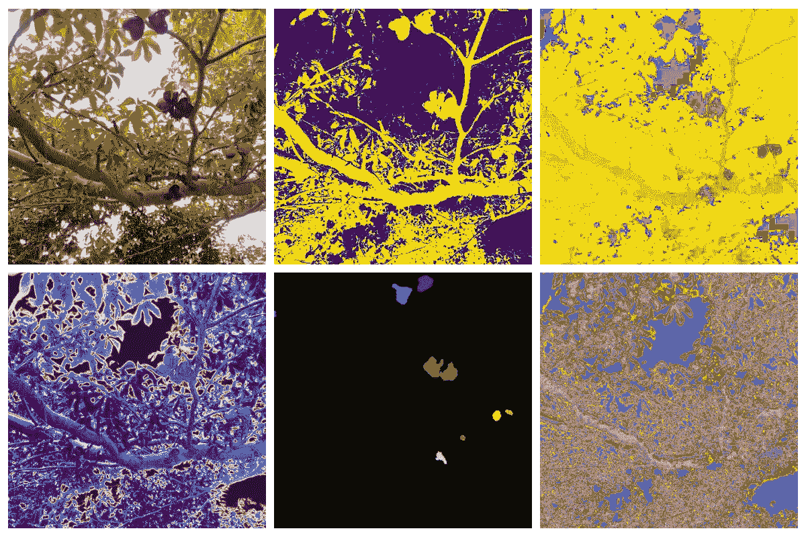

笑树(作者图片)

数据科学家在处理图像时需要的最重要的技能之一是能够识别图像的特定部分。一幅图像只有在特定的兴趣点能够被识别和逐项列出时才变得有用。在本文中，我们将学习如何做到这一点。

我们开始吧！

像往常一样，让我们首先导入本文所需的所有库。

```
import matplotlib.pyplot as plt
import numpy as np
import pandas as pd
import skimagefrom skimage.io import imread, imshow
from skimage.color import rgb2gray, rgb2hsv
from skimage.measure import label, regionprops, regionprops_table
from skimage.filters import threshold_otsu
from scipy.ndimage import median_filter
from matplotlib.patches import Rectangle
from tqdm import tqdm
```

很好，现在让我们加载将要处理的图像。

```
tree = imread('laughing_tree.png')
imshow(tree);
```

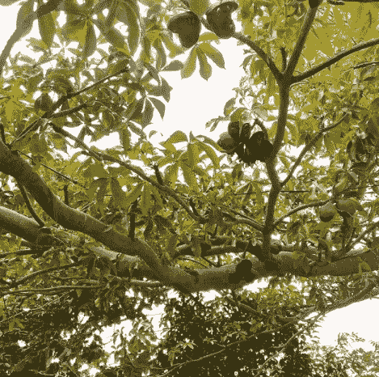

笑树(作者图片)

我们将使用上面的图像。我们的任务是识别和分离图像中包含该树的独特果实(看起来像张开的嘴)的部分。

我们应该做的第一件事是尝试看看是否有任何简单的方法来根据值识别图像。让我们将图像转换成灰度，并使用 Otsu 的方法，看看这是否给我们一个体面的面具。

```
tree_gray = rgb2gray(tree)
otsu_thresh = threshold_otsu(tree_gray)
tree_binary = tree_gray < otsu_thresh
imshow(tree_binary, cmap = 'gray');
```

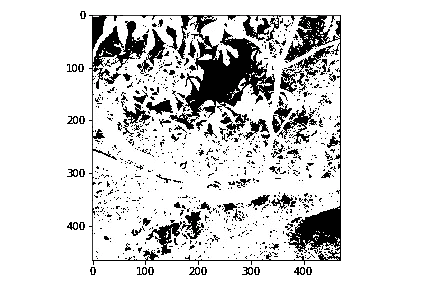

二值化树木图像

这显然不太好，让我们尝试在几个阈值水平上迭代，看看我们是否能找到产生更好掩模的阈值。

```
def threshold_checker(image):
    thresholds =  np.arange(0.1,1.1,0.1)
    tree_gray = rgb2gray(image)
    fig, ax = plt.subplots(2, 5, figsize=(17, 10))
    for n, ax in enumerate(ax.flatten()):
        ax.set_title(f'Threshold  : {round(thresholds[n],2)}',      
                       fontsize = 16)
        threshold_tree = tree_gray < thresholds[n]
        ax.imshow(threshold_tree);
        ax.axis('off')
    fig.tight_layout()threshold_checker(tree)
```

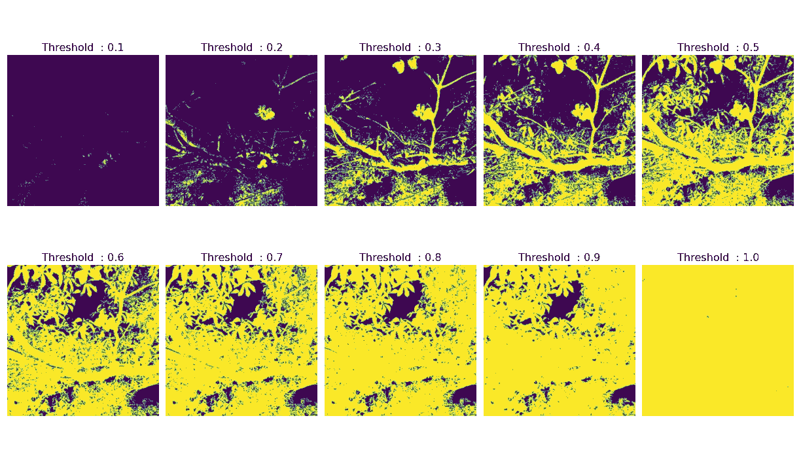

不同阈值水平的二值化图像

我们可以看到，虽然阈值处理似乎有所帮助，但它仍然包含我们不感兴趣的图像的重要部分。让我们尝试另一种方法。

```
tree_hsv = rgb2hsv(tree[:,:,:-1])
plt.figure(num=None, figsize=(8, 6), dpi=80)
plt.imshow(tree_hsv[:,:,0], cmap='hsv')
plt.colorbar();
```

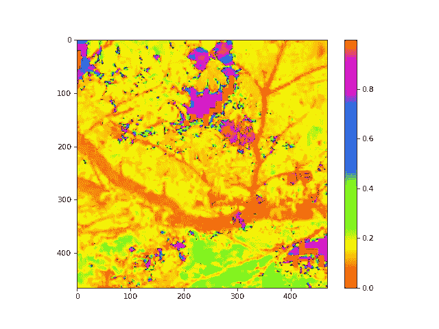

图像的 HSV(色调通道)

如果我们将图像放入 HSV 色彩空间，我们可以看到水果明显具有红色色调，而这在图像的其他部分不存在。让我们试着分离图像的这些部分。

```
lower_mask = tree_hsv [:,:,0] > 0.80
upper_mask = tree_hsv [:,:,0] <= 1.00
mask = upper_mask*lower_mask
red = tree[:,:,0]*mask
green = tree[:,:,1]*mask
blue = tree[:,:,2]*mask
tree_mask = np.dstack((red,green,blue))
plt.figure(num=None, figsize=(8, 6), dpi=80)
imshow(tree_mask);
```

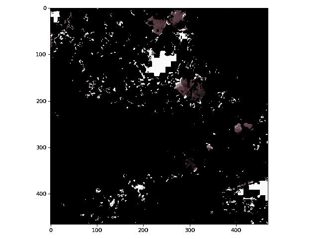

屏蔽图像

我们看到，随着水果，大部分的天窗部分也被保留。参考前面的色调通道图像，我们可以看到这些部分也有水果中存在的同一种红色。

为了解决这个问题，让我们检查图像的价值通道。

```
tree_hsv = rgb2hsv(tree[:,:,:-1])
plt.figure(num=None, figsize=(8, 6), dpi=80)
plt.imshow(tree_hsv[:,:,2], cmap='gray')
plt.colorbar();
```

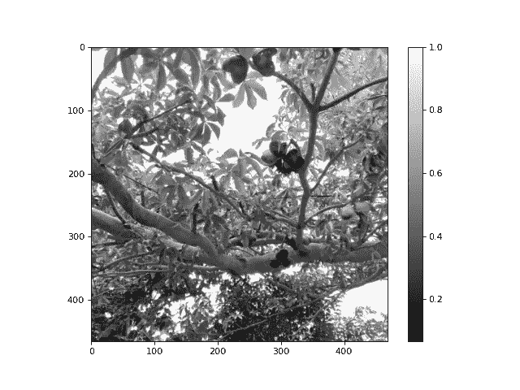

价值渠道

我们可以看到那些灯火通明的区域有着令人难以置信的高价值。让我们在制作面具时考虑到这一点。

```
lower_mask = tree_hsv [:,:,0] > 0.80
upper_mask = tree_hsv [:,:,0] <= 1.00
value_mask = tree_hsv [:,:,2] < .90
mask = upper_mask*lower_mask*value_mask
red = tree[:,:,0] * mask
green = tree[:,:,1] * mask
blue = tree[:,:,2] * mask
tree_mask = np.dstack((red, green, blue))
plt.figure(num=None, figsize=(8, 6), dpi=80)
imshow(tree_mask);
```

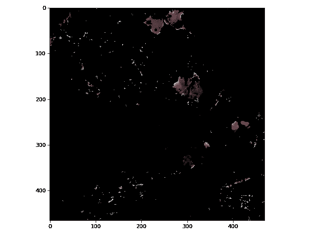

整合价值渠道

太好了！我们快到了。我们现在必须找到一种方法来清理图像，并删除小白点。为此，我们可以简单地使用 Skimage 库中的 *median_filter* 函数。

```
lower_mask = tree_hsv [:,:,0] > 0.80
upper_mask = tree_hsv [:,:,0] <= 1.00
value_mask = tree_hsv [:,:,2] < .90
mask = median_filter(upper_mask*lower_mask*value_mask, 10)
red = tree[:,:,0] * mask
green = tree[:,:,1] * mask
blue = tree[:,:,2] * mask
tree_mask = np.dstack((red, green, blue))
plt.figure(num=None, figsize=(8, 6), dpi=80)
imshow(tree_mask);
```

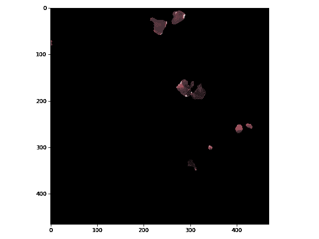

结合中值滤波器

我们可以看到，采用中值滤波器得到了非常清晰的图像。现在我们需要识别每个斑点，为此我们需要利用 Skimage 中的*标签*功能。

```
tree_blobs = label(rgb2gray(tree_mask) > 0)
imshow(tree_blobs, cmap = 'tab10');
```

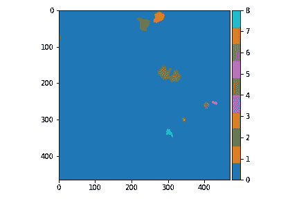

我们可以看到，该函数识别图像中的不同斑点。下一步是获取每个 blob 的属性。为此，我们必须使用 Skimage 中的 *regionprops_table* 函数。

```
properties =['area','bbox','convex_area','bbox_area',
             'major_axis_length', 'minor_axis_length',
             'eccentricity']
df = pd.DataFrame(regionprops_table(tree_blobs, properties = properties))
```

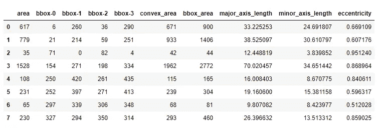

Blob 属性

*regionprops_table* 函数在一个方便的 pandas 数据帧中为我们提供了每个斑点的属性。这使我们能够轻松地操纵数据和定位特定的斑点。作为这个数据框有多有用的例子，让我们使用 *bbox* 特性在图像上绘制边界框。

```
blob_coordinates = [(row['bbox-0'],row['bbox-1'],
                     row['bbox-2'],row['bbox-3'] )for 
                    index, row in df.iterrows()]fig, ax = plt.subplots(1,1, figsize=(8, 6), dpi = 80)
for blob in tqdm(blob_coordinates):
    width = blob[3] - blob[1]
    height = blob[2] - blob[0]
    patch = Rectangle((blob[1],blob[0]), width, height, 
                       edgecolor='r', facecolor='none')
    ax.add_patch(patch)
ax.imshow(tree);
ax.set_axis_off()
```

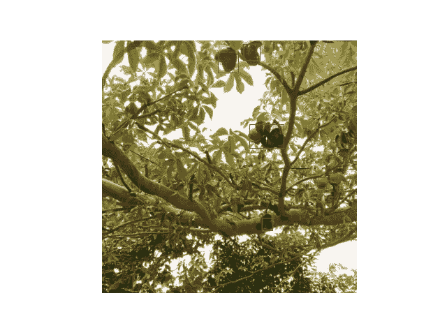

带边框的图像

如果我们仔细观察，我们可以看到在图像的左上角有一个单一的边界框。边界框内的对象显然不是水果。但是我们如何摆脱它呢？

我们能做的是过滤熊猫的数据。为了简单起见，我们将通过*离心率*列对其进行过滤，这是因为离群点具有独特的形状。

```
df = df[df['eccentricity'] < df['eccentricity'].max()]
```

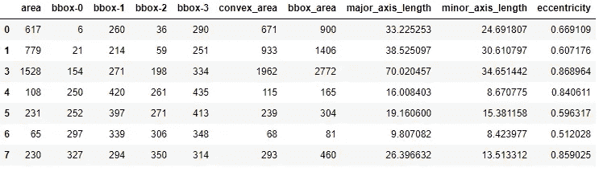

过滤数据帧

如果我们再次绘制边界框，我们看到我们能够成功地过滤掉斑点。


过滤边界框

最后，让我们从图像中剪切出边界框，并将它们显示为自己的图像。

```
fig, ax = plt.subplots(1, len(blob_coordinates), figsize=(15,5))
for n, axis in enumerate(ax.flatten()):
    axis.imshow(tree[int(blob_coordinates[n][0]):
                     int(blob_coordinates[n][2]), 
                     int(blob_coordinates[n][1]):
                     int(blob_coordinates[n][3])]);

fig.tight_layout()
```

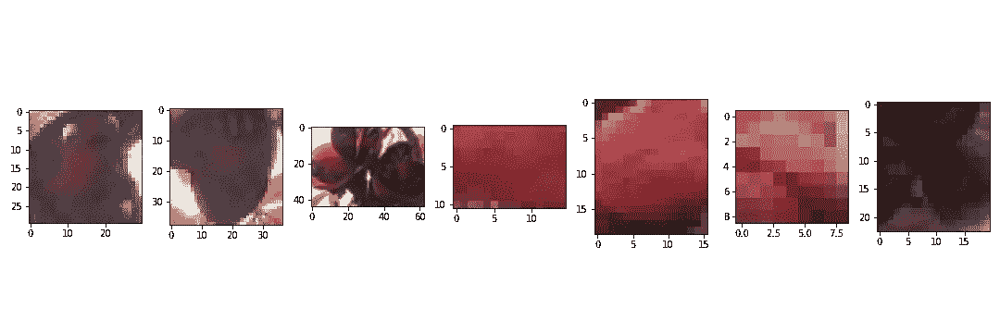

剪下斑点

太好了，我们已经成功地识别了图像中有趣的嘴状水果。这些图像现在可以保存到一个文件中，供以后使用(可能用于机器学习项目)。

**总之**

对于任何处理图像的数据科学家来说，知道如何进行斑点检测都是一项很有价值的技能。它可以用来将图像的不同部分分成不同的兴趣点。实际上，您可以使用这种技术来创建数据，这些数据将被输入到您的机器学习算法中。虽然这是一个相对简单和直接的教训，我希望你现在有一个想法，如何使用斑点检测来解决基本的图像问题。