# 使用 Python 进行图像处理——初学者的模糊和锐化

> 原文：<https://towardsdatascience.com/image-processing-with-python-blurring-and-sharpening-for-beginners-3bcebec0583a?source=collection_archive---------3----------------------->

## 如何将卷积核应用于彩色图像？

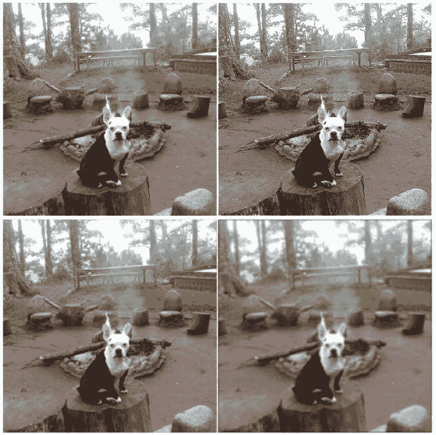

卷积狗(图片作者)

在这篇文章中，我们将讨论如何应用模糊和锐化内核到图像上。这些基本内核构成了许多更高级的内核应用程序的主干。在我之前的文章中，我讨论了边缘检测内核，但是我意识到我只关注灰度图像。

作为一个有用的指导，我将讨论我们如何将这些内核应用到彩色图像上，同时仍然保留核心图像。

我们开始吧！

一如既往，让我们从导入所需的 Python 库开始。

```
import numpy as np
import matplotlib.pyplot as plt
from skimage.io import imshow, imread
from skimage.color import rgb2yuv, rgb2hsv, rgb2gray, yuv2rgb, hsv2rgb
from scipy.signal import convolve2d
```

出于本文的目的，我们将使用下图。

```
dog = imread('fire_dog.png')
plt.figure(num=None, figsize=(8, 6), dpi=80)
imshow(dog);
```

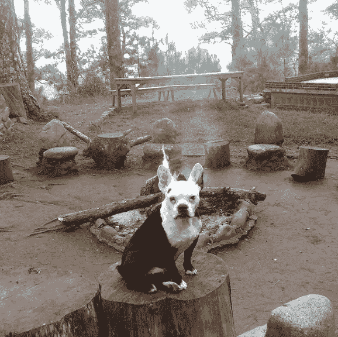

篝火狗(图片由作者提供)

现在我们将应用于图像的内核是高斯模糊内核和锐化内核。你可以在下面看到我们如何定义他们的矩阵。

```
# Sharpen
sharpen = np.array([[0, -1, 0],
                    [-1, 5, -1],
                    [0, -1, 0]])# Gaussian Blur
gaussian = (1 / 16.0) * np.array([[1., 2., 1.],
                                  [2., 4., 2.],
                                  [1., 2., 1.]])fig, ax = plt.subplots(1,2, figsize = (17,10))
ax[0].imshow(sharpen, cmap='gray')
ax[0].set_title(f'Sharpen', fontsize = 18)

ax[1].imshow(gaussian, cmap='gray')
ax[1].set_title(f'Gaussian Blur', fontsize = 18)

[axi.set_axis_off() for axi in ax.ravel()];
```

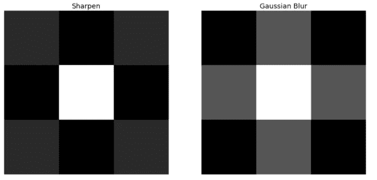

锐化和高斯模糊内核

但是我们如何将这些内核应用到我们的图像中呢？好吧，让我们首先尝试直接召集他们。我已经定义了下面的函数来允许我们迭代内核。注意我们如何设置*边界*填充和*填充值*为 0，这对于确保输出将是 s *ame size* 的 *0 填充矩阵*作为原始矩阵是很重要的。

```
def multi_convolver(image, kernel, iterations):
    for i in range(iterations):
        image = convolve2d(image, kernel, 'same', boundary = 'fill',
                           fillvalue = 0)
    return imagemulti_convolver(dog, gaussian, 2)
```

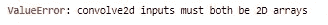

出错信息

哦，不，似乎我们遇到了一个数值错误。为什么会这样呢？请记住，当我们将一个矩阵与另一个矩阵进行卷积时，这两个矩阵的维数应该相同。这意味着我们不能将 2D 卷积应用于我们的 3D(由于颜色通道)矩阵。为了解决这个问题，我们必须首先将图像转换成灰度。

```
dog_grey = rgb2gray(dog)
plt.figure(num=None, figsize=(8, 6), dpi=80)
imshow(dog_grey);
```

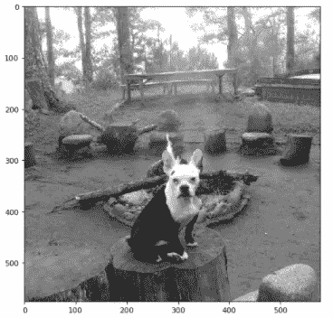

灰色的狗

现在，如果我们运行这个函数，我们应该会得到想要的效果。

```
convolved_image = multi_convolver(dog_grey, gaussian, 2)
plt.figure(num=None, figsize=(8, 6), dpi=80)
imshow(convolved_image);
```

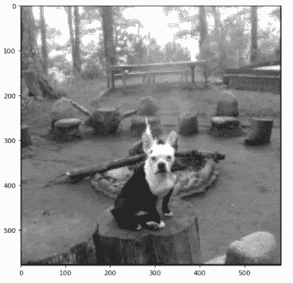

模糊的狗

精彩！我们现在可以看到图像已经明显模糊。下面的代码将向我们展示如果我们继续对图像进行高斯模糊卷积，图像会发生什么。

```
def convolution_plotter(image, kernel):
    iterations = [1,10,20,30]
    f_size = 20

    fig, ax = plt.subplots(1,4, figsize = (15,7))
    for n, ax in enumerate(ax.flatten()):
        ax.set_title(f'Iteration : {iterations[n]}', fontsize =
                     f_size)
        ax.imshow(multi_convolver(image, kernel, iterations[n]), 
                  cmap='gray')
        ax.set_axis_off() fig.tight_layout()

convolution_plotter(dog_grey, gaussian)
```

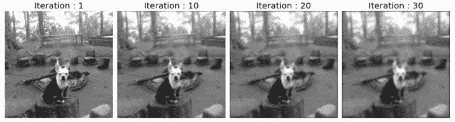

高斯模糊

太好了！我们可以清楚地看到，由于我们的内核的应用图像不断模糊。

但是如果你需要模糊图像*而*保持颜色呢？让我们首先尝试应用每个颜色通道的卷积。

```
def convolver_rgb(image, kernel, iterations = 1):
    convolved_image_r = multi_convolver(image[:,:,0], kernel,
                                        iterations)
    convolved_image_g = multi_convolver(image[:,:,1], kernel, 
                                        iterations)
    convolved_image_b  = multi_convolver(image[:,:,2], kernel, 
                                         iterations)

    reformed_image = np.dstack((np.rint(abs(convolved_image_r)), 
                                np.rint(abs(convolved_image_g)), 
                                np.rint(abs(convolved_image_b)))) / 
                                255

    fig, ax = plt.subplots(1,3, figsize = (17,10))

    ax[0].imshow(abs(convolved_image_r), cmap='Reds')
    ax[0].set_title(f'Red', fontsize = 15)

    ax[1].imshow(abs(convolved_image_g), cmap='Greens')
    ax[1].set_title(f'Green', fontsize = 15)

    ax[2].imshow(abs(convolved_image_b), cmap='Blues')
    ax[2].set_title(f'Blue', fontsize = 15)

    [axi.set_axis_off() for axi in ax.ravel()]

    return np.array(reformed_image).astype(np.uint8)convolved_rgb_gauss = convolver_rgb(dog, gaussian, 2)
```

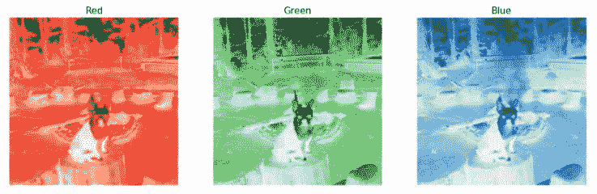

RGB 通道卷积

该函数实际上向我们返回了重组后的图像，我们只需将它插入到 *show* 函数中。

```
plt.figure(num=None, figsize=(8, 6), dpi=80)
imshow(convolved_rgb_gauss);
```

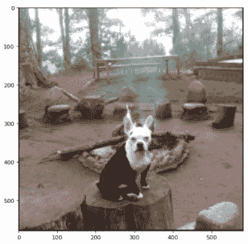

重组高斯图像

太好了！看起来这个功能运行得很好。作为一个有趣的练习，让我们看看当我们对图像进行 10 次卷积时会发生什么。

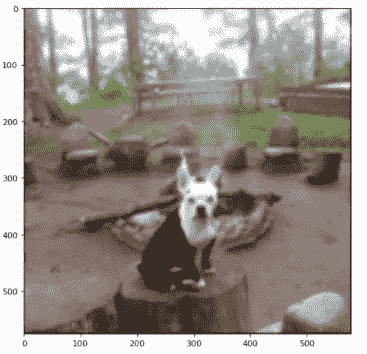

非常模糊的图像

所以这解决了我们的问题，对吗？不完全是。要查看这个函数的问题，让我们尝试锐化图像。

```
convolved_rgb_sharpen = convolver_rgb(dog, sharpen, 1)
```

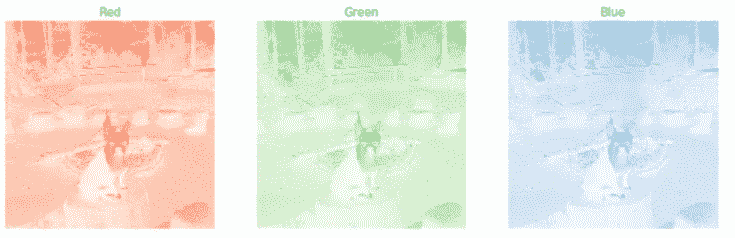

RGB 通道卷积

目前为止看起来不错，让我们看看改造后的形象是什么样的。

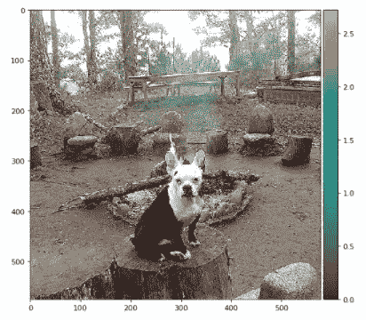

改良锐化图像

图像已被改造，但我们现在看到有一些轻微的扭曲。为什么会这样呢？

请记住，RGB 颜色空间隐含地将像素的亮度与颜色混合在一起。这意味着实际上不可能在不改变颜色的情况下对图像的照明应用卷积。那么我们如何处理这个问题呢？

解决这个问题的一个方法是改变图像的色彩空间。我们可以不使用 RGB 颜色空间，而是使用 Y'UV 颜色空间。我们这样做是因为 Y'UV 空间中的照明通道实际上是与颜色分离的(这是 Y 分量)。

出于本文的目的，我们将编辑函数，首先将图像转换到 Y'UV 颜色空间，然后进行所需的卷积。

```
def convolver_rgb(image, kernel, iterations = 1):
    img_yuv = rgb2yuv(image)   
    img_yuv[:,:,0] = multi_convolver(img_yuv[:,:,0], kernel, 
                                     iterations)
    final_image = yuv2rgb(img_yuv)

    fig, ax = plt.subplots(1,2, figsize = (17,10))

    ax[0].imshow(image)
    ax[0].set_title(f'Original', fontsize = 20)

    ax[1].imshow(final_image);
    ax[1].set_title(f'YUV Adjusted, Iterations = {iterations}', 
                    fontsize = 20)

    [axi.set_axis_off() for axi in ax.ravel()]

    fig.tight_layout()

    return final_imagefinal_image = convolver_rgb(dog, sharpen, iterations = 1)
```

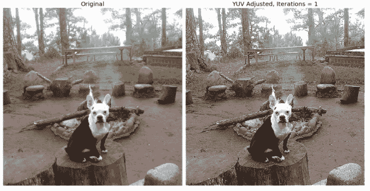

改良锐化图像

我们可以看到，我们的函数现在返回的图像明显更清晰，没有任何颜色失真。有许多其他方法来解决这个问题，紫外线转换只是其中之一。请记住，HSV 颜色空间的 V 分量代表几乎相同的东西。然而，Y'UV 空间的亮度分量和 HSV 空间的值分量的方式略有不同。让我们来看看使用一个比另一个更好的结果是什么。

```
def convolver_comparison(image, kernel, iterations = 1):
    img_yuv = rgb2yuv(image)   
    img_yuv[:,:,0] = multi_convolver(img_yuv[:,:,0], kernel, 
                      iterations)
    final_image_yuv = yuv2rgb(img_yuv)

    img_hsv = rgb2hsv(image)   
    img_hsv[:,:,2] = multi_convolver(img_hsv[:,:,2], kernel, 
                      iterations)
    final_image_hsv = hsv2rgb(img_hsv)

    convolved_image_r = multi_convolver(image[:,:,0], kernel, 
                         iterations)
    convolved_image_g = multi_convolver(image[:,:,1], kernel, 
                         iterations)
    convolved_image_b  = multi_convolver(image[:,:,2], kernel,
                         iterations)

    final_image_rgb = np.dstack((np.rint(abs(convolved_image_r)), 
                                 np.rint(abs(convolved_image_g)), 
                                 np.rint(abs(convolved_image_b)))) / 
                                 255

    fig, ax = plt.subplots(2,2, figsize = (17,17))

    ax[0][0].imshow(image)
    ax[0][0].set_title(f'Original', fontsize = 30)

    ax[0][1].imshow(final_image_rgb);
    ax[0][1].set_title(f'RGB Adjusted, Iterations = {iterations}', 
                       fontsize = 30)
    fig.tight_layout()

    ax[1][0].imshow(final_image_yuv)
    ax[1][0].set_title(f'YUV Adjusted, Iterations = {iterations}', 
                       fontsize = 30)

    ax[1][1].imshow(final_image_hsv)
    ax[1][1].set_title(f'HSV Adjusted, Iterations = {iterations}', 
                       fontsize = 30)

    [axi.set_axis_off() for axi in ax.ravel()]

    fig.tight_layout()convolver_comparison(dog, sharpen, iterations = 1)
```

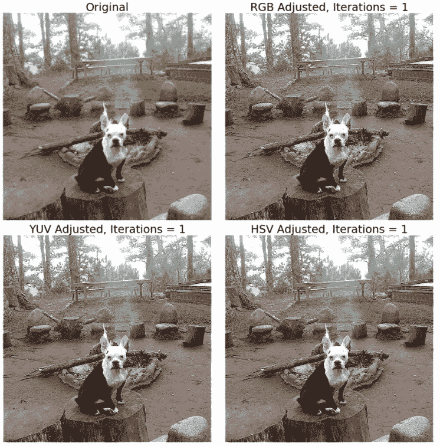

卷积的比较

我们看到 HSV 和 Y'UV 相对于原始的 RGB 方法有一些轻微的改进。为了更好地说明，我们可以将迭代次数从 1 增加到 2。

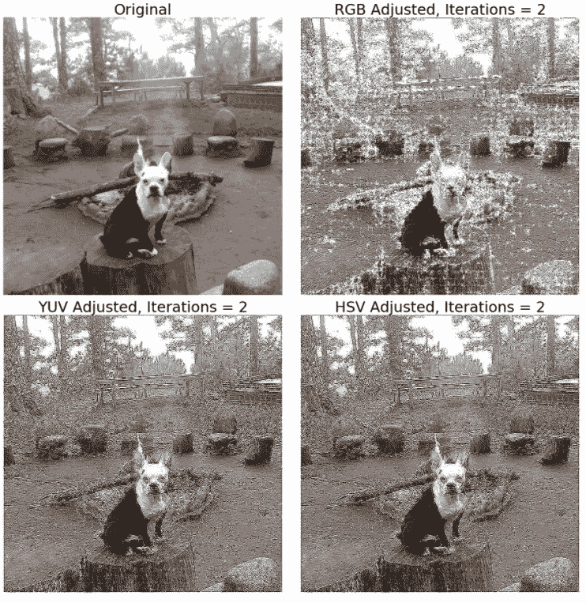

失真比较

在 2 次迭代时，失真变得更加明显。但是也很清楚，HSV 和 Y'UV 调整后的图像比原始 RGB 调整后的图像更加平滑。在决定将卷积核应用于图像的最佳方式时，应该记住这些属性。

**总之**

总而言之，我们已经学会了如何对图像进行模糊和锐化卷积。这些技术对于任何在图像处理和计算机视觉领域工作的数据科学家来说都是至关重要的。非常重要的是，我们了解到简单地对单个 RGB 通道应用卷积可能不是最好的方法。当处理图像时，你应该知道有很多不同种类的颜色空间可以使用。希望这篇文章对你有所帮助，并能应用到你自己的工作中。