# Python 图像处理——初学者的色彩隔离

> 原文：<https://towardsdatascience.com/image-processing-with-python-color-isolation-for-beginners-3b472293335b?source=collection_archive---------5----------------------->

## 如何根据颜色隔离图像的各个部分

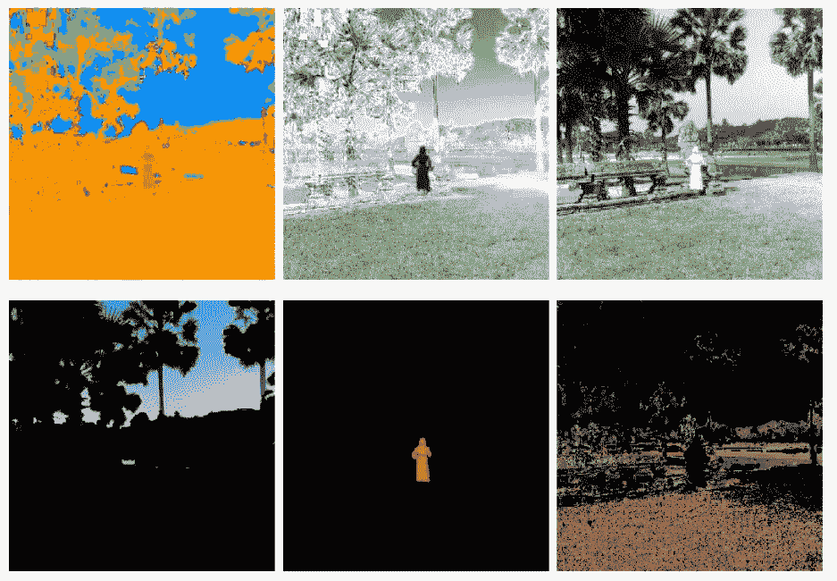

颜色隔离(图片由作者提供)

需要隔离图像的特定部分是一项基本技能，在这个领域会对你很有帮助。在这篇文章中，我们将讨论一些技术，将我们的图像的特定部分隔离。

我们开始吧！

一如既往，让我们从导入所需的 Python 库开始。

```
import numpy as np
import matplotlib.pyplot as plt
from skimage.io import imshow, imread
from skimage.color import rgb2hsv, hsv2rgb
import cv2
```

首先，让我们选择一个相对容易的图片。

```
red_girl = imread('red_girl.PNG')
plt.figure(num=None, figsize=(8, 6), dpi=80)
imshow(red_girl);
```

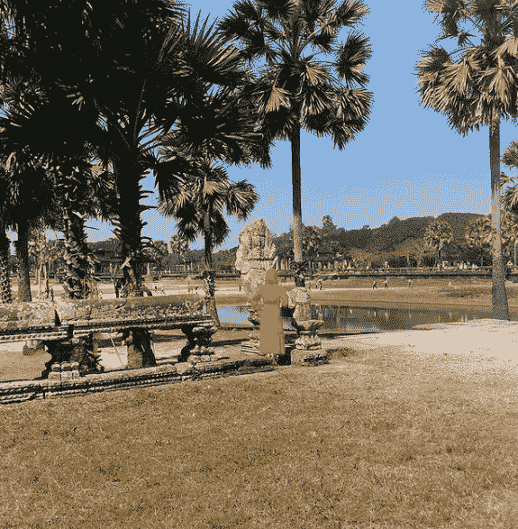

吴哥窟的红姑娘(图片由作者提供)

正如我们所见，这张图片是尝试图像隔离的理想方式，因为有一个明确的目标。那么应该如何隔离红衣女士呢？

首先，回想一下图像是由三个颜色通道红、绿、蓝组成的。也许我们可以简单地过滤红色通道。

```
red_filtered_girl = (red_girl[:,:,0] > 150)
plt.figure(num=None, figsize=(8, 6), dpi=80)
imshow(red_filtered_girl, cmap = 'gray');
```

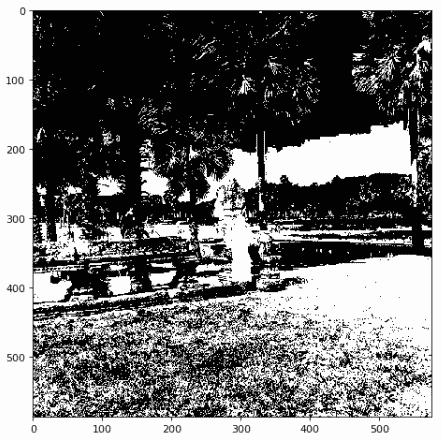

过滤像

这肯定不像我们想要的。让我们将这个遮罩应用到 RGB 图像中，看看结果。

```
red_girl_new = red_girl.copy()
red_girl_new[:, :, 0] = red_girl_new[:, :, 0]*red_filtered_girl
red_girl_new[:, :, 1] = red_girl_new[:, :, 1]*red_filtered_girl
red_girl_new[:, :, 2] = red_girl_new[:, :, 2]*red_filtered_girl
plt.figure(num=None, figsize=(8, 6), dpi=80)
imshow(red_girl_new);
```

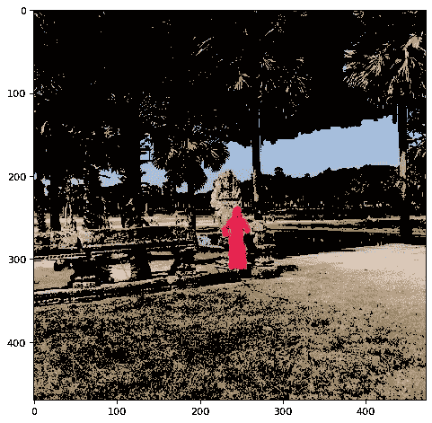

RGB 过滤图像

虽然图像看起来很酷，但它绝对不是我们想要的。这到底是怎么回事？回想一下，图像本身并不认为每种颜色是不同的“颜色”。所有的颜色都是红色、绿色和蓝色的简单混合。

```
def rgb_splitter(image):
    rgb_list = ['Reds','Greens','Blues']
    fig, ax = plt.subplots(1, 3, figsize=(15,5), sharey = True)
    for i in range(3):
        ax[i].imshow(image[:,:,i], cmap = rgb_list[i])
        ax[i].set_title(rgb_list[i], fontsize = 15)rgb_splitter(red_girl)
```

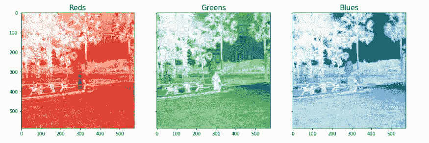

RGB 通道

请注意，尽管人眼看不到红色，但图像中的许多其他物体中仍然存在红色成分。我们必须考虑到这一点。在下面的代码中，我们指定绿色和蓝色通道也必须低于某个阈值。

```
red_filtered = (red_girl[:,:,0] > 150) & (red_girl[:,:,1] < 100) & (red_girl[:,:,2] < 110)
plt.figure(num=None, figsize=(8, 6), dpi=80)
red_girl_new = red_girl.copy()
red_girl_new[:, :, 0] = red_girl_new[:, :, 0] * red_filtered
red_girl_new[:, :, 1] = red_girl_new[:, :, 1] * red_filtered
red_girl_new[:, :, 2] = red_girl_new[:, :, 2] * red_filtered
imshow(red_girl_new);
```

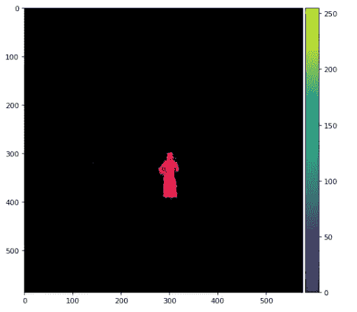

红色过滤图像

这就好多了，我们可以清楚地看到，红姑娘是与图像的其余部分隔离开来的。

但是请注意，只有当需要以具有非常明显的红色、绿色和蓝色通道的对象为目标时，才首选此方法。为了更好地分离这些颜色，我们可以利用 HSV 颜色空间。

```
def display_as_hsv(image):

    img = cv2.imread(image)
    img_hsv = cv2.cvtColor(img, cv2.COLOR_BGR2HSV)

    hsv_list = ['Hue','Saturation','Value']
    fig, ax = plt.subplots(1, 3, figsize=(15,7), sharey = True)

    ax[0].imshow(img_hsv[:,:,0], cmap = 'hsv')
    ax[0].set_title(hsv_list[0], fontsize = 20)
    ax[0].axis('off')

    ax[1].imshow(img_hsv[:,:,1], cmap = 'Greys')
    ax[1].set_title(hsv_list[1], fontsize = 20)
    ax[1].axis('off')

    ax[2].imshow(img_hsv[:,:,2], cmap = 'gray')
    ax[2].set_title(hsv_list[2], fontsize = 20)
    ax[2].axis('off')

    fig.tight_layout()display_as_hsv('red_girl.PNG')
```

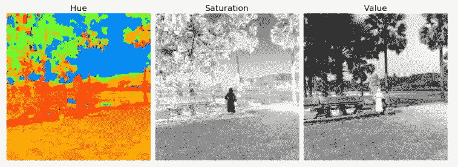

HSV 频道

与 RGB 色彩空间不同，HSV 色彩空间明确地将色彩色调通道与饱和度和值分离开来。这使我们能够轻松地锁定特定的颜色。为了帮助我们找到特定的颜色，让我们显示图片的颜色条。

```
plt.figure(num=None, figsize=(8, 6), dpi=80)
plt.imshow(red_girl_hsv[:,:,0], cmap='hsv')
plt.colorbar();
```

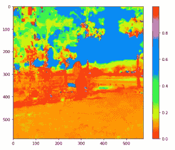

带有颜色条的色调图像

我们可以看到，每种颜色指的是色谱上的一个特定范围。让我们试着分离红色。

```
lower_mask = red_girl_hsv [:,:,0] > 0.90
upper_mask = red_girl_hsv [:,:,0] < 1.00
mask = upper_mask*lower_maskred = red_girl[:,:,0]*mask
green = red_girl[:,:,1]*mask
blue = red_girl[:,:,2]*mask
red_girl_masked = np.dstack((red,green,blue))
plt.figure(num=None, figsize=(8, 6), dpi=80)
imshow(red_girl_masked);
```

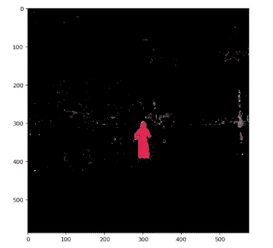

色调掩蔽图像

我们可以看到，图像清楚地隔离了红色女士。然而，它也拾取了几个斑点。如果我们将其与 HSV 颜色空间的色调通道进行比较，我们会看到这些斑点也被视为红色，即使它们看起来是灰色/棕色。为了减轻这一点，让我们添加另一个饱和度过滤器。

```
lower_mask = red_girl_hsv [:,:,0] > 0.90
upper_mask = red_girl_hsv [:,:,0] < 1.00
saturation = red_girl_hsv [:,:,1] > 0.50mask = upper_mask*lower_mask*saturationred = red_girl[:,:,0]*mask
green = red_girl[:,:,1]*mask
blue = red_girl[:,:,2]*mask
red_girl_masked = np.dstack((red,green,blue))
plt.figure(num=None, figsize=(8, 6), dpi=80)
imshow(red_girl_masked);
```

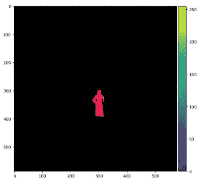

添加了饱和度过滤器

太棒了。我们利用单纯疱疹病毒通道成功地隔离了红娘。让我们试着区分不同的颜色。下面的代码为三种不同的颜色设置做了同样的事情。

```
def color_isolates(image):

    image_hsv = rgb2hsv(image[:,:,:-1])
    titles = ['Mask 1','Mask 2','Mask 3']
    f_size = 22

    #Sky Filter
    lower_mask_1 = image_hsv [:,:,0] > 0.45
    upper_mask_1 = image_hsv [:,:,0] < 0.75
    saturation_1 = image_hsv [:,:,1] > 0.15
    mask_1= lower_mask_1*upper_mask_1*saturation_1

    #Red Filter
    lower_mask_2 = image_hsv [:,:,0] > 0.90
    upper_mask_2 = image_hsv [:,:,0] < 1.00
    saturation_2 = image_hsv [:,:,1] > 0.50
    mask_2= lower_mask_2*upper_mask_2*saturation_2

    #Earth Fikter
    lower_mask_3 = image_hsv [:,:,0] > 0.05
    upper_mask_3 = image_hsv [:,:,0] < 0.15
    saturation_3 = image_hsv [:,:,1] < 0.75
    value_3 = image_hsv [:,:,2] < 0.70
    mask_3= lower_mask_3*upper_mask_3*saturation_3*value_3 sky_filtered = np.dstack((image[:,:,0]*mask_1,
                              image[:,:,1]*mask_1,
                              image[:,:,2]*mask_1))

    red_filtered = np.dstack((image[:,:,0]*mask_2,
                              image[:,:,1]*mask_2,
                              image[:,:,2]*mask_2))

    earth_filtered = np.dstack((image[:,:,0]*mask_3,
                                image[:,:,1]*mask_3,
                                image[:,:,2]*mask_3))

    images = [sky_filtered,red_filtered,earth_filtered]

    fig, ax = plt.subplots(1, 3, figsize=(15,12))
    for n, ax in enumerate(ax.flatten()):
        ax.set_title(f'{titles[n]}', fontsize = f_size)
        ax.imshow(images[n])
        ax.set_axis_off()

    fig.tight_layout()

color_isolates(red_girl)
```

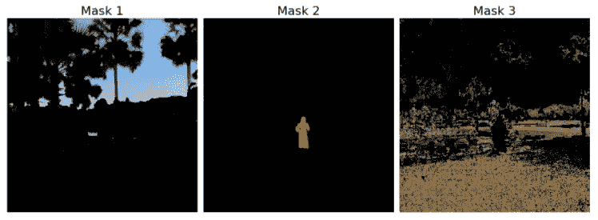

不同颜色的分离物

当然，人们可以很容易地看到手动调节的问题。它要求对每个图像进行不同的处理。如果我们处理数百张图像，这种方法是不可行的。

**总之**

我们看到，起初看起来复杂的问题，比如告诉机器隔离特定的颜色，可以相对容易地处理。我们学到了不要把自己局限于仅仅处理 RGB 颜色空间的重要性。当处理需要颜色识别的问题时，HSV 颜色空间的知识非常有用。在未来，我们将学习如何创建脚本来识别相似的颜色并将它们组合在一起，但现在我希望你能够了解图像分割的许多可能性。