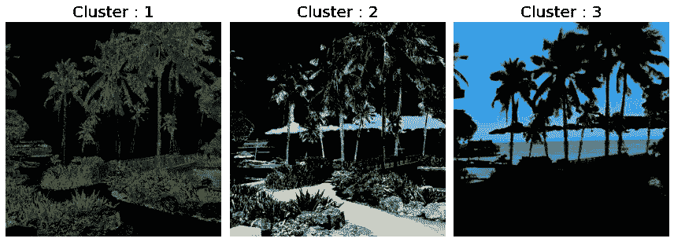

# 使用 Python 进行影像处理-提取影像数据进行聚类

> 原文：<https://towardsdatascience.com/image-processing-with-python-extracting-image-data-for-clustering-8fb2a985cfcd?source=collection_archive---------26----------------------->

## 如何从图像中提取更多的特征来改善聚类结果


k 表示生成的艺术(作者的图像)

在[之前的一篇文章](https://tonichi-edeza.medium.com/image-processing-with-python-unsupervised-learning-for-image-segmentation-90ebd23d91a4)中，我们探讨了应用 K-Means 算法来自动分割我们的图像的想法。然而，我们只关注 RGB 颜色空间。当然，RGB 颜色空间是大多数图像的原生格式，但是在本文中，我们将超越它，看看使用不同的颜色空间对结果聚类的影响。

我们开始吧！

像往常一样，让我们从导入所需的 Python 库开始

```
import numpy as np
import pandas as pd
import matplotlib.pyplot as pltfrom mpl_toolkits.mplot3d import Axes3D
from matplotlib import colors
from skimage.color import rgb2gray, rgb2hsv, hsv2rgb
from skimage.io import imread, imshow
from sklearn.cluster import KMeans
```

很好，现在让我们加载将要使用的图像。

```
island = imread('island_life.png')
plt.figure(num=None, figsize=(8, 6), dpi=80)
imshow(island);
```


拍摄于菲律宾东部的一个岛屿(图片由作者提供)

像以前一样，我们可以尝试通过 K-Means 算法分离这张图像。

```
def image_to_pandas(image):
    df = pd.DataFrame([image[:,:,0].flatten(),
                       image[:,:,1].flatten(),
                       image[:,:,2].flatten()]).T
    df.columns = ['Red_Channel','Green_Channel','Blue_Channel']
    return dfdf_island = image_to_pandas(island)plt.figure(num=None, figsize=(8, 6), dpi=80)
kmeans = KMeans(n_clusters=  5, random_state = 42).fit(df_island)
result = kmeans.labels_.reshape(island.shape[0],island.shape[1])plt.figure(num=None, figsize=(8, 6), dpi=80)
imshow(result, cmap='twilight');
```


聚类图像

将聚类计数设置为 5，该算法将图像聚类成这些不同的聚类。为了更好地了解每个集群代表什么，让我们将这个遮罩应用到我们的原始图像。


被群集屏蔽的原始图像

我们可以看到，K 均值算法把图像分成了以上几个部分。我们注意到的一个明显的事情是，该算法似乎将植物的亮部分从暗部分中分离出来，它做了一些类似于天空的事情。考虑到这一点，让我们尝试通过减少集群的数量来折叠这些集群。

```
plt.figure(num=None, figsize=(8, 6), dpi=80)
kmeans = KMeans(n_clusters =  3, random_state = 42).fit(df_island)
result = kmeans.labels_.reshape(island.shape[0],island.shape[1])plt.figure(num=None, figsize=(8, 6), dpi=80)
imshow(result, cmap='magma');
```


将聚类设置为 3

现在让我们将这些结果应用于原始图像。

```
def masker(image,masks):
    fig, axes = plt.subplots(1, 3, figsize=(12, 10))
    image_copy = image.copy()
    for n, ax in enumerate(axes.flatten()):
        masked_image = np.dstack((image_copy[:, :, 0]*(masks==[n]),
                                  image_copy[:, :, 1]*(masks==[n]),
                                  image_copy[:, :, 2]*(masks==[n])))
        ax.imshow(masked_image)
        ax.set_title(f'Cluster : {n+1}', fontsize = 20)
        ax.set_axis_off();
    fig.tight_layout()

masker(island,result)
```



集群设置为 3

我们可以看到，该算法现在认为天空是一个单一的集群。另外两个星团似乎是根据它们绿色的亮度来划分的。尽管这种算法似乎做得很好，但尝试通过不同的色彩空间对图像进行聚类可能会有所收获。

## HSV 颜色空间

另一种可视化图像的方式是通过它的 HSV 颜色空间表示。简单来说，HSV 代表**色相**、**饱和度**和**值。**由于其直观性，它是最终用户的理想色彩空间。在未来，我们将回顾不同的色彩空间及其应用。然而，现在让我们坚持将其应用于 K 均值聚类算法。

```
def image_to_pandas_hsv(image):
    hsv_image = rgb2hsv(image)
    df = pd.DataFrame([hsv_image[:,:,0].flatten(),
                       hsv_image[:,:,1].flatten(),
                       hsv_image[:,:,2].flatten()]).T
    df.columns = ['Hue','Saturation','Value']
    return dfdf_hsv = image_to_pandas_hsv(island)
df_hsv.head(5)
```


带有 HSV 元素的熊猫数据帧

很好，现在让我们将 K 均值算法应用于它并检查结果。

```
plt.figure(num=None, figsize=(8, 6), dpi=80)
kmeans = KMeans(n_clusters =  3, random_state = 42).fit(df_hsv)
result_hsv = kmeans.labels_.reshape(island.shape[0],island.shape[1])plt.figure(num=None, figsize=(8, 6), dpi=80)
imshow(result_hsv, cmap='magma');
```


HSV 聚类图像

不幸的是，HSV 色彩空间似乎生成了与 RGB 色彩空间非常相似的聚类。对原始图像应用蒙版证实了这一点。


HSV 聚类图像

那么，我们能做些什么来产生一种不同的集群呢？我们可以把两个数据帧连接起来。将元素彼此相加将允许 K 均值算法能够更好地区分每个特定的聚类。

## 连接数据帧

为了连接数据帧，我们只需要在 Pandas 中运行 *concat* 函数。

```
stacked_features = pd.concat([df_island, df_hsv], axis=1)
stacked_features.head(5)
```


级联数据帧

现在让我们应用 K 均值聚类算法，看看是否有任何显著的差异。

```
plt.figure(num=None, figsize=(8, 6), dpi=80)
kmeans = KMeans(n_clusters=  3, random_state =
               42).fit(stacked_features)
result_stacked = kmeans.labels_.reshape
                (island.shape[0],island.shape[1])
imshow(result_stacked, cmap='magma')
plt.show();
```


聚集堆栈

可悲的是，结果似乎是一样的，我希望它至少会有点不同。也许将来我们会讨论不同的聚类算法，并最终得到一些区别。

**总之**

尽管这一发现并不光彩，但它们确实说明了 K 均值算法的局限性。虽然理论上我们可以将更多的数据添加到数据帧中，但是我们最好使用其他的聚类算法，比如谱聚类和凝聚聚类。现在，我希望你对如何使用 K 均值算法的参数有一个更好的想法，并且希望你可以更有创造性地表现你的图像。