# 使用 Python 进行图像处理—使用 Scikit-Image 进行模板匹配

> 原文：<https://towardsdatascience.com/image-processing-with-python-template-matching-with-scikit-image-6e82fdd77b66?source=collection_archive---------8----------------------->

## 如何识别图像中的相似物体

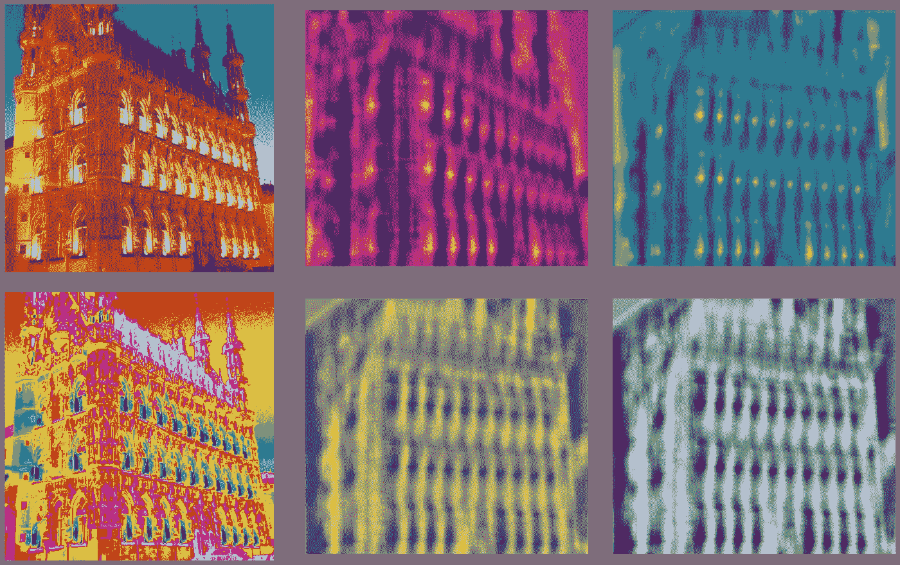

鲁汶市政厅的照片(图片由作者提供)

模板匹配是用于识别图片中感兴趣的对象的有用技术。不同于类似的物体识别方法，例如[图像遮蔽](/image-processing-with-python-color-isolation-for-beginners-3b472293335b)和[斑点检测](/image-processing-with-python-blob-detection-using-scikit-image-5df9a8380ade)。模板匹配很有帮助，因为它允许我们识别更复杂的图形。本文将讨论如何在 Python 中实现这一点。

我们开始吧！

和往常一样，首先导入所需的 Python 库。

```
import numpy as np
from skimage.io import imread, imshow
import matplotlib.pyplot as plt
from matplotlib.patches import Circle, Rectangle
from skimage import transform
from skimage.color import rgb2gray
from skimage.feature import match_template
from skimage.feature import peak_local_max
```

很好，现在让我们加载将要使用的图像。

```
leuven = imread('leuven_picture.PNG')
plt.figure(num=None, figsize=(8, 6), dpi=80)
imshow(leuven);
```

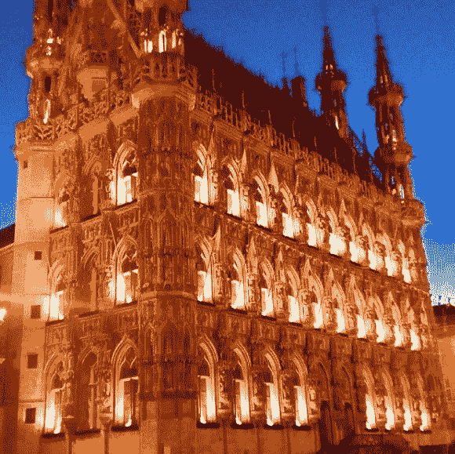

鲁汶市政厅(图片由作者提供)

上面的图片是我几年前拍摄的鲁汶市政厅。它极具装饰性的拱门绝对是一个值得一看的景观。对于我们的任务，让我们尝试使用模板匹配来尽可能多地识别它们。我们的第一步当然是将图像转换成灰度。

```
leuven_gray = rgb2gray(leuven)
plt.figure(num=None, figsize=(8, 6), dpi=80)
imshow(leuven_gray);
```

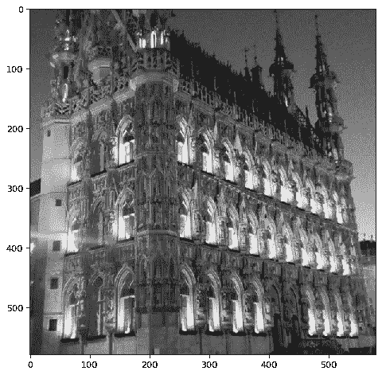

灰度鲁汶市政厅

太好了，现在让我们挑选一个窗口，并将其用作模板。要做到这一点，我们只需剪切掉图像的那一部分。

```
template = leuven_gray[310:390,240:270]
imshow(template);
```

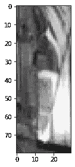

一片鲁汶

此时我们可以将模板送入 Skimage 的 *match_template* 函数中。

```
resulting_image = match_template(leuven_gray, template)
plt.figure(num=None, figsize=(8, 6), dpi=80)
imshow(resulting_image, cmap='magma');
```

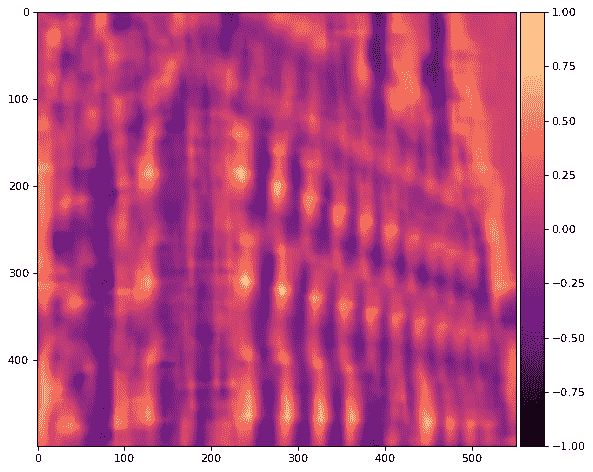

函数生成的图像

以上是使用 *match_template* 函数的结果。简而言之，图像的部分越亮，就越接近模板。让我们看看函数*认为*与模板最匹配的图像部分。

```
x, y = np.unravel_index(np.argmax(resulting_image), resulting_image.shape)
template_width, template_height = template.shape
rect = plt.Rectangle((y, x), template_height, template_width, 
                     color='r', fc='none')
plt.figure(num=None, figsize=(8, 6), dpi=80)
plt.gca().add_patch(rect)
imshow(leuven_gray);
```

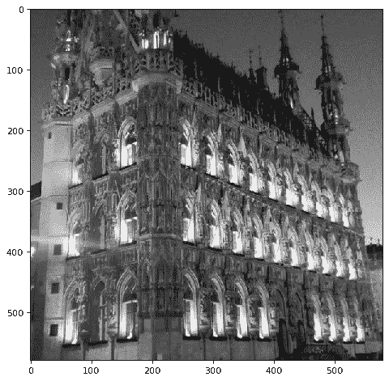

最佳匹配标识

我们可以看到图像能够正确地识别模板的完美匹配(为了验证，您可以使用我们使用的切片坐标进行检查)。这对于任何需要在图像中搜索对象的精确匹配的任务来说都是非常有用的。

现在让我们看看我们是否能得到识别其他窗口的函数，这些窗口或多或少与我们的模板相似。

```
template_width, template_height = template.shape    
plt.figure(num=None, figsize=(8, 6), dpi=80)
for x, y in peak_local_max(result, threshold_abs=0.5, 
                           exclude_border = 20):
    rect = plt.Rectangle((y, x), template_height, template_width,
                          color='r', fc='none')
    plt.gca().add_patch(rect)
imshow(leuven_gray);
```

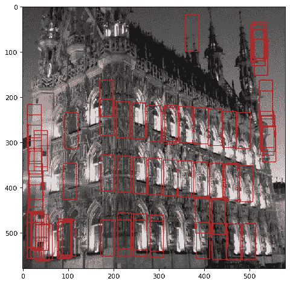

多个模板匹配

我们看到，虽然该函数确实准确地识别了其他几个窗口。它还会错误地识别出其他几个明显不是窗户的物体。让我们看看能否减少假阳性的数量。

我们可以补救的一种方法是利用单应矩阵。我以前写过一篇关于如何在 Skimage 中使用 transform.warp 函数的文章，但是通常它会扭曲图像，使图像看起来像是从另一个角度拍摄的。

```
points_of_interest =[[240, 130], 
                     [525, 255], 
                     [550, 545], 
                     [250, 545]]
projection = [[180, 150],
              [520, 150],
              [520, 550],
              [180, 550]]
color = 'red'
patches = []
fig, ax = plt.subplots(1,2, figsize=(15, 10), dpi = 80)
for coordinates in (points_of_interest + projection):
    patch = Circle((coordinates[0],coordinates[1]), 10, 
                    facecolor = color)
    patches.append(patch)for p in patches[:4]:
    ax[0].add_patch(p)
ax[0].imshow(leuven_gray);for p in patches[4:]:
    ax[1].add_patch(p)
ax[1].imshow(np.ones((leuven_gray.shape[0], leuven_gray.shape[1])));
```

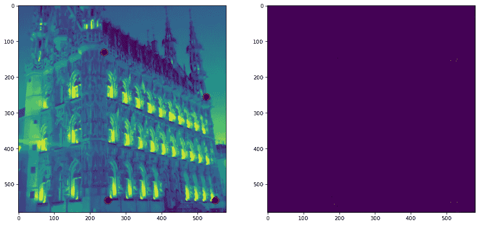

原始角点与目标角点

```
points_of_interest = np.array(points_of_interest)
projection = np.array(projection)
tform = transform.estimate_transform('projective', points_of_interest, projection)
tf_img_warp = transform.warp(leuven, tform.inverse)
plt.figure(num=None, figsize=(8, 6), dpi=80)
fig, ax = plt.subplots(1,2, figsize=(15, 10), dpi = 80)
ax[0].set_title(f'Original', fontsize = 15)
ax[0].imshow(leuven)
ax[0].set_axis_off();
ax[1].set_title(f'Transformed', fontsize = 15)
ax[1].imshow(tf_img_warp)
ax[1].set_axis_off();
```

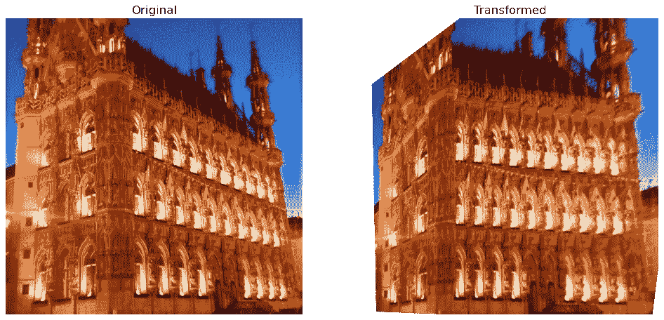

变换图像

我们可以看到图像现在面向前方。由于我们已经减轻了角度对模板匹配的影响，让我们看看我们是否得到了更好的结果。像以前一样，让我们首先将图像转换成灰度，然后应用变换函数。

```
points_of_interest = np.array(points_of_interest)
projection = np.array(projection)
tform = transform.estimate_transform('projective', points_of_interest, projection)
tf_img_warp = transform.warp(leuven_gray, tform.inverse)
plt.figure(num=None, figsize=(8, 6), dpi=80)
fig, ax = plt.subplots(1,2, figsize=(15, 10), dpi = 80)
ax[0].set_title(f'Original', fontsize = 15)
ax[0].imshow(leuven_gray, cmap = 'gray')
ax[0].set_axis_off();
ax[1].set_title(f'Transformed', fontsize = 15)
ax[1].imshow(tf_img_warp, cmap = 'gray')
ax[1].set_axis_off();
```

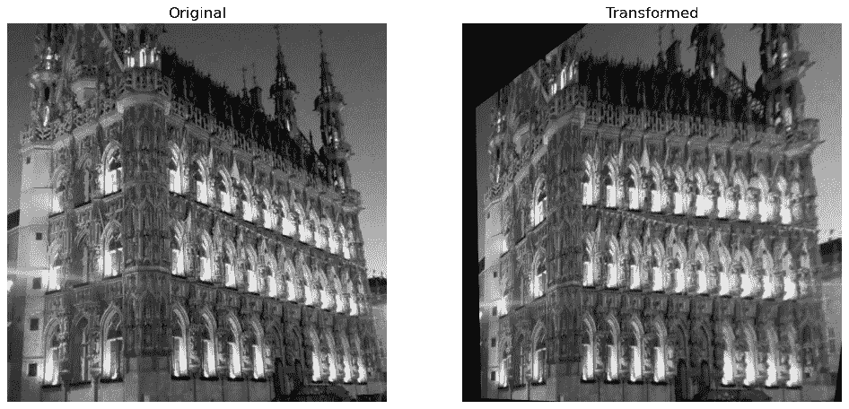

转换灰度

```
result = match_template(tf_img_warp, template)
plt.figure(num=None, figsize=(8, 6), dpi=80)
imshow(result, cmap=’magma’);
```

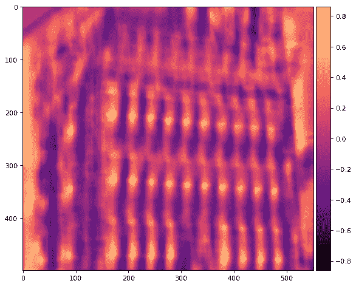

模板匹配的结果(或地下世界的城堡)

现在让我们应用和以前完全一样的代码，看看我们是否能得到更好的结果。

```
template_width, template_height = template.shape    
plt.figure(num=None, figsize=(8, 6), dpi=80)
for x, y in peak_local_max(result, threshold_abs=0.5, 
                           exclude_border = 10):
    rect = plt.Rectangle((y, x), template_height, template_width, 
                          color='r', fc='none')
    plt.gca().add_patch(rect)
imshow(tf_img_warp);
```

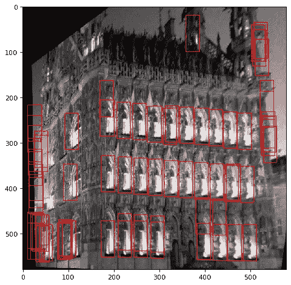

变换图像上的多个模板匹配

我们可以看到，该算法仍然可以识别图像上的每个窗口，但是它仍然有那些讨厌的假阳性。为了减轻这种情况，让我们应用一个与模板匹配的过滤器。下面是一些代码来处理我们的数据争论，如果它们有点晦涩，我很抱歉。

```
template_width, template_height = template.shape
matched_list = []
for x, y in peak_local_max(result, threshold_abs=0.50, exclude_border = 10):
    rect = plt.Rectangle((y, x), template_height, template_width)
    coord = Rectangle.get_bbox(rect).get_points()
    matched_list.append(coord)

matched_patches = [tf_img_warp[int(match[0][1]):int(match[1][1]),
                               int(match[0][0]):int(match[1][0])] for match in matched_list]difference = [abs(i.flatten() - template.flatten()) for i in matched_patches]
summed_diff = [array.sum() for array in difference]final_patches =list(zip(matched_list,summed_diff))
statistics.mean(summed_diff)
```

运行上述代码后，我们现在可以创建模板匹配的过滤列表。再次道歉，如果代码可能不是那么容易遵循。

```
summed_diff = np.array(summed_diff)
filtered_list_mean =list(filter(lambda x: x[1] <= 
                         summed_diff.mean(), final_patches))
filtered_list_median =list(filter(lambda x: x[1] <=
                           np.percentile(summed_diff, 50), 
                           final_patches))
filtered_list_75 =list(filter(lambda x: x[1] <= 
                       np.percentile(summed_diff, 75),
                       final_patches))
```

上面的代码应该通过平均差、中值差和 75%百分位差来过滤匹配项。本质上，它将只保存绝对差异低于这些阈值的匹配。最后一步是将这些绘制出来，看看结果是否有所改善。

```
fig, ax = plt.subplots(1,3, figsize=(17, 10), dpi = 80)
template_width, template_height = template.shapefor box in filtered_list_mean:
    patch = Rectangle((box[0][0][0],box[0][0][1]), template_height, 
                       template_width, edgecolor='b',  
                       facecolor='none', linewidth = 3.0)
    ax[0].add_patch(patch)
ax[0].imshow(tf_img_warp, cmap = 'gray');
ax[0].set_axis_off()for box in filtered_list_median:
    patch = Rectangle((box[0][0][0],box[0][0][1]), template_height, 
                       template_width, edgecolor='b', 
                       facecolor='none', linewidth = 3.0)
    ax[1].add_patch(patch)
ax[1].imshow(tf_img_warp, cmap = 'gray');
ax[1].set_axis_off()for box in filtered_list_75:
    patch = Rectangle((box[0][0][0],box[0][0][1]), template_height, 
                       template_width, 
                       edgecolor='b', facecolor='none', 
                       linewidth = 3.0)
    ax[2].add_patch(patch)
ax[2].imshow(tf_img_warp, cmap = 'gray');
ax[2].set_axis_off()fig.tight_layout()
```

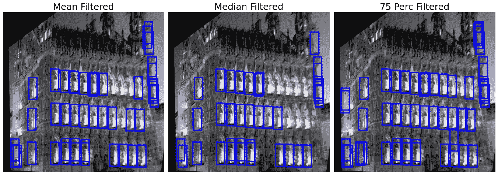

模板过滤图像

我们可以看到，它们看起来确实比原始图像好得多。然而，我们注意到，尽管均值和中值的假阳性少得多，但它们的真阳性也少得多。然而，75 Perc 过滤器能够保留几乎所有的真阳性。

**总之**

如果模板是特别复杂的图像，那么模板匹配可能是一件棘手的事情。我们必须记住，虽然我们作为人类可以将图像理解为一个简单的窗口，但机器只能看到一个矩阵。有两种方法可以解决这个问题。一个是通过确保模板足够独特，假阳性将很少，另一个是开发一个复杂的过滤系统，能够准确地从数据中删除任何假阳性。像这样的主题值得写几篇文章，将来我们将回顾一些关于模板匹配的最佳实践。现在，我希望你能够学会如何在你自己的项目中使用模板匹配，并提前考虑如何处理不可避免的问题。