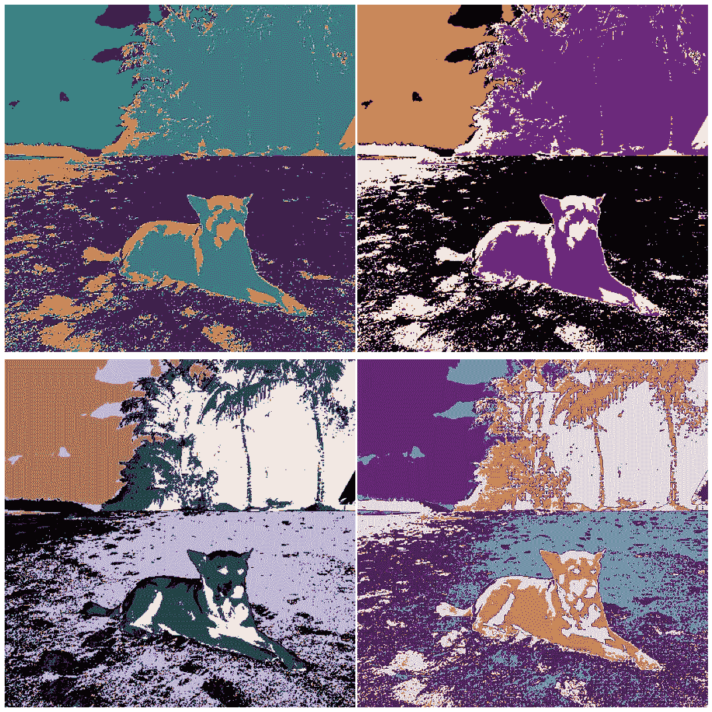
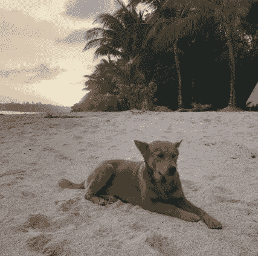
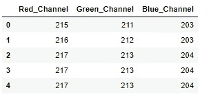
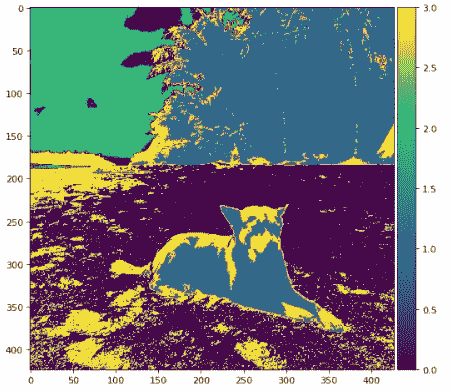
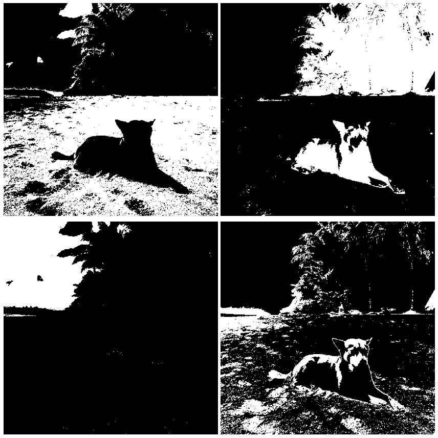
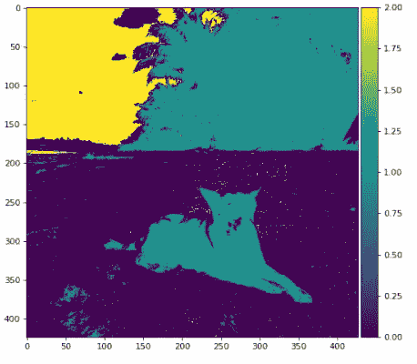
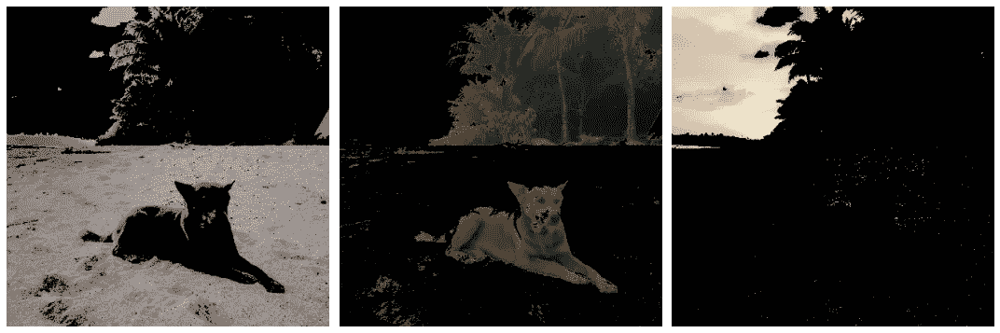
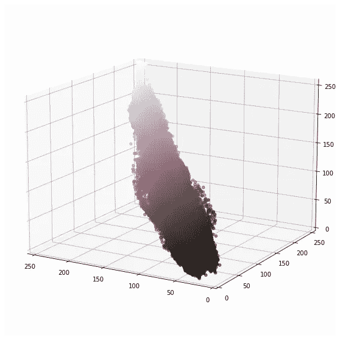
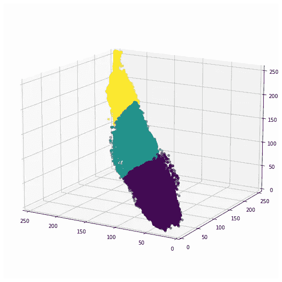

# 基于 Python 的图像处理——图像分割的无监督学习

> 原文：<https://towardsdatascience.com/image-processing-with-python-unsupervised-learning-for-image-segmentation-90ebd23d91a4?source=collection_archive---------14----------------------->

## 如何使用 K-Means 算法自动分割图像



现代艺术 Doggos(作者图片)

到目前为止，我们讨论的大多数技术都要求我们通过图像的特征来手动分割图像。但是我们实际上可以使用无监督聚类算法来为我们做到这一点。在这篇文章中，我们将回顾如何做到这一点。

我们开始吧！

和往常一样，我们从导入所需的 Python 库开始。

```
import numpy as np
import pandas as pd
import matplotlib.pyplot as pltfrom mpl_toolkits.mplot3d import Axes3D
from matplotlib import colors
from skimage.color import rgb2gray, rgb2hsv, hsv2rgb
from skimage.io import imread, imshow
from sklearn.cluster import KMeans
```

很好，现在让我们导入将要使用的图像。

```
dog = imread('beach_doggo.PNG')
plt.figure(num=None, figsize=(8, 6), dpi=80)
imshow(dog);
```



海滩上的狗(图片由作者提供)

我们知道，图像本质上是一个三维矩阵，每个单独的像素包含红色、绿色和蓝色通道的值。但是我们实际上可以使用心爱的熊猫库将每个像素存储为一个单独的数据点。下面的代码就是这么做的。

```
def image_to_pandas(image):
    df = pd.DataFrame([image[:,:,0].flatten(),
                       image[:,:,1].flatten(),
                       image[:,:,2].flatten()]).T
    df.columns = [‘Red_Channel’,’Green_Channel’,’Blue_Channel’]
    return dfdf_doggo = image_to_pandas(dog)
df_doggo.head(5)
```



图像为熊猫数据帧

这使得图像的操作更简单，因为更容易将其视为可以输入机器学习算法的数据。在我们的例子中，我们将利用 K 均值算法对图像进行聚类。

```
plt.figure(num=None, figsize=(8, 6), dpi=80)
kmeans = KMeans(n_clusters=  4, random_state = 42).fit(df_doggo)
result = kmeans.labels_.reshape(dog.shape[0],dog.shape[1])
imshow(result, cmap='viridis')
plt.show()
```



集群狗

正如我们所看到的，图像分为 4 个不同的区域。让我们分别想象每个区域。

```
fig, axes = plt.subplots(2,2, figsize=(12, 12))
for n, ax in enumerate(axes.flatten()):
    ax.imshow(result==[n], cmap='gray');
    ax.set_axis_off()

fig.tight_layout()
```



每个集群

正如我们所见，该算法根据 R、G 和 B 像素值分割图像。一个不幸的缺点是，这是一个完全无监督的学习算法。它并不特别关心任何特定群集背后的含义。作为证据，我们可以看到，第二个和第四个集群都有一个突出的狗的一部分(阴影的一半和非阴影的一半)。也许运行 4 个集群太多了，让我们重试集群，但是将集群的数量设置为 3。



重新聚集的狗

很好，我们可以看到狗是作为一个整体出来的。现在让我们看看，如果我们将每个聚类作为单独的蒙版应用于我们的图像，会发生什么。

```
fig, axes = plt.subplots(1,3, figsize=(15, 12))
for n, ax in enumerate(axes.flatten()):
    dog = imread('beach_doggo.png')
    dog[:, :, 0] = dog[:, :, 0]*(result==[n])
    dog[:, :, 1] = dog[:, :, 1]*(result==[n])
    dog[:, :, 2] = dog[:, :, 2]*(result==[n])
    ax.imshow(dog);
    ax.set_axis_off()
fig.tight_layout()
```



给狗戴上面具

我们可以看到，该算法生成了三个不同的集群，沙子、生物和天空。当然，算法本身并不太关心这些聚类，只关心它们共享相似的 RGB 值。这是由我们人类来解释这些集群。

在我们离开之前，我认为如果我们简单地在 3D 图上画出来，实际上展示我们的图像看起来像什么会有帮助。

```
def pixel_plotter(df):
    x_3d = df['Red_Channel']
    y_3d = df['Green_Channel']
    z_3d = df['Blue_Channel']

    color_list = list(zip(df['Red_Channel'].to_list(),
                          df['Blue_Channel'].to_list(),
                          df['Green_Channel'].to_list())) norm = colors.Normalize(vmin=0,vmax=1.)
    norm.autoscale(color_list)
    p_color = norm(color_list).tolist()

    fig = plt.figure(figsize=(12,10))
    ax_3d = plt.axes(projection='3d')
    ax_3d.scatter3D(xs = x_3d, ys =  y_3d, zs = z_3d, 
                    c = p_color, alpha = 0.55);

    ax_3d.set_xlim3d(0, x_3d.max())
    ax_3d.set_ylim3d(0, y_3d.max())
    ax_3d.set_zlim3d(0, z_3d.max())
    ax_3d.invert_zaxis()

    ax_3d.view_init(-165, 60)pixel_plotter(df_doggo)
```



像素的三维表示

我们应该记住，这实际上是算法如何定义“接近度”的。如果我们将 K-Means 算法应用于这个图，它分割图像的方式就变得非常清楚了。

```
df_doggo['cluster'] = result.flatten()def pixel_plotter_clusters(df):
    x_3d = df['Red_Channel']
    y_3d = df['Green_Channel']
    z_3d = df['Blue_Channel']

    fig = plt.figure(figsize=(12,10))
    ax_3d = plt.axes(projection='3d')
    ax_3d.scatter3D(xs = x_3d, ys =  y_3d, zs = z_3d, 
                    c = df['cluster'], alpha = 0.55);

    ax_3d.set_xlim3d(0, x_3d.max())
    ax_3d.set_ylim3d(0, y_3d.max())
    ax_3d.set_zlim3d(0, z_3d.max())
    ax_3d.invert_zaxis()

    ax_3d.view_init(-165, 60)pixel_plotter_clusters(df_doggo)
```



聚集像素

**总之**

K-Means 算法是一种流行的无监督学习算法，任何数据科学家都应该能够轻松使用。虽然它非常简单，但对于像素差异非常明显的图像来说，它尤其强大。在未来的文章中，我们将回顾其他机器学习算法，我们可以使用图像分割以及微调超参数。但是现在，我希望你能想象在你自己的任务中使用这种方法。