# 使用 Python 进行图像处理—使用 RG 色度

> 原文：<https://towardsdatascience.com/image-processing-with-python-using-rg-chromaticity-c585e7905818?source=collection_archive---------16----------------------->

## *如何使用高斯分布进行图像分割*

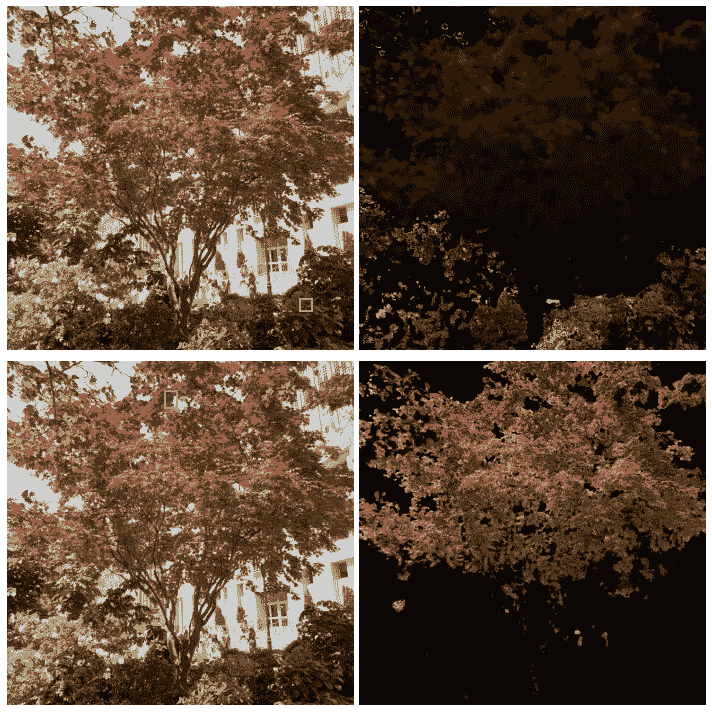

蒙面红树(图片由作者提供)

根据颜色分割图像是一项非常有用的技能。我以前写过一篇文章，介绍如何通过 [RGB 和 HSV 色彩空间](/image-processing-with-python-color-isolation-for-beginners-3b472293335b)实现这一点。然而，另一种基于颜色分割图像的有效方法是利用 RG 色度和高斯分布。本文将讨论如何做到这一点。

我们开始吧！

和往常一样，首先导入所需的 Python 库。

```
import numpy as np
import matplotlib.pyplot as plt
from skimage.io import imread, imshow
from numpy import ndarray
from matplotlib.patches import Rectanglefrom mpl_toolkits.mplot3d import Axes3D
from matplotlib import cm
from matplotlib import colors
```

很好，现在让我们导入将要使用的图像。

```
budapest = imread('budapest.png')
plt.figure(num=None, figsize=(8, 6), dpi=80)
imshow(budapest);
```

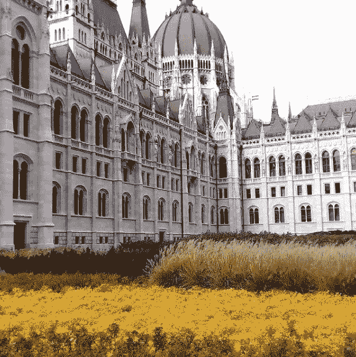

匈牙利议会(图片由作者提供)

你们中的一些人可能对上面的建筑很熟悉，这是我几年前拍摄的匈牙利议会的照片。因为这是一个非常丰富多彩的图像，所以它非常适合我们的文章。

我相信我们大多数人都知道，我们屏幕上呈现的图像实际上是在 RGB 色彩空间中。使用**红**、**绿**和**蓝**的不同组合生成不同颜色光谱的颜色空间。为了帮助我们形象化，让我们把图像分成不同的部分。

```
def rgb_splitter(image):
    rgb_list = ['Reds','Greens','Blues']
    fig, ax = plt.subplots(1, 3, figsize=(17,7), sharey = True)
    for i in range(3):
        ax[i].imshow(image[:,:,i], cmap = rgb_list[i])
        ax[i].set_title(rgb_list[i], fontsize = 22)
        ax[i].axis('off')
    fig.tight_layout()rgb_splitter(budapest)
```

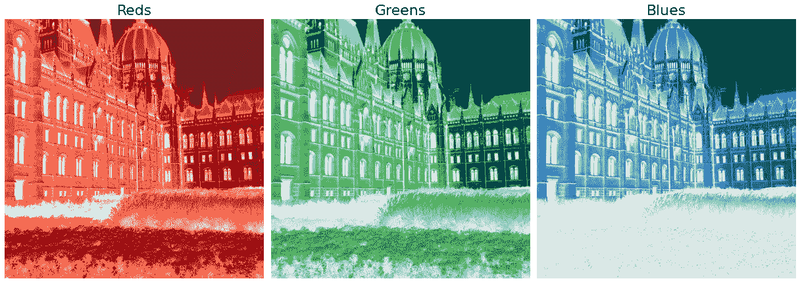

不同的颜色通道

本质上，如果我们分离每种颜色，这将是结果。注意，仅仅因为某一颜色存在于像素中，并不一定意味着该像素在我们的人眼看来是黄色的。请记住，我们的屏幕只是模拟颜色，并不产生颜色本身。

现在让我们讨论 RG 色度。

RG 色度仅仅是 RGB 颜色空间的二维标准化版本。我们可以通过将每个颜色通道的值除以该特定像素的总和值，将图像转换到这个颜色空间。从编程的角度来看，它将采用下面的形式。

```
budapest_r = budapest[:,:,0] /budapest.sum(axis=2)
budapest_g = budapest[:,:,1] /budapest.sum(axis=2)
```

您可能会注意到，我们没有包括蓝色通道，这是特意设计的。我们知道，不管怎样，所有归一化像素之和应该等于 **1** 。因此，蓝色通道可以从其他两个通道获得。下面的代码就是这么做的。

```
one_matrix = np.ones_like(float,shape=budapest_r.shape)
budapest_b = one_matrix- (budapest_r +budapest_g)
```

现在你可能会问自己，“这个图像看起来像什么？”。让我们看看图像发生了什么变化。

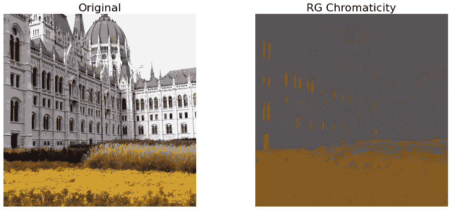

原始与 RG 色度

请注意，在我们的图像中，白色实际上由黑色表示，所有像素的亮度都相同。在这一点上，你可能很难真正看到图像，这是因为人眼更适合根据光线对比度来区分物体(但我不是眼科医生，所以请不要问我细节)。

当然，我们是否能够实际可视化图像并不重要，RG 色度的真正优势在于能够在一个 2 轴图形中表示所有像素值(请记住可以导出蓝色通道)。

让我们画出如何在这样的图上表现我们的形象。

```
def RG_Chroma_plotter(red,green):
    p_color = [(r, g, 1-r-g) for r,g in 
               zip(red.flatten(),green.flatten())]
    norm = colors.Normalize(vmin=0,vmax=1.)
    norm.autoscale(p_color)
    p_color = norm(p_color).tolist() fig = plt.figure(figsize=(10, 7), dpi=100)
    ax = fig.add_subplot(111) ax.scatter(red.flatten(), 
                green.flatten(), 
                c = p_color, alpha = 0.40) ax.set_xlabel('Red Channel', fontsize = 20)
    ax.set_ylabel('Green Channel', fontsize = 20) ax.set_xlim([0, 1])
    ax.set_ylim([0, 1]) plt.show()RG_Chroma_plotter(budapest_r,budapest_g)
```

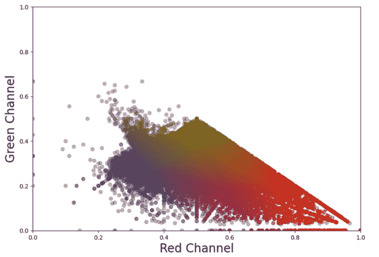

RG 色度图

上面的图表给了我们一个很好的图像中不同像素的视觉表现。现在，我们如何利用这些知识来正确地分割颜色。

我们首先需要做的是从图像中选择一个补丁。

```
patch = budapest[500:510,50:60]
imshow(patch);
```

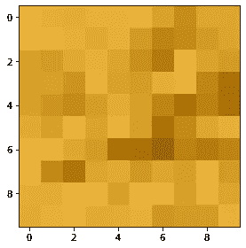

黄色补丁

让我们看看我们的补丁在 RG 色度图上的位置。

```
patch_r = patch[:,:,0] /patch.sum(axis=2)
patch_g = patch[:,:,1] /patch.sum(axis=2)
RG_Chroma_plotter(patch_r,patch_g)
```

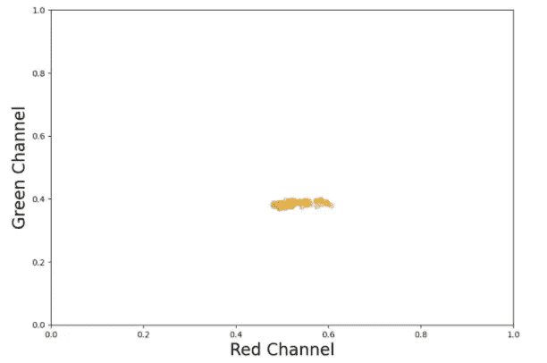

补丁 RG 色度

我们要做的是创建一个遮罩，它将使用面片的属性作为输入来创建一个高斯分布。这样做的目的是定位补片的像素在原始图像上的位置，并使用该信息来创建蒙版。

下面是一个很有用的函数，它能帮我们做到这一点。

```
def gaussian(p,mean,std):
    return np.exp(-(p-mean)**2/(2*std**2))*(1/(std*((2*np.pi)**0.5)))def rg_chroma_patch(image, patch_coor, mean = 1, std = 1):patch = image[patch_coor[0]:patch_coor[1],
                  patch_coor[2]:patch_coor[3]]

    image_r = image[:,:,0] /image.sum(axis=2)
    image_g = image[:,:,1] /image.sum(axis=2)

    patch_r = patch[:,:,0] / patch.sum(axis=2)
    patch_g = patch[:,:,1] / patch.sum(axis=2)

    std_patch_r = np.std(patch_r.flatten())
    mean_patch_r = np.mean(patch_r.flatten()) std_patch_g = np.std(patch_g.flatten())
    mean_patch_g = np.mean(patch_g.flatten()) masked_image_r = gaussian(image_r, mean_patch_r, std_patch_r)
    masked_image_g = gaussian(image_g, mean_patch_g, std_patch_g)
    final_mask = masked_image_r * masked_image_g fig, ax = plt.subplots(1,2, figsize=(15,7))
    ax[0].imshow(image)
    ax[0].add_patch(Rectangle((patch_coor[2], patch_coor[0]), 
                               patch_coor[1] - patch_coor[0], 
                               patch_coor[3] - patch_coor[2], 
                               linewidth=2,
                               edgecolor='b', facecolor='none')); ax[0].set_title('Original Image with Patch', fontsize = 22)
    ax[0].set_axis_off()

    #clean the mask using area_opening
    ax[1].imshow(final_mask, cmap = 'hot');
    ax[1].set_title('Mask', fontsize = 22)
    ax[1].set_axis_off()
    fig.tight_layout()

    return final_maskfinal_mask = rg_chroma_patch(budapest, [500,510,50,60])
```

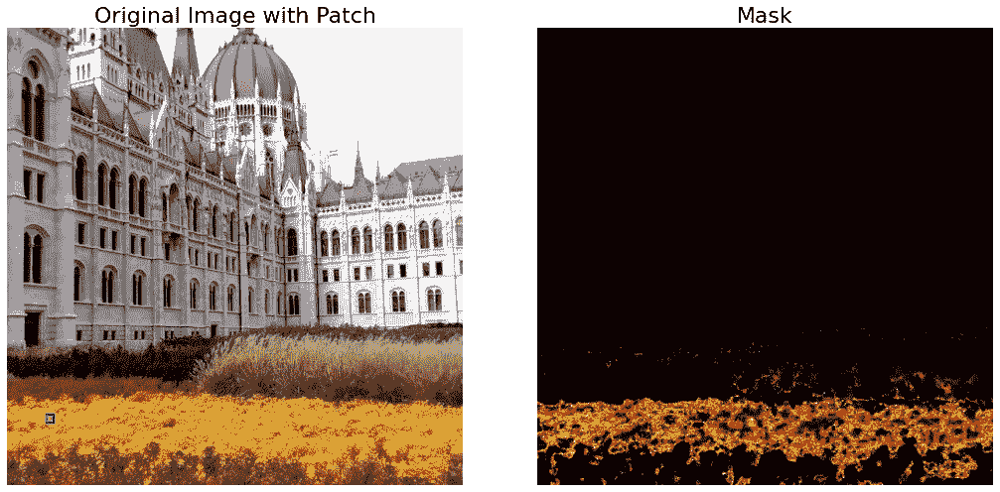

原始图像和遮罩

我们可以看到，该函数在创建遮罩方面做得相当不错。为了验证，让我们将蒙版应用到我们的图像，看看结果。首先让我们二值化我们的面具。

```
binarized_mask = final_mask > final_mask.mean()
plt.figure(num=None, figsize=(8, 6), dpi=80)
imshow(binarized_mask)
```

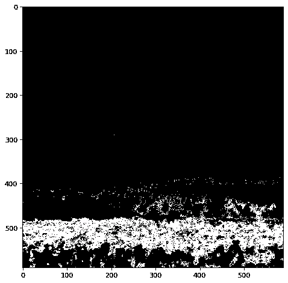

二值化掩模

太好了，下面的函数将获取原始图像和二值化的蒙版，并给出最终的结果。

```
def apply_mask(image,mask):
    yuv_image = rgb2yuv(image)
    yuv_image[:,:,0] = yuv_image[:,:,0] * mask 

    masked_image = yuv2rgb(yuv_image)

    fig, ax = plt.subplots(1,2, figsize=(15,7))
    ax[0].imshow(image)
    ax[0].set_title('Original Image', fontsize = 22)
    ax[0].set_axis_off()

    ax[1].imshow(masked_image);
    ax[1].set_title('Masked Image', fontsize = 22)
    ax[1].set_axis_off()
    fig.tight_layout()
```

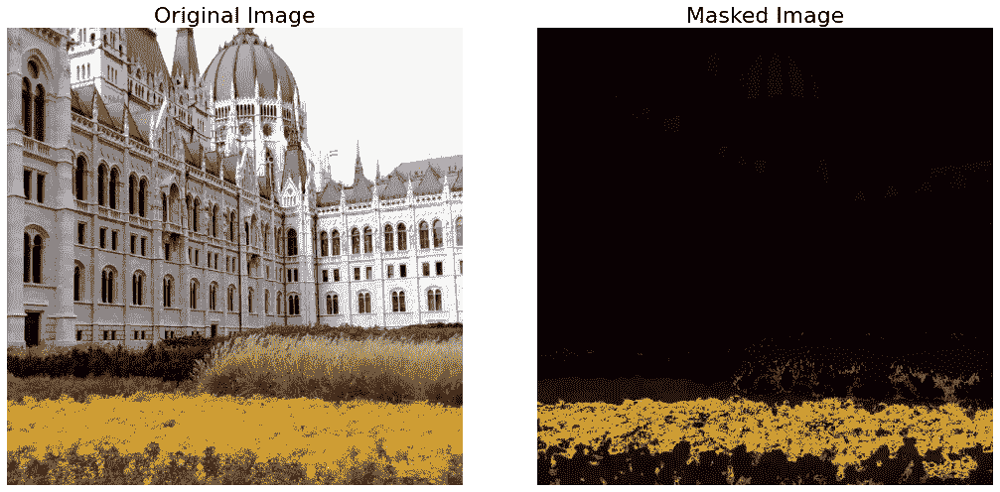

原始图像与蒙版图像

我们可以看到面具做得非常好。除了田地，其他都被涂黑了。注意我们是如何利用 Y'UV 颜色空间的，这是因为 Y'UV 颜色空间有一个专用于亮度的通道。

为了好玩，让我们将所有这些应用到另一个图像，看看我们是否能得到同样令人印象深刻的结果。

```
singapore = imread('singapore_street.png')
plt.figure(num=None, figsize=(8, 6), dpi=80)
```


新加坡一条空荡荡的街道(图片由作者提供)

我们将利用新加坡街道的上述图像。首先让我们看看图像的 RG 色度图是什么样的。

```
singapore_r = singapore[:,:,0] /singapore.sum(axis=2)
singapore_g = singapore[:,:,1] /singapore.sum(axis=2)
RG_Chroma_plotter(singapore_r,singapore_g)
```

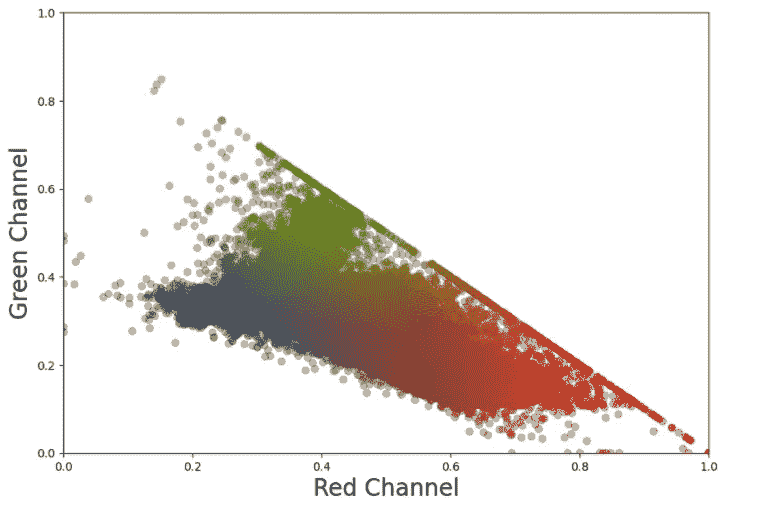

新加坡 RG 色度

我们看到，与匈牙利议会的图像不同，新加坡的图像有更多的绿色和蓝色像素。

现在让我们试着挑选一个补丁并得到相关的掩码。

```
final_mask_singapore = rg_chroma_patch(singapore, [125,150,290,310])
```

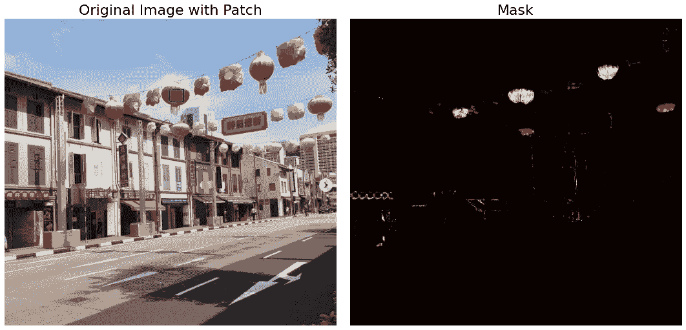

新加坡面具

我们可以看到，蒙版在定位图像中的暗粉色物体方面做得很好。让我们看看最终的蒙版图像是什么样的。

```
binarized_mask_singapore = final_mask_singapore >      
                           final_mask_singapore.mean()
apply_mask(singapore,binarized_mask_singapore)
```

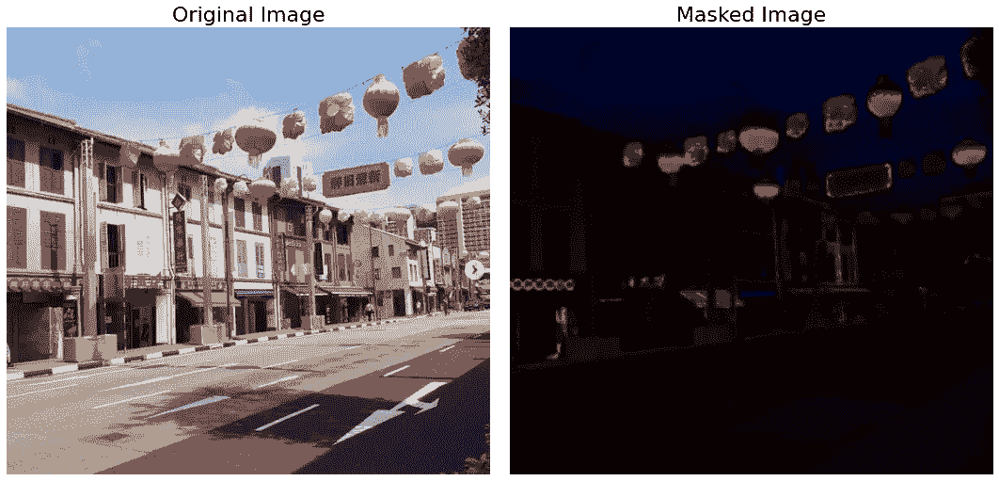

蒙面新加坡形象

我们可以看到，它在屏蔽图像方面也做得很好。注意灯笼是如何被整齐地切割出来的。然而，请注意许多建筑也包括在内。在未来的文章中，我们将学习如何调整参数，以确保最终的图像更干净。

**总之**

RG 色度是您可以用于颜色分割的最强大的工具之一。它干净地屏蔽图像的能力是我们所介绍的其他技术无法比拟的。前进将调整参数，以确保我们可以获得更清晰的图像，但现在我希望你能够欣赏这个非常有用的方法。