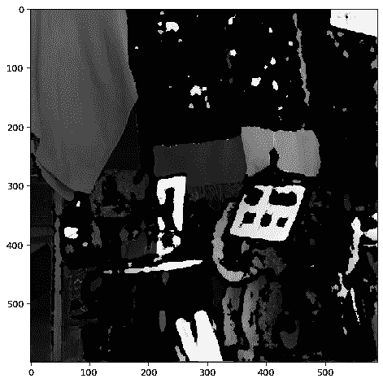

# 使用 Python 进行图像处理-使用熵

> 原文：<https://towardsdatascience.com/image-processing-with-python-working-with-entropy-b05e9c84fc36?source=collection_archive---------10----------------------->

## 如何使用熵分离物体纹理


熵图像(作者提供的图像)

除了根据颜色分离物体，另一种分离物体的方法是通过物体的纹理。要做到这一点，我们可以利用 Skimage 中的*熵*函数。在这篇文章中，我们将学习如何使用函数有效地提取图像中感兴趣的对象。

我们开始吧！

和往常一样，首先导入所需的 Python 库。

```
import matplotlib.pyplot as plt
import numpy as np
from skimage.io import imread, imshowfrom skimage import data
from skimage.util import img_as_ubyte
from skimage.filters.rank import entropy
from skimage.morphology import disk
from skimage.color import rgb2hsv, rgb2gray, rgb2yuv
```

现在让我们导入将要使用的图像。

```
shawls = imread('shawls.PNG')
plt.figure(num=None, figsize=(8, 6), dpi=80)
imshow(shawls);
```


彩色披肩(图片由作者提供)

上图是不同印花和纹理的披肩。让我们试着看看我们是否能根据这些特征把他们分开。作为开始，让我们首先把我们的图像转换成灰度。

```
shawl_gray = rgb2gray(imread('shawls.PNG'))
plt.figure(num=None, figsize=(8, 6), dpi=80)
imshow(shawl_gray);
```


灰色披肩

很好，从这一点我们现在可以应用撇除的*熵*函数。

```
entropy_image = entropy(shawl_gray, disk(5))
plt.figure(num=None, figsize=(8, 6), dpi=80)
imshow(entropy_image, cmap = 'magma');
```


应用熵函数

简而言之，熵函数给出一个值，该值表示图像的某一部分的复杂程度。结果值当然取决于我们选择的初始结构元素。作为一个例子，让我们通过改变圆盘的初始半径来进行实验。

```
def disk_iterations(image):
    image_gray = rgb2gray(image)
    f_size = 20
    radi = list(range(1,10))
    fig, ax = plt.subplots(3,3,figsize=(15,15))
    for n, ax in enumerate(ax.flatten()):
        ax.set_title(f'Radius at {radi[n]}', fontsize = f_size)
        ax.imshow(entropy(shawl_gray, disk(radi[n])), cmap = 
                  'magma');
        ax.set_axis_off()
    fig.tight_layout()
```


半径设置为不同的值

我们可以看到，如果我们增加光盘半径，图像变得越来越模糊。由于本练习的目标是基于纹理分割图像，因此我们不需要包含不同纹理图像部分的大小。让我们选择 **6** 的半径，因为它似乎是 **1** 的锐度和 **9** 的钝度之间的良好平衡。

我们的下一个任务是把它变成一个面具。为此，让我们使用图像二值化。下面的代码将迭代几个阈值。

```
def threshold_checker(image):
    thresholds =  np.arange(0.1,1.1,0.1)
    image_gray = rgb2gray(image)
    entropy_image = entropy(image_gray, disk(6))
    scaled_entropy = entropy_image / entropy_image.max()  
    fig, ax = plt.subplots(2, 5, figsize=(17, 10))
    for n, ax in enumerate(ax.flatten()):
        ax.set_title(f'Threshold  : {round(thresholds[n],2)}', 
                     fontsize = 16)
        threshold = scaled_entropy > thresholds[n]
        ax.imshow(threshold, cmap = 'gist_stern_r') ;
        ax.axis('off')
    fig.tight_layout()
```


二值化的不同阈值

我们可以看到，增加二值化的阈值会减少图像的显示量。直观上，这是有意义的，因为一旦阈值等于 1，就没有图像的任何部分可以匹配该熵水平。

出于可视化的目的，让我们将阈值设置为 0.8，看看当我们使用它作为图像的遮罩时会发生什么。

```
scaled_entropy = shawl_gray / shawl_gray.max()
entropy_image = entropy(scaled_entropy, disk(6))
scaled_entropy = entropy_image / entropy_image.max()
mask = scaled_entropy > 0.8
plt.figure(num=None, figsize=(8, 6), dpi=80)
imshow(shawl_gray * mask, cmap = 'gray');
```


熵屏蔽图像

正如预期的那样，可以看到只有违反熵的对象才能被渲染。如果我们翻转数学运算符，我们可以看到相反的效果。



反向熵掩蔽图像

注意只有低熵物体被渲染。为了有助于可视化，让我们将这两个遮罩转换为其原始彩色图像，并并排比较它们。

```
def entropy_mask_viz(image):
    image_gray = rgb2gray(image)
    entropy_image = entropy(image_gray, disk(6))
    scaled_entropy = entropy_image / entropy_image.max()
    f_size = 24
    fig, ax = plt.subplots(1, 2, figsize=(17, 10))

    ax[0].set_title('Greater Than Threshold', 
                     fontsize = f_size)
    threshold = scaled_entropy > 0.8
    image_a = np.dstack([image[:,:,0]*threshold,
                            image[:,:,1]*threshold,
                            image[:,:,2]*threshold])
    ax[0].imshow(image_a)
    ax[0].axis('off')

    ax[1].set_title('Less Than Threshold', 
                     fontsize = f_size)
    threshold = scaled_entropy < 0.8
    image_b = np.dstack([image[:,:,0]*threshold,
                            image[:,:,1]*threshold,
                            image[:,:,2]*threshold])
    ax[1].imshow(image_b)
    ax[1].axis('off')
    fig.tight_layout()
    return [image_a, image_b]
entropic_images = entropy_mask_viz(shawls)
```


基于熵值的彩色图像分割

我们可以看到，我们能够成功地按照对象的复杂程度来划分图形。左图中的物品展示了更复杂的设计图案(以及由更复杂纹理的织物制成)。右图中的物体要简单得多，只包含一种颜色。

一个有趣的现象是，我们是如何将文字从书写文字的纸上分离出来的。


正文段

记住这一点很有用。人类的文本倾向于写在简单的背景上以方便阅读。了解这一点意味着从图像中提取所有文本特征是可能的，但这是我们将留待下次完成的任务。

**总之**

熵屏蔽是一种有用的技术，可以帮助数据科学家根据复杂性分割图像的各个部分。应用范围从纹理分析、图像过滤，甚至文本提取(这一特性非常适合自然语言处理)。我希望在读完这篇文章之后，你能对如何使用这个工具有一个更好的评价和理解。