# 图像分割:改变你的车的颜色！分步指南。

> 原文：<https://towardsdatascience.com/image-segmentation-change-the-color-of-your-car-step-by-step-guide-ba9aa16ee52e?source=collection_archive---------49----------------------->

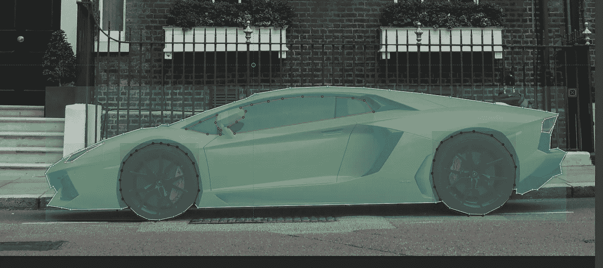

图片来自 [Gabor Papp](https://unsplash.com/photos/k688MQzA3LI) 来自 unsplash 由本人标注

你有没有想过你的车换成另一种颜色会是什么样子？或者你只是对训练一个不需要理论知识的图像分割任务的深度学习模型感兴趣？或者两者都有？那么这个帖子就是给你的！

将有两个主要部分:首先如何为图像分割任务创建数据集，然后如何创建和训练模型。如果你只对第二部分感兴趣，可以直接看！我为它提供了一个数据集。

# 收集图像和创建遮罩注释

首先，我们需要收集汽车侧面图像。收集这类数据的方法有很多，我可以建议以下方法:

## 不溅

Unsplash 是一个伟大的网站，它分享了大量免费提供的图片，并附有宽松的版权条款。这对我特别有用，因为我想公开分享一些照片，比如在这个博客上。这里的缺点是没有太多的图片特别是汽车侧视图。

## 谷歌图片

Google Chrome 和 Firefox 有一个很好的扩展，可以让你下载当前活动标签的所有图片。非常有用，如果你用谷歌搜索“汽车侧面-侧面-素描-卡通”，然后进入图像标签。“-”符号表示您希望从搜索中排除这些关键字。

## 在野外

如果你有一个好相机，你也可以简单地四处走走，自己拍照！如果要公开数据集，请确保模糊人物和车牌。出于版权原因，我个人选择以这种方式调整我的数据集。

你可能需要收集大约 200 张图像，才能通过我们的深度学习模型获得满意的结果。

## 屏蔽注释

掩膜注记是一幅图像，其像素值代表类，如下图所示。它可以遵循不同的格式:黑白 PNG、彩色 PNG、COCO style JSON 等…

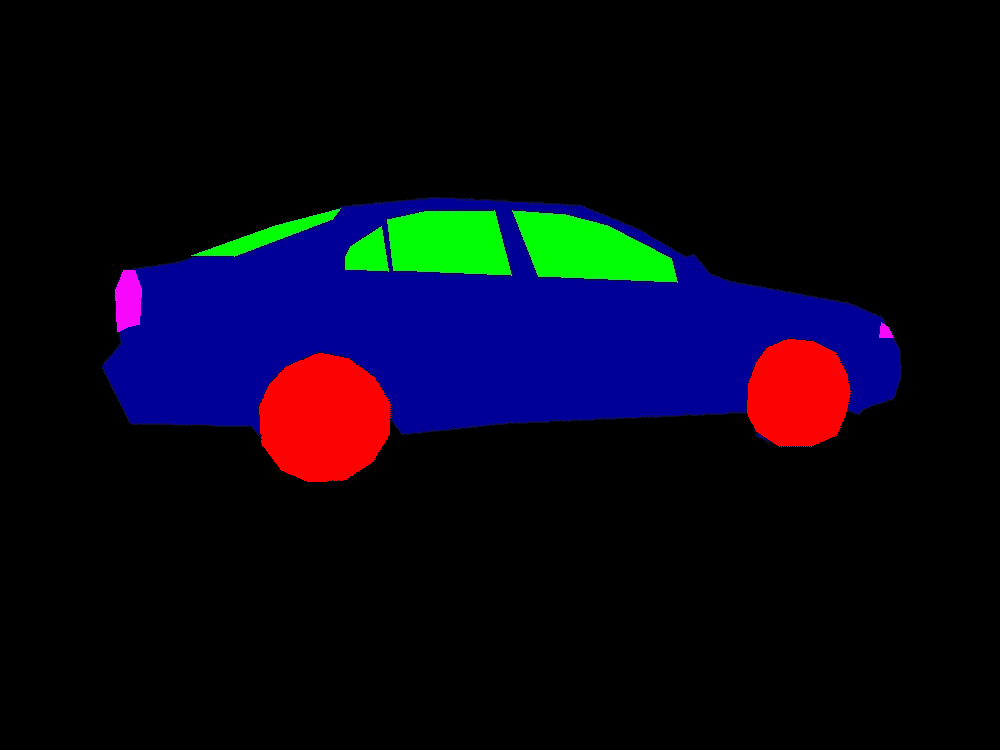

多彩 PNG 蒙版标注:黑色为背景，红色为轮子，绿色为窗户，紫色为灯光，蓝色为车身。由我自己生成。

还有许多工具可用于注释图像。我决定用 [VoTT](https://github.com/microsoft/VoTT) ，可以从他们的 GitHub 页面[这里](https://github.com/microsoft/VoTT)下载。如果你想为图像分割创建边界框或多边形，这真的很有用。多边形并不是所有的图像分割模型都能直接理解的，但是有软件能够为我们将多边形转化为实际的遮罩。我们将使用智能人工智能。

一旦你下载了 VoTT，启动它。建立一个项目，其中“目标连接”是您想要保存注释图像的位置，“源连接”是您的图像数据集的位置。

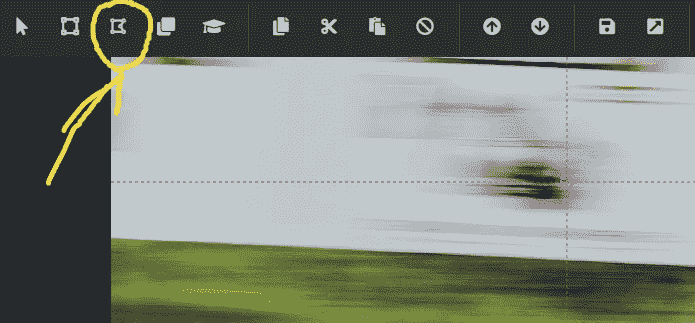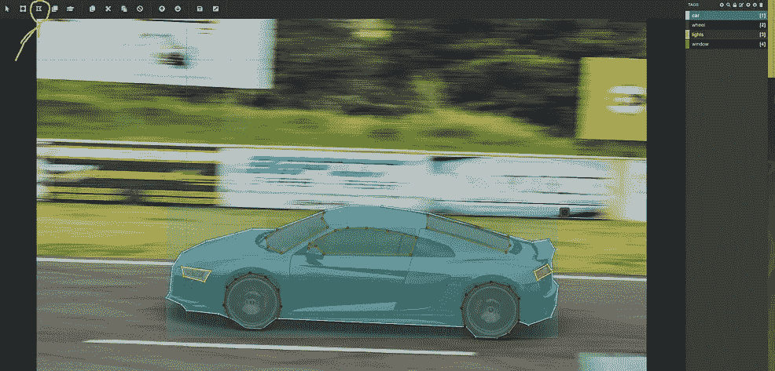

图片来自 [Malusi Msom](https://unsplash.com/photos/1Jz3Xq7EcrI) 本人来自 unsplash 自己注释

点击左上角的多边形选项，开始你的注释之旅！完成多边形绘制后，按 escape 键并选择标签。如果你纠结于这个软件，我建议你看看这个快速的[教程](https://www.youtube.com/watch?v=uDWgWJ5Gpwc)。

当您完成注释后，还有最后一件重要的事情要做！在左侧面板中，转到导出设置并选择 VoTT 格式。然后在顶部面板上，单击导出。它应该会产生一个大的 JSON 文件，类似于[project-name]-export.json。这个文件非常重要:它包含了 Intelec AI 可以理解并为我们翻译的格式的所有注释。

> 正如上面的截图所示，我个人决定将汽车分为 4 个不同的类别:汽车本身，以了解它在图片上的位置，车轮，前后灯(标有灯)，最后是窗户，后窗和挡风玻璃(标有窗)

> 如果你想在不标注自己数据集的情况下尝试训练一个模型，我在这里提供了我的！

## 使用智能人工智能训练模型

对于这个演示，我选择向您展示 Intelec AI，因为它易于使用，并且经常产生良好的效果。他们为不同的任务提出不同的模型，并为我们处理大部分数据争论。多亏了 VoTT 和 Intelec AI，在本教程中你实际上不会看到一行代码！

Intelec AI 可以从这个[链接](https://www.intelec.ai/install)下载。你需要有码头工人。其安装在第[页](https://www.docker.com/)中有很好的解释。我不会在这里详细解释 docker 是如何工作的，但是如果你和我一样是 Linux 用户，我建议你设置 Docker 在没有 sudo 的情况下使用，就像这个[页面](https://docs.docker.com/engine/install/linux-postinstall/)建议的那样。

一旦安装了 Docker 和 Intelec AI，我们就可以创建一个 ZIP 文件夹，其结构与下面的一个截图相同。您需要注意结构:文件夹和 JSON 文件的名称应该与下面的截图完全匹配。

> 如果您自己注释了图像，请注意将您的**【项目名称】-export.json** 重命名为 **masks.json**

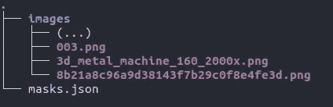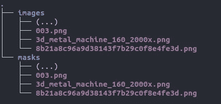

你的 zip 文件夹应该是什么样子的例子。这个演示是基于左边的，或者如果你直接下载数据集的话，是基于右边的。

然后，进入 Intelec AI 的“文件浏览器”标签，上传你的 zip 文件夹。右键点击解压。现在，我们可以直接进入培训页面，创建一个图像分割培训器！将它链接到我们刚刚上传的数据，选择一个收缩因子(如果你有一个强大的 GPU，我建议因子为 2，否则因子为 5)，然后按“训练”。你可以喝杯咖啡，过一会儿回来看看你的结果。

对我来说，用一个 GPU 训练 22 个纪元不到 5 分钟！Intelec AI 提供了如下所示的摘要:

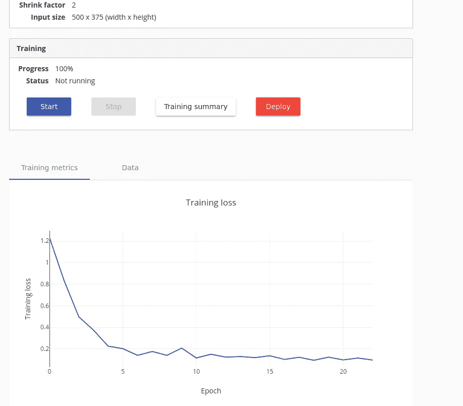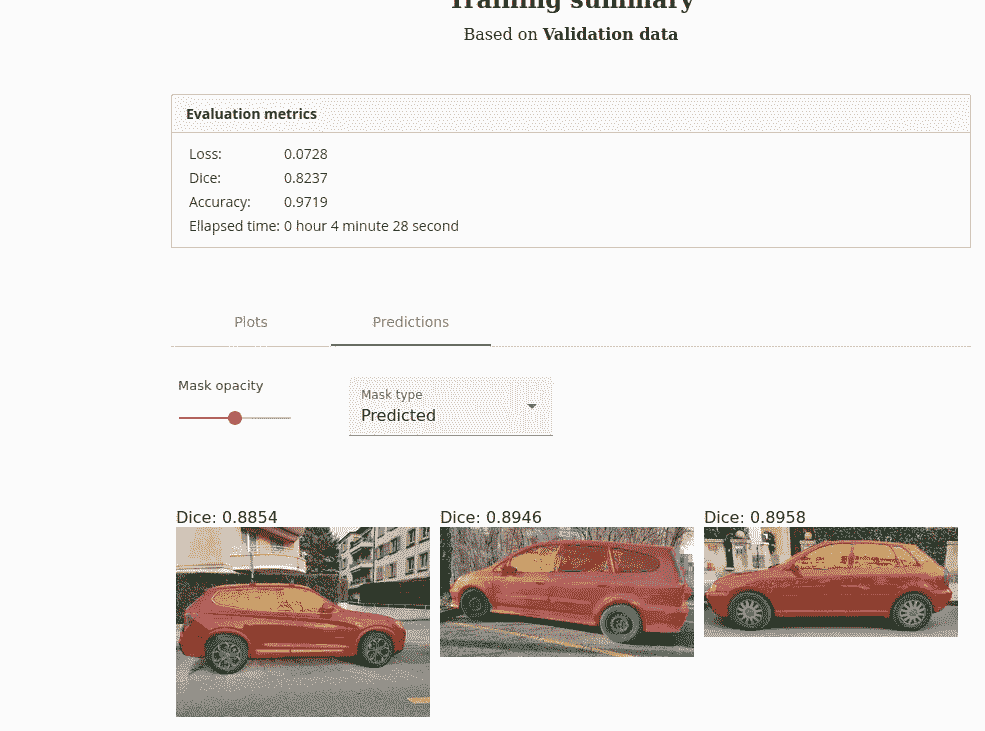

Intelec AI 软件截图

如果你想知道模型在不同时期的训练效果如何，我保存了一些中间结果，如下所示:

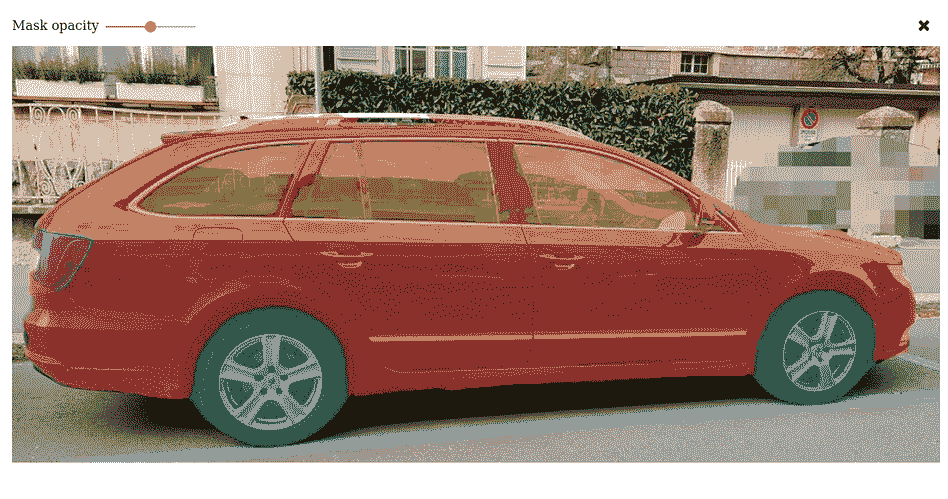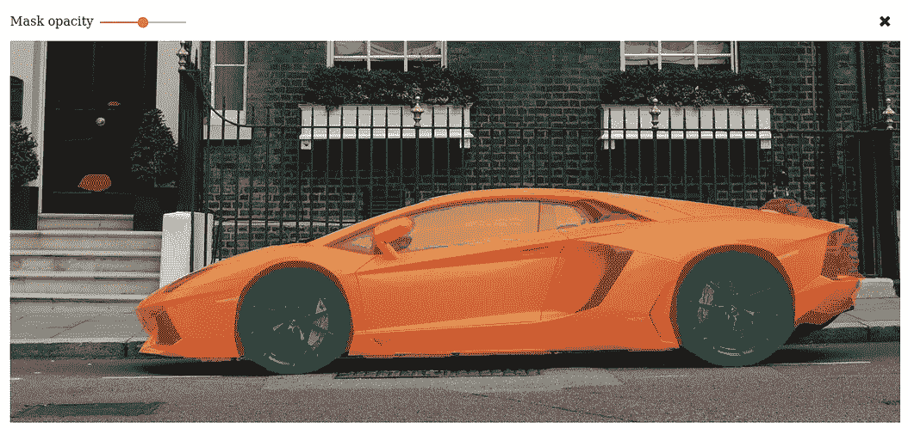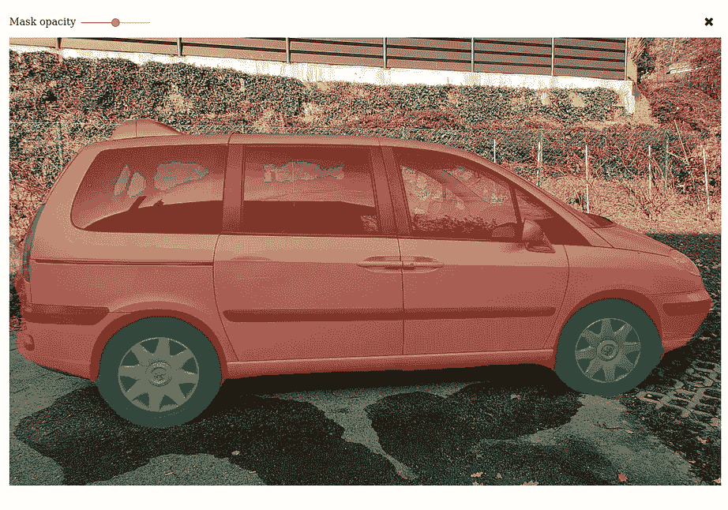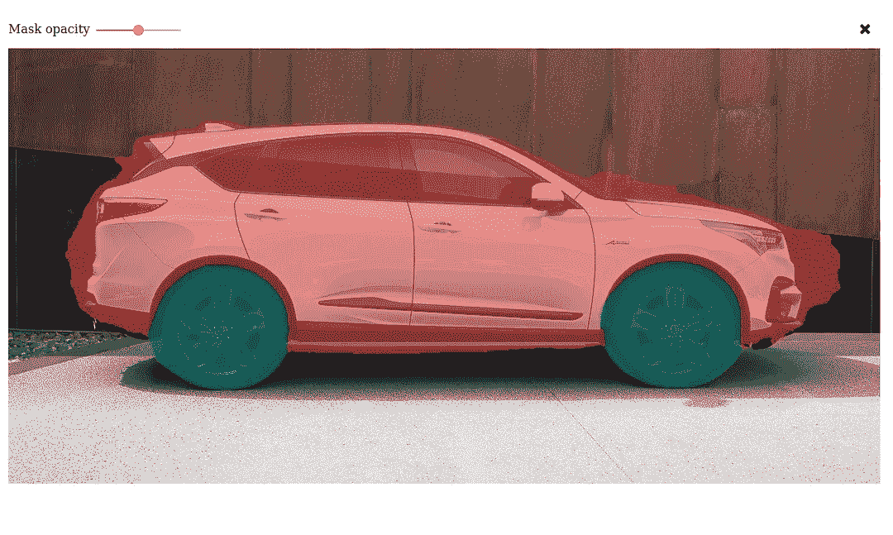

从左上到右下，经过 14、6、4 和 2 个时期。除封面使用的图片外，其他图片均为本人拍摄，来自 [Gabor Papp](https://unsplash.com/photos/k688MQzA3LI) 取自 unsplash。

右下角显示，它已经开始了解汽车的两个主要部件之间的区别:车身和车轮。左下角显示了围绕实际汽车进行分段时的良好改进。右上角显示，它也开始正确猜测窗口的位置。左上角显示了它变得有多精确，也开始检测背光。不过，它的前灯还是有问题。如果这是你真正想要检测的，它可能需要更多的历元，因为它比其他物体小。Intelec AI 让您轻松训练额外的 epochs:只需再次按下“开始”按钮。

## 做出推论

我很好奇，想看看模型是否过度拟合，所以决定尝试分割我自己的车！我在 Intelec AI 软件中部署了我的模型，给我漂亮的菲亚特 Seicento sport 拍了张照片，然后上传到“部署的模型”标签中。下面是结果！

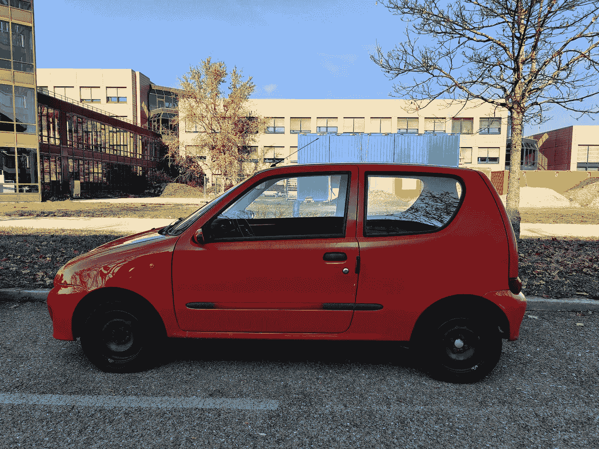

我的菲亚特 Seicento 的原图，我自己拍的

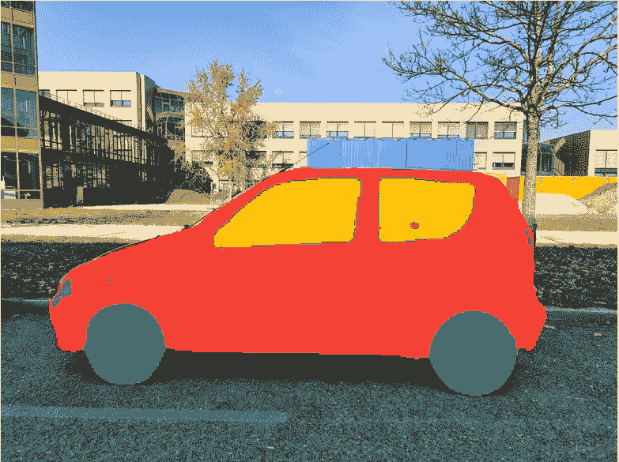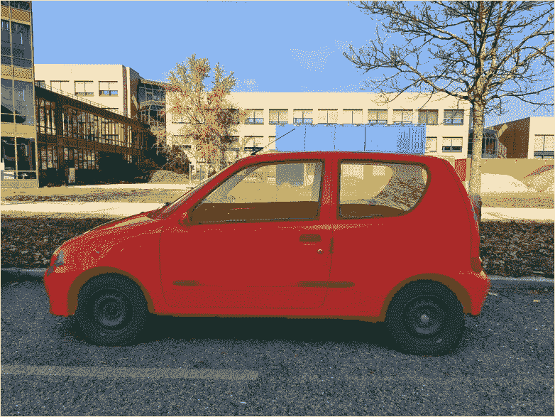

结果:左边完全不透明，右边半不透明

老实说，我真的没想到这个模特能做这么棒的工作！现在，很容易使用你想在自己的车上试用的车轮的精灵，因为它的位置是由模型以非常好的精确度自动检测的。

正如你现在所看到的，现在进行深度学习不再困难:你不需要高超的编码技能，也不需要对所有数学和神经网络的微妙之处有深刻的理解。