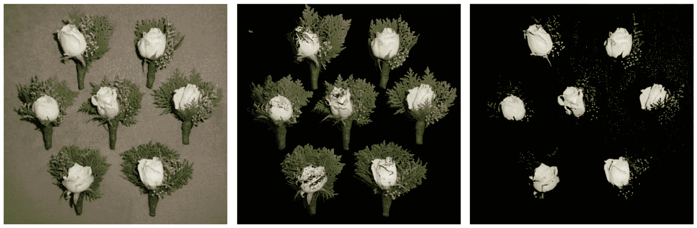
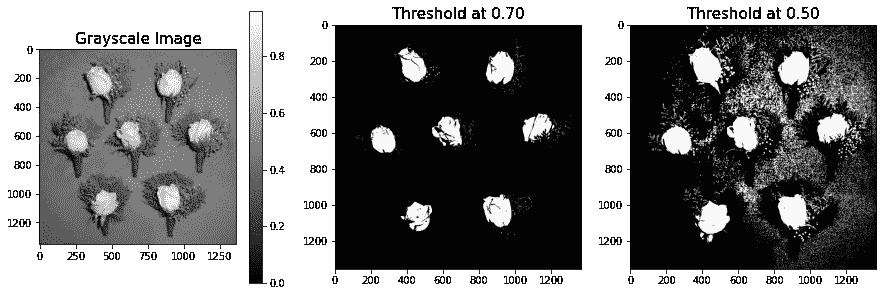
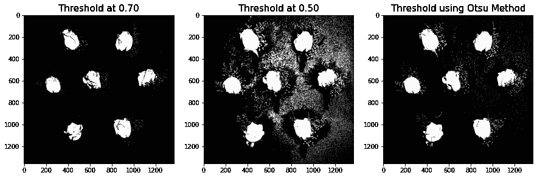
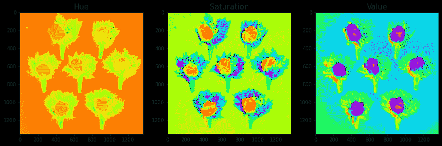
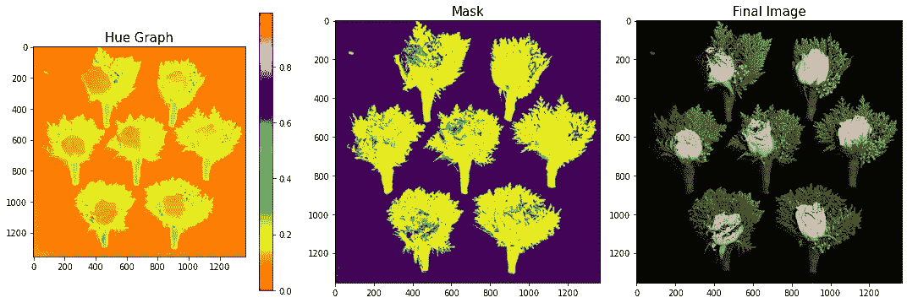

# 图像分割(第一部分)

> 原文：<https://towardsdatascience.com/image-segmentation-part-1-6e0ddb5f7f8a?source=collection_archive---------13----------------------->

## 阈值、Otsu 和 HSV 分割



(图片由作者提供)

图像处理对数据科学最重要的贡献之一是能够使用处理技术对图像进行不同的分割。所谓分割，我们是指从背景中分割出不同的对象。通常，如果我们有一个原始图像，并且我们想要创建图像中的对象的数据集，我们会想要首先隔离这些对象。但是我们怎么做呢？

我们使用不同的图像分割技术来分离这些不同的对象。

有许多常用的分段技术，但是对于本文的第 1 部分，我们将强调并讨论以下内容:

1.  试错阈值
2.  大津法
3.  HSV 空间分割

让我们加载一个示例图像:


图 1:样本图像(作者提供的图像)

我们的示例图像是一组简单的棕色背景上的小花。我们在这篇文章中的挑战是能够从背景中分割出每一朵花。我们将尝试使用提及图像分割，看看我们是否最终获胜。

## 试错阈值

图像处理中的反复试验一直是常态，尤其是在处理新图像时。这与阈值方法的方式相同。我们试图确定最佳值，我们可以阈值的图像和削弱我们想要的对象。

通常在阈值处理中，我们尝试不同的阈值，比较和对比哪个结果更好。下面的例子说明了我们如何做到这一点:

```
#experimented threshold values
sample_t = sample_g>0.70
sample_t1 = sample_g>0.50fig, ax = plt.subplots(1,3,figsize=(15,5))
im = ax[0].imshow(sample_g,cmap='gray')
fig.colorbar(im,ax=ax[0])
ax[1].imshow(sample_t,cmap='gray')
ax[0].set_title('Grayscale Image',fontsize=15)
ax[1].set_title('Threshold at 0.70',fontsize=15)ax[2].imshow(sample_t1,cmap='gray')
ax[2].set_title('Threshold at 0.50',fontsize=15)
plt.show()
```



图 2:使用阈值分割(图片由作者提供)

我们可以在图中看到，两个不同的阈值分别为 0.7 和 0.6。请注意，这些阈值彼此非常接近，但是使用每个阈值的结果都很明显。在值为 0.70 时，我们可以清楚地分割白花，而在值为 0.50 时，我们确实分割了白花，但被该范围内的其他像素值连接。如果我们只想分割白花，那么最佳阈值大约是 0.7。

找到最佳阈值的一个方法是查看灰度图旁边的颜色条，从这里我们可以选择我们可以设置的范围来提取我们需要的对象。

## 大津法

下一个技术叫做 Otsu 法，实际上与试错法几乎相同，但这次是自动化的。这种方法是由大津信行开发的。otsu 方法背后的思想是，该方法检查像素值，并通过最小化直方图上的方差来找到可以将两个类一分为二的最佳平衡点。

已经有一个预定义的 scikit-function，可以调用它以方便使用。

```
from skimage.filters import threshold_otsuthresh = threshold_otsu(sample_g)
sample_ot  = sample_g > thresh
```



图 3:使用 Otsu 方法的分割(图片由作者提供)

从图 3 中，我们可以看到使用 Otsu 方法和使用试错阈值之间的区别。请注意，与 0.7 阈值图相比，otsu 的结果具有更明确的斑点对象，这意味着它能够分割并看到整个白花。

## HSV 颜色分割

请注意，从上面的两种分割技术中，很容易区分亮暗像素值，因为我们处理的是灰度图像维度。在 RGB 颜色通道维度方面，我们使用 HSV 或色调、饱和度和值空间来正确分割花朵。

让我们首先展示样本图像在 HSV 值中的样子。

```
from skimage.color import rgb2hsv
#convert to hsv scale
sample_h= rgb2hsv(sample)#graph per HSV Channel
fig, ax = plt.subplots(1, 3, figsize=(15,5))
ax[0].imshow(sample_h[:,:,0], cmap='hsv')
ax[0].set_title('Hue',fontsize=15)
ax[1].imshow(sample_h[:,:,1], cmap='hsv')
ax[1].set_title('Saturation',fontsize=15)
ax[2].imshow(sample_h[:,:,2], cmap='hsv')
ax[2].set_title('Value',fontsize=15);
plt.show()
```



图 4:样本图像 HSV 空间(图片由作者提供)

该图示出了 HSV 颜色空间的不同通道，并且注意，从这个不同的通道中，我们可以识别所需的分割对象。从数值图中，我们可以看到白色花朵的亮度与背景不同。

与前两种技术相比，使用 HSV 颜色空间，我们实际上可以更恰当地分割花朵。示例代码如下:

```
fig, ax = plt.subplots(1,3,figsize=(15,5))
im = ax[0].imshow(sample_h[:,:,0],cmap='hsv')
fig.colorbar(im,ax=ax[0])
ax[0].set_title('Hue Graph',fontsize=15)#set the lower and upper mask based on hue colorbar value of the desired fruit
lower_mask = sample_h[:,:,0] > 0.11
upper_mask = sample_h[:,:,0] < 0.3
mask = upper_mask*lower_mask# get the desired mask and show in original image
red = sample[:,:,0]*mask
green = sample[:,:,1]*mask
blue = sample[:,:,2]*mask
mask2 = np.dstack((red,green,blue))
ax[1].imshow(mask)
ax[2].imshow(mask2)ax[1].set_title('Mask',fontsize=15)
ax[2].set_title('Final Image',fontsize=15)
plt.tight_layout()
plt.show()
```



(图片由作者提供)

从我们的代码中，注意我们首先为预期的对象定义了一个 lower 和 upper 掩码。蒙版的值是从色调图一侧的颜色条值得出的。请注意，这朵花有一种与背景完全不同的色调。使用该值，我们已经可以将小花束作为一个整体进行分割。

我们还展示了当我们将蒙版乘以原始图像时得到的最终图像。请注意背景中的花朵是如何定义的。我们能够把它们每一个都分割开来！

# 摘要

从结果中，我们可以看到，通过使用试错阈值法以及使用 otsu 方法，我们成功地从图像中分割出了白花。与其他两种技术相比，通过使用 HSV 颜色通道，我们能够更精确地分割花束。总之，需要注意的是，这些技术有不同的优缺点，可以根据您的需要同时使用。

请继续关注第 2 部分！