# 图像分割:第一部分

> 原文：<https://towardsdatascience.com/image-segmentation-part-1-9f3db1ac1c50?source=collection_archive---------0----------------------->

## 各种图像分割技术的数学和实际实现

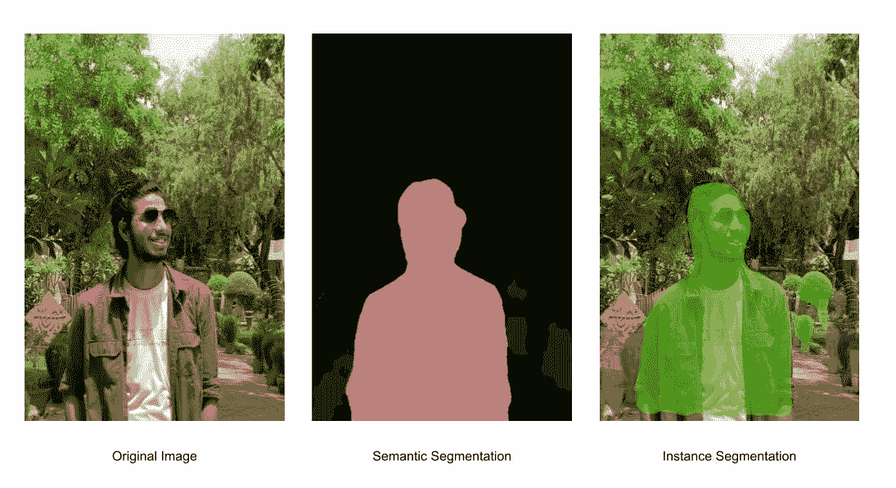

(图片由作者提供)

# 图象分割法

图像分割是一种将数字图像分解成称为图像片段的各种子组的方法，这有助于降低图像的复杂性，从而使图像的进一步处理或分析更简单。简单来说，分段就是给像素分配标签。属于同一类别的所有图像元素或像素具有分配给它们的公共标签。例如:让我们考虑一个问题，其中必须提供图片作为对象检测的输入。检测器可以输入由分割算法选择的区域，而不是处理整个图像。这将防止检测器处理整个图像，从而减少推断时间。

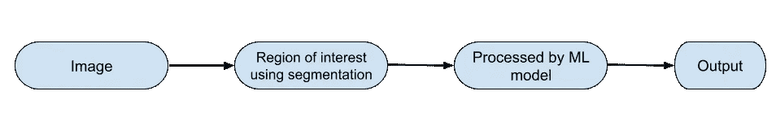

(图片由作者提供)

# **图像分割方法**

1.  **相似性方法:**这种方法基于检测图像像素之间的相似性，以基于阈值形成片段。像聚类这样的 ML 算法就是基于这种方法来分割图像的。
2.  **不连续性方法:**这种方法依赖于图像像素亮度值的不连续性。线、点和边缘检测技术使用这种类型的方法来获得中间分割结果，这些结果可以在以后被处理以获得最终的分割图像。

# **图像分割技术**

1.  基于阈值的分割
2.  基于边缘的分割
3.  基于区域的分割
4.  基于聚类的分割
5.  基于人工神经网络的分割

在本文中，我们将涵盖基于阈值和基于边缘的分割。其他分割技术将在后面的部分讨论。

# **基于阈值的分割**

图像阈值分割是图像分割的一种简单形式。这是一种基于对原始图像的像素强度设置阈值来创建二值或多色图像的方法。

在这个阈值处理过程中，我们将考虑图像中所有像素的强度直方图。然后，我们将设置一个阈值，将图像分成多个部分。例如，考虑到图像像素范围从 0 到 255，我们设置阈值为 60。因此，所有值小于或等于 60 的像素将被提供值 0(黑色)，所有值大于 60 的像素将被提供值 255(白色)。

考虑具有背景和对象的图像，我们可以基于对象和背景的强度将图像划分成区域。但是这个阈值必须被完美地设置，以将图像分割成对象和背景。

各种阈值技术有:

1.  全局阈值:在这种方法中，我们使用双模态图像。双峰图像是在强度分布图中具有两个强度峰值的图像。一个用于物体，一个用于背景。然后，我们推导出整个图像的阈值，并将该全局阈值用于整个图像。这种阈值的一个缺点是，在图像中光照不足的情况下，它的性能很差。
2.  手动阈值处理:下面的过程如下

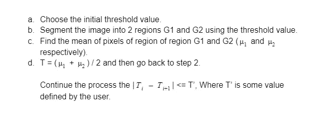

(图片由作者提供)

3.自适应阈值处理:为了克服光照的影响，图像被分成不同的子区域，所有这些区域都使用为所有这些区域计算的阈值进行分割。然后这些子区域被组合以成像完整的分割图像。这有助于在一定程度上减少照明的影响。

4.最佳阈值处理:最佳阈值处理技术可用于最小化由分割执行的像素的错误分类。

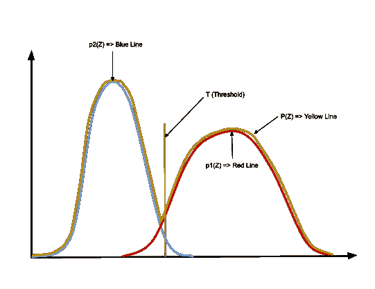

(图片由作者提供)

**通过最小化像素的误分类损失，使用迭代方法计算最佳阈值。**

像素值的概率由以下公式给出:

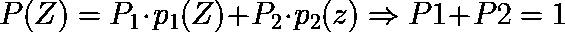

(图片由作者提供)

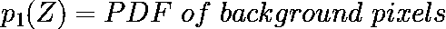

(图片由作者提供)

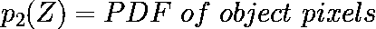

(图片由作者提供)

我们考虑阈值 T 作为初始阈值。如果待确定像素的像素值小于或等于 T，则它属于背景，否则它属于物体。

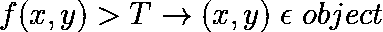

(图片由作者提供)

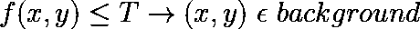

(图片由作者提供)

E1:错误，如果一个背景像素被误分类为一个对象像素。

E2:如果对象像素被错误分类为背景像素，则出现错误。

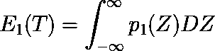

(图片由作者提供)

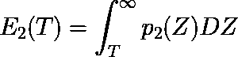

(图片由作者提供)

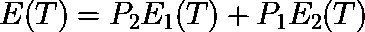

(图片由作者提供)

E(T):将像素分类为背景或对象的总误差。为了获得更好的分割，我们必须最小化这个误差。我们通过对下面的方程求导并使其等于零来达到这个目的。

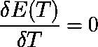

(图片由作者提供)

考虑高斯像素密度，P(Z)的值可以计算为:

(图片由作者提供)

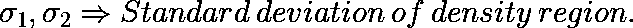

(图片由作者提供)

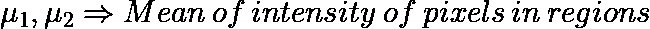

(图片由作者提供)

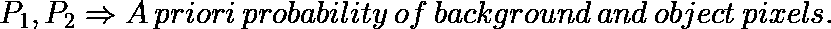

(图片由作者提供)

此后，T 的新值可以通过将其输入以下等式来计算:

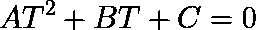

(图片由作者提供)

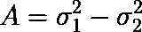

(图片由作者提供)

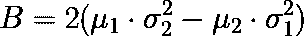

(图片由作者提供)

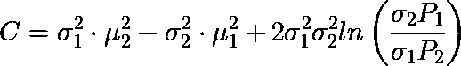

(图片由作者提供)

5.局部自适应阈值处理:由于图像中像素亮度的变化，全局阈值处理可能难以分割图像。然后将图像分成更小的子组，然后对这些单独的组进行自适应阈值处理。在对这些子组进行单独分割之后，将所有这些子组组合起来以形成原始图像的完整分割图像。因此，子组的直方图有助于提供更好的图像分割。

## 基于阈值分割的实际实现

# 基于边缘的分割

基于边缘的分割依赖于使用各种边缘检测算子在图像中找到的边缘。这些边缘标记了灰度、颜色、纹理等不连续的图像位置。当我们从一个区域移动到另一个区域时，灰度级可能会改变。所以如果我们能找到那个不连续点，我们就能找到那个边。各种边缘检测算子是可用的，但是所得图像是中间分割结果，并且不应该与最终分割图像混淆。我们必须对图像进行进一步的处理来分割它。附加步骤包括将获得的边缘片段组合成一个片段，以便减少片段的数量，而不是可能阻碍区域填充过程的小边界的块。这样做是为了获得对象的无缝边界。边缘分割的目标是获得中间分割结果，我们可以应用基于区域或任何其他类型的分割来获得最终的分割图像。

**边缘的类型**

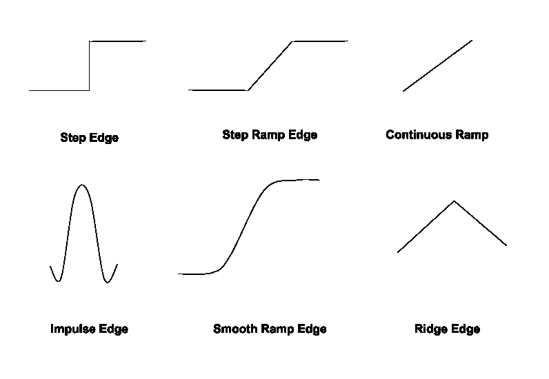

(图片由作者提供)

边缘通常与“大小”和“方向”联系在一起。一些边缘检测器既给出方向又给出幅度。我们可以使用各种边缘检测器，如 Sobel 边缘算子、canny 边缘检测器、Kirsch 边缘算子、Prewitt 边缘算子、Robert 边缘算子等。

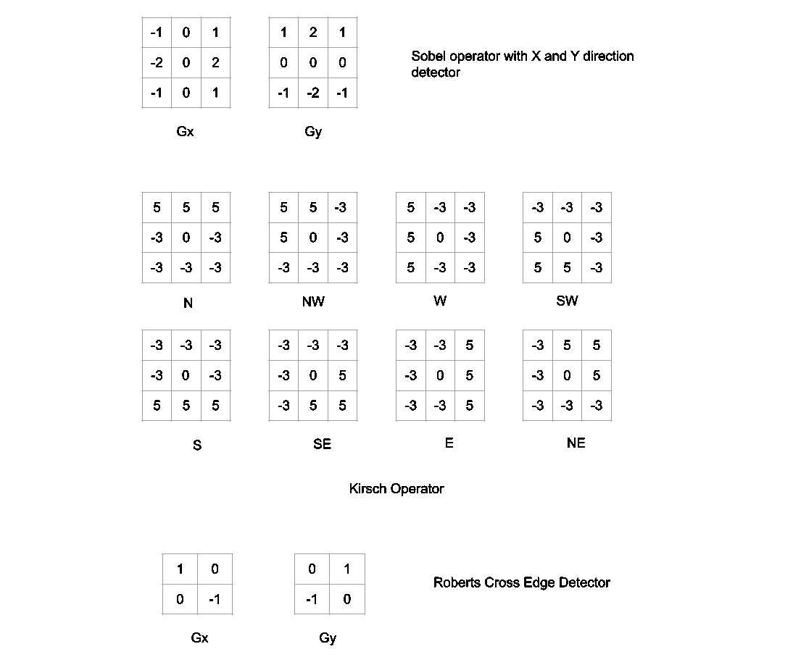

(图片由作者提供)

三个公式中的任何一个都可以用来计算 g 的值。在计算 g 和θ之后，我们获得了具有幅度和方向的边缘向量。

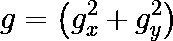

(图片由作者提供)

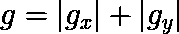

(图片由作者提供)

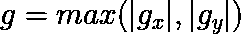

(图片由作者提供)

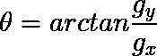

(图片由作者提供)

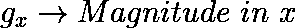

(图片由作者提供)

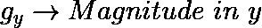

(图片由作者提供)

## 基于边缘分割的实际实现

# 参考

1.  基于区域的分割操作。阈值技术，【https://www.youtube.com/watch?v=4S7BezwSAmQ 
2.  基于边缘的分割，【https://www.youtube.com/watch?v=ygVCjURa7ZE 
3.  大学资源，[https://www . CSE . unr . edu/~ bebis/cs 791 e/Notes/thresholding . pdf](https://www.cse.unr.edu/~bebis/CS791E/Notes/Thresholding.pdf)

我希望这篇文章和解释对你有用。请继续关注后续部分中的其他分段技术。

请随时联系并给出您的建议:[https://www.linkedin.com/in/mrinal-tyagi-02a1351b1/](https://www.linkedin.com/in/mrinal-tyagi-02a1351b1/)

[https://github.com/MrinalTyagi](https://github.com/MrinalTyagi)