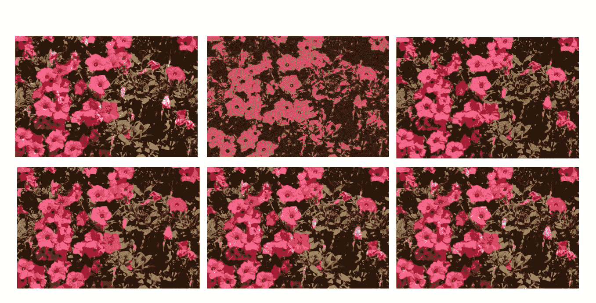
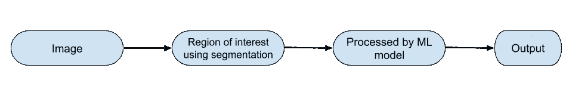
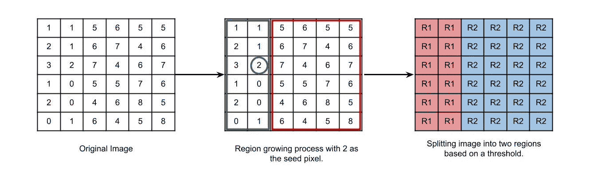
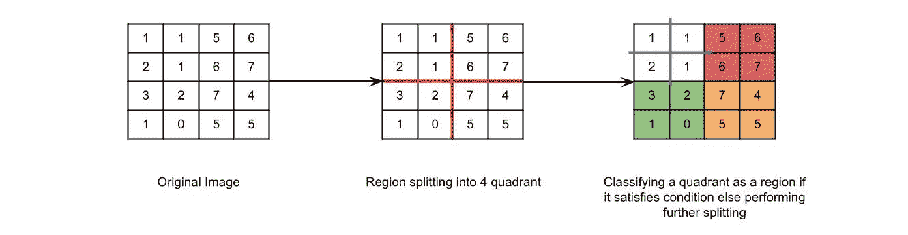
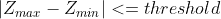
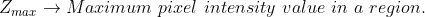
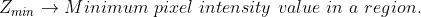
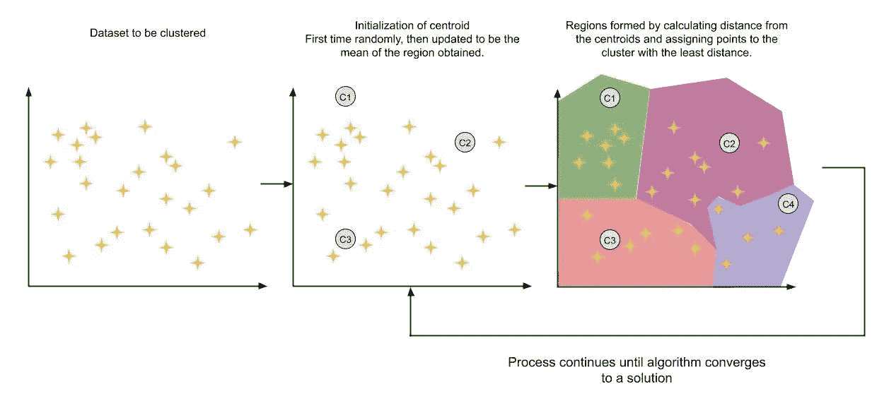
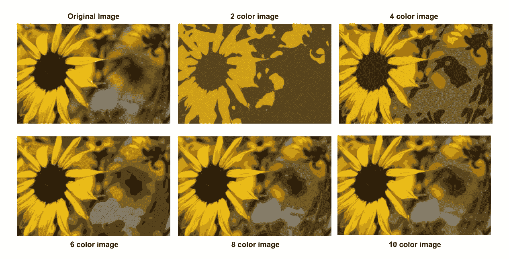

# 图像分割:第二部分

> 原文：<https://towardsdatascience.com/image-segmentation-part-2-8959b609d268?source=collection_archive---------4----------------------->

## 深入研究各种图像分割技术

(图片由作者提供)

# **什么是图像分割？**

图像分割是一种技术，其中将计算机化的图片分成称为片段的不同子组，这些子组有助于降低图片的复杂性，从而降低图片的进一步处理或研究的难度。简单的单词分割就是把名字分配给像素。具有相似类别位置的所有图像成分或像素都具有分配给它们的典型标记。图像分割可以作为应用机器学习算法之前的预处理步骤，以便降低机器学习算法处理图像所需的时间复杂度。例如:上面给出的花的图像是使用聚类的图像分割的例子，其中图像的颜色被分割。然后，该图像可以由任何机器学习算法通过仅提供感兴趣区域来处理，从而降低算法的时间复杂度。

(图片由作者提供)

# 图像分割技术

1.  基于阈值的分割
2.  基于边缘的分割
3.  基于区域的分割
4.  基于聚类的分割
5.  基于人工神经网络的分割

在本文中，我们将讨论基于区域和基于聚类的分割。其他分割技术将在后面的部分讨论。

# 基于区域的分割

一个区域可以被分类为表现出相似属性的一组相连的像素。像素之间的相似性可以在强度、颜色等方面。在这种类型的分割中，存在一些预定义的规则，像素必须遵守这些规则才能被分类到相似的像素区域中。在噪声图像的情况下，基于区域的分割方法优于基于边缘的分割方法。基于区域的技术根据它们遵循的方法进一步分为两种类型。

1.  区域生长法
2.  区域分割和合并方法

# 区域生长技术

在区域生长方法的情况下，我们从某个像素作为种子像素开始，然后检查相邻的像素。如果相邻像素遵守预定义的规则，则该像素被添加到种子像素的区域，并且后续过程继续，直到没有相似性。这种方法遵循自底向上的方法。在区域增长的情况下，优选的规则可以被设置为阈值。例如:考虑给定图像中的种子像素 2 和阈值 3，如果像素具有大于 3 的值，则它将被认为在种子像素区域内。否则会考虑换个地区。因此，基于阈值 3，在下面的图像中形成了 2 个区域。

(图片由作者提供)区域增长工作流

# 区域分裂和合并技术

在区域分割中，首先将整个图像作为单个区域。如果该区域不遵循预定义的规则，则将其进一步划分为多个区域(通常为 4 个象限)，然后对这些区域执行预定义的规则，以便决定是进一步细分还是将其分类为一个区域。接下来的过程继续，直到不再需要区域的进一步划分，即每个区域都遵循预定义的规则。在区域合并技术中，我们把每个像素看作一个独立的区域。我们选择一个区域作为种子区域，根据预定义的规则检查相邻区域是否相似。如果它们是相似的，我们将它们合并成一个单独的区域，然后继续前进，以构建整个图像的分割区域。区域分割和区域合并都是迭代过程。通常，首先对图像进行区域分割，以将图像分割成最大区域，然后将这些区域合并，以形成原始图像的良好分割图像。

在区域分割的情况下，可以检查以下条件以决定是否细分区域。如果一个区域中的最大和最小像素强度之差的绝对值小于或等于用户决定的阈值，则该区域不需要进一步分割。

(图片由作者提供)区域分割和合并工作流

(图片由作者提供)

(图片由作者提供)

(图片由作者提供)

# 基于聚类的分割

聚类是一种无监督的机器学习算法。它被广泛用于图像分割。用于分割的最主要的基于聚类的算法之一是 KMeans 聚类。这种类型的聚类可用于在彩色图像中制作片段。

# k 均值聚类

为了更好的可视化，让我们想象一个二维数据集。首先，在数据集中，质心(由用户选择)首先被随机初始化。然后计算所有点到所有聚类的距离，并将该点分配给具有最小距离的聚类。然后，通过将该聚类的平均值作为质心来重新计算所有聚类的质心。然后，再次将数据点分配给这些聚类。并且该过程继续，直到算法收敛到好的解。通常，该算法只需要很少的迭代次数就可以收敛到一个解，并且不会反弹。

(图片由作者提供)KMeans 聚类工作流

(图片由作者提供)对颜色类似于 KMeans 算法中输入的聚类数的图像执行聚类。

# 参考

1.  印地语中基于区域的图像分割|数字图像处理，[https://www.youtube.com/watch?v=mPJTOcEJOhY](https://www.youtube.com/watch?v=mPJTOcEJOhY)
2.  使用 Scikit-Learn、Keras 和 TensorFlow 进行机器实践学习:构建智能系统的概念、工具和技术

我希望这篇文章和解释对你有用。请继续关注后续部分中的其他分段技术。

请随时联系并给出您的建议:[https://www.linkedin.com/in/mrinal-tyagi-02a1351b1/](https://www.linkedin.com/in/mrinal-tyagi-02a1351b1/)

https://github.com/MrinalTyagi