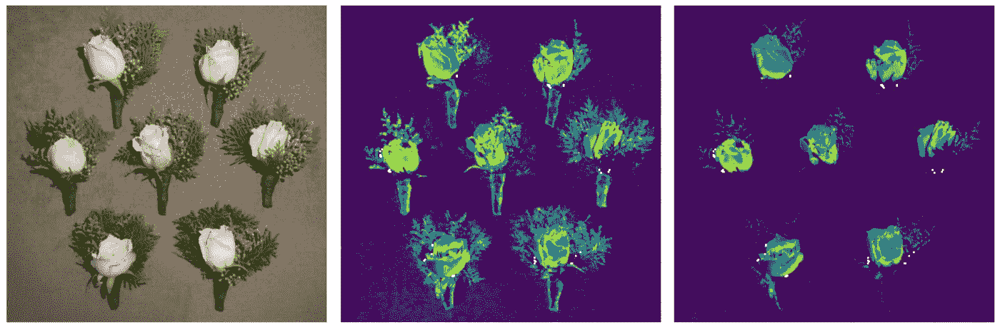
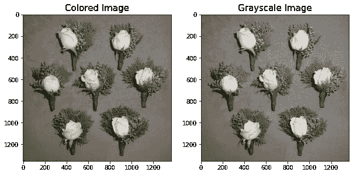
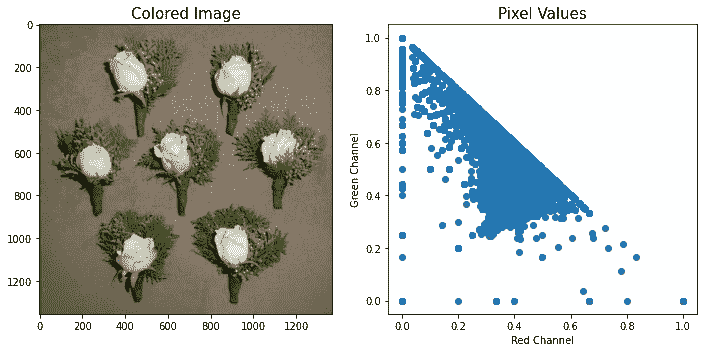
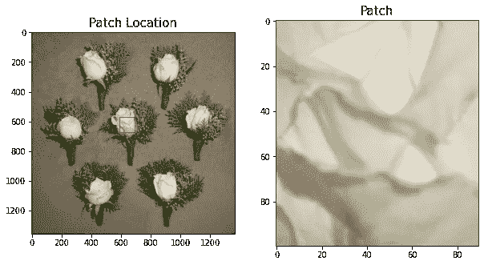
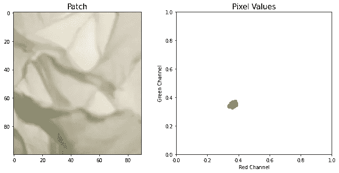
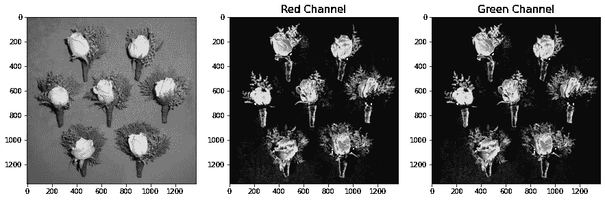
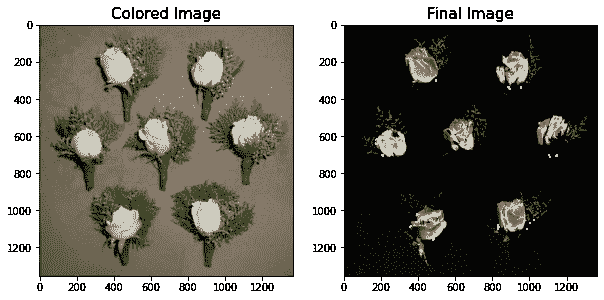

# 图像分割(第二部分)

> 原文：<https://towardsdatascience.com/image-segmentation-part-2-ea377218fb3f?source=collection_archive---------29----------------------->

## RG 色度



(图片由作者提供)

在第 1 部分中，我们讨论了 3 种不同的技术(阈值、Otsu 和 HSV 颜色空间)来分割图像中的不同对象。

这一次，我们将展示一种更明确的方法，使用一种用于复杂图像的更复杂的技术来分割对象。

假设我们的图像中有不同种类的独特颜色，我们如何利用图像处理技术来显示每个像素值的独特性？

最好的方法是使用**色度分割。**

在某种意义上，色度分割查看图像内像素值的组合，并将其映射到红色和绿色通道以确定比例。色度分割也可以被称为 RG 色度。

为了更好地展示它是如何工作的，让我们做一些实验:

让我们加载第 1 部分中的旧样本:

```
import numpy as np
from skimage.io import imshow, imread
from skimage.color import rgb2gray
import matplotlib.pyplot as pltsample = imread('flowers2.png')
sample_g = rgb2gray(sample)fig, ax = plt.subplots(1,2,figsize=(10,5))
ax[0].imshow(sample)
ax[1].imshow(sample_g,cmap='gray')
ax[0].set_title('Colored Image',fontsize=15)
ax[1].set_title('Grayscale Image',fontsize=15)
plt.show()
```



图 1:样本图像(作者提供的图像)

## RG 色度

对于本文，我们仍将尝试从图像中分割出白花。这一次，我们将使用 RG 色度作为图像分割技术。

为了更好地理解图像，我们应该首先检查图像像素值的散点图。显示这一点的代码如下:

```
sample_R = sample[:,:,0]*1.0/sample.sum(axis=2)
sample_G = sample[:,:,1]*1.0/sample.sum(axis=2)fig, ax = plt.subplots(1,2,figsize=(10,5))
ax[0].imshow(sample)
ax[1].scatter(sample_R.flatten(),sample_G.flatten())
ax[0].set_title('Colored Image',fontsize=15)
ax[1].set_title('Pixel Values',fontsize=15)
ax[1].set_xlabel('Red Channel',fontsize=10)
ax[1].set_ylabel('Green Channel',fontsize=10)
plt.tight_layout()
plt.show()
```



图 2:像素值散点图(图片由作者提供)

图 2 显示了以红色通道为 x 轴，绿色通道为 y 轴的散点图。请注意，像素值在高亮度绿色通道像素值上更明显。

为了能够分割白花，我们应该首先在图像中定义一个样本面片。其代码如下:

```
from matplotlib.patches import Rectanglefig, ax = plt.subplots(1,2,figsize=(10,10))
ax[0].imshow(sample)
ax[0].add_patch(Rectangle((590, 570), 100, 100, edgecolor='r', facecolor='none'));
ax[0].set_title('Patch Location',fontsize=15)#Showing Patch
patch = sample[570:670, 590:680]
ax[1].imshow(patch)
ax[1].set_title('Patch',fontsize=15)
plt.show()
```



图 3:补丁分配(图片由作者提供)

请注意，在图 3 中，我们使用了花朵最白的部分，因为我们将只分割与该补丁像素值相同的像素值。为了形象化，我们可以绘制补丁本身的散点图:

```
patch_R = patch[:,:,0]*1.0/patch.sum(axis=2)
patch_G = patch[:,:,1]*1.0/patch.sum(axis=2)
fig, ax = plt.subplots(1,2,figsize=(10,5))ax[0].imshow(patch)
ax[1].scatter(patch_R.flatten(),patch_G.flatten())
ax[0].set_title('Patch',fontsize=15)
ax[1].set_title('Pixel Values',fontsize=15)
ax[1].set_xlabel('Red Channel',fontsize=10)
ax[1].set_ylabel('Green Channel',fontsize=10)
ax[1].set_xlim(0,1)
ax[1].set_ylim(0,1)
plt.tight_layout()
plt.show()
```



图 4:补丁散点图(图片由作者提供)

图 4 显示红色通道和绿色通道的像素值仅位于图的中间。为了分割白花，我们需要这个区域内的所有像素值。

为了分割它，我们将采用标准偏差和补丁初始化的平均值。

```
std_patch_R = np.std(patch_R.flatten())
mean_patch_R = np.mean(patch_R.flatten())std_patch_G = np.std(patch_G.flatten())
mean_patch_G = np.mean(patch_G.flatten())def gaussian(p,mean,std):
    return np.exp(-(p-mean)**2/(2*std**2))*(1/(std*((2*np.pi)**0.5)))
```

在得到平均值和标准偏差后，我们将把原始图像插值到小块上，这样它将遵循该分布。对于本文，我们使用高斯分布作为分布曲线。

```
prob_R = gaussian(sample_R,mean_patch_R,std_patch_R)
prob_G = gaussian(sample_G,mean_patch_G,std_patch_G)fig, ax = plt.subplots(1,3,figsize=(15,10))
ax[0].imshow(sample_g,cmap='gray')
ax[1].imshow(prob_R,cmap='gray')
ax[2].imshow(prob_R,cmap='gray')
ax[1].set_title('Grayscale',fontsize=15)
ax[1].set_title('Red Channel',fontsize=15)
ax[2].set_title('Green Channel',fontsize=15)
plt.show()
```



图 5:红色和绿色通道色度(图片由作者提供)

图 5 显示了获得红色和绿色通道插值的结果，注意，在灰度模式下，我们也能够分割花束。

为了得到白花的特定部分，我们需要将结果相乘。

```
prob = prob_R * prob_Gfig, ax = plt.subplots(1,2,figsize=(10,10))
ax[0].imshow(sample)
ax[1].imshow(prob,cmap='gray')
ax[0].set_title('Colored Image',fontsize=15)
ax[1].set_title('Final Image',fontsize=15)
plt.show()
```



图 6:使用色度的最终图像(图片由作者提供)

图 6 显示了我们使用 RG 色度技术的最终图像。结果表明，RG 色度在分割具有不同颜色空间的对象时实际上更好。

# 摘要

在本文中，我们展示了如何使用红色和绿色通道来分割图像中的对象。我们还能够展示如何使用色度图将像素值从图像背景中分割出来。总之，图像分割非常有助于为未来的数据科学项目创建数据集。

敬请关注更多关于图像处理的文章！