# 基于经典计算机视觉方法的图像分割

> 原文：<https://towardsdatascience.com/image-segmentation-with-classical-computer-vision-based-approaches-80c75d6d995f?source=collection_archive---------7----------------------->

## 经典的基于计算机视觉的图像分割方法，如阈值分割，基于区域，基于边缘检测和形态学分割，将在 1 篇文章中解释，以便快速了解这个领域

图像分割是将数字图像细分成多个片段(对象)的过程。分割的目标是将图像的表示变成更有意义和更容易分析的东西。我们可以组合不同的分割方法，如下所示。

*   经典的基于计算机视觉的方法

1.  阈值处理
2.  基于区域的方法
3.  基于边缘/边界的方法

*   基于人工智能的方法

1.  [基于聚类的方法](/image-segmentation-with-clustering-b4bbc98f2ee6)
2.  神经网络

在这篇文章中，我将回顾经典的基于计算机视觉的方法，你可以阅读我的基于聚类的方法的文章，并关注神经网络的文章！

# 阈值处理

阈值处理是分割图像的最简单的方法，它根据图像像素的亮度值将其分成不同的组。通常，它用于获取二值图像，将图像分割成两部分。主要思想是选择一个阈值 T，将低于该阈值的像素值改为 0 **(背景像素)**，将较高的像素值改为 1 **(前景像素)**。如果要保留图像数据类型，可以选择 0 作为背景像素，选择该数据类型的最大值作为前景像素值。例如，如果您使用 uint8 数据类型图像，您的图像像素可以采用的最大值是 255，因此将 255 分配给前景像素，将 0 分配给背景像素也是一种适用的方法。

**全局阈值** 阈值是在开始时选定的，在处理过程中不能改变。您可以**手动**选择阈值，或者使用 Otsu 阈值法根据图像直方图自动**获得阈值**。

*基本阈值*

手动选择阈值 T。

您可以使用 OpenCV 的阈值函数和 cv2 非常容易地应用基本阈值。THRESH_BINARY 选项。

```
import cv2
import numpy as npimg = cv2.imread("dog.jpg", cv2.IMREAD_GRAYSCALE)
_, segmented1 = cv2.threshold(img, 127,255,cv2.THRESH_BINARY)
print(segmented1)cv2.imshow("Segmented Output Image", segmented1)
cv2.waitKey(0)
```

这里，127 是阈值，255 是分配给前景像素的值。

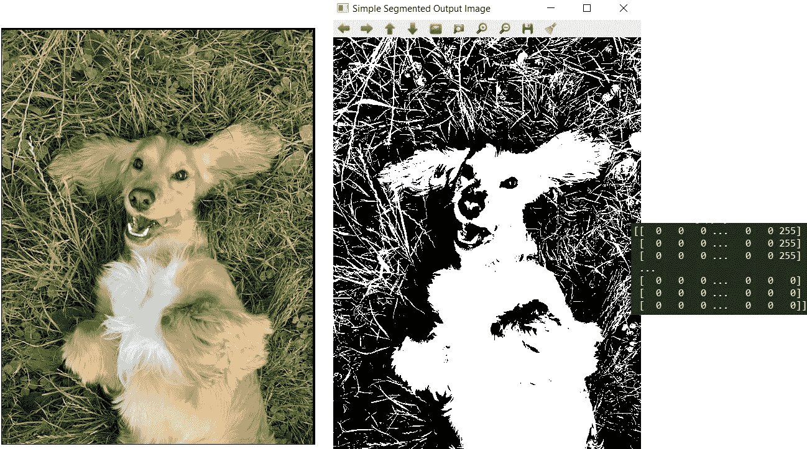

背景像素= 0，前景像素= 255 的基本阈值“作者图像”

OpenCV 的 threshold 函数返回与输入图像具有相同数据类型的分割图像。因此，如果您希望前景像素为 1，背景像素为 0，您将看到如下所示的错误结果:

```
_, segmented1 = cv2.threshold(img, 127,1,cv2.THRESH_BINARY)
print(segmented1)cv2.imshow("Segmented Output Image", segmented1)
cv2.waitKey(0)
```

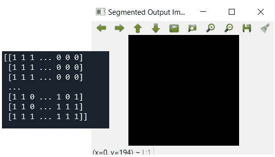

“作者提供的图像”

即使分割是正确的，以至于我们在图像像素中看到了 1 和 0，但是在输出图像中，我们的前景像素(1)在哪里呢？

如果我们想与 OpenCV 的功能更紧密地合作，这是非常重要的一点。正如我所说的，cv2.threshold 函数为我们提供了一个与输入图像具有相同数据类型的分割图像。由于我们的“dog.jpg”图像来自 uint8 数据类型，因此像素范围在 0 和 255 之间，当我们的输出图像在 0 和 255 范围内只有 0 和 1 时，0 和 1 都对应于黑色像素！为了做到这一点，我们需要将输出图像数据类型改为 float32:

```
_, segmented2 = cv2.threshold(img, 127,1,cv2.THRESH_BINARY)
segmented2 = segmented2.astype(dtype='f')
print(segmented2)cv2.imshow("Segmented Output Image", segmented1)
cv2.waitKey(0)
```

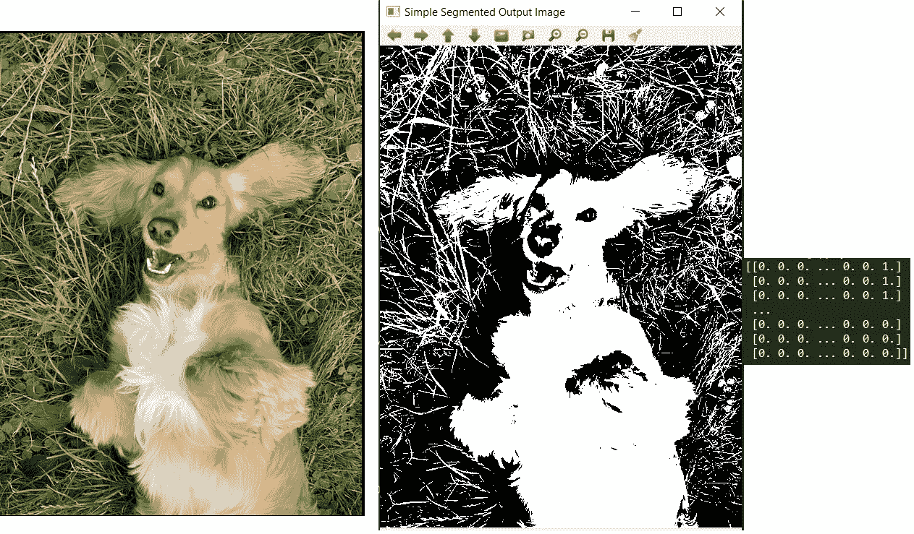

背景像素= 0，前景像素= 1 的基本阈值“作者图像”

这里又是正确的输出！

注意，具有 0 或 1 值和 0 或 255 值的两个图像都是**二进制**，因为它们只有两种类型的像素值。

*大津阈值法*

这是一种自动阈值决定方法，试图**最小化**下面的等式以获得最佳的 t

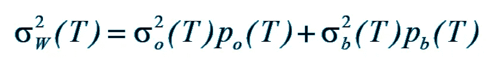

Po:前景像素根据阈值 T 的概率
Pb:背景像素根据阈值 T 的概率

σ o:前景像素的方差
σ b:背景像素的方差

您可以使用 OpenCV 的阈值函数和 cv2 非常容易地应用 Otsu 阈值。OTSU 选项。这一次，我们可以使用函数的第一个返回值来查看选择的阈值是什么。THRESH_BINARY 中不存在这个选项，因为是我们已经给出了阈值。😉

```
thresh, segmented2 = cv2.threshold(img, 127,1,cv2.THRESH_OTSU)
segmented2 = segmented2.astype(dtype='f')
print(thresh)
print(segmented2)cv2.imshow("Segmented Output Image", segmented2)
cv2.waitKey(0) 
cv2.destroyAllWindows()
```

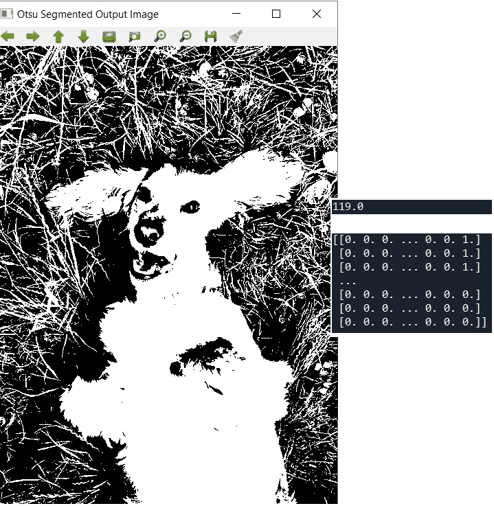

Otsu 阈值，我们看到 Otsu 给我们 119 作为阈值“作者的图像”

**局部阈值处理**

在局部阈值处理中，对于给定大小的区域，不是全局地而是局部地选择阈值。为此，我们取停留在该区域的像素的平均值，从该平均值中减去一个常数值 C，就得到我们的阈值！

局部阈值化背后的思想是图像可以在不同的区域暴露于不同的光。用于整个图像的通用阈值可能不适用于这种例外区域。因此，全局阈值化对于这种图像来说不是最好的方法，对于不同的光线条件选择不同的阈值会给我们带来更好的结果。

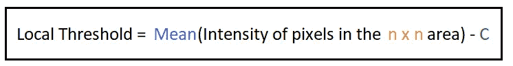

在这个问题中，我们需要决定 **n、** **C、**和**平均值的计算方法。**对于局部阈值处理，有两种不同的常用方法来计算平均值。您可以选择**标准平均值计算**，将所有像素强度相加，然后除以该区域中的像素数量，或者您可以使用**高斯平均值**(或加权平均值)，其中距离区域中心最近的像素的强度贡献更大——为计算加权。

选择 n 是另一个问题:太大的 n 可能导致与全局阈值处理类似的输出，因为它没有将图像分割成足够小的区域，而太小的 n 可能导致该区域不包含像素多样性。

我们可以使用 OpenCV cv2 应用自适应阈值。自适应阈值函数很容易:

```
segmented4 = cv2.adaptiveThreshold(img,255,cv2.ADAPTIVE_THRESH_MEAN_C, cv2.THRESH_BINARY,15,2)
print(segmented4)cv2.imshow("Segmented Output Image", segmented4)
cv2.waitKey(0)segmented5 = cv2.adaptiveThreshold(img,255,cv2.ADAPTIVE_THRESH_GAUSSIAN_C, cv2.THRESH_BINARY,15,2)
print(segmented5)cv2.imshow("Segmented Output Image", segmented5)
cv2.waitKey(0)
```

**255** 是前景像素的值， **ADAPTIVE_THRESH_MEAN_C** 是选择局部阈值计算的标准均值方法，**ADAPTIVE _ THRESH _ GAUSSIAN _ C**是高斯均值。**看到我们还在用 cv2。THRESH_BINARY** ！这意味着，在局部选择我们的阈值之后，我们应用简单的阈值方法来决定一个像素是前景像素还是背景像素。 **15** 是区域 n 的大小，所以我们对于每个局部区域有一个 15×15 的窗口，2 是常量值 c。

在这种情况下，不同参数的一些输出结果如下所示:

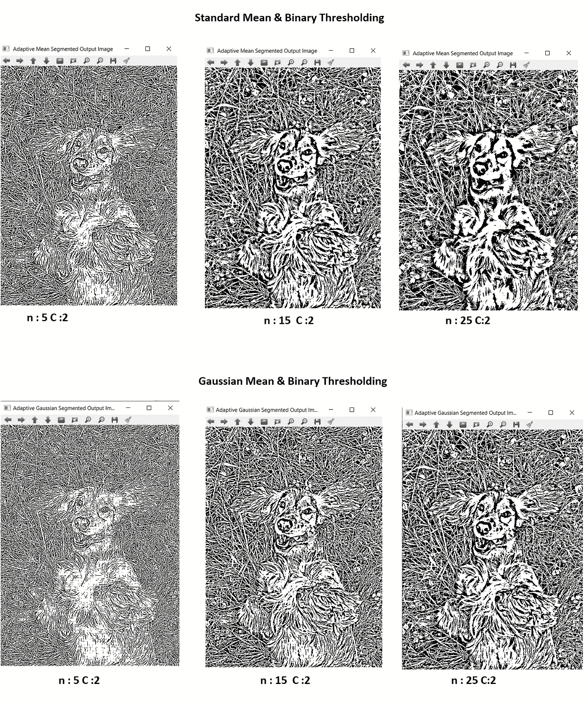

“作者提供的图像”

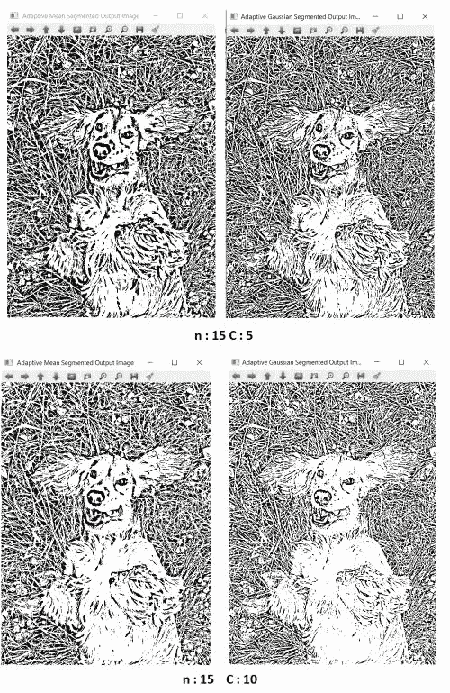

“作者提供的图像”

由于随着**增加 C** ，**阈值减少**，我们在输出中看到**更多的前景像素**。

可能不太清楚自适应阈值在这里做什么，因为来自全局阈值的结果也被很好地分割。现在，让我们来看一些在不同区域有光线差异或标记了不同颜色的图像:

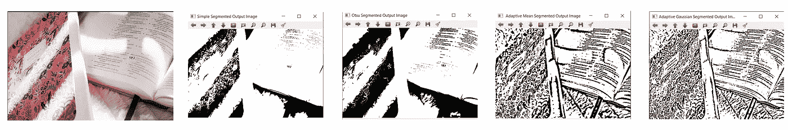

“作者提供的图像”

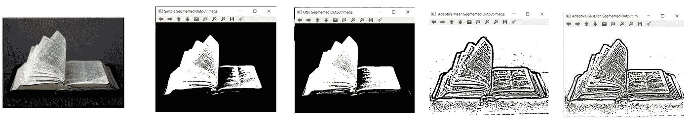

“作者提供的图像”

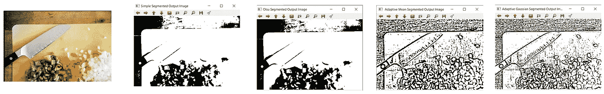

“作者提供的图像”

现在我们可以看到，对于这些图像，局部阈值处理要比全局阈值处理好得多。以书籍为例，自适应阈值处理的输出初看起来可能更嘈杂、更复杂，但如果你仔细观察，你会发现，在全局阈值处理中有一些部分丢失了，这是我们在课堂上再也看不到的，而自适应阈值处理则不是这样。

最终，选择哪种阈值方法取决于您和您的图像类型！

以上就是图像分割与阈值分割，相关代码可以在我的 [**GitHub**](https://github.com/YCAyca/Image-Segmentation/tree/main/Thresholding) 链接中找到，现在让我们继续下一个话题✋

# 基于区域的图像分割

在本帖中，我们将回顾基于“区域”方法的图像分割方法，其中使用了像素之间的邻域和连接关系。如果你对**邻域**、**连接**、**连通分量**术语没有任何概念，可以 [**点击**](https://yagmurcigdemaktas.medium.com/neighborhood-connections-and-connected-components-cedf922dd383) 看我的简短帖子。

**区域生长**

一种基于区域的方法是区域生长，我们选择**种子**点，让种子按照符合一组规则的像素生长。有一套不同的规则来决定增长的过程和停止的条件，这里我们将研究两种不同的方法。

第一种方法:

1.  从那个种子像素开始，我们查看种子的**4-连接**或**8-连接**像素。4 还是 8，看你的选择。
2.  在那些有可能被添加到该区域中的像素中，选择与该区域的平均强度具有最小距离 **的像素**。如果该距离低于确定的“**相似性阈值**，则我们最终将该像素添加到该区域中。****
3.  当一个新的像素被添加到该区域时，现在它就是我们的**新种子，** so 1。第二。将对该种子点**重复这些步骤，直到**在种子的邻域中不存在任何符合这些规则的可能像素(因此它不能再增长)或者图像中的所有像素已经被分类。

我不认为 OpenCV 有一个内置的区域增长算法函数，但是我准备了一个实现来按照我上面解释的规则做一些实验。首先，在尝试真实图像之前，让我们来看看 2D 阵列的一些结果，以便更好地了解发生了什么:

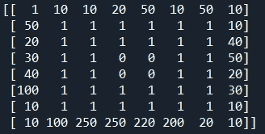

表示要分割的图像的初始 8x8 数组。我们将用两个种子来分割它，第一个在[1，1]位置，第二个在[7，7]。阈值是 25，我们使用 4-连接“作者的图像”

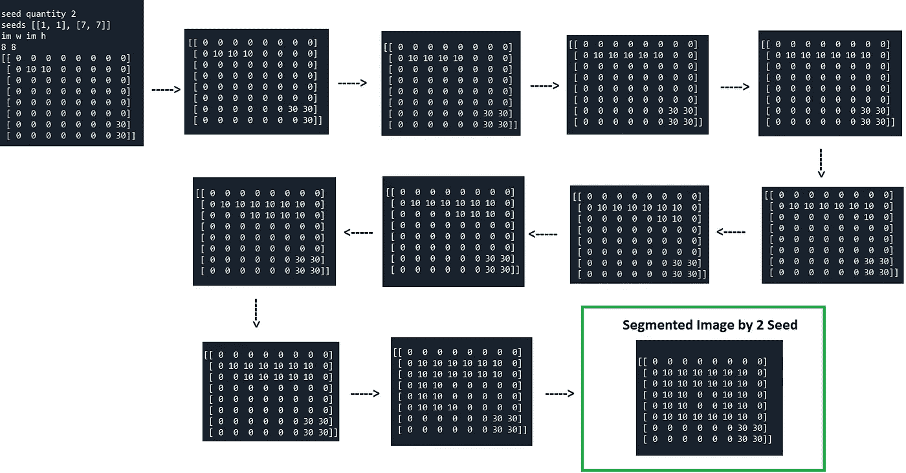

“作者提供的图像”

因此，对于分割的图像，我们从与我们的输入大小相同的空图像开始，我们看到该区域如何增长，同时为每个种子区域分配一个唯一标签，其中 10 是[1，1]种子的标签，30 是[7，7]种子的标签。

您也可以跟踪种子像素，但在此之前，我建议您注释掉分段输出以获得更好的效果。

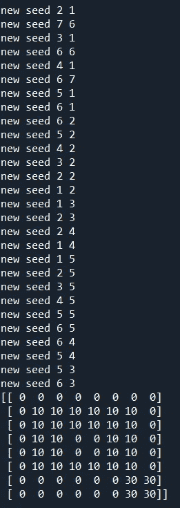

“作者提供的图像”

现在让我们用这种方法来看一个真实的图像示例:

在左侧，我们看到输入图像，我想分割中心的圆，所以我在该区域选择一些种子点，如[[245，245]，[240，195]，[300，245]，[230，300]]。这是以 8-连通性和 10 作为阈值的结果。请注意，分割的图像是一个到处都是 255 的空白图像(对于 2D 实验来说，这是 0，以使它的噪声更少)，因此黑线是我们分割的唯一部分。

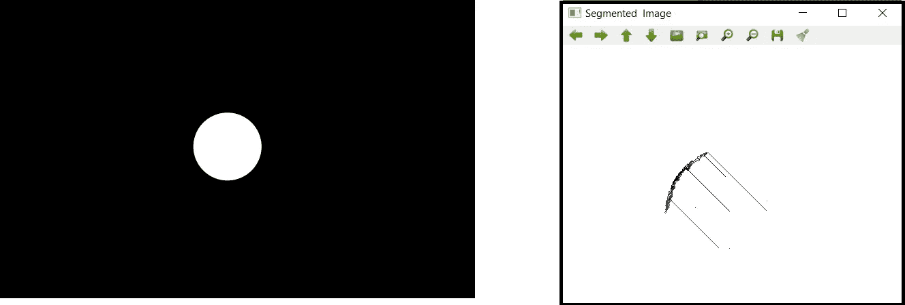

"自动生成的图像"

这不是一个好的输出，对不对？

因为即使图像非常容易分割，当种子到达对象(这里是圆)的边界时只有 0 和 255 个值，但是种子很可能不能走得更远，因为它的相邻像素都是 0，且其他相邻像素已经被分类。让我们思考一下如何改进这种方法:

*   我们可以添加与该区域兼容的种子的所有邻居，而不是最小距离的邻居。
*   当种子停止生长时，我们可以在该区域中搜索另一个具有兼容性条件的像素，而不是直接搜索该种子的邻居。

让我们用实现的第二个版本来检查结果:

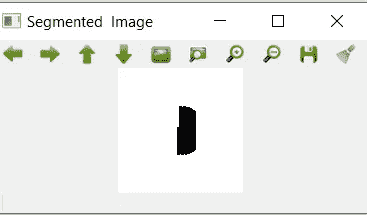

"自动生成的图像"

这个远比第一个输出好，对吗？

您可以尝试这两种实现，并通过点击我的 [**Github**](https://github.com/YCAyca/Image-Segmentation/tree/main/Region_Growing) 链接，用**多种子**选项做自己的实验。

请注意，种子点的选择非常重要，因为它们是起点。例如，它可以是您想要分割的对象的中心。种子点选择甚至可以自动完成，此时您需要计算图像的直方图并返回 n 个**峰值**点。然后选择 1 个具有该峰值点值的像素作为每个峰值点的种子。

**峰值点**:如果您有一个 0–255 范围内的灰度图像，并且您看到直方图峰值(占大多数)在 200、100 和 10 处，您可以选择 3 个具有 200、100 和 10 强度值的种子点。最后，你将有 3 个分割区域。

此外，这是一个非常好的区域增长算法的可视化，其中该方法应用于 RGB 图像。[https://www.youtube.com/watch?v=VaR21S8ewCQ](https://www.youtube.com/watch?v=VaR21S8ewCQ)

**！！！**注意，在 RGB 图像中，由于我们有 3 个通道，而不是像在灰色图像中那样有 1 个通道，所以要添加到区域中的条件从最接近区域平均值变为距离区域平均值最小。并且两个 RGB 像素之间的距离为:
`distance = sqrt((R2-R1)^2 +(G2-G1)^2 +(B2-B1)^2)`

**拆分/合并**

分割和合并方法与区域增长相反。我们从整个图像开始，把它作为一个区域

1.  将该区域分成 4 个子区域
2.  如果 4 个子区域中任何区域不是**同质的**，则将其再次分割成 4 个子区域。如果任何相邻子区域是同质的，则合并它们。
3.  重复 2。直到所有的区域都是同质的。

***如何检查一个区域是否同质？***

有不同的方法来检查一个区域是否是同质的。您可以选择其中一个并将其作为**分割条件**来分割满足条件的区域，并将其作为**合并条件**来合并满足条件的**邻居**区域。

*   如果像素的灰度等级在给定的**范围内**(或者全部相同)，则该区域是同质的
*   如果该区域的平均值高于整个图像的平均值，则该区域是同质的
*   如果该区域的**方差**低于确定的阈值，则该区域是同质的。其中区域的方差是

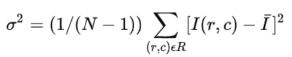

区域 R [1]的方差

随着

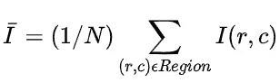

区域的强度和除以 1/N，其中 N:区域中的像素数[2]

分割和合并方法通常由树形结构表示。我们看到下面的输出示例:

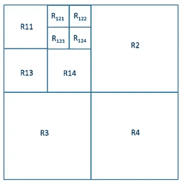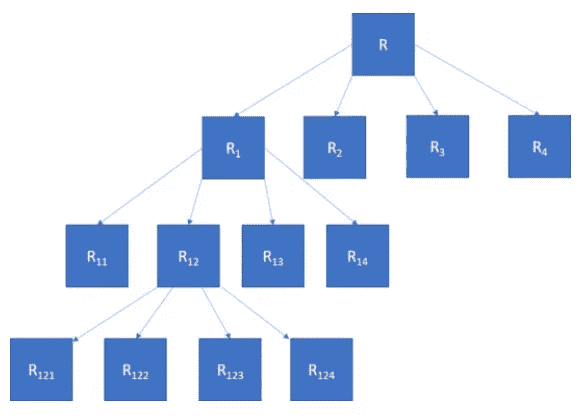

[3]

注意，基于区域的分割方法经常用于医学图像分割，并且它们仍然是图像分割的重要基本方法之一。

# 基于边缘的图像分割

正如我们在[空间线性滤波](https://yagmurcigdemaktas.medium.com/image-processing-part-2-2-4ab76a18e276)中已经看到的，有不同类型的内核为我们提供图像的边缘。基于边缘的图像分割就是这样！**我们需要跟踪图像的边缘，当我们获得边缘图时，我们通常使用形态学填充那些边缘中的空洞，**然后就完成了！如果你对我们用来检测边缘的“一阶导数和二阶导数核”没有任何概念，你可以看看我之前提到的那篇文章。

除了这些内核类型之外，还有一些“边缘检测器”,我们不仅仅使用边缘检测内核，而是使用一些额外的步骤来获得更好的结果。一个非常常见的边缘检测器是 Canny 边缘检测器，它在下面的帖子中有很好的解释和详细说明:

</canny-edge-detection-step-by-step-in-python-computer-vision-b49c3a2d8123>  

让我们试着看看边缘检测器和孔洞填充一起使用的一些结果，同时使用 Scipy 的内置函数:

```
"""Edge Based Segmentation """""" edge detection with canny """edges = canny(img)fig, ax = plt.subplots(figsize=(4, 4))
ax.imshow(edges, cmap=plt.cm.gray)
ax.axis('off')
ax.set_title('Canny detector')""" region - hole filling """fill_holes = ndi.binary_fill_holes(edges)fig, ax = plt.subplots(figsize=(4, 3))
ax.imshow(fill_holes, cmap=plt.cm.gray, interpolation='nearest')
ax.axis('off')
ax.set_title('Filling the holes')
```

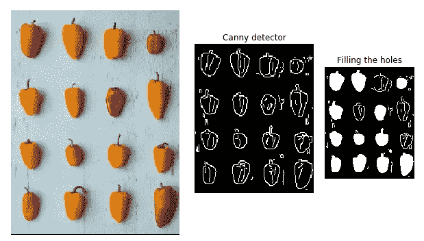

“作者提供的图像”

请注意，处理太大的图像或大的对象可能会破坏您的结果图像，因为边缘大多没有闭合。如果边缘不闭合，填充洞算法也不能正常工作。让我们在不调整大小的情况下检查相同的图像:

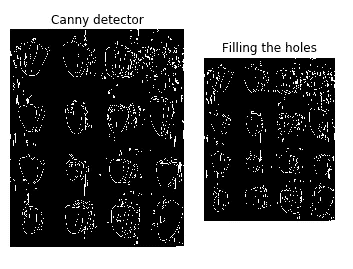

没有调整输入图像“作者的图像”的大小

记住这些小技巧，祝你自己的试验好运！你可以从那个 [**Github**](https://github.com/YCAyca/Image-Segmentation/tree/main/Edge_Based) 链接到达代码。

我试图在一篇文章中收集经典的方法，让你对每一种方法有一个简单的了解。我希望代码和解释对那些开始研究这个领域的人有所帮助！如果你想用经典方法更进一步，我建议你继续用**分水岭算法**和**提取连通分量**。两者都在某些部分使用了形态学运算，值得一看！

要进一步了解更多先进的方法，请点击我的[基于聚类的方法](/image-segmentation-with-clustering-b4bbc98f2ee6)帖子，在那里我解释了聚类分割，这是基于人工智能的图像分割的一个子组。

谢谢✋

[1] [2] [3]:图片来自[https://en.wikipedia.org/wiki/Split_and_merge_segmentation](https://en.wikipedia.org/wiki/Split_and_merge_segmentation)

在这篇文章中，所有用于不同代码部分实验的图片都来自 unsplash.com