# 聚类图像分割

> 原文：<https://towardsdatascience.com/image-segmentation-with-clustering-b4bbc98f2ee6?source=collection_archive---------10----------------------->

## K 均值和模糊 C 均值聚类的基本原理及其在图像分割中的应用

在我之前的文章中，我们概述了经典的图像分割方法。现在是时候检查基于人工智能的图像分割方法了，我们将从聚类开始。

在开始使用聚类进行图像分割之前，让我们先回顾一下“什么是聚类？”"如何用 Python 实现一个基本的聚类方法？"

**什么是集群**

无非是把给定的数据按照相似性进行分组，最后得到不同的聚类。根据我们使用的聚类方法，我们对数据分组的方式会发生变化。让我们考察 2 种不同的最常用的图像分割类型:分割聚类和模糊聚类

***划分聚类***

分区聚类方法将数据细分为 k 个组，其中 k 是用户预定义的数字。对于 **K-means 聚类**，哪一种是最流行的划分聚类方法

1.  我们选择数据中的 **k 个随机点**作为聚类的**中心，并通过查看该点与中心**之间的 L2 距离将每个点分配给**最近的聚类。**
2.  计算每个聚类的平均值，将该平均值指定为该聚类的新中心。
3.  将每个数据点重新分配到其最近的聚类中心。重复步骤 2。

该过程继续进行**直到没有新的分配被执行**(因此模型被收敛，没有什么可进一步进行的)**或者对于给定的迭代次数**。因此，K-means 聚类是一种**迭代**方法，其中我们也可以确定迭代次数。

现在让我们可视化一些随机数据，对每个数据应用 10 次迭代的 K 均值聚类。

```
from sklearn.cluster import KMeans
from sklearn.datasets import make_blobs
import numpy as np
from matplotlib import pyplot as plt
import cv2""" Plot the data """data = np.array([[1, 2], [1, 4], [1, 0],[10, 2], [10, 4], [10, 0]])
data = np.array([[1, 5], [3, 1], [10, 3], [10, 2], [10, 1], [1, 0], [2, 15], [0.5, 4.9], [5, 3], [7, 13], [18, 18], [1.9, 0.5]]) 
data = np.random.randint(100, size=(2,2))centers = [[1, 1], [-1, -1], [1, -1]]
data, _ = make_blobs(n_samples=10000, centers=centers, cluster_std=0.6)# Plot the data
plt.scatter(data[:,0],data[:,1])
plt.xlabel('x'),plt.ylabel('y')
plt.show()""" Visualize K means for each iteration """""" create an empty list for each cluster, k is the cluster number """k = 2
clusters = [[[0 for _ in range(2)] for _ in range(1)] for _ in range(k)]for i in range(k):
    clusters[i].pop() #if we dont do that, additional [0,0] points will be stayed added in our data

""" Visualize each iteration. """for i in range(1,10):
    kmeans = KMeans(n_clusters=k, random_state = 0, max_iter=i).fit(data)
    for index,data_point in enumerate(data):
        clusters[kmeans.labels_[index]].append(list(data_point))

    for i in range(k):
        clusters[i] = np.array(clusters[i])
        plt.scatter(clusters[i][:,0],clusters[i][:,1])
        clusters[i] = clusters[i].tolist() 
    plt.show()
```

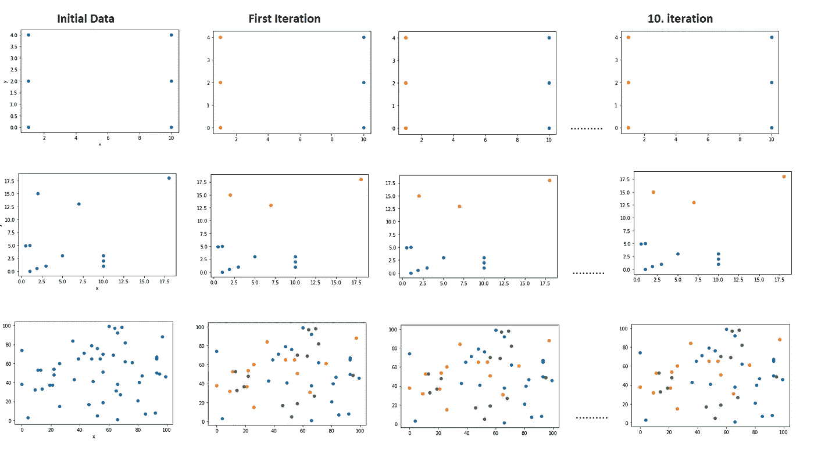

前两个示例被分为 2 个组，第三个示例分为 3 个组“作者图片”

我们看到，甚至在第一次迭代中，我们就获得了最终结果。因为数据非常小，初始聚类效果很好。让我们对下面随机生成的数据运行相同的代码，并将它们分成 5 个组。

centers = [[1，1]，[-1，-1]，[1，-1]]
data，_ = make_blobs(n_samples=10000，centers=centers，cluster_std=0.6)


“作者提供的图像”

现在我们可以更好地看到在每次迭代中集群是如何更新的！

是时候对真实图像应用 K-means 聚类并获得分段输出了！

```
""" Image Segmentation """img = cv2.imread("bird1.jpg", cv2.IMREAD_UNCHANGED) 
img = cv2.imread("birds2.jpg", cv2.IMREAD_UNCHANGED)  
img = cv2.imread("peppers3.jpg", cv2.IMREAD_UNCHANGED)  
vectorized = img.reshape((-1,3))kmeans = KMeans(n_clusters=5, random_state = 0, n_init=5).fit(vectorized)centers = np.uint8(kmeans.cluster_centers_)
segmented_data = centers[kmeans.labels_.flatten()]

segmented_image = segmented_data.reshape((img.shape))
plt.imshow(segmented_image)
plt.pause(1)
```

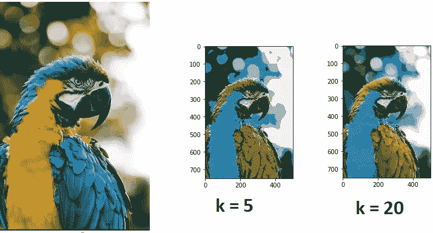

“作者提供的图像”

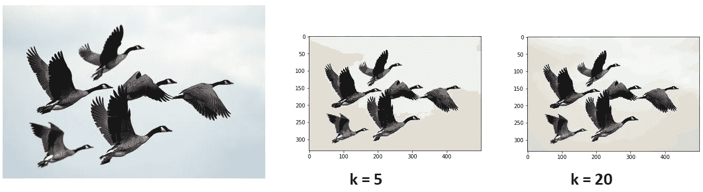

“作者提供的图像”

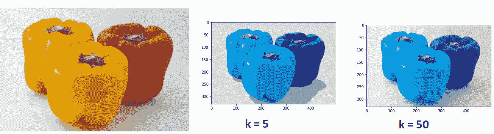

“作者提供的图像”

你可以意识到我没有使用那次确定迭代次数参数的 **max_iter** 。我将这一决定留给模型，这样当聚类中没有发生变化时，分割就停止了。另一方面， **n_init** 参数决定了在初始步骤中用不同的随机聚类中心完成多少次不同的试验。该算法选择最佳拟合，这给出了最佳分割。

我们可以意识到随着**增加 k** ，结果**会变得更好**和更详细！

下面是该节中使用的代码的[**githu**](https://github.com/YCAyca/Image-Segmentation/tree/main/Clustering)**b**链接:

**模糊聚类**

模糊聚类是一种**硬**聚类类型，而划分聚类被称为**软**。其原因是，在划分聚类中， **1 个数据点可能仅在 1 个聚类**中，在模糊聚类中，我们有每个聚类的数据点的**概率，并且它们可能**属于该概率水平的任何聚类。****

让我们来看看最常见的模糊聚类类型**模糊 C 均值聚类**，看看如何计算点的概率、聚类的中心等。[1]

1.  随机初始化概率矩阵。因此，为每个数据-聚类对分配权重，这是指数据 x 位于聚类 C 中的概率。
2.  计算聚类的中心(质心)，
3.  根据新的聚类中心计算新的概率。
4.  重复 2。第三。步进，直到中心不变或给定迭代次数

让我们想象一个例子:

我们有 4 个数据点 p1、p2、p3、p4 二维，所以我们有这些点的 x 和 y 坐标，我们想把它们分成两个组。

1.  我们随机初始化权重矩阵:

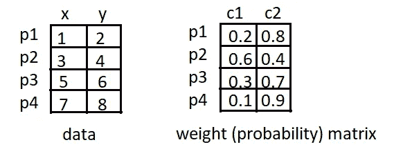

“作者提供的图像”

2.我们根据初始概率用下面的公式计算聚类的质心:

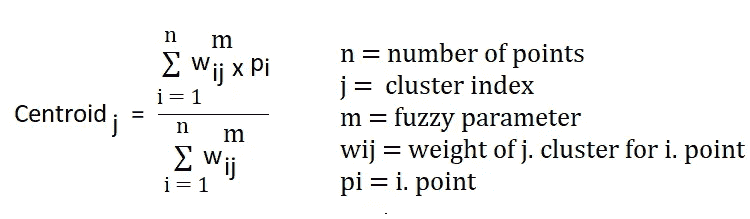

“作者提供的图像”

注意**模糊参数**是我们应该选择的，就像聚类数一样，它可以在 1 < m < ∞之间选择

让我们通过选择 **m = 2** 将公式应用于我们的示例案例:

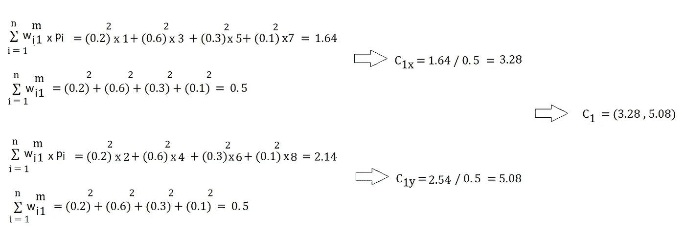

“作者提供的图像”

因为我们有 2D 点，所以群集的中心也是 2D。所以我们用我们点的 x 坐标计算 C1x(第一个聚类的 x 坐标)，用我们点的 y 坐标计算 C1y(第一个聚类的 y 坐标)。

当我们对 C2 也应用同样的公式时，我们得到如下结果

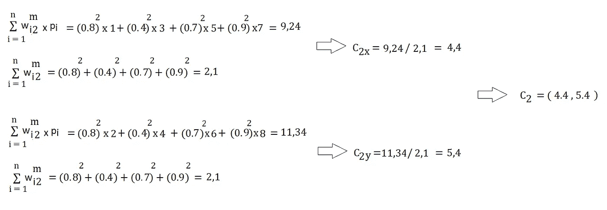

“作者提供的图像”

我们得到了我们的聚类中心，现在是时候根据新的聚类中心来计算点的概率了。

3.我们使用以下公式计算新的概率——权重:

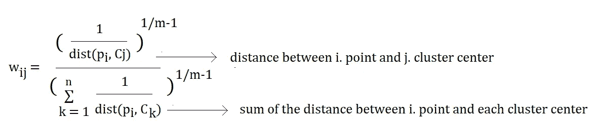

“作者提供的图像”

别忘了在我们的例子中 m = 2，所以 1/m-1 = 1。

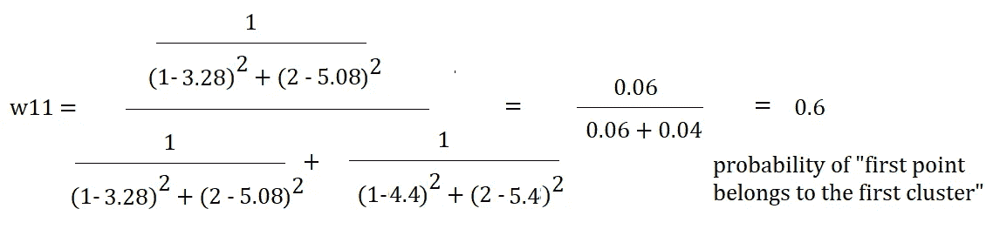

“作者提供的图像”

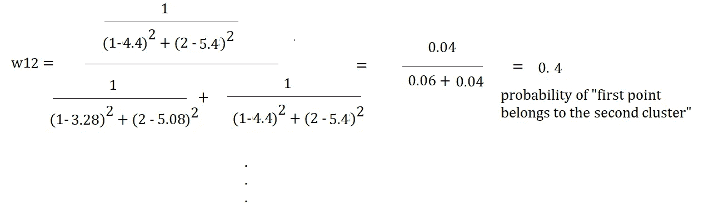

“作者提供的图像”

诸如此类！我没有计算每个点和聚类的权重，而是想手动显示每个步骤的逻辑。

我希望大家清楚模糊 C 均值聚类的基本逻辑和应用。现在是时候做一些实验并检查结果了。

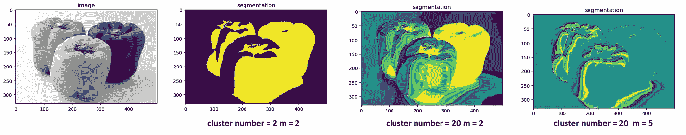

“作者提供的图像”

选择模糊参数 m 太大会导致结果失真。我们再次看到，随着聚类数的增加，我们获得了更详细和更好的分割结果。

如果您使用 Linux，您可以尝试使用 PyPI [1]中的 fuzzy c means 模块，我在 windows 上安装它时遇到了一些问题，尽管我按照建议使用了 pip install fuzzy-c-means[windows]命令。感谢[2]中的 fuzzy c 意味着从头开始实现，我在准备最后一部分时使用了它。

在图像分割与神经网络部分再见！👐

[1][https://pypi.org/project/fuzzy-c-means/](https://pypi.org/project/fuzzy-c-means/)

[2][https://github . com/jeongHwarr/variable _ FCM _ segmentation/blob/master/FCM . py](https://github.com/jeongHwarr/various_FCM_segmentation/blob/master/FCM.py)

在这篇文章中，所有用于不同代码部分实验的图片都来自 unsplash.com