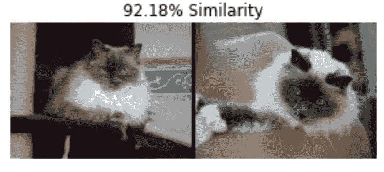
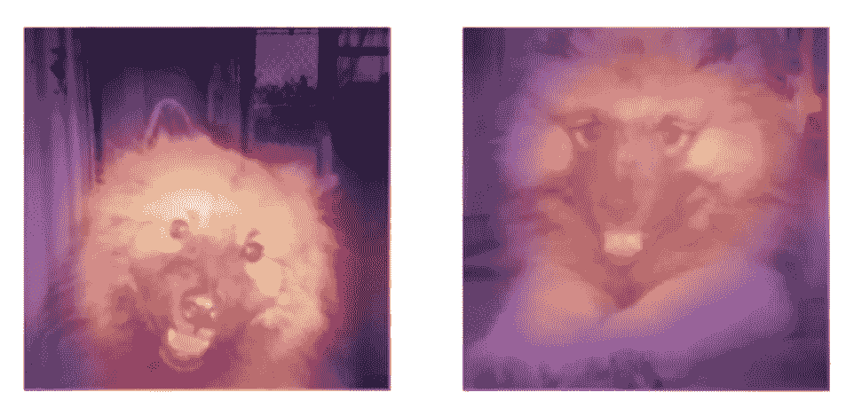
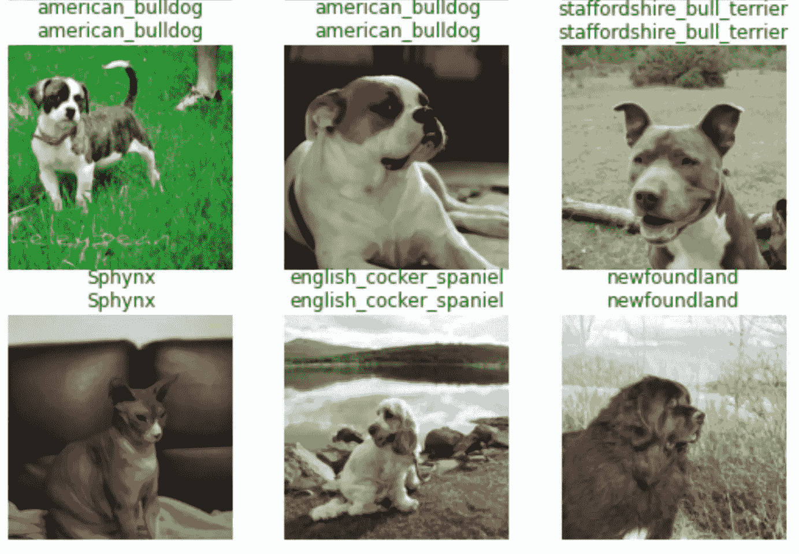
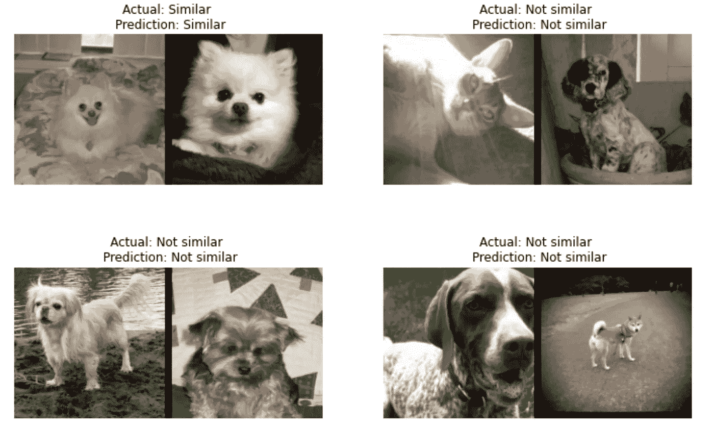
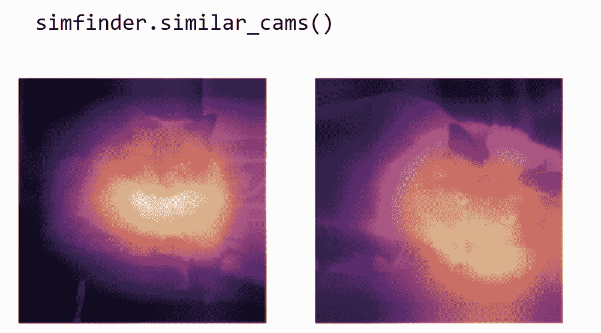

# 图像相似性:理论与代码

> 原文：<https://towardsdatascience.com/image-similarity-theory-and-code-2b7bcce96d0a?source=collection_archive---------10----------------------->

## 一种计算非结构化图像数据相似性的启发式方法。



未来的预告片。所有图片均为作者本人，使用[牛津 Pet 数据集](https://www.robots.ox.ac.uk/~vgg/data/pets/)。

# 介绍

我们如何计算一幅图像与另一幅图像有多相似呢？对于矢量化形式的数据之间的相似性，我们可以找到两个示例之间的平方差之和，或者使用类似的方法，如余弦相似性。然而，在图像上执行这种技术(将每个像素值之间的平方差求和)会失败，因为图像中的信息存在于像素之间的相互作用中。如果我们要继续的话，我们必须首先从图像中提取有意义的特征，并转换成矢量化的形式。

但是我们如何从图像这样的非结构化数据中提取特征呢？为了对单词做到这一点，我们使用可学习的嵌入——包含特定单词含义的特征向量。我们用向量来表示单词中的意思，我们也可以用图像做类似的事情。CNN 可以被训练成将图像映射到向量，我们可以像使用单词嵌入一样使用这些向量。这是零射击学习发展领域的一个中心任务；然而，这个项目采用了一种不同的、更加端到端的方法。

我提出了一种复合深度学习管道，作为自动预测图像之间相似性的可解释启发式方法。为此，我使用了牛津 PETS 数据集。这个管道可能类似于面部识别技术，尽管我对这些方法不熟悉。在这篇文章中，我走过了我的项目的每一步，从宠物品种的分类到寻找与暹罗模型的相似性，以及用类激活图(CAMs)解释预测。代码是用 PyTorch 和 fastai 写的。最后，我将讨论这种启发式算法的潜在应用，作为最低标记数据集的原始聚类算法，并为医疗预后匹配相似的患者。

这是[原项目的笔记本](https://colab.research.google.com/drive/1LQ6gbZHioY09GQRBh99VgD-Lxc8L5lv4?usp=sharing)。我建议你在阅读下面的评论时仔细阅读笔记本，因为为了简洁我省略了一些细节。而且，如果你希望以更清晰的格式阅读这篇文章，我推荐你从我自己的网站上阅读。



*预测相似的一对宠物。*

# 深入实施

让我们从能清楚看到整个项目的地方开始:在最后。

类是我的推理管道的模块化版本，一旦我们理解了它的三个方法，我们就已经理解了这个项目的本质。`SimilarityFinder`将两个模型串在一起，一个是预测宠物品种的分类器，一个是确定两幅图像是否相似的比较(`Siamese`)模型。我们使用它们来预测比较图像文件中与输入图像最相似的图像。

```
**class** **SimilarityFinder**:
    **def** **__init__**(self, classifier_learner, siamese_learner, files):
    **def** **predict**(self, fn, compare_n**=**15):
    **def** **similar_cams**(self):
```

在`__init__`中，我们将用于比较的图像文件预处理为`lbl2files`，这是一个对`predict`有用的映射，并初始化我们的两个`Learner`。一个`Learner`是 fastai 类，它将模型、数据和其他一些训练组件包装到一个类中，因此我们可以将它们视为管道的两个部分。

```
**def** **label_func**(fname):
    """extracts the pet breed from a file name"""
    **return** re.match(r'^(.+)_\d+.jpg$', fname.name).groups()[0]**class** **SimilarityFinder**:
    **def** **__init__**(self, classifier_learner, siamese_learner, files):
      self.clearn,self.slearn **=** classifier_learner,siamese_learner
      labels **=** L(map(label_func, files)).unique()
      self.lbl2files **=** {l:[f **for** f **in** files **if** label_func(f)**==**l] 
                        **for** l **in** labels}
```

分类器`Learner`将作为一种启发，减少我们在预测相似性时必须筛选的图像数量。连体`Learner`预测两幅图像之间的相似性。它们一起将允许我们在一个相当大的数据集中找到最相似的图像。

让我们继续看看我们是如何构建这两个`Learner`的。

# 分类

我们从宠物的图像中预测宠物的品种。这是一个标准的分类问题，因此对于熟悉 CNN 的人来说，这似乎是微不足道的。有三个基本步骤:

1.  从目录中提取图像文件。默认情况下，fastai 库中有 PETS 数据集，所以我们使用`untar_data`来访问它。

```
path = untar_data(URLs.PETS)
files = get_image_files(path/"images")
```

2.对图像文件进行预处理，用 fastai 的数据块 API 存储在`DataLoaders`中。

```
cdls = DataBlock(blocks = (ImageBlock, CategoryBlock),
          get_items = get_image_files,
          get_y = using_attr(RegexLabeller(r'(.+)_\d+.jpg$'),'name',
          splitter = RandomSplitter(),
          item_tfms = Resize(224),
          batch_tfms = aug_transforms()).dataloaders(path/'images')
```

3.用 fastai `Learner`包好所有东西，训练模特。我在项目中使用了一些技巧进行训练(标签平滑，混合精度训练)，但是为了简单起见，我在这里省略了它们。它们可以在原始笔记本中找到。

```
clearn = cnn_learner(cdls, resnet34, metrics=accuracy) clearn.fit_one_cycle(n_epochs, lr)
```

分类管道已完成；让我们转到更复杂的比较管道。



显示分类器的结果

# 比较

我们训练了一个模型来预测宠物品种。现在，我们训练使用一个模型来预测两个图像是否属于同一种类。这将需要定义一些自定义数据类型和一个自定义模型，因为它不是一个标准的应用程序。下面的实现来自 fastai 文档的 Siamese 教程，但是我对模型和训练过程做了修改。

实现暹罗模型与实现分类器非常相似；然而，有两个关键的修改。

我们将两幅图像输入到模型中，而不是一幅。这意味着，首先，我们需要用每个例子的三个元素来表示我们的`DataLoaders`——第一个图像，第二个图像，以及它们是否相似——其次，我们通过同一个主体单独传递每个图像，并在头部连接主体的输出。

1.  与之前完全一样，检索图像文件。

```
path **=** untar_data(URLs.PETS)
files **=** get_image_files(path**/**"images")
```

2.用 fastai 的中级 API 对数据进行预处理。我们创建一个`Transform`来打开文件，将它们与其他文件配对，并将其输出为一个`SiameseImage`，它本质上是一个用于显示数据的容器。然后，我们用`TfmdLists`和`dataloaders`对所有文件进行必要的转换。

```
**class** **SiameseTransform**(Transform):
   **def** **__init__**(self, files, splits):
   """setup files into train and valid sets"""
   **def** **encodes**(self, f):
   """applies transforms on f and pairs it with another image"""
     f2,same **=** self.valid.get(f, self._draw(f))
     im1,im2 **=** PILImage.create(f),PILImage.create(f2)
     **return** SiameseImage(im1,im2,int(same))
   **def** **_draw**(self, f, splits**=**0):
   """retrieve a file--same class as f with probability 0.5"""
splits **=** RandomSplitter(seed**=**23)(files)
tfm **=** SiameseTransform(files, splits)
tls **=** TfmdLists(files, tfm, splits**=**splits)
sdls **=** tls.dataloaders(after_item**=**[Resize(224), ToTensor], 
     after_batch**=**[IntToFloatTensor, Normalize.from_stats(*****imagenet_stats)])
```

3.建立模型。我们将图像对中的每个图像通过主体(也称为编码器)，连接输出，并通过头部来获得预测。注意，两个图像只有一个编码器，而不是每个图像有两个编码器。然后，我们下载一些预训练的重量，并将它们组装成一个模型。

```
**class** **SiameseModel**(Module):
   **def** **__init__**(self, encoder, head):
       self.encoder,self.head **=** encoder,head
   **def** **forward**(self, x1, x2):
       ftrs **=** torch.cat([self.encoder(x1), self.encoder(x2)], dim**=**1)
       **return** self.head(ftrs)
encoder **=** create_body(resnet34, cut**=-**2)
head **=** create_head(512*****2, 2, ps**=**0.5)
smodel **=** SiameseModel(encoder, head)
```

4.创建`Learner`并训练模型。我们在`Learner`中处理小褶皱:用`siamese_splitter`指定身体和头部的位置，在`loss_func`中把目标投成浮动。请注意，在我们定制了数据和模型之后，其他的一切都就位了，我们可以以标准的方式进行训练。

```
slearn = Learner(sdls, smodel, loss_func=loss_func, 
             splitter=siamese_splitter, metrics=accuracy)
slearn.fit_one_cycle(n_epochs, lr)
```

我们使用确定共享品种的能力作为图像相似性的启发。我使用两只宠物是同一品种的概率作为相似性的代理:如果模型有 95%的信心认为两只宠物是同一品种，那么它们就被认为比模型以 80%的信心预测的更相似。

现在，让我们回到项目的核心，`SimilarityFinder`，我们将这些功能串联在一起。



展示了连体模型的结果

# `SimilarityFinder.predict`

这是项目中最复杂的方法，所以我将一点一点地分解它。要点如下:输入一个图像文件，预测其类别，在同一类别的图像库中搜索，用钩子记录身体的活动(对于`similar_cams`)，并输出最相似的图像。

```
**class** **SimilarityFinder**:
  **def** **predict**(self, fn, compare_n**=**15):
    self.preds,self.acts,self.images,self.fns **=** [],[],[],[] *# 1\. predict breed of input image
*    cls **=** predict_class(fn,self.clearn) *# 2\. retrieve a list of same-class images for comparison
*    compare_fns **=** self.lbl2files[cls][:compare_n] *# 3\. register a hook to record activations of the body
*    hook_layer **=** self.slearn.model.encoder
    **with** Hook(hook_layer) **as** hook:
      **for** f2 **in** compare_fns: *# 4\. preprocess image files for comparison and predict similarity
*          im1,im2 **=** PILImage.create(fn),PILImage.create(f2)
          ims **=** SiameseImage(im1,im2)        
          output **=** slearn.siampredict(ims)[0][1] *# 5\. record state and outputs
*          self.preds.append(torch.sigmoid(output))
          self.fns.append((fn,f2))
          self.images.append((im1,im2))
          self.acts.append(hook.stored)
          hook.reset() *# 6\. retrieve most similar image and show it with original
*    self.idx **=** np.array(self.preds).argmax()
    sim_ims **=** self.images[self.idx]
    title **=** f'{self.preds[self.idx].item()*****100:.2f}% Similarity'
    SiameseImage(sim_ims[0], sim_ims[1], title).show()
    **return** self.fns[self.idx][1]
```

1.  预测输入图像的种类。`predict_class`对图像文件进行预处理，并使用分类器模型输出预测类别。

```
**def** **predict_class**(fn,learn):
   im **=** first(learn.dls.test_dl([fn,]))[0].cpu()
   **with** torch.no_grad(): output **=** learn.model.eval().cpu()(im)
   **return** learn.dls.vocab[output.argmax()]
```

2.检索同类图像列表进行比较。我使用预测类作为启发，以减少我们必须通过搜索来检索最相似的图像的数量。`compare_n`指定我们要搜索的图片数量，所以如果我们想快速得到结果，我们可以减少`compare_n`。如果`compare_n`是 20，调用`predict`大约需要一秒钟。

3.注册一个钩子来记录身体的活动。钩子是我们注入 PyTorch 模型的代码片段，如果我们希望它们执行额外的功能。它们与上下文管理器(`with`块)配合得很好，因为我们必须在使用钩子后移除它。在这里，我使用钩子来存储模型身体的最终激活，这样我就可以实现`similar_cams`(稍后解释)。

```
**class** **Hook**():
   **def** **__init__**(self, m):
     self.hook **=** m.register_forward_hook(self.hook_func)
     self.stored **=** []
   **def** **hook_func**(self,m,i,o): self.stored.append(o.detach().cpu())
   **def** **reset**(self): self.stored **=** []
   **def** **__enter__**(self,*****args,******kwargs): **return** self
   **def** **__exit__**(self,*****args,******kwargs):  self.hook.remove()
```

4.预处理图像文件以进行比较和预测相似性。`SiameseImage`是一个修改过的元组，用于分组和显示我们的图像。`siampredict`方法是`Learner.predict`的一个版本，通过修改默认值来处理定制模型的一些问题。

5.记录一些统计数据。

6.检索具有最大预测相似概率的图像对，将它们视为所考虑的图像中最相似的。用`SiameseImage.show`并排显示图像，并输出最相似图像的文件名。

这是管道的主要功能，但是，如果这样实现，我们将不知道为什么图像被认为是“最相似的”。换句话说，如果我们能够确定模型用来进行预测的图像特征，这将是非常有用的。为了避免模型预测两个图像由于外部因素而相似(例如，相似的背景)，我添加了一个 CAM 功能。


SimilarityFinder.predict 的输出

# 计算机辅助制造（computer aided manufacturing）

类激活图是显示原始图像上对输出影响最大的位置的网格。我们通过将模型身体的激活(称为空间地图)与包含输出梯度的矩阵相乘来创建一个。这里，我使用模型最后一层的权重矩阵作为梯度，因为最后一层的输出相对于输入的导数就是最后一层的权重。

直观地说，空间地图显示了影像中每个位置的要素的突出程度，梯度矩阵将每个要素与输出联系起来，显示了每个要素的使用程度。结果是图像中的每个位置如何影响输出的图示。

```
**class** **SimilarityFinder**:
  **def** **similar_cams**(self):
    *# 1\. grab the final weights and spatial maps of the most similar images
*    sweight **=** self.slearn.model.head[**-**1].weight.cpu()
    act1,act2 **=** self.acts[self.idx]
    *# 2\. matrix multiply the weights and spatial maps
*    cam_map1 **=** torch.einsum('ik,kjl->ijl', sweight, act1[0])
    cam_map2 **=** torch.einsum('ik,kjl->ijl', sweight, act2[0])
    *# 3\. open the most similar images to show them
*    f1,f2 **=** self.fns[self.idx]
    t1,t2 **=** to_tensor(f1,slearn.dls),to_tensor(f2,slearn.dls)
    *# 4\. show the CAMs overlain on the images
*    _,axs **=** plt.subplots(ncols**=**2)
    show_cam(t1,cam_map1,axs[0])
    show_cam(t2,cam_map2,axs[1])
```

1.  获取连体模型的最终重量以及最相似图像的空间地图，我们在`predict`中用钩子记录了这些图像。
2.  用`torch.einsum`(一种自定义矩阵乘法的方法)执行权重和空间图之间的点积。
3.  打开`predict`中预测最相似的文件，将它们转换成我们能够显示的预处理张量。
4.  将凸轮叠加在原始图像上，并并排显示。

```
**def** **show_cam**(t, cam_map, ctx):
   show_image(t, ctx**=**ctx)
   ctx.imshow(cam_map[0].detach().cpu(), 
              extent[0, t.shape[2], t.shape[1],0], 
              alpha**=**.7, interpolation**=**'BILINEAR', cmap**=**'magma')
```



*show _ cam 的输出*

# 最后的话

在这个项目中，我们预测了最相似的宠物，然后用 CAMs 解释这个预测。最后，我将尝试更精确地定义“最相似”，并解释为什么这个微妙的定义具有实际意义。

这个项目的核心观点是，我们可以使用连体模型在预测中的置信度作为图像相似性的代理。然而，本文中的“图像相似性”并不意味着图像整体上的相似性。相反，它指的是两个图像如何明显地共享区分目标类的特征。当使用`SimilarityFinder`时，我们用来标记图像的类别会影响哪个图像被预测为最相似。

例如，如果我们像这里一样用品种来区分宠物，`SimilarityFinder`可能会预测两只狗共享，比如说，他们品种特有的尖鼻子，是最相似的，即使它们的其他特征有很大不同。相比之下，如果我们根据另一个类别来区分宠物，例如它们是否可爱，模型可能会在预测中更多地考虑类似的软耳朵，而不是尖鼻子，因为软耳朵对可爱程度的贡献更大。因此，`SimilarityFinder`过分强调了对确定它被训练的类最重要的特征。

基于训练标签的预测图像相似性的可变性是`SimilarityFinder`的一个有用特征，如果我们要将其应用于更多实际问题的话。例如，`SimilarityFinder`对于发现肺炎患者的 CT 扫描之间的相似性将是一个有用的启发，因为相似性度量将有助于评估治疗方案。举例来说，如果我们能找到与肺炎病例最相似的既往患者，并且他们对治疗反应良好，比如说克罗星，那么克罗星可能是目前患者的一个好的治疗选择。

我们将从 CT 扫描图像中确定病例的相似性，但是我们不希望该模型由于诸如骨骼结构或扫描质量之类的外来因素而预测相似性；我们希望这种相似性是基于疾病的发展和性质。因此，通过指定类别标签(如肺炎的严重程度和类型)来确定有助于预测的特征，并通过分析我们的 cam 来确认使用了适当的特征是非常有用的。

这个项目的目的是实现一个算法，可以计算非结构化图像数据的相似性。作为一种可解释的启发式方法来实现这一目的。目前，我感兴趣的是将这种启发式方法应用到医学领域，为临床任务提供额外的数据，如随机对照试验的配对解释。更多信息将在后续文章中发布。

# 参考

1.  [Fastai 和 PyTorch 为程序员提供深度学习](https://www.amazon.com/Deep-Learning-Coders-fastai-PyTorch/dp/1492045527)
2.  [fastai 文档](https://docs.fast.ai/)
3.  [grad-CAM 纸](https://arxiv.org/abs/1611.07450)