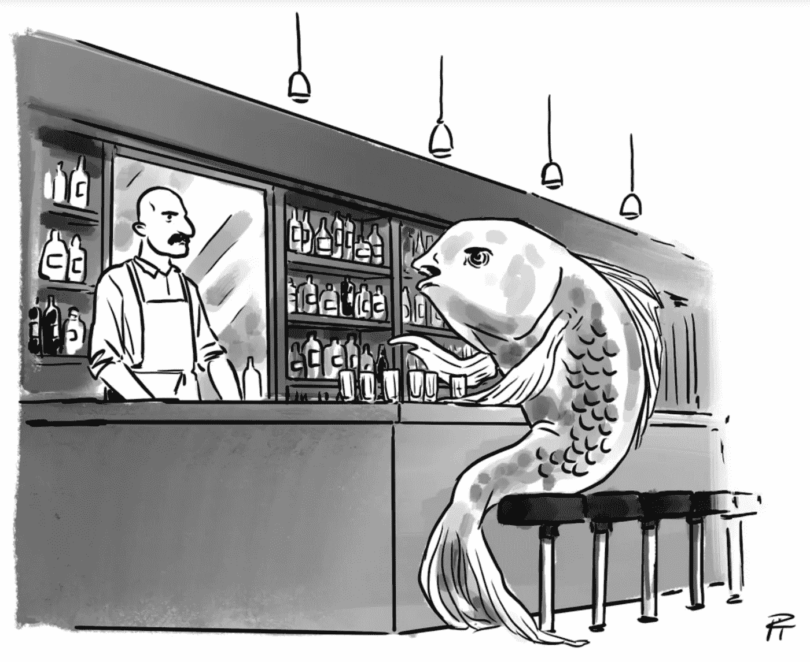
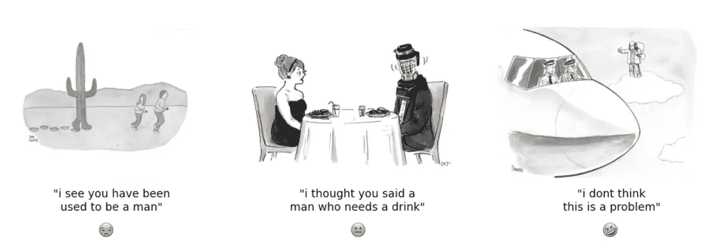
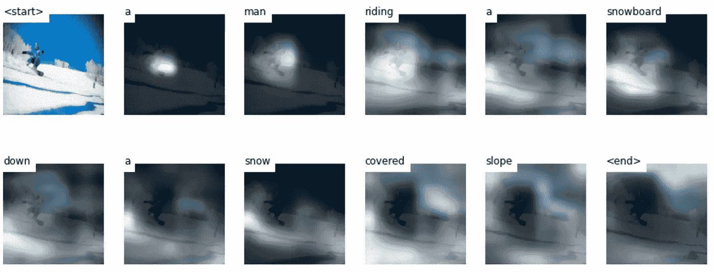
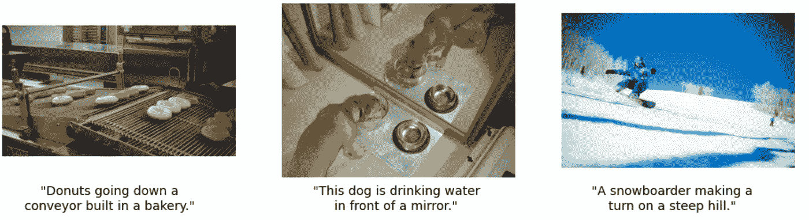
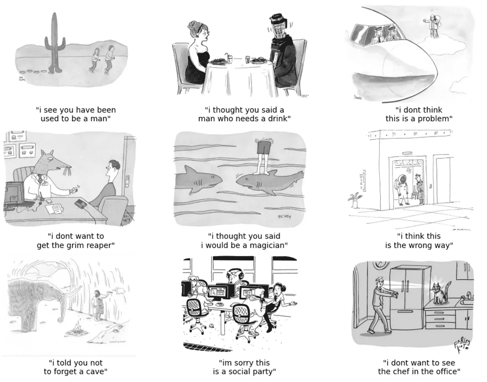
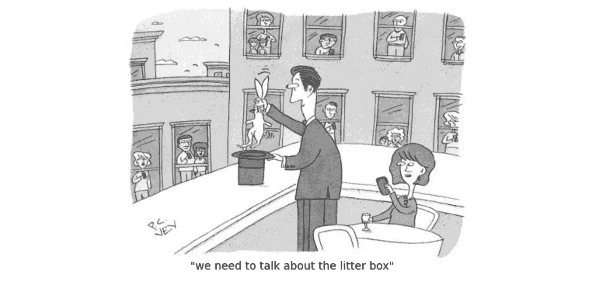

# 《纽约客》漫画的图像到文本生成

> 原文：<https://towardsdatascience.com/image-to-text-generation-for-new-yorker-cartoons-f5f145eb6208?source=collection_archive---------27----------------------->

## 我如何使用深度学习来创建《纽约客》的标题

从来没有一台电脑赢得过《纽约客》漫画字幕大赛的冠军，理由很充分:这很难。《纽约客》杂志每周举办一次竞赛，让读者为一幅无字幕的漫画提交字幕，如下图所示。获奖说明刊登在杂志上。

上一届《纽约客》字幕大赛的图片示例。图片来自 [NextML](https://github.com/nextml/caption-contest-data) 。 [CC 乘 4.0](https://creativecommons.org/licenses/by/4.0/) 。

人们已经创建了纽约客字幕生成器，但没有一个真正使用漫画的图像来生成字幕。相反，他们使用以前的标题来预测新的标题会是什么样子。

直接从卡通形象转到标题很难，原因如下:

*   卡通通常描绘现实生活中从未发生的情景和图像。(一条坐在酒吧的鱼？)
*   即使我们有一个模型可以识别漫画中的主题，也很难将这种理解转化为诙谐的标题。

我将这项任务作为图像到文本算法的学习练习，经过大量的反复试验，我创建了一个图像到文本的模型，仅基于图像就可以为《纽约客》漫画制作像样的字幕。我是这样做的。

由模型产生的样本标题。图片来自 [NextML](https://github.com/nextml/caption-contest-data) 。 [CC 乘 4.0](https://creativecommons.org/licenses/by/4.0/) 。

# **数据**

第一步是获取训练数据。NEXTml 有一个 [Github 知识库](https://github.com/nextml/caption-contest-data)，在那里你可以访问来自 186 场比赛的原始卡通图像和候选人说明。每场比赛平均有大约 5000 个候选字幕。在下载了这个数据集之后，我将它分成了分别包含 127 个和 59 个图像的训练和测试数据集。

# **型号**

我从 [sgrvinod 的教程](https://github.com/sgrvinod/a-PyTorch-Tutorial-to-Image-Captioning)中的深度图像到文本模型开始。给定一幅图像，该模型通过将图像编码到描述图像中内容的向量空间中来工作。然后，该模型获取编码图像，并将其翻译成文字(“解码”)。在将编码图像翻译成文字时，注意力层会告诉模型应该关注图像的哪一部分。注意力层特别酷，因为它可以让你看到模型在选择每个单词时的焦点在哪里。

该模型集中在滑雪板上，以确定“一个人骑着滑雪板”，并围绕滑雪板确定“雪覆盖的斜坡”图片来自 [COCO2014](https://cocodataset.org/#home) 。 [CC BY-SA 2.0](https://creativecommons.org/licenses/by-sa/2.0/) 。

我在大约 16 万张图片和说明的 [COCO2014](https://cocodataset.org/#home) 数据集上训练了一个模型(“COCO 模型”)。然而，如下图所示，COCO2014 的图片和说明与我们想为《纽约客》制作的图片和说明大相径庭。这些图像是真实生活中的照片，描述非常简单。看不到喜剧。下一步是弄清楚:我们如何把这个预先训练好的模型改编成《纽约客》的字幕？这是最困难的部分。

来自 [COCO2014](https://cocodataset.org/#home) 数据集的样本图像和标题。 [CC BY-SA 2.0](https://creativecommons.org/licenses/by-sa/2.0/) 。

# 文本预处理

对上述问题的回答最终是“非常仔细的预处理”

## 词汇扩展

我需要做的第一件事是扩展 COCO 模型的词汇。《纽约客》漫画中包含的“雪人”或“穴居人”等概念从未出现在 COCO2014 数据集中。为了解决这个问题，我将《纽约客》数据集中的单词添加到 COCO 模型的词汇表中，并重新训练了 COCO 模型。这使词汇量从 9490 个单词增加到 11865 个单词。

## 字幕过滤

在《纽约客》的数据集中，一幅漫画的候选标题彼此大相径庭。有的提到了图像中的物体，有的没有。字幕也以不同的单词开始，并且具有不同的语法结构:

> “你什么意思？你只在星期五供应鱼”
> “每个学校都拒绝了我”
> “我知道什么东西被掺水了，伙计。”

为了使模型更容易解决图像到文本的问题，我用两种方法过滤了候选标题:

*   结构:标题必须以代词开头(如“我”、“你”、“他们”)。这是为了使标题结构更容易预测。
*   内容:标题必须引用图像中的对象。这有两个原因。首先，由于我们直接从图像到标题，我想强制模型使用图像中的对象来获得标题。第二是关键词(例如“鱼”)出现在标题中，使模型更容易学习。为了弄清楚图像中有哪些物体，我使用了一种粗略的启发式方法，从漫画的描述中提取名词，并迫使标题至少引用一两个名词。

这些过滤器将每部漫画的平均标题数量从 5000 个减少到 10 个，但这仍然是足够训练模型的数据[3]。

# 迁移学习

清理完数据后，我继续训练 COCO 模型，给它提供来自《纽约客》数据集的图片和说明。额外的训练意味着模型可以对其参数进行小的调整以适应新的任务。这种技术通常被称为迁移学习。值得注意的是，我将学习率保持在较高的水平(本例中为 1e-4)，以迫使模型学习一种新的“有趣”的句法结构，并识别黑白图像中的对象。

# 结果

这里有一些由测试集上的模型生成的示例字幕。

模型生成的示例标题。来自 [NextML](https://github.com/nextml/caption-contest-data) 的图片。 [CC 乘 4.0](https://creativecommons.org/licenses/by/4.0/) 。

许多字幕有 70%在那里，只需要一些调整就可以使它们配得上字幕(例如，中间底部的照片:“对不起，这是一个*社交*派对”→“对不起，这是一个*数字*派对”或“*反社交*派对”)。话虽如此，我对迁移学习如何让模型识别卡通黑白图像中的主题印象深刻(例如，洞穴画中的“洞穴”，走进厨房的人的“厨师”)。也许再做一些调整，我们就能拥有一个有竞争力的人工智能卡通字幕了。

这是这位模特提交给本周《纽约客》字幕竞赛(竞赛#749)的作品。

模特参加《纽约客》字幕竞赛的作品。

# 结束语

有很多方法可以改进这个模型，但希望这里的技术和知识可以让你在创建自己的有趣人工智能方面领先一步。我将会更多地使用这个模型，并且我很乐意听到你关于我们如何改进它的任何想法！大部分建模代码来自于 [sgrvinod 的教程](https://github.com/sgrvinod/a-PyTorch-Tutorial-to-Image-Captioning)，你可以在这个 [Github repo](https://github.com/eugenet12/newyorker-caption-preprocessing) 中找到我用来预处理纽约客字幕的代码。

# 笔记

[1]更准确地说，以前的尝试在以前的字幕上训练语言模型来生成新的字幕。比如说马尔可夫模型。一些简单的例子包括:

*   [基于过去入围者的马尔可夫模型](https://www.theverge.com/2015/8/27/9200709/new-yorker-cartoon-caption-generator-markov-program)。
*   [题目→ RNN 文本生成](https://coolposts.online/2019/07/01/project-four/)。
*   [漫画的文字描述→ RNN 文字生成](https://yale-lily.github.io/public/danfriedman.pdf)。

[2]技术说明:我根据漫画是否带有图像内容的文本描述来分割数据，我帮助使用这些数据来过滤用于训练的标题。如果这幅漫画没有文字描述，我就把它放在测试集中。此外，GitHub 的 readme 声明有 155 个图像，但在删除重复项后，数据库实际上有 184 个。

[3]在这种情况下，图像到文本模型的主要数据约束是字幕图像的数量，而不是每个图像的字幕数量。相比之下，COCO2014 每张图片有 5 个标题。