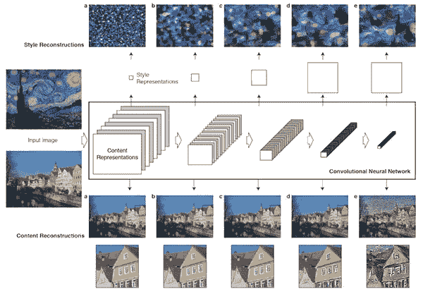

# 基于神经风格转移和张量流的图像生成

> 原文：<https://towardsdatascience.com/images-generation-with-neural-style-transfer-and-tensorflow-a823b0353b06?source=collection_archive---------18----------------------->

## 使用机器学习算法创建独特的图像

## 3 分钟机器学习

3 分钟机器学习是一系列与机器学习世界相关的教程和内容丰富的视频。你可以在 YouTube 上找到完整的视频。[库](https://github.com/GitMarco27/TMML)包含视频中显示的所有文件。这个系列是在实验阶段，完全免费开发，为了娱乐和文化！欢迎任何反馈。

## 为什么要看这篇文章？

本文将介绍如何通过开发一种有趣的机器学习算法来创建独特和原始的图像:**神经风格转移**。我们将看到如何上传已经训练好的**神经网络模型**来加快过程，以及如何上传自己的照片来测试算法并生成自己的图像。

下面是我们最终结果的预览:

神经风格转移应用程序—图片由作者提供

## 神经类型转移

神经类型转移是一种优化技术。它的实现包括使用两个图像:一个表示主要内容(**内容**图像)，另一个表示代表我们希望获得的图像的样式(**样式引用**图像)。该算法混合这些图像，获取内容图像并对其应用样式参考图像。这是通过优化最终图像以匹配内容图像的**内容统计**和**样式参考图像的样式统计**来完成的。该算法的实现涉及卷积网络的使用。

神经类型转移工作原理—学分:[篇](https://arxiv.org/abs/1508.06576)

更多信息请参考 Tensorflow 原创[文章](https://arxiv.org/abs/1508.06576)或者这个有趣的[教程](https://www.tensorflow.org/tutorials/generative/style_transfer)。

## 代码

代码需要导入几个库和定义一些环境变量。 **Matplotlib** 用于图像绘制， **Tensorflow** 和 **Keras** 用于代理模型管理和图像预处理， **os** 系统库用于定义一些系统变量， **NumPy** 作为数值分析的基本工具。我们直接从 **Google Colab** 导入一些工具，方便直接从你的 PC 导入图片。

剩下的工作就是导入我们想要执行分析的图像。请记住，第一个将是基础图像，它将为最终结果分配主题(**内容**图像)。第二个将分配样式(**样式参考**图像)。这段代码非常有用，因为它允许我们用几行代码直接从本地存储空间上传图像文件，同时在代码共享的情况下创建与用户的交互界面(如本例所示)。我们注意到，正如所写的，这段代码允许同时导入几个图像，但是在这种情况下，我们只需要两个图像:只有最后一个将被存储。图像会自动上传并保存在您的工作区中。

让我们定义一些有用的函数:

**tensor_to_image** 允许将 TensorFlow 张量转换为图像文件，并以此表示。 **load_img** 从所需路径加载图像。 **imshow** 允许我们可视化一个图像，注意输入文件的大小。

让我们展示这些图像:

让我们创建我们的 ***神经风格转移模型*** :

要开发 **Tensorflow Hub** 的潜力，只需:

*   从 **Tensorflow Hub** 加载预训练模型
*   生成新的风格化图像，将我们的两个图像作为常量张量流张量传递给模型
*   将新图像转换为图像
*   让我们来想象一下结果吧！

神经风格转移应用程序—图片由作者提供

让我们添加一些 Python 命令来自动命名和下载新图像:

# 结论

我希望你喜欢这篇文章的内容。我提醒你，你可以在这里找到[源代码](https://github.com/GitMarco27/TMML/blob/5727dc3f4f87885d1e05863427cbe4ae6b6ea1fe/Notebooks/002_Style_Transfer.ipynb)，在 GitHub 和 [YouTube](https://www.youtube.com/channel/UCExkeDZ9WC0tg9aoFMsNF0w) 上可以找到完整的[库](https://github.com/GitMarco27/TMML)。
下次见，
马可