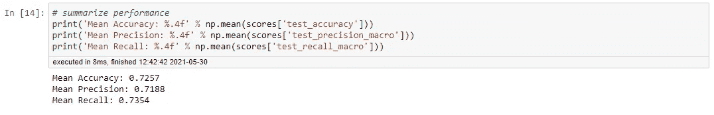

# Python 中的不平衡分类:SMOTE-ENN 方法

> 原文：<https://towardsdatascience.com/imbalanced-classification-in-python-smote-enn-method-db5db06b8d50?source=collection_archive---------1----------------------->


奥马尔·弗洛雷斯在 [Unsplash](https://unsplash.com?utm_source=medium&utm_medium=referral) 上拍摄的照片

## 使用 Python 将 SMOTE 与编辑过的最近邻(ENN)相结合以平衡数据集

## 动机

在分类建模中，有许多方法可以通过过采样少数类或欠采样多数类来克服不平衡数据集。为了进一步提高模型性能，许多研究人员建议结合过采样和欠采样方法来更好地平衡数据集。

在我的[上一篇文章](/imbalanced-classification-in-python-smote-tomek-links-method-6e48dfe69bbc)中，我已经解释过采样和欠采样相结合的方法之一，称为 SMOTE-Tomek 链接方法。这一次，我将通过结合 SMOTE 和编辑最近邻(ENN)方法(简称 SMOTE-ENN)及其使用 Python 的实现来解释另一种变体。

## 概念:K-最近邻(KNN)

KNN 的思想是假设基于距离的每个数据的最近邻具有相似的类。**当数据集中的新观测值存在时，KNN 将搜索其 K-最近邻，以确定新观测值将属于的类别**。许多距离度量可用于计算 KNN 的每个观察距离，但最常用的是使用**欧几里德距离**。

例如，假设数据集由两个类组成，黑色和白色。现在，假设有一个未知类的新观察。通过使用 KNN，如果大部分新观测值的 K-最近邻属于黑色类，那么新观测值将属于该黑色类，反之亦然。

给定由 N 个观测值组成的数据集，KNN 的算法可以解释如下。

1.  将 K 确定为最近邻居的数量。
2.  对于数据集中的每个观测值，计算每个观测值之间的距离，然后将距离和观测值添加到有序集。
3.  根据距离按升序对距离和观测值的有序集合进行排序。
4.  从排序的有序集合中挑选前 K 个条目。换句话说，选择每个观察值的 K 个最近邻。
5.  从选定的 K 个条目中返回多数类。

## 概念:编辑过的最近邻(ENN)

由 Wilson (1972)开发的 ENN 方法的工作原理是首先找到每个观测值的 K-最近邻，然后检查来自观测值的 K-最近邻的多数类是否与观测值的类相同。如果观测值的 K-最近邻的多数类和观测值的类不同，则从数据集中删除观测值及其 K-最近邻。默认情况下，ENN 使用的最近邻数为 K=3。

ENN 的算法可以解释如下。

1.  给定具有 N 个观测值的数据集，将 K 确定为最近邻的数量。如果不确定，那么 K=3。
2.  在数据集中的其他观测值中查找该观测值的 K-最近邻，然后从 K-最近邻返回多数类。
3.  如果观测值的类和观测值的 K-最近邻中的多数类不同，则从数据集中删除观测值及其 K-最近邻。
4.  重复第 2 步和第 3 步，直到达到每个类别的期望比例。

此方法比托梅克链接更有效，在托梅克链接中，当观测值的类与观测值的 K-最近邻的多数类不同时，ENN 会移除观测值及其 K-最近邻，而不是仅移除具有不同类的观测值及其 1-最近邻。因此，可以预期 ENN 会比 Tomek 链接提供更深入的数据清理。

## 斯莫特-ENN 方法

该方法由巴蒂斯塔*等人* (2004)开发，结合了 SMOTE 为少数类生成合成样本的能力和 ENN 从两个类中删除一些观察值的能力，这些观察值被识别为在观察值的类和其 K-最近邻多数类之间具有不同的类。SMOTE-ENN 的过程可以解释如下。

1.  (**开始 SMOTE** )从少数类中选择随机数据。
2.  计算随机数据与其 k 个最近邻之间的距离。
3.  将差值乘以 0 到 1 之间的随机数，然后将结果添加到少数类作为合成样本。
4.  重复步骤 2-3，直到达到所需的少数族裔比例。(**击打结束**)
5.  (**ENN 的开始**)确定 K，作为最近邻居的数量。如果不确定，那么 K=3。
6.  在数据集中的其他观测值中查找该观测值的 K-最近邻，然后从 K-最近邻返回多数类。
7.  如果观测值的类和观测值的 K-最近邻中的多数类不同，则从数据集中删除观测值及其 K-最近邻。
8.  重复第 2 步和第 3 步，直到达到每个类别的期望比例。(**ENN 结束**

为了在实践中更好地理解这种方法，这里我将使用`imbalanced-learn`库给出 SMOTE-ENN 在 Python 中的一些实现。对于本文，我将通过使用`AdaBoostClassifier`使用 AdaBoost 分类器。为了评估我们的模型，这里我将使用重复分层交叉验证方法。

## 履行

为了实现，这里我使用来自 Kaggle 的 [Pima Indians 糖尿病数据库](https://www.kaggle.com/uciml/pima-indians-diabetes-database)。这个数据集中的文件名是`diabetes.csv`。


皮马印第安人糖尿病数据库(图片取自 [Kaggle](https://www.kaggle.com/uciml/pima-indians-diabetes-database)

首先，我们需要导入我们需要的数据和库，如下所示。


让我们来看看数据描述，并检查数据集中是否有任何缺失值，如下所示。

```
> data.info()
<class 'pandas.core.frame.DataFrame'>
RangeIndex: 768 entries, 0 to 767
Data columns (total 9 columns):
 #   Column                    Non-Null Count  Dtype  
---  ------                    --------------  -----  
 0   Pregnancies               768 non-null    int64  
 1   Glucose                   768 non-null    int64  
 2   BloodPressure             768 non-null    int64  
 3   SkinThickness             768 non-null    int64  
 4   Insulin                   768 non-null    int64  
 5   BMI                       768 non-null    float64
 6   DiabetesPedigreeFunction  768 non-null    float64
 7   Age                       768 non-null    int64  
 8   Outcome                   768 non-null    int64  
dtypes: float64(2), int64(7)
memory usage: 54.1 KB> data.isnull().sum()
Pregnancies                 0
Glucose                     0
BloodPressure               0
SkinThickness               0
Insulin                     0
BMI                         0
DiabetesPedigreeFunction    0
Age                         0
Outcome                     0
dtype: int64
```

我们可以看到数据集中没有丢失的值，所以我们可以跳到下一步，我们需要通过编写如下代码行来计算属于`Outcome`变量中每个类的数据的数量。

```
> data['Outcome'].value_counts()
0    500
1    268
```

数据非常不平衡，多数阶级属于“0”(我们称之为负)标签，少数阶级属于“1”(我们称之为正)标签。接下来，我们通过编写如下代码将数据分为特性和目标。

```
Y=data['Outcome'].values #Target
X=data.drop('Outcome',axis=1) #Features
```

预处理完成。现在，让我们跳到建模过程。为了给你一些性能比较，**这里我创建了两个模型，其中第一个没有使用任何不平衡数据处理，而另一个使用 SMOTE-ENN 方法来平衡数据**。

在不使用 SMOTE-ENN 平衡数据的情况下，产生的模型性能如下。

```
Mean Accuracy: 0.7535
Mean Precision: 0.7346
Mean Recall: 0.7122
```


我们可以看到，准确率分数相当高，但召回分数略低(大约 0.7122)。这意味着正确预测少数类标签的模型性能不够好。

让我们使用 SMOTE-ENN 来平衡我们的数据集，看看有什么不同。**注意，我在** `**EditedNearestNeighbours**` **中使用的** `**sampling_strategy**` **是** `**'all'**` **，因为 ENN 的目的是从两个类中删除一些观察值，这些观察值被识别为在观察值的类与其 K 近邻多数类之间具有不同的类。**

```
Mean Accuracy: 0.7257
Mean Precision: 0.7188
Mean Recall: 0.7354
```



我们可以看到，召回分数增加，虽然准确性和精确度分数略有下降。这意味着通过使用 SMOTE-ENN 平衡数据，正确预测少数类标签的模型性能正在变得更好。

## 结论

我们到了。现在，您已经了解了如何使用 SMOTE-ENN 方法来平衡分类建模中使用的数据集，从而提高模型性能。像往常一样，如果您有任何问题，请随时提问和/或讨论！

我的下一篇文章再见！一如既往，保持健康，保持安全！

## 作者的联系人

领英:[拉登·奥勒留和希卡·维亚迪努格罗霍](https://www.linkedin.com/in/raden-aurelius-andhika-viadinugroho-b84b19163/)

中:【https://medium.com/@radenaurelius】T2

## 参考

[1]舒拉、鲍耶、霍尔和凯格尔迈耶(2002 年)。 [SMOTE:合成少数过采样技术](https://arxiv.org/abs/1106.1813)。《人工智能研究杂志》，第 16 卷，第 321–357 页。

[https://www.kaggle.com/uciml/pima-indians-diabetes-database](https://www.kaggle.com/uciml/pima-indians-diabetes-database)

[3]何和马，杨(2013)。 [*不平衡学习:基础、算法、应用*](https://www.wiley.com/en-us/Imbalanced+Learning%3A+Foundations%2C+Algorithms%2C+and+Applications-p-9781118074626) 。第一版。威利。

[4]盖，T. M .和哈特，P. E. (1967 年)。[最近邻模式分类](https://ieeexplore.ieee.org/abstract/document/1053964?casa_token=lPmnigNVCooAAAAA:FiwjJ9K8QRVTra-GkyoxWbQigU7hcZiKShUSTSSb0D1Sq7npSi3FXW7a4swOaKAJ2pWab9yMQcbMGzw)。 *IEEE 信息论汇刊*，第 13 卷，第 1 期，第 21–27 页。

[5]韩，j .，Kamber，m .，和裴，J. (2012 年)。 [*数据挖掘概念与技术*](https://www.sciencedirect.com/book/9780123814791/data-mining-concepts-and-techniques) 。第三版。波士顿:爱思唯尔。

[6]威尔逊法学博士(1972 年)。[使用编辑数据的最近邻规则的渐近性质](https://ieeexplore.ieee.org/abstract/document/4309137/?casa_token=kvUJIlb4SMkAAAAA:66UtLLyzOyyDuDtadNIHMAVSRBR69bmBE3H9anLqJbvbL_OpeJPhZ13afAmPqbgL6PNIr0Y18Ml3_gY)。 *IEEE 系统、人和控制论汇刊*，SMC-2 卷，第 3 期，第 408-421 页。

[7]巴蒂斯塔，两性平等协会，普拉蒂共和国，和莫纳德，M. C. (2004 年)。[对平衡机器学习训练数据的几种方法的行为的研究](https://dl.acm.org/doi/abs/10.1145/1007730.1007735)。 *ACM SIGKDD 探索时事通讯*，第 6 卷，第 1 期，第 20–29 页。

[8][https://unbalanced-learn . org/stable/references/generated/imb learn . combine . smote enn . html](https://imbalanced-learn.org/stable/references/generated/imblearn.combine.SMOTEENN.html)