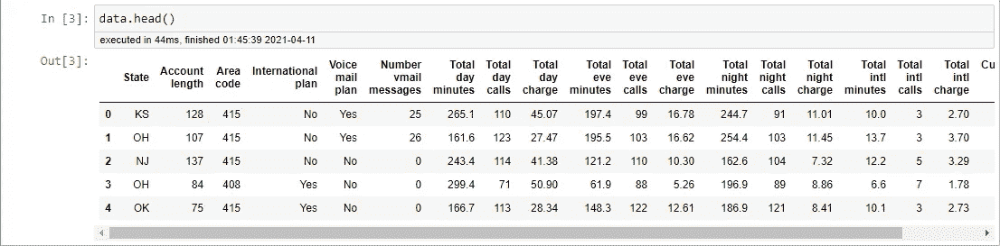

# Python 中的不平衡分类:SMOTE-Tomek 链接方法

> 原文：<https://towardsdatascience.com/imbalanced-classification-in-python-smote-tomek-links-method-6e48dfe69bbc?source=collection_archive---------9----------------------->


[马太·亨利](https://unsplash.com/@matthewhenry?utm_source=medium&utm_medium=referral)在 [Unsplash](https://unsplash.com?utm_source=medium&utm_medium=referral) 上拍照

## 结合 SMOTE 和 Tomek 链接的 Python 不平衡分类

## 动机

在实际应用中，分类建模经常会遇到不平衡数据集问题，多数类的数量远大于少数类，从而使模型无法很好地从少数类中学习。当来自少数类的数据集中的信息更重要时，例如疾病检测数据集、客户流失数据集和欺诈检测数据集，这就成为一个严重的问题。

解决这种不平衡数据集问题的一种流行方法是对少数类进行过采样或对多数类进行欠采样。然而，这些方法都有自己的弱点。在普通的过采样方法中，想法是从少数类中复制一些随机样本，因此这种技术不会从数据中添加任何新信息。相反，欠采样方法是通过从多数类中移除一些随机样本来进行的，代价是原始数据中的一些信息也被移除。

克服这一弱点的解决方案之一是从现有的少数类中生成新的综合示例。这种方法就是众所周知的**合成少数过采样技术**或 **SMOTE** 。SMOTE 有许多变体，但在本文中，我将解释 SMOTE-Tomek 链接方法及其使用 Python 的实现，其中该方法结合了 SMOTE 的过采样方法和 Tomek 链接的欠采样方法。

## 概念:SMOTE

SMOTE 是最流行的过采样技术之一，由 Chawla *等人*开发。(2002).与仅从少数类中复制一些随机样本的随机过采样不同，SMOTE 基于每个数据的距离(通常使用欧氏距离)和少数类最近邻来生成样本，因此生成的样本与原始少数类不同。

简而言之，生成合成样本的过程如下。

1.  从少数类中选择随机数据。
2.  计算随机数据与其 k 个最近邻之间的欧几里德距离。
3.  将差值乘以 0 到 1 之间的随机数，然后将结果添加到少数类作为合成样本。
4.  重复该过程，直到达到所需的少数族裔比例。

这种方法是有效的，因为生成的合成数据与少数类上的特征空间相对接近，从而在数据上添加了新的“信息”，这与原始过采样方法不同。

## 概念:托梅克链接

Tomek 链接是由 Tomek (1976)开发的压缩最近邻(CNN，不要与卷积神经网络混淆)欠采样技术的修改之一。与 CNN 方法不同，其仅从想要移除的多数类中随机选择具有 k 个最近邻的样本，Tomek Links 方法使用规则来选择满足这些属性的观测值对(例如， **a** 和 **b** ):

1.  观测值 **a** 的最近邻居是 **b** 。
2.  观测值 **b** 的最近邻居是 **a** 。
3.  观察值 **a** 和 **b** 属于不同的类别。即 **a** 和 **b** 分别属于少数派和多数派阶级(或者*反之*)。

数学上可以表述如下。

> 设 d(x_i，x_j)表示 x_i 和 x_j 之间的欧几里德距离，其中 x_i 表示属于少数类的样本，x_j 表示属于多数类的样本。如果没有样本，x_k 满足以下条件:
> 
> 1.d(x_i，x_k) < d(x_i, x_j), or
> 2。d(x j，x k)<d(x I，x j)
> 
> 那么(x_i，x_j)对就是一个**托梅克链**。

该方法可用于从与少数类数据具有最低欧几里德距离的多数类中找到所需的数据样本(即，来自与少数类数据最接近的多数类的数据，从而使其模糊不清)，然后将其移除。

## **SMOTE-Tomek 链接**

首先由巴蒂斯塔*等人*介绍。(2003)，该方法结合了 SMOTE 为少数类生成合成数据的能力和 Tomek 链接从多数类中移除被识别为 Tomek 链接的数据的能力(即，来自与少数类数据最接近的多数类的数据样本)。SMOTE-Tomek 链接的过程如下。

1.  (**SMOTE 的开始**)从少数类中选择随机数据。
2.  计算随机数据与其 k 个最近邻之间的距离。
3.  将差值乘以 0 到 1 之间的随机数，然后将结果添加到少数类作为合成样本。
4.  重复步骤 2-3，直到达到所需的少数族裔比例。(**击打结束**)
5.  (**Tomek 链接的开始**)从多数类中选择随机数据。
6.  如果随机数据的最近邻是来自少数类的数据(即创建 Tomek 链接)，则移除 Tomek 链接。

为了在实践中更好地理解这种方法，这里我将给出一些如何使用`imbalanced-learn`库(或简称为`imblearn`)在 Python 中实现 SMOTE-Tomek 链接的例子。我们将使用的模型是通过使用`RandomForestClassifier`随机森林。**对于评估程序，这里我将使用重复分层 K-fold 交叉验证方法**，以确保我们在每次重复中以不同的随机化保留每个 fold 中每个类别的样本百分比(即每个 fold 在每个类别中必须有一些样本)。

## **实现:合成数据集**

对于第一个例子，我将使用来自`sklearn.datasets`库的`make_classification`生成的合成数据集。首先，我们需要导入库(第二个例子中也会用到这些库)。

```
import pandas as pd
import numpy as np
from imblearn.pipeline import Pipeline
import matplotlib.pyplot as plt
from sklearn.datasets import make_classification
from sklearn.model_selection import cross_validate
from sklearn.model_selection import RepeatedStratifiedKFold
from sklearn.ensemble import RandomForestClassifier
from imblearn.combine import SMOTETomek
from imblearn.under_sampling import TomekLinks
```

接下来，我们通过编写这些代码行来生成我们想要使用的合成数据。

```
#Dummy dataset study case
X, Y = make_classification(n_samples=10000, n_features=4, n_redundant=0,
                           n_clusters_per_class=1, weights=[0.99], flip_y=0, random_state=1)
```

我们可以从`weights`参数中看到，数据集将包含 99%属于多数类的数据，而其余的属于少数类。

在这里，我创建了两个模型— **,第一个模型不使用任何不平衡数据处理，而另一个模型使用 SMOTE-Tomek 链接方法**,为您提供使用和不使用 SMOTE-Tomek 链接不平衡处理方法的一些性能比较。

```
## No Imbalance Handling
# Define model
model_ori=RandomForestClassifier(criterion='entropy')
# Define evaluation procedure (here we use Repeated Stratified K-Fold CV)
cv_ori=RepeatedStratifiedKFold(n_splits=10, n_repeats=3, random_state=1)
# Evaluate model
scoring=['accuracy','precision_macro','recall_macro']
scores_ori = cross_validate(model_ori, X, Y, scoring=scoring, cv=cv_ori, n_jobs=-1)# summarize performance
print('Mean Accuracy: %.4f' % np.mean(scores_ori['test_accuracy']))
print('Mean Precision: %.4f' % np.mean(scores_ori['test_precision_macro']))
print('Mean Recall: %.4f' % np.mean(scores_ori['test_recall_macro']))
```

如果没有 SMOTE-Tomek 链接，产生的模型性能如下。

```
Mean Accuracy: 0.9943
Mean Precision: 0.9416
Mean Recall: 0.7480
```

正如我们可以从不平衡的数据集预期的那样，**准确性指标得分非常高，但是召回指标得分非常低**(大约 0.748)。这意味着模型未能很好地“学习”少数民族类别，因此未能正确预测少数民族类别标签。

让我们看看是否可以通过使用 SMOTE-Tomek 链接来处理不平衡的数据，从而提高模型的性能。

```
## With SMOTE-Tomek Links method
# Define model
model=RandomForestClassifier(criterion='entropy')
# Define SMOTE-Tomek Links
resample=SMOTETomek(tomek=TomekLinks(sampling_strategy='majority'))
# Define pipeline
pipeline=Pipeline(steps=[('r', resample), ('m', model)])
# Define evaluation procedure (here we use Repeated Stratified K-Fold CV)
cv=RepeatedStratifiedKFold(n_splits=10, n_repeats=3, random_state=1)
# Evaluate model
scoring=['accuracy','precision_macro','recall_macro']
scores = cross_validate(pipeline, X, Y, scoring=scoring, cv=cv, n_jobs=-1)# summarize performance
print('Mean Accuracy: %.4f' % np.mean(scores['test_accuracy']))
print('Mean Precision: %.4f' % np.mean(scores['test_precision_macro']))
print('Mean Recall: %.4f' % np.mean(scores['test_recall_macro']))
```

结果如下。

```
Mean Accuracy: 0.9805
Mean Precision: 0.6499
Mean Recall: 0.8433
```

**准确度和精确度指标可能会下降，但我们可以看到召回指标更高**，这意味着通过使用 SMOTE-Tomek 链接处理不平衡数据，该模型在正确预测少数类标签方面表现更好。

## **实施:电信流失数据集**

对于第二个例子，这里我使用来自 Kaggle 的[电信客户流失数据集](https://www.kaggle.com/mnassrib/telecom-churn-datasets?select=churn-bigml-80.csv)。这个数据集中有两个数据文件，但是在本文中，我将使用`churn-bigml-80.csv`数据文件。


电信客户流失数据集(图片取自 [Kaggle](https://www.kaggle.com/mnassrib/telecom-churn-datasets)

首先，我们导入库(就像第一个例子)和数据，如下所示。

```
data=pd.read_csv("churn-bigml-80.csv")
data.head()
```



让我们看看数据描述，找出每个变量的类型。

```
> data.info()<class 'pandas.core.frame.DataFrame'>
RangeIndex: 2666 entries, 0 to 2665
Data columns (total 20 columns):
 #   Column                  Non-Null Count  Dtype  
---  ------                  --------------  -----  
 0   State                   2666 non-null   object 
 1   Account length          2666 non-null   int64  
 2   Area code               2666 non-null   int64  
 3   International plan      2666 non-null   object 
 4   Voice mail plan         2666 non-null   object 
 5   Number vmail messages   2666 non-null   int64  
 6   Total day minutes       2666 non-null   float64
 7   Total day calls         2666 non-null   int64  
 8   Total day charge        2666 non-null   float64
 9   Total eve minutes       2666 non-null   float64
 10  Total eve calls         2666 non-null   int64  
 11  Total eve charge        2666 non-null   float64
 12  Total night minutes     2666 non-null   float64
 13  Total night calls       2666 non-null   int64  
 14  Total night charge      2666 non-null   float64
 15  Total intl minutes      2666 non-null   float64
 16  Total intl calls        2666 non-null   int64  
 17  Total intl charge       2666 non-null   float64
 18  Customer service calls  2666 non-null   int64  
 19  Churn                   2666 non-null   bool   
dtypes: bool(1), float64(8), int64(8), object(3)
memory usage: 398.5+ KB
```

然后，我们检查数据中是否存在缺失值，如下所示。

```
> data.isnull().sum()State                     0
Account length            0
Area code                 0
International plan        0
Voice mail plan           0
Number vmail messages     0
Total day minutes         0
Total day calls           0
Total day charge          0
Total eve minutes         0
Total eve calls           0
Total eve charge          0
Total night minutes       0
Total night calls         0
Total night charge        0
Total intl minutes        0
Total intl calls          0
Total intl charge         0
Customer service calls    0
Churn                     0
dtype: int64
```

没有缺失值！接下来，我们通过编写如下代码来计算属于`Churn`变量中每个类的数据数量。

```
> data['Churn'].value_counts()False    2278
True      388
```

数据相当不平衡，其中多数阶级属于`False`标签(我们将其标记为 0)，少数阶级属于`True`标签(我们将其标记为 1)。

对于下一个预处理步骤，我们删除`State`变量(因为它包含了太多的类别)，然后我们重新编码`Churn`变量(False=0，True=1)，并通过编写这些代码行来创建虚拟变量。

```
data=data.drop('State',axis=1)
data['Churn'].replace(to_replace=True, value=1, inplace=True)
data['Churn'].replace(to_replace=False,  value=0, inplace=True)
df_dummies=pd.get_dummies(data)
df_dummies.head()#Churn dataset study case
Y_churn=df_dummies['Churn'].values
X_churn=df_dummies.drop('Churn',axis=1)
```

数据预处理完成。现在，我们使用与第一个例子相同的方法进行建模。

```
## No Imbalance Handling
# Define model
model2_ori=RandomForestClassifier(criterion='entropy')
# Define evaluation procedure (here we use Repeated Stratified K-Fold CV)
cv2_ori=RepeatedStratifiedKFold(n_splits=10, n_repeats=3, random_state=1)
# Evaluate model
scoring=['accuracy','precision_macro','recall_macro']
scores2_ori = cross_validate(model2_ori, X_churn, Y_churn, scoring=scoring, cv=cv2_ori, n_jobs=-1)# summarize performance
print('Mean Accuracy: %.4f' % np.mean(scores2_ori['test_accuracy']))
print('Mean Precision: %.4f' % np.mean(scores2_ori['test_precision_macro']))
print('Mean Recall: %.4f' % np.mean(scores2_ori['test_recall_macro']))
```

如果没有不平衡的数据处理，结果如下。

```
Mean Accuracy: 0.9534
Mean Precision: 0.9503
Mean Recall: 0.8572
```

**请记住，我们使用的数据是不平衡的，因此我们不能仅仅通过观察精确度指标来简单地说模型性能良好**。尽管准确性指标得分相当高，但召回指标得分仍然不够高，这意味着该模型正在努力正确预测少数类标签(即被重新编码为 1 的`True`标签)。

现在，让我们对数据进行 SMOTE-Tomek 链接方法，以查看性能改进。

```
## With SMOTE-Tomek Links method
# Define model
model2=RandomForestClassifier(criterion='entropy')
# Define SMOTE-Tomek Links
resample2=SMOTETomek(tomek=TomekLinks(sampling_strategy='majority'))
# Define pipeline
pipeline2=Pipeline(steps=[('r', resample2), ('m', model2)])
# Define evaluation procedure (here we use Repeated Stratified K-Fold CV)
cv2=RepeatedStratifiedKFold(n_splits=10, n_repeats=3, random_state=1)
# Evaluate model
scoring=['accuracy','precision_macro','recall_macro']
scores2 = cross_validate(pipeline2, X_churn, Y_churn, scoring=scoring, cv=cv2, n_jobs=-1)# summarize performance
print('Mean Accuracy: %.4f' % np.mean(scores2['test_accuracy']))
print('Mean Precision: %.4f' % np.mean(scores2['test_precision_macro']))
print('Mean Recall: %.4f' % np.mean(scores2['test_recall_macro']))
```

结果如下。

```
Mean Accuracy: 0.9449
Mean Precision: 0.8981
Mean Recall: 0.8768
```

准确度和精确度分数可能会稍微降低，但是召回分数会增加！这意味着该模型能够更好地正确预测该流失数据集中的少数类标签。

## **结论**

就是这样！现在，您将了解如何在 Python 中使用 SMOTE-Tomek Links 方法来提高不平衡数据集中分类模型的性能。像往常一样，如果您有任何问题，请随时提问和/或讨论！

我的下一篇文章再见！保持安全，保持健康！

## **作者的联系方式**

领英:[拉登·奥勒留和希卡·维亚迪努格罗霍](https://www.linkedin.com/in/raden-aurelius-andhika-viadinugroho-b84b19163/)

中:[https://medium.com/@radenaurelius](https://medium.com/@radenaurelius)

## 参考

[1]舒拉、鲍耶、霍尔和凯格尔迈耶(2002 年)。 [SMOTE:合成少数过采样技术](https://arxiv.org/abs/1106.1813)。*人工智能研究杂志*，第 16 卷，第 321–357 页。

[2]https://www.kaggle.com/mnassrib/telecom-churn-datasets

[3]托梅克，1976 年。[CNN 的两次修改](https://ieeexplore.ieee.org/document/4309452)。 *IEEE 系统、人和控制论汇刊*，第 6 卷，第 11 期，第 769-772 页。

[4]何和马，杨(2013)。 [*不平衡学习:基础、算法、应用*](https://www.wiley.com/en-us/Imbalanced+Learning%3A+Foundations%2C+Algorithms%2C+and+Applications-p-9781118074626) 。第一版。威利。

[5]曾，m，邹，b，魏，f，刘，x，王，L. (2016)。[结合 SMOTE 和 Tomek links 技术对不平衡医疗数据进行有效预测](https://ieeexplore.ieee.org/abstract/document/7563084?casa_token=_0SmM6ilaTQAAAAA:sLVb6VptUVi5N8dGd2nMCQuumxpFv0iL66P8gT5Im-xJm58f-OUFMexDf3cEDrSTdPa25RIQuENi)。 *2016 年 IEEE 在线分析与计算科学国际会议(ICOACS)* ，第 225–228 页。

[6] Batista，G. E. A. P. A .，Bazzan，A. L. C .和 Monard，M. A. (2003 年)。[平衡关键字自动标注的训练数据:案例研究](http://www.inf.ufrgs.br/maslab/pergamus/pubs/balancing-training-data-for.pdf)。*第二届巴西生物信息学研讨会会议录*，第 35-43 页。

[7][https://sci kit-learn . org/stable/modules/cross _ validation . html](https://scikit-learn.org/stable/modules/cross_validation.html)