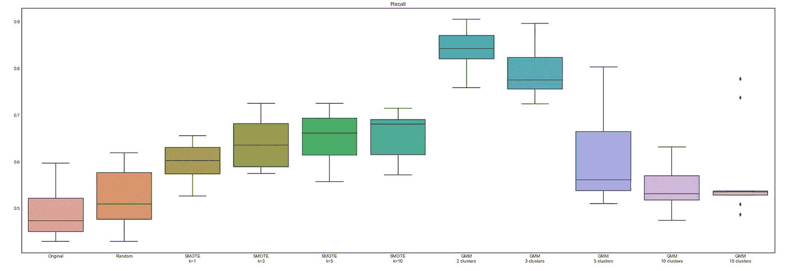

# 不平衡数据—使用高斯混合模型进行过采样

> 原文：<https://towardsdatascience.com/imbalanced-data-oversampling-using-gaussian-mixture-models-dfb5b8dd5825?source=collection_archive---------23----------------------->

## 其他创成式模型也可以类似地用于过采样


图片来自[皮克斯拜](https://pixabay.com/?utm_source=link-attribution&utm_medium=referral&utm_campaign=image&utm_content=5029714)

**TL；DR** —从高斯混合模型(GMM)或其他生成模型中提取样本，是另一种创造性的过采样技术，可能优于 SMOTE 变体。

## 目录

*   介绍
*   数据集准备
*   GMM 介绍
*   使用 GMM 作为过采样技术
*   绩效指标的评估
*   结论

## 介绍

在[之前的文章](/imbalanced-data-oversampling-using-genetic-crossover-operators-bb581150a9a8)中，我讨论了一个人如何想出许多能够胜过 SMOTE 变体的创造性过采样技术。我们看到了使用“交叉”的过采样如何优于 SMOTE 变体。

在本文中，我们将展示如何使用**高斯混合模型(GMM)** 或生成模型对**不平衡数据集**中的少数类实例进行过采样。

## 数据集准备

我们首先使用 scikit-learn 的 make_classification 函数生成一个包含两个类的 5000 个数据点的图像分类数据集(二元分类)。有 95%的可能性目标是 0，有 5%的可能性目标是 1。我们准备了一个类似于[上一篇文章](/imbalanced-data-oversampling-using-genetic-crossover-operators-bb581150a9a8)的数据集。

```
from sklearn.datasets import make_classification
import seaborn as snsX, y = make_classification(
    n_samples=5000, n_classes=2, 
    weights=[0.95, 0.05], flip_y=0
)sns.countplot(y)
plt.show()
```


为练习生成的不平衡数据集(图片由作者提供)

默认情况下会创建 20 个特征，下面是我们的 X 数组中的一个示例条目。


使用 scikit-learn 的 make_classification 创建的包含 20 个特征的示例条目(图片由作者提供)

最后，我们将数据分成训练和测试数据集。

```
from sklearn.model_selection import train_test_split
X_train, X_test, y_train, y_test = train_test_split(X, y)
```

## 高斯混合模型介绍(GMM)

高斯混合模型(GMM)假设数据来自多个正态分布的子群体。

**示例:**假设我们有一万个人的身高数据。下面是一个样本分布。看起来不像钟形正态分布。


万人身高的概率分布(图片由作者提供)

然而，它实际上来自正态分布的平均身高不同的 4 个不同人群。一组的平均身高为 150 厘米，其他组的平均身高分别为 160、170 和 180 厘米。

下面是用于生成图表的代码。您可以看到 4 个不同的组，我们分别从中生成 4000、1000、1000 和 4000 个样本数据，总共 10，000 个样本个体。

```
samples_150 = ss.norm(150, 10).rvs(4000)
samples_160 = ss.norm(160, 10).rvs(1000)
samples_170 = ss.norm(170, 10).rvs(1000)
samples_180 = ss.norm(180, 10).rvs(4000)samples_total = np.hstack([samples_150, samples_160,
                          samples_170, samples_180])plt.figure(figsize=(10, 5))
ax = sns.distplot(samples_total)
ax.set_xlabel("Height (in cm)")
plt.show()
```

各组身高呈正态分布。

```
plt.figure(figsize=(10, 5))
ax = sns.distplot(samples_150)
ax.set_xlabel("Height (in cm)")
plt.show()
```


显示平均身高 150 cm 的群体如何正态分布的示例(图片由作者提供)

GMM 背后的想法是，一个数据集可能有来自不同子群体的观察值，这些子群体有自己的特征。GMM 帮助从数据中提取子群体，这样每个子群体就形成了一个我们可以使用的集群。

## 使用 GMM 作为过采样技术

如果我们回到在“数据集准备”一节中生成的分类数据集，我们可以尝试从数据中提取子群体/聚类。让我们以提取 5 个集群为例。

```
gmm = GaussianMixture(5)
gmm.fit(X_train)
```

就是这样！

在引擎盖下，我们的 GMM 模型现在已经创建了 5 个不同的聚类，它们具有不同的正态分布，反映了每个聚类可以采用的特征值。

下面的示例显示了 20 个特征中每个特征的聚类平均值。

```
pd.DataFrame(gmm.means_.T)
```


例如，我们可以看到，对于特征 1，聚类 0 的平均值为-0.159613(图片由作者提供)

更重要的是，GMM 模型可以帮助我们实现两个功能:

1-它可以查看特定样本的特征值，并将该样本分配给一个聚类。

```
gmm.predict(X_test)
```


示例预测显示 X_test 中的前 3 个样本分别属于聚类 0、2 和 4(图片由作者提供)

2-它可以使用拟合的正态分布来**生成新的样本**，我们可以将其用于**过采样**。

```
gmm.sample(5)
```


生成了具有特征值的 5 个样本，即 X，它们分别属于聚类 0、1、2、2 和 2(图片由作者提供)

最后，在本例中，我们将数据聚类到 5 个不同的桶中，但我们的问题是一个二元分类问题，其中我们的目标变量可以是 0 或 1。

一个想法是检查每个聚类和目标(y)变量之间的关系。

```
cluster_mean = pd.DataFrame(data={
    "Cluster": gmm.predict(X_train), 
    "Mean Target Variable (y)": y_train
}).groupby("Cluster").mean().reset_index(drop=False)plt.figure(figsize=(10, 5))
sns.barplot(data=cluster_mean, x="Cluster", 
     y="Mean Target Variable (y)")
plt.show()
```


聚类 4 与一个积极的目标变量有最强的关联(图片由作者提供)

我们可以看到**集群 4** 的目标值平均值最高，略高于 40%。

> 请记住，这是一个不平衡的数据集，其中只有 5%的样本的目标变量(y)值= 1，因此 40%是一个很大的数字。

最后一步是从 GMM 模型中生成随机样本，并且只保留属于聚类 4 的样本。我们可以用一个正的目标变量(y=1)来标记它们。

```
samples, clusters = gmm.sample(100)
samples_to_keep = samples[clusters==4]
```

我们终于可以将它们添加到我们的训练数据中了！

我们同样可以从与 y=1 关联最强的前 2–3 个集群中抽取样本。或者我们可以从 y 的平均值高于预定义阈值的任何集群中抽取样本。

## 绩效指标的评估

测试这种过采样技术的性能时，我们将使用下面的函数，该函数总结了我们讨论的所有步骤。

```
def oversample_gmm(X, y, rows_1, no_clusters=2, 
                   no_sampling_clusters=1, rs=1):
    # Instantiate GMM model
    gmm = GaussianMixture(
        no_clusters,
        covariance_type='tied', 
        max_iter=10000,
        random_state=rs
    )
    gmm.fit(X)

    # Finding cluster with y=1 most likely
    cluster_mean = pd.DataFrame(data={
        "Cluster": gmm.predict(X_train), 
        "Mean Target Variable (y)": y_train
        }).groupby("Cluster").mean().sort_values(
        by='Mean Target Variable (y)', ascending=False)top_clusters = cluster_mean.sort_values(
        by='Mean Target Variable (y)', ascending=False).index[
        :no_sampling_clusters]

    # Number of rows we will generate before
    # filtering by required cluster.
    # Multiply by 5 to ensure we have sufficient samples
    rows_initial = rows_1 * no_clusters * 5

    # Generate samples
    samples, clusters = gmm.sample(rows_initial)# Keep samples coming from clusters where y=1 is likely
    top_clusters_filter = [np.any([
        cluster == x for x in top_clusters]
        ) for cluster in clusters]
    samples_to_keep = samples[top_clusters_filter]

    # Keep only required number of additional samples
    rows_required = rows_1 - np.sum(y)
    np.random.shuffle(samples_to_keep)
    samples_to_keep = samples_to_keep[:rows_required]

    # Add samples to training dataset
    X_gmm = np.vstack([X, samples_to_keep])
    y_gmm = np.hstack([y, np.ones(samples_to_keep.shape[0])])

    return X_gmm, y_gmm
```

与我们的[上一篇文章](/imbalanced-data-oversampling-using-genetic-crossover-operators-bb581150a9a8)类似，我们遍历了 30 个随机状态，并比较了随机森林分类器在原始数据集和过采样方法上的性能，确保我们有 2000 个具有正目标值(target = 1)的训练样本:

*   随机过采样
*   SMOTE — 1 个邻居
*   SMOTE — 3 个邻居
*   SMOTE — 5 个邻居
*   SMOTE — 10 个邻居
*   GMM — 2
*   GMM — 3
*   GMM — 5
*   GMM — 10
*   GMM——15 人

我们还研究了 7 个**分类指标**:

*   ROC AUC—ROC 曲线下的面积
*   PR AUC——精确召回曲线下的面积
*   平衡的准确性—这也相当于两个标签的宏观平均召回率
*   最大 F1 —不同概率临界值的最大 F1 分数(即，如果我们在预测概率> 0.2 或 0.3 时预测 1，等等。而不是默认的 0.5)
*   回忆
*   精确
*   F1 分数

以下是结果…


SMOTE 在 ROC AUC 上领先(查看中位数)，但 PR AUC 更适合不平衡数据集(图片由作者提供)


GMM 在 PR AUC 上领先 10 或 15，这是不平衡数据集的良好指标(图片由作者提供)


具有 10 个和 15 个簇的 GMM 在 Max F1 上也表现非常好，但是随机过采样稍有优势(图片由作者提供)


拥有两个集群的 GMM 在平衡准确性方面领先(图片由作者提供)



GMM 在回忆方面领先 2 或 3 个集群(图片由作者提供)


原始数据集和具有 10 个聚类的 GMM 在精度指标上领先(图片由作者提供)


具有 5 个以上聚类的 GMM 具有最高的 F1 分数(图片由作者提供)

当然，结果有好有坏。

当查看与不平衡数据集最相关的指标时，具有 10 个聚类的 GMM 是最佳选择:精度-召回曲线、F1 得分和最大 F1(F1 的替代方案，其中我们考虑所有概率阈值)。

## 结论

我们已经展示了另一种用于不平衡数据集的创新而简单的过采样技术如何在几个指标上优于 SMOTE 和随机过采样等默认技术。

同样基于 GMM 的方法也可用于生成合成数据样本，以调整您的预测模型。这在预期会有大量模型/数据漂移并且交叉验证结果会产生误导的用例中尤其有用。

这是一个在后续文章中讨论的话题…