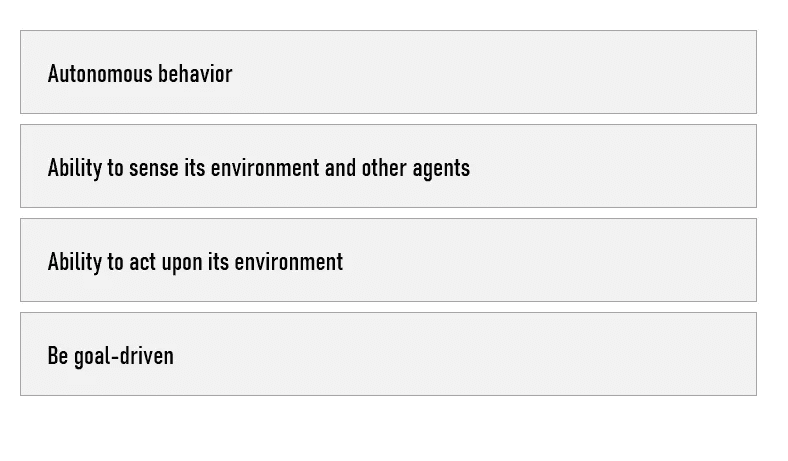
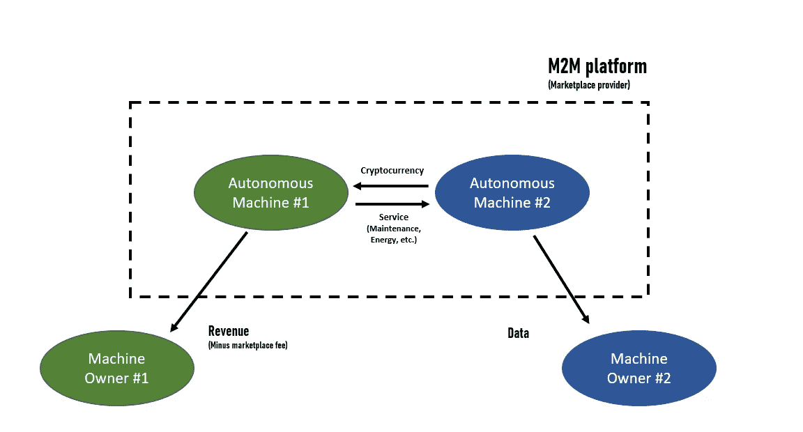
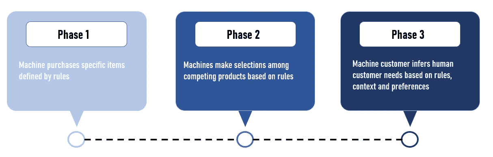
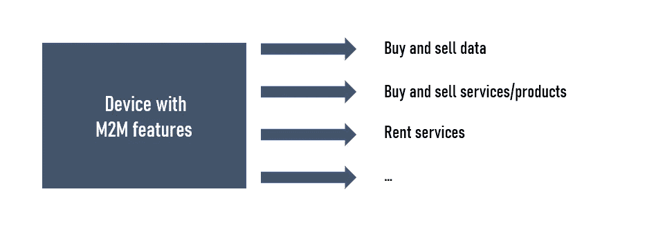
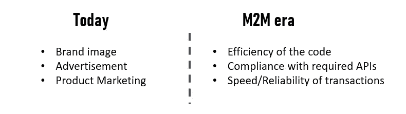

# 人工智能分散自治组织在机器对机器经济中的影响

> 原文：<https://towardsdatascience.com/impact-of-ai-decentralized-autonomous-organizations-in-the-machine-to-machine-economy-2b99a435cdd9?source=collection_archive---------45----------------------->

## 介绍自主经济主体、机器学习和机器对机器经济中的新商业模式(M2M)

纳斯蒂亚·杜尔希尔在 [Unsplash](https://unsplash.com/s/photos/connected?utm_source=unsplash&utm_medium=referral&utm_content=creditCopyText) 上的照片

即将到来的机器对机器(M2M)时代将彻底改变公司和资产的管理方式。因此，大多数现有的商业模式将会过时。

基于这一评估，我接受了为我的客户建立 M2M 战略以及一个试点项目的任务。这一新战略包括创建新的商业模式，选择新的机器学习方法，以及确定可能的技术合作伙伴。

在本文中，您将了解未来的关键概念，如自主经济主体，发现 M2M 用例，以及公司如何从数据角度重塑自己以保持相关性。

# 机器对机器经济介绍(M2M)

M2M 时代的特点是，消费者/公司将**拥有更少的**资产和机器，同时共享更多的**数据。**

**我们将更加依赖自主机器来代表我们采购和签订合同**。最终，“这些机器将自主决策，买卖服务，作为市场参与者的新资产类别参与未来经济”( [1](https://theworldwecreate.net/insights/four-steps-in-the-evolution-of-the-machine-economy) ): **自主经济代理人(AEA)** 或**自主智能代理人(AIA)** 。

根据 Anton Korinek 的说法，要被视为智能代理，计算机系统必须具有以下特性( [2](https://ideas.darden.virginia.edu/the-rise-of-artificially-intelligent-agents-part-1) ):

作者图片，想法来自迈克尔·j·伍尔德里奇，“智能代理”，在韦斯·格哈德(编辑。)*多智能体系统:分布式人工智能的现代方法，*剑桥，马萨诸塞州，麻省理工学院

M2M 经济的定义是，智能机器决定购买什么，以什么价格购买，并在没有中间人的情况下通过区块链分布式账本完成交易。

**机器之间的微支付**可以带来更高的效率，例如寻找特定备件的汽车、无人机或农场可以直接相互协商以实现其目标(建筑工地、维护工作等)。)而不需要人类的参与。

由于**多代理人工智能系统**和**分散的自治组织**，机器将有能力出租自己，雇佣维护专业人员，并支付更换零件的费用。

在这种新经济中，每台机器都有不同的能力，但有一条共同的线索将它们联系在一起——相互生产和消费商品和服务的能力。此外，这些智能代理/机器能够协商价格(并发现新的提供商)以自主运行。

> 参与 M2M 交易的设备可以被编程为基于个人或商业需求进行购买。

# 它是如何工作的

简而言之，加密货币和智能合约使自动机器在区块链上相互交易成为可能。微支付渠道和纳米支付在 M2M 经济中将非常有用。我相信 M2M 经济中的大多数机器都会有某种数字钱包和 ID。

机器学习在 M2M 通信发展中的作用至关重要。事实上，机器学习提供了获取物联网生成的数据并将其转换为支付决策的能力，从而消除了用户的明确决策。

> **用例#1 —来自** [**戴姆勒卡车**](https://media.daimler.com/marsMediaSite/en/instance/ko/Pilot-project-Daimler-Trucks-is-teaching-trucks-how-to-pay.xhtml?oid=44097488)的试点项目戴姆勒一直致力于与卡车相关的 M2M 项目。事实上，他们希望他们的卡车能够“自主地与其他机器通信，并执行具有法律约束力的交易，如支付。这个想法是让汽车拥有自己的装有电子货币的钱包，这样就可以不用人工干预就能支付燃料或通行费”。
> 
> 在大多数 M2M 项目中，数字身份证和钱包是必需的。因此，他们的试点项目包括“卡车 ID 和卡车钱包，它们还可以通过证明卡车何时由哪个用户使用来部分接管对分包商的控制和计费。
> 
> M2M 通信可以创建多个新的用例。例如，车辆租赁和短期使用合同(如“按使用付费”)的“平均**处理”可以直接由卡车本身控制:客户直接在车辆上付款，卡车自行决定是否满足运营准备所需的条件。作为试点项目的一部分，他们已经创建了数字**卡车 ID** 和相关的**卡车钱包**——这是 M2M 卡车经济的必要先决条件。**

# 机器经济伙伴关系

M2M 经济将需要企业建立新的生态系统合作伙伴关系。我期望看到公司创造的机器会因为一些合同协议而偏向于一个 M2M 平台或公司。我还希望看到越来越多的公司建立 M2M 平台，并竞争成为每个行业中领先的 M2M 平台。

作者图片

例如，德国电信的 M2M 解决方案使机器、传感器和车辆能够相互通信，或者与所有商业领域的中央数据处理平台通信。

> **用例#2**
> 戴姆勒卡车与德国商业银行合作，在一个电动充电站完成了**自动支付**。他们的目标是使戴姆勒卡车能够在各种应用领域发挥自己的作用。( [4](https://www.daimler-truck.com/innovation-sustainability/reliable-connected/truck-wallet.html)

# 如何准备你的组织

**行业专家认为，在未来 **10 到 20 年**“机器客户”将分三个阶段发展。**

图片由作者提供，创意来自 [**唐·谢本瑞夫**](https://telecoms-channel.co.za/news/gartner/machine-customers-the-next-emerging-market/)

可以有把握地假设，在不久的将来，大多数公司应该会开始开发这样的机器，它们将获得自己的机器身份，以及自己的数字钱包，这些身份具有将它们与其他机器区分开来的个人属性。。

此外，应该为 M2M 设备提供一个唯一、安全的身份，使其能够在生产网络中向其他机器、实例和参与者进行身份验证。

作为一家无人机制造商试点项目的一部分，我们已经创建了数字**无人机 ID** 和相关的**无人机钱包**——这是具有 M2M 功能的无人机的必要先决条件。

# 新的商业模式和威胁

当机器能够自由地从其他机器获得服务时，新的市场就会出现。M2M 通信将影响所有产品，从通过联网家用设备订购的日常产品，到制造机器人购买的备件和原材料。

机器可以与他人互动的事实将创造或摧毁一些商业模式。例如，通过制造具有 M2M 功能的新车，汽车制造商可以告诉他们的客户何时需要更换零部件。显然，这允许他们在一个全新的水平上提供客户服务，但也阻止人类业主选择其他供应商。

> IBM 的 ADEPT 项目通过将物联网与区块链集成来创造半自动设备，可以进行预测性维护，然后使用虚拟“钱包”来订购零件和用品，从而开辟了新的天地。

**获胜的未来商业模式将是如何创造相关的机器，为它们的所有者创造收入。**因此，大多数公司在开发产品时都认为产品可以与其他产品交流，并有可能自己购买服务。我相信 M2M 通信将最终加强现有的锁定效应。

> 与此同时，M2M 可能对零售商构成威胁。的确，零售商靠冲动或无计划的购买赚钱。机器不会刺激购买…

严重依赖市场营销的公司将不得不改变他们的沟通方式。他们必须意识到，为机器设计不仅仅是为非人类客户调整现有的产品营销。

处于危险中的公司的一个很好的例子是那些专门从事售后产品的公司…如果某个特定品牌的一台机器被指示只考虑特定供应商的维护或零件，而忽略其他的，那该怎么办？这种情况可能会摧毁专门从事售后产品的公司。

## 实时出售数据

大多数公司将利用 M2M 通信**通过出售或交易实时数据来创造新的收入流。**

例如，想象商店中的智能传感器向营销公司提供店内访客的交易数据，以换取在线广告的折扣，或者向零售商提供销售数据，以帮助评估未来产品的需求。

此外，你的汽车可以出售数据，为你创造收入。事实上，在驾驶时，您的车辆会自动收集数据(例如，是否有可用的停车位或充电站)。**这些数据可以出售给其他汽车使用。**

> 在不久的将来，**客户将期望公司创造出不仅能满足需求，还能为他们创造收入的产品。**

我还预计一些公司会说他们的产品永远不会收集用户的数据，除非他们决定这样做。理想情况下，客户将能够决定他们是否想要参与特定的数据市场。

作者图片

## 自我管理的机器和商业模式

我相信，机器不仅会通过 M2M 平台购买维护、检查和保险等服务，还会将它们的服务作为产品出售，企业按小时或按结果付费，而不是直接购买资产。例如，你的车可以在你不用的时候出租，为你创造收入…

**新的商业模式将会出现，减少企业拥有、维护或管理资产的需求，并降低资产报废周期的风险。**

我相信这些发展也将创造几个**数据市场。一些公司将成为专门从事匹配买家和卖家(包括人类和非人类市场参与者)的软件的**。人类将与非人类参与者竞争/参与数据市场。

因此，数据交易将“超越人对人和人对机器的交易，包括旨在为自主机器参与者服务的商业化机制”。( [6](https://theworldwecreate.net/insights/how-to-monetize-iot-data-trading-in-the-machine-economy) )

# 新的“客户”之旅

公司未来在 M2M 面临的一个关键挑战将是确保它们的产品在适当的在线交易所上市，描述完整，并采用适当的机器友好格式。我希望看到一些产品经理专门研究 M2M 的这个方面。

> **我们将从以人为中心过渡到以机器为中心的客户之旅。**

在客户之旅中，认知步骤将变得更加数据驱动，而不是基于情绪。由于机器会相互作用，考虑阶段也将完全由数据驱动。**因此，公司需要确保他们的机器能够将最相关的信息传递给附近的另一台机器。**

如今，包装、品牌形象、在线内容和用户界面等元素对消费者有着重要的影响。在 M2M 时代，公司将必须确保它们能够轻松地与其他机器交流，它们的服务在多大程度上满足了设备或软件的技术需求。营销要素将被代码的效率、对所需 API 或协议的遵从性以及交易的速度或可靠性所取代。

作者图片

# **AI 去中心化自治组织(AI DAOs)**

M2M 时代也将见证人工智能去中心化自治组织(AI DAOs)的崛起。

**定义:****道**是一种去中心化的商业模式。它是由管理企业如何运作的智能合同组成的。**所有的“道的经营决策和财务行为都记录在一个公开的、不可更改的区块链上”(** [**7**](https://www.bitcoininsider.org/article/20974/blockchain-ownerless-businesses-are-horizon) **)。**

一个 DAO 的每个参与者/投资者都可以就公司的运营方式投上一票。该区块链对所有投资者/代币持有者开放，便于与每个投资者分享所有信息。

一个人工智能 DAO 将是一个使用多个人工智能代理(群体智能)的 DAO。还有其他方法可以创建 AI DAO。

> 机器交易数据，支付维护、能源或责任保险。

**M2M 经济恰恰是把这种道的概念转移到了机器上。**在 M2M 经济中，汽车制造商可以制造最终成为自主组织的汽车；他们可以拥有自己的数字身份和钱包来存储数字值(代币)，他们将使用这些数字值来管理和存储他们通过向人类乘客提供运输服务而获得的值，以及支付他们的充值和维护费用。

在 M2M 经济中，艾道斯本身被认为是一个经济主体，有自己的经济，自给自足，甚至有自己的商业模式。此外，同样的汽车或自动售货机将围绕它培育新的微服务生态系统。

当涉及到所有权时，这些自治组织可以作为一种众筹融资，用初始投资创建一个 AI DAO。AI DAO 将允许代币所有者治理、决策和利润分享。**也许艾道斯会以某种方式与创造它们的公司竞争……**

尽管最近的技术进步，机器经济仍然是一个实验性的概念，需要解决不同的挑战。例如，安全的基于硬件的数字身份、群体智能、机器学习中的因果关系、互操作性和数据主权，甚至分布式机器治理模型。

# 想了解更多关于 M2M 经济的信息，我推荐以下链接:

*   [机器经济发展的四个步骤](http://Four Steps in the Evolution of the Machine Economy)
*   多智能体系统:分布式人工智能的现代方法
*   [人工智能代理的崛起:人工智能对经济日益增长的影响，第一部分](https://ideas.darden.virginia.edu/the-rise-of-artificially-intelligent-agents-part-1)
*   [戴姆勒卡车公司正在教卡车如何付款](https://www.daimler-truck.com/innovation-sustainability/reliable-connected/truck-wallet.html)
*   [M2M 经济——智能机器代理:交付有形的、可工作的区块链原型](https://iota-news.com/m2m-economy%E2%80%8A-%E2%80%8Asmart-machine-agents/)
*   [欢迎来到机器对机器经济:互联世界中的机遇和挑战](https://www.commbank.com.au/content/dam/caas/newsroom/docs/Commbank-Whitepaper-Machine-to-Machine-economy.pdf)
*   [什么是 M2M 技术？](https://www.ibm.com/blogs/internet-of-things/what-is-m2m-technology/)
*   [如何将物联网货币化:机器经济中的数据交易](https://theworldwecreate.net/insights/how-to-monetize-iot-data-trading-in-the-machine-economy)
*   [机器经济已经到来:为互联世界提供动力](https://theworldwecreate.net/insights/what-is-the-machine-economy)
*   [区块链:从工业 4.0 到机器经济](https://www.intechopen.com/books/computer-security-threats/blockchain-from-industry-4-0-to-the-machine-economy)
*   人工智能能模拟经济选择吗？
*   机器客户:下一个新兴市场？