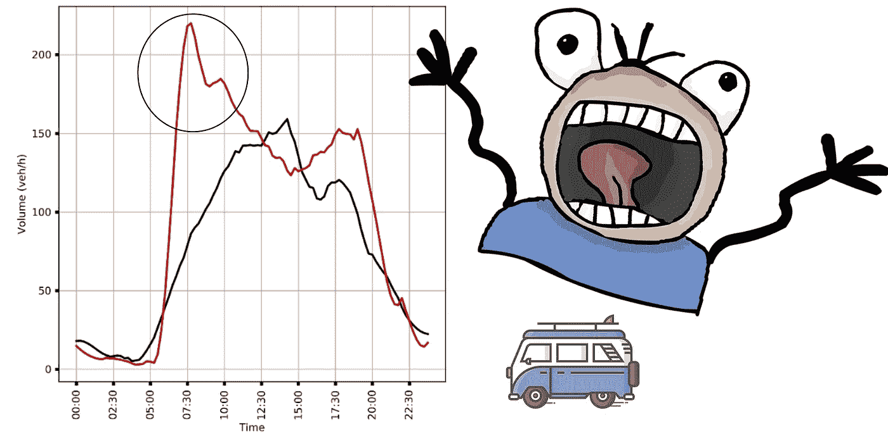
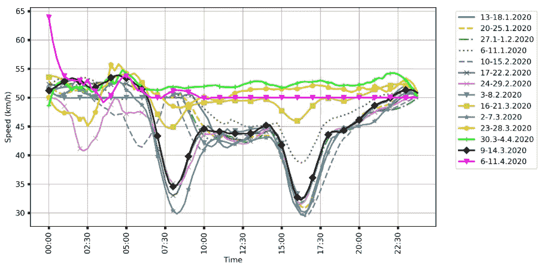
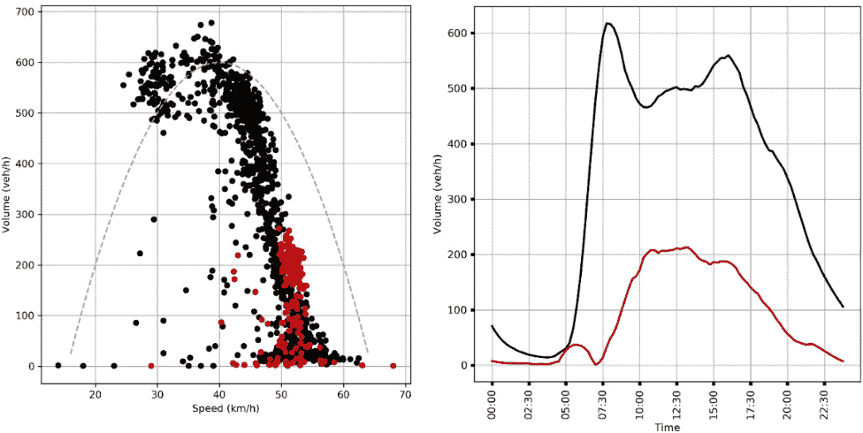

# 新冠肺炎疫情和地震对狭窄市中心交通流的影响

> 原文：<https://towardsdatascience.com/impact-of-the-covid-19-pandemic-and-the-earthquake-on-traffic-flow-in-the-narrow-city-center-5513be654a15?source=collection_archive---------18----------------------->

## 如何通过挖掘流量数据发现隐藏现象

恐慌(图片作者:作者)

交通科学家和工程师通常使用交通数据来建模和预测交通行为。但是，利用交通数据有没有可能提取出一些与交通流量没有严格关系的“隐藏”现象呢？在本文中，介绍了论文 [" *的结果:新冠肺炎疫情和地震对狭窄城市中心交通流的混合影响:萨格勒布-克罗埃西亚*【1】](https://www.researchgate.net/publication/344449300_Mixed_Impact_of_the_Covid-19_Pandemic_and_the_Earthquake_on_Traffic_Flow_in_the_Narrow_City_Center_A_Case_Study_for_Zagreb-Croatia)的案例研究，其中作者发现了面对自然灾害所激发的有趣的人类行为模式。

> 长度[tiljari，D. Cvetek，M. Muš tra，n . je lui:*新冠肺炎疫情和地震对狭窄市中心交通流量的混合影响:萨格勒布-克罗地亚案例研究*，载于《交通运输科学与发展会议录》(ZIRP)，第 293-300 页](https://www.researchgate.net/publication/344449300_Mixed_Impact_of_the_Covid-19_Pandemic_and_the_Earthquake_on_Traffic_Flow_in_the_Narrow_City_Center_A_Case_Study_for_Zagreb-Croatia)

# 1.介绍

2020 年对全人类来说都是充满挑战的一年。在我的家乡([萨格勒布，克罗埃西亚](https://www.google.com/maps/place/Zagreb/@45.8401104,15.8242483,11z/data=!3m1!4b1!4m5!3m4!1s0x4765d692c902cc39:0x3a45249628fbc28a!8m2!3d45.8150108!4d15.9819189))，在 COVID 疫情旁边，几场地震在 100 多年没有震动后发生了。作为一名交通工程师，对于上述事件，观察市中心交通流量的变化是很有趣的。

作为一组来自萨格勒布大学运输和交通科学学院的研究人员，我们试图调查新冠肺炎疫情之前和期间的交通流量趋势。此外，我们分析了地震期间的交通流量，地震于 2020 年 3 月 22 日周日早上 6:24 袭击了萨格勒布。

除了疫情造成的“正常”交通流量下降，我们还发现了关于地震反应的有趣的人类行为模式。

# 2.疫情对交通流的影响

为了说明疫情对交通流的影响，我们提出了两个经典的交通参数:速度和交通量。出于本研究的目的，我们观察了市中心的一条道路，基于雷达的交通计数器放置在[这里](https://www.google.com/maps/place/45%C2%B048'13.3%22N+15%C2%B058'27.3%22E/@45.803692,15.9731497,18z/data=!3m1!4b1!4m14!1m7!3m6!1s0x4765d6f5d241fec3:0x3d4d624652154f!2sMiramarska+Cesta,+10000,+Zagreb!3b1!8m2!3d45.7989764!4d15.9747049!3m5!1s0x0:0x0!7e2!8m2!3d45.8036923!4d15.9742436)。

图一。显示了在现场观察到的速度曲线，其中每个速度曲线代表每周平均的 24 小时内的平均速度变化(见图例)。我们可以看到，在 3 月 16 日之后，车辆的速度急剧增加，在繁忙时间经常出现的拥挤情况已经消失。由于政府在疫情采取了限制行动的措施，这是意料之中的行为。

图一。速度曲线(图片来源:[1])

图二。只是确认了交通流的预期行为。红色显示 2019 年的平均值，而红色显示疫情期间的值。在左侧，我们可以看到交通量和速度之间的关系，在右侧，我们可以看到交通量曲线。两个图表都显示了道路上超过 50%的车辆数量较少，因此道路上的速度值较高。

图二。[左]2019 年平均工作日(黑色)和有新冠肺炎限制的一周(红色)的量和速度的关系；[右]2019 年平均工作日(黑色)和新冠肺炎限行周(红色)的交通量概况(图片来源:[1])

# 3.面对自然灾害时人类的行为模式

在分析了疫情的交通模式后，我们分析了地震时的交通模式。

> 就我个人而言，我并不期待有什么不同。但是，我不这么认为。

图 3。显示地震发生当天的交通量(红线)和前一天的交通量(黑线)。地震发生在早上 6 点 24 分。可以看到，早上 7:30 的车流量增加了 100%以上。在检查了每日新闻后，我们看到大量的人只是跑向他们的汽车，试图尽可能远。那种行为显然是由地震引起的恐慌和恐惧引发的。

图 3。交通模式显示了由恐惧和惊慌行为引起的道路上活动的增加(图片来源:作者)

# 4.结论

本文展示了一个例子，展示了在挖掘数据时如何提取出意想不到的知识。我们展示了一个通过挖掘流量数据集提取人类行为模式的例子。

如果你对类似的、与交通相关的话题感兴趣，请关注我的媒体简介，或者在研究门户:)查看[发表的研究](https://www.researchgate.net/profile/Leo-Tisljaric)

如有任何问题或建议，欢迎评论或联系我！https://www.linkedin.com/in/leo-tisljaric-28a56b123/

**类似文章:**

 [## 基于速度转移矩阵的道路交通异常度量新方法

### 利用 GPS 交通数据测量道路网络异常水平的新方法

towardsdatascience.com](/novel-road-traffic-anomaly-metric-based-on-speed-transition-matrices-f2faf7d3b38b) 

# 参考

[1][l . tiljari，D. Cvetek，M. Muš tra，n . jelu ii:*新冠肺炎疫情和地震对狭窄市中心交通流量的混合影响:萨格勒布-克罗埃西亚案例研究*，载于《交通运输科学与发展学报》(ZIRP)，第 293–300 页](https://www.researchgate.net/publication/344449300_Mixed_Impact_of_the_Covid-19_Pandemic_and_the_Earthquake_on_Traffic_Flow_in_the_Narrow_City_Center_A_Case_Study_for_Zagreb-Croatia)