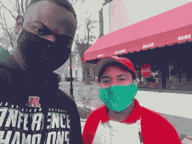
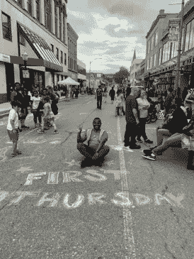

# 作为数据科学家影响您的社区

> 原文：<https://towardsdatascience.com/impacting-your-community-as-a-data-scientist-e4c98e1f3b03?source=collection_archive---------25----------------------->

## *如何利用数据科学技能获得“真实世界”的体验。*

由[卡尔·海尔达尔](https://unsplash.com/@carlheyerdahl?utm_source=medium&utm_medium=referral)在 [Unsplash](https://unsplash.com?utm_source=medium&utm_medium=referral) 上拍摄

作为一名数据科学家新手，我发现的一个主要挑战是由于缺乏“真实世界的经验”而无法进入这个领域。尽管有许多很棒的训练营提供从事激情项目的专业人员，但我注意到新数据科学家仍然需要一些时间才能在许多公司找到工作。

我发现了一个“窍门”，可以获得经验，并快速跟踪一个新手将他们的数据科学技能应用到现实世界的项目中。我将在这里概述我的一些经历，我是如何发现自己在马萨诸塞州菲奇堡的当地社区从事一个数百万美元的项目的，这一切都是因为我能够找到机会，并自愿将我的技能提供给最需要它们的利益相关者。

从 Metis 数据科学训练营毕业后，我发现自己刚刚掌握了机器学习和数据科学技能，但却找不到任何有意义的项目。即使在完成了多个在线教程和项目之后，它对我来说似乎并不重要，因为它并没有被人们日常使用。因此，我采取了以下步骤来确保我能够以一种能够产生重大影响的方式来运用我的技能。

1.  **采访当地商业领袖**:2021 年，我决定花一些时间在我的当地社区与企业主、政府官员、居民和学生讨论，试图了解他们面临的一些挑战。我问了许多开放式的问题，没有明确的目标，只是想看看我能在哪些方面发挥我的技能。在这里度过的时间实际上给了我一个很好的机会去了解马萨诸塞州菲奇堡的历史，它的风俗和它的人民。通过这一过程，我在该地区结交了很多好朋友，并建立了惊人的关系。

采访当地的小企业主。作者图片

2.**从讨论中发现真知灼见**:通过我与不同领导的交谈，以及在发出调查问卷后。我发现市政当局正面临一些巨大的挑战。

3.**大问题**:面临的问题是**每年大约有 3000 万美元**花费在城外，原因是在菲奇堡普遍缺乏某些种类的商业和对新商业的认识。例如，菲奇堡的居民会开 30 分钟到 1 小时的车去光顾波士顿、剑桥和伍斯特等大城市的商店，而这些商店离他们只有 5 到 15 分钟的路程。这是一个很大的问题，因为“资金外流”，即从长远来看，社区支出的资金会影响许多小企业、社区和经济发展。社区领导已经制定了一个 5-10 年的计划来解决这个问题，并鼓励我制定有用的解决方案。

4.**真实世界的数据解决方案和影响**:我参与了两个具体的项目，以解决该地区的商业意识和商业可用性问题。第一个项目是帮助提高当地的商业意识，第二个项目是帮助改善在镇上开办新企业的过程。在商业意识方面，我建立了 [SeeksCo](https://seeksco.com/) ，这是一个面向小城镇和城市的 yelp，允许个人轻松找到该地区的企业，并为这些企业提供评论。到目前为止，SeeksCo 正在帮助提高这些企业的意识。

与意式浓缩披萨的老板讨论(开始于 50 多年前)。图片作者。

第二个项目是与市长办公室合作，在菲奇堡市区建立店面空置的数据可视化(使用 Tableau)。该项目将允许投资者和未来的企业主查看他们可以在该地区租赁或购买的店面物业空缺，并提供详细信息，如最新照片、业主信息和物业状态。目前，菲奇堡有 100 多处空置房产，为小企业提供了许多机会，为该地区的 40，000 多名市民提供服务。这个项目的影响是显而易见的，因为它为商业领袖、投资者和其他利益相关者节省了时间。过去，个人必须手动搜索这些信息，但现在他们可以在向当地政府经济部门提出请求后访问这些数据。

菲奇堡的空置店面。图片作者。

通过这两个项目，我能够向当地领导和全球领导展示数据在社区中的作用以及如何鼓励最佳数据实践。

5.**社区的持续支持**:作为一名数据科学家，尽管我们的工作主要集中在数据和算法上，但我个人认为，提出解决方案的最佳方式是从数据中创造有意义的见解。通过了解数据分析影响的个人故事，我们的工作可以做得更好。

这就是为什么我志愿帮助组织菲奇堡社区的活动，以帮助提高小企业的意识。我与当地一个名为 Reimagine North of Main 的组织合作，在 2021 年夏天组织了一次街区聚会，以促进许多小企业的发展。我们有 500 多人参加，许多小企业能够获得新客户。

为小企业组织街区聚会。图片作者。

当我开始面试一份数据科学的工作时，我在当地社区的经历很有帮助。在面试数据科学工作时，我能够讨论真实世界的项目，并接受了在波士顿地区一家现代咨询公司担任数据科学家顾问的邀请。我的许多采访讨论都围绕着我在社区中所做的影响工作，并为我提供了一个用数据科学专业人员可以理解的术语进行解释的机会。

总之，数据科学领域是一个快节奏的领域，人们可能会觉得不得不进入这个领域，但找到创造性的方法来利用自己获得的技能，以一种实际上对真实的人有用的方式，不仅对提高我们的数据科学家技能有巨大的好处，而且对立即需要我们帮助的人也有好处。

更多关于我的影响力工作，请访问我的页面:【dotunopasina.com/impact】T2，并在 [LinkedIn](https://www.linkedin.com/in/dotun-opasina/) 上与我联系。