# 从头开始实现高斯过程

> 原文：<https://towardsdatascience.com/implement-a-gaussian-process-from-scratch-2a074a470bce?source=collection_archive---------3----------------------->

## 高斯过程模型的基本理论和实际实现的演练

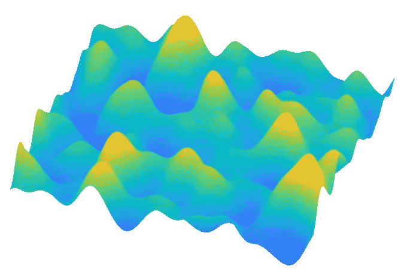

(图片由作者提供)

G **高斯过程** (GP)是一种强大的监督机器学习方法，主要用于回归设置。这种方法在实践中是可取的，因为:

*   它在小数据范围内表现很好；
*   它具有高度的可解释性；
*   它自动估计预测的不确定性。

这最后一点是 GP 区别于许多其他机器学习技术的地方:对于 GP 模型，它在位置 *x* 的预测 *f* ( *x* )不是确定性的值，而是遵循正态分布的随机变量，即*f*(*x*)~*N*(*μ*(*x*)，【T20 这里， *μ* ( *x* )表示预测均值， *σ* ( *x* )是预测方差，作为预测不确定性的指标。

那么，为什么估计预测不确定性很重要呢？有两个原因:首先，它通过告诉我们可以在多大程度上相信一个特定的预测，使**能够做出可靠的决策**；其次，它有助于**主动学习，**这意味着我们可以智能地分配对模型性能贡献最大的训练数据。

尽管高斯过程在实际应用中很重要，但它在机器学习书籍和教程中出现的次数并不多。部分原因是 GP 理论充满了高级统计学和线性代数，对新来者不太友好。

在这篇博客中，我们将采用边做边学的方法，从头开始用 Python 实现一个 GP 模型。最后，我们将把我们的原型付诸实施，并近似两个分析函数:

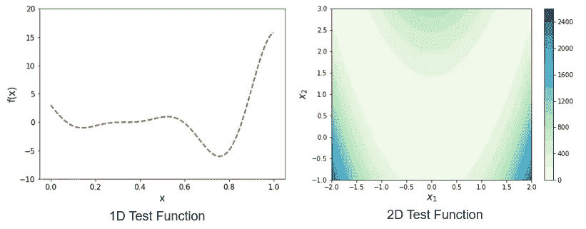

图 1 我们的测试函数。(图片由作者提供)

> 我为这篇文章创建了一个 [Jupyter 笔记本](https://github.com/ShuaiGuo16/Gaussian-Process)。另外，我已经编译了一个[备忘单](http://bit.ly/2NEX2Ub)，它总结了 GP 相关的公式。您可以在编写自己的 GP 模型时使用它作为快速参考。

所以，让我们开始吧！

## 目录

[1。了解高斯过程](#60fd)
[2。内核函数](#9f9c)
[3。](#025e) `[GaussianProcess](#025e)` [类](#025e)
[4。初始化 GP 模型](#cdff)
[5。构造相关矩阵。](#ce81)
[7 训练一个 GP 模型(理论)。](#2347)
[8 训练一个 GP 模型(代码)。](#e206)
[GP 模型预测(理论)9。GP 模型预测(代码)](#d4b0)
[10。基准](#ccec)
[11。外卖](#cd61)
[关于作者](#6048)

# 1.理解高斯过程

使用 GP 方法的一个常见情况是:我们收集了一些训练数据*= {(*x*ᵢ， *y* ᵢ)， *i* =1，…，n}， *y* ᵢ为实值标签。我们希望训练一个模型，在给定输入 *x* *的情况下，预测函数输出 *y* **

*简而言之，GP 通过将底层真函数 *y* ( *x* )建模为高斯随机过程的实现来工作。正是这种统计观点使 GP 能够预测复杂的投入产出模式，并在此过程中估计预测的不确定性。我们将在接下来的章节中对此进行更详细的阐述。*

## *1.1 高斯过程中的“过程”*

*其名称中的“进程”部分指的是 GP 是一个**随机进程**的事实。简单来说，一个随机过程就是一个函数 *f* (。)具有以下属性:*

*   *在任意位置 *x* ， *f* ( *x* )为随机变量；*
*   *在不同的位置 *x* ᵢ和 *x* ⱼ，随机变量 *f* ( *x* ᵢ)和 *f* ( *x* ⱼ)相关；*
*   **f* ( *x* ᵢ)和 *f* ( *x* ⱼ)之间的关联强度取决于 *x* ᵢ和 *x* ⱼ.之间的距离一般来说，随着 *x* ⱼ远离 *x* ᵢ，它们的关联强度会衰减。*

*这里的关键要点是，我们可以将随机过程解释为相关随机变量的无限集合。*

*那么，我们应该用什么概率分布来描述那些随机变量呢？*

## *1.2 高斯过程中的“高斯”*

*其名字中的“高斯”部分表示 GP 用**高斯分布**(或正态分布)来表征随机过程。*

*为了描述具有高斯分布的单个随机变量，我们只需要一个*平均值*和一个*方差*值。然而，为了描述包含无限数量随机变量的随机过程，我们需要将高斯分布升级为高斯随机过程。*

*形式上，一个高斯随机过程 *f* (。)的特征是均值函数 *μ* ( *x* )和协方差函数*σ**K*(*x*， *x* *)。这里， *σ* 表示整体进程方差， *K* ( *x* ， *x* *)是相关函数，也称为**核函数**。当 *x = x* *， *K* ( *x* ，*x*)= 1；当*x*≦*x**， *K* ( *x* ， *x* *)表示 *f* ( *x* )与 *f* ( *x* *)之间的相关性。*

*配备了 *μ* ( *x* )和*σ**K*(*x*， *x* *)的符号，我们可以介绍一个高斯随机过程 *f* (。):*

*   *对于单个位置 *x* ， *f* ( *x* )服从高斯分布，即*f*(*x*)~*N*(*μ*(*x*)，*σ*)；*
*   *对于任意一组位置[ *x* ₁、 *x* ₂,…、 *x* ₙ、***f***=[*f*(*x*₁)、 *f* ( *x* ₂),…、 *f* ( *x**

*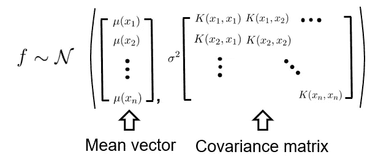*

## *1.3 GP 的“世界观”*

*回想一下，在本节开始时，我们提到 GP 通过将底层真函数 *y* ( *x* )建模为高斯随机过程的实现来工作。这意味着 GP 模型将训练数据的观察到的标签[ *y* ₁、 *y* ₂,…、 *y* ₙ]视为从上述多元高斯分布中随机抽取的*。**

*因此，我们能够通过推断最可能产生观察到的标签的 *μ* ( *x* )、 *σ* 和 *K* ( *x* 、 *x* *)来训练 GP 模型。这通常通过**最大似然估计**来完成。随后，我们可以用训练好的 GP 模型对未知地点进行预测，并估计相关的预测不确定性。*

> *乍一看，通过引入随机过程来模拟确定性函数值，从而增加额外的复杂性，这似乎是违反直觉的(y₁、y₂,…、yₙ).事实上，这种治疗方法源于**贝叶斯统计**。这里，随机过程假设编码了我们对函数形式 y(x)的先验信念。这个方向我们就不深入了。对于 GP 方法的贝叶斯解释，看一看墨菲的书第 15 章。*

# *2.核函数*

*在我们深入研究编码之前，让我们先讨论一下 GP 模型的关键要素:内核函数。之前我们只陈述了它的一般形式 *K* ( *x* ᵢ， *x* ⱼ)，没有给出具体的例子。我们将填补这一部分的空白。*

## *2.1 核心特征*

*在 GP 建模设置中，核函数测量两个不同预测之间的“相似性”，即，较高的核函数值意味着两个预测更相似，反之亦然。*

*内核函数必须满足某些要求。其中之一是内核函数 *K* ( *x* ᵢ， *x* ⱼ)必须能够构造一个*对称*和*正定*的相关矩阵。*

*实际上，内核函数经常被假设为*静态*。这意味着核函数值仅取决于输入之间的距离，即 *K* ( *x* ᵢ，*x*ⱼ)=*k*(*x*ᵢ-*x*ⱼ).*

*此外，当输入具有两个或更多特征时，我们通常假设多维核函数 *K* ( ***x*** ᵢ， ***x*** ⱼ)是针对每个输入特征的一维核函数的一系列乘法:*

*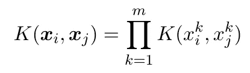*

*其中 *m* 表示特征总数，即输入尺寸。这种处理是有益的，因为它允许为
单个输入特征定制相关结构。*

## *2.2 高斯核*

*常见的核函数包括立方核、指数核、高斯核和 Matérn 核。本文将使用高斯核，这是最流行的选择之一。*

*一维高斯核表示为:*

*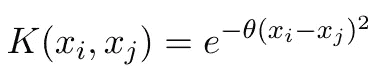*

*其中 *θ* 是控制相关强度的核参数。高斯核的一个 *m* 维版本被表示为:*

*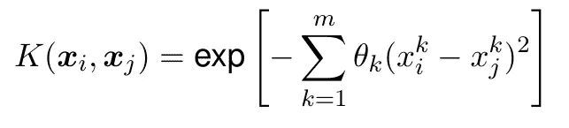*

*这只是一维高斯核的一系列乘法。这里，我们有内核参数***θ****=**θ*₁、 *θ* ₂,…、 *θ* ₘ].*

## *2.3 GP 的可解释性*

*内核参数 ***θ*** 是 **GP 模型可解释性**的关键，因为它表明了特征在进行预测时的重要性。让我们详细说明一下。*

*首先，让我们关注一维情况，其中我们只有一个特征和一个关联的 *θ* 。下图显示了 *θ* 的选择如何影响相关性。*

*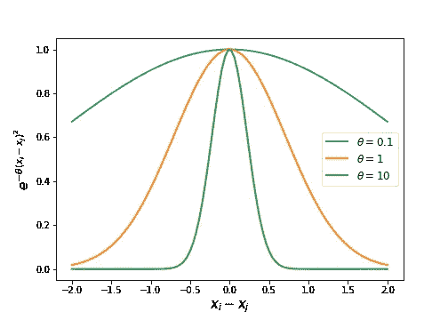*

*图 2*θ对*相关强度的影响。(图片由作者提供)*

*当 *θ* 值较低时，遥远地点的预测保持高水平的相关性。这意味着无论 *x* 值如何，底层函数都会产生相似的输出。换句话说，特征 *x* 没有那么好预测。*

*同样的推理也适用于多特征设置:如果第 *k* 个特征的 *θ* 值相当低，那么当沿着第 *k* 个维度移动时，底层函数将产生类似的输出值。由于输出对第 *k* 个特征不太敏感，我们可以得出结论，在进行预测时，第 *k* 个特征并不那么重要。*

*因此，通过对( *θ* ₁， *θ* ₂,…， *θ* ₘ)的值进行排序，我们可以对特征的重要性进行排序，这有助于进行敏感性分析或降维。*

*高斯过程的基础知识到此为止。在下文中，我们将从实现的角度来研究 GP，并介绍缺失的理论和代码。*

# *3.`GaussianProcess`阶级*

*让我们从头开始编写一个`GaussianProcess`类吧！为了帮助你浏览与 GP 建模相关的方程，我为你准备了这个[备忘单](https://github.com/ShuaiGuo16/Gaussian-Process/blob/master/GP_cheatsheet.pdf)。*

## *3.1 课程概述*

*下面是对`GaussianProcess`类的方法和属性的总结。这个类通过使用`.fit()`方法训练模型和使用`.predict()`方法进行预测来模仿`scikit-learn`风格。这种一致性使得将开发的`GaussianProcess`估计器与其他`scikit-learn`函数进一步集成成为可能，如`Pipeline`、`GridSearchCV`等。*

*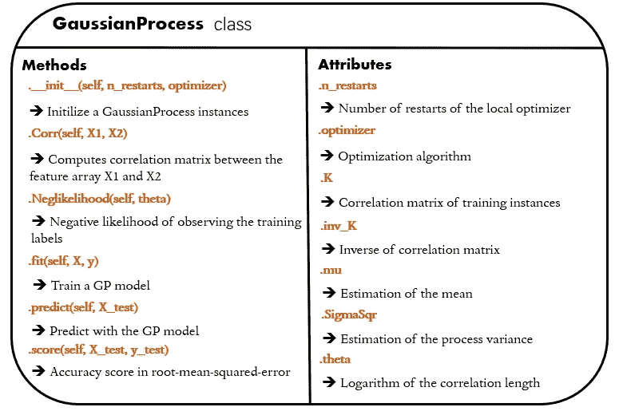*

*图 3 `GaussianProcess`类概述。(图片由作者提供)*

*我们将在下面的小节中讨论每一种方法。*

## ***3.2** 包装*

*首先，我们加载所有必需的包。*

*我们将主要使用`numpy`进行矩阵操作，使用`matplotlib`进行数据可视化。此外，我们需要*

*   *`[scipy.optimize.minimize](https://docs.scipy.org/doc/scipy/reference/generated/scipy.optimize.minimize.html)`:进行优化；*
*   *`[scipy.optimize.Bounds](https://docs.scipy.org/doc/scipy/reference/generated/scipy.optimize.Bounds.html)`:指定优化的参数界限；*
*   *`[pyDOE.lhs](https://pythonhosted.org/pyDOE/randomized.html)`:为优化器生成随机起始点。这里，我们采用拉丁超立方体采样方法，因为它善于生成均匀分布的随机样本。*

# *4.初始化 GP 模型*

*在本节中，我们开发`GaussianProcess.__init__(self, n_restarts, optimizer, bounds)`。*

*为了训练 GP 模型，我们使用**多起点优化策略**来估计模型参数。因此，我们需要指定我们希望优化器尝试多少个起始点，以及这个优化器应该使用哪个算法。*

# *5.构建相关矩阵*

*在本节中，我们开发`GaussianProcess.Corr(self, X1, X2)`，它计算一对特征矩阵 X1 和 X2 之间的相关矩阵。因为计算相关矩阵涉及训练和预测(稍后将讨论)，所以有一个专用函数来实现这个目标是有益的。*

*下面给出了如何使用高斯核来构建 X1 和 X2 的相关矩阵的图示:*

*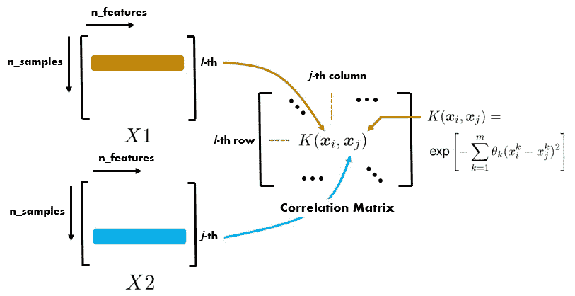*

*图 4 是构造相关矩阵的示意图。(图片由作者提供)*

*以下代码可以实现所需的功能:*

# *6.训练一个全科医生模型(理论)*

## *6.1 GP 模型参数*

*一个工作的 GP 模型需要一个均值函数 *μ* ( *x* )、过程方差 *σ* 和核参数向量 ***θ*** 。实际操作中， *μ* ( *x* )被简单假设为常数，即 *μ* ( *x* ) = *μ。这种处理极大地简化了数学，并且不会对模型的准确性造成太大的伤害。我们将在编码部分实现一个平均值不变的 GP。**

*所以，训练一个 GP 模型意味着估计 *μ* 、 *σ* 、 ***θ*** 。但是我们到底应该怎么做呢？介绍最大似然估计。*

## *6.2 最大似然估计*

*简单地说，这种估计方法通过找到一个特定的组合 *μ* 、 *σ* 和 ***θ*** 来工作，这样观察训练实例的标签( *y* ₁、 *y* ₂,…、 *y* ₙ、 *x* ₁、 *x* ₂,…、*x*的可能性***

*由于 GP 假设[ *y* ₁,…， *y* ₙ]是由多元高斯分布生成的，我们可以很容易地根据多元高斯分布的概率密度函数来表示可能性 ***L*** :*

*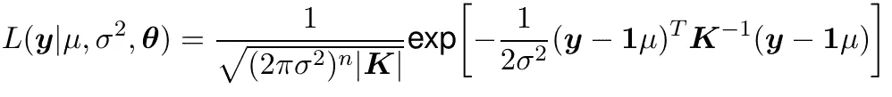*

*其中***y***=[*y*₁,…， *y* ₙ]， ***1*** 为个例向量， ***K*** 为训练实例的关联矩阵。*

*在实践中，我们倾向于最大化可能性的对数 ***L*** 以避免舍入误差:*

*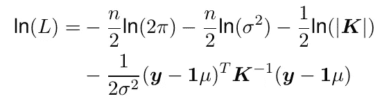*

*幸运的是，如果我们将对数似然相对于 *μ* 和 *σ* 的导数设置为零，则 *μ* 和 *σ* 的最佳值存在解析表达式:*

*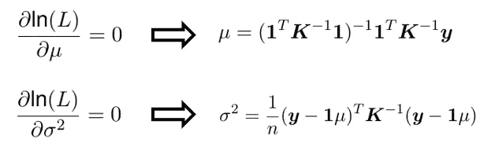*

*然而，对于**T5【θ**来说，由于它嵌套在相关矩阵中，因此推导最优 ***θ*** 的解析式是不可行的。因此，我们需要采用一种优化算法来寻找一个使可能性最大化的***θ******L***。*

*我们可以通过将最优的 *σ* 代入 ***L*** 来简化 ***L*** 方程。经过一些代数运算后，我们得到了下面的优化问题:*

*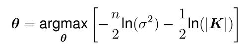*

*在本文中，我们采用多起点策略来估计最优 ***θ*** 。基本上，这种策略会多次运行优化器，每次都从不同的初始 ***θ*** 值开始。最后，选择产生最佳目标函数值的 ***θ*** 值作为最终优化结果。*

# *7.训练 GP 模型(代码)*

*在本节中，我们开发了`GaussianProcess.likelihood(self, theta)`和`GaussianProcess.fit(self, X, y)`方法。*

*这里值得一提的是:从实现的角度来看，在对数尺度上搜索 ***θ*** 有利于加速优化算法的收敛。因此，在下面的代码中，我们将进行优化( *μ* 、 *σ* 和 10^**t59】θ**)。 ***θ*** 的合适搜索范围是[-3，2]，其转化为在 0.001 和 100 之间变化的相关长度。*

## *7.1 似然函数*

*首先，我们开发`GaussianProcess.Neglikelihood(self, theta)`来计算负的可能性。在下面的代码片段中，self。x 和 self.y 构成了训练数据集。它们分别是 shape (n_samples，n_features)和(n_samples，1)的数组。*

*这里有几件事值得一提:*

*   *我们在 ***K*** 的对角线上加一个小项(1e-10)。这一项也称为“块金”项，它有助于在求 ***K*** 的倒数时缓解数值不稳定问题；*
*   *我们返回计算的似然值的负值。这一步是必要的，因为我们稍后将使用`scipy.optimize.minimize`，最小化负似然值相当于最大化原始似然值；*
*   *为了便于理解，我天真地使用了`np.linalg.inv()`和`np.linalg.det()`来计算**的倒数和行列式*K*。然而，在实践中，这些处理可能是耗时的，并且可能导致数值不稳定。更可靠的替代方案是计算 ***K*** 的乔莱斯基因式分解，并使用获得的下三角矩阵进行进一步的矩阵乘法和行列式计算。请参阅配套的笔记本[了解这种可靠的实现方式。](https://github.com/ShuaiGuo16/Gaussian-Process)***

## *7.2 模型拟合功能*

*现在我们开发`GaussianProcess.fit(self, X, y)`来实现模型拟合。在下面的代码片段中，我们使用拉丁超立方体方法为优化器的运行生成起点 ***θ*** 。由于`pyDOE.lhs`只生成[0，1]内的随机样本，我们需要将样本缩放到我们的目标范围[-3，2]。*

# *8.GP 模型预测(理论)*

*现在我们知道了如何训练 GP 模型，让我们换个角度，看看如何用训练好的 GP 模型进行预测。我们的目标是预测测试点 *x* *的基础函数值。我们将预测表示为 *f* *。*

*回想一下，我们在开头提到 GP 预测 *f* *不是一个确定值，而是一个遵循高斯分布的随机变量。这个结果实际上是通过计算***【y】*，**即训练实例的观察标签条件下的 *f* *的分布得到的。在贝叶斯语言中，我们是在计算 *f* *的后验分布。*

*下面，我们讨论如何计算 *f* *的这个条件分布。我们就从 *f* *和 ***y*** 的联合分布开始，即**P*(***y***， *f* *)。从那里，我们可以导出期望的条件分布*P*(*f** |***y***)。**

## **8.1 测试/训练数据的联合分发**

**首先，注意，根据高斯随机过程的定义，我们可以将联合分布*P*(***y***， *f* *)表示为多元高斯分布:**

**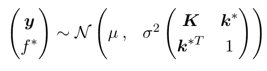**

**其中 ***K*** 是训练实例的相关矩阵， ***k*** *是测试实例和训练实例之间的相关向量:**

**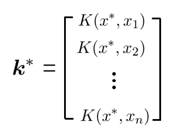**

## **3.2 测试数据的条件分布**

**第二步，我们推导出*P*(*f** |***y***)，它描述了在给定观察到的标签 ***y*** 的情况下 *f* *是如何分布的。**

**高斯随机过程的一个很好的性质是，*f**的期望条件分布也是高斯分布，即*f** |***y****~ N*(*μ**，*σ**)，其中**

**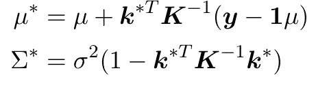**

***f** |***y****~ N*(*μ**，*σ**)充分刻画了 *x* *处的 GP 预测。在实践中，我们用均值 *μ* *作为预期预测值，用方差*σ**来表示预测的不确定性。**

> **从它们的联合分布 P( f*， **y** )中导出 P( f*| **y** )在分析上是容易处理的。为了让我们的讨论更集中，我跳过冗长的代数，让读者参考这个 [StackExchange 页面](http://Stackexchange page)了解更多细节。**

# **9.GP 模型预测(代码)**

**在本节中，我们开发了`GaussianProcess.predict(self, X_test)`方法来启用 GP 模型预测。**

**在下面的代码片段中，我们打算一次预测多个测试实例。结果，在第 17 行中，我们将在所有测试实例和训练实例之间有一个相关矩阵 ***k*** (而不是理论部分所述的仅仅一个相关向量)。因此，在第 20 行和第 23 行，计算出的 *f* 和 *SSqr* 现在是数组。**

**最后，让我们开发`GaussianProcess.score(self, X_test, y_test)`方法，以均方根误差来评估模型的准确性。**

# **10.基准**

**这一节将我们开发的 GP 类投入使用，并测试它逼近函数的能力。我们将首先在 1D 函数上测试 GP 类。稍后，我们将测试扩展到 2D 案例。**

## **10.1 1D 试验**

**对于本案例研究，我们的目标是训练一个 GP 模型，它可以精确地逼近以下函数:**

**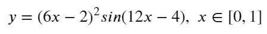**

**这个函数绘制如下。正如我们所看到的，这个函数是高度非线性的，并且在 *x* =0.6 之前和之后具有不同的“活动性”水平。这些特征在构建全球精确模型方面提出了挑战。**

**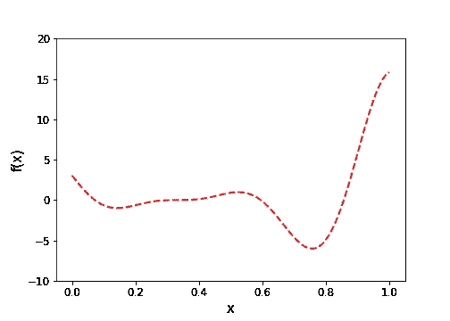**

**图 5 1D 测试函数。(图片由作者提供)**

**为了训练 GP 模型，我们选择分布在[0，1]范围内的 8 个训练实例。在下面的代码片段中，我们首先创建一个训练数据集和一个测试数据集。然后，我们初始化一个`GaussianProcess`实例，并采用一个 [L-BFGS-B](https://docs.scipy.org/doc/scipy/reference/optimize.minimize-lbfgsb.html) 算法来寻找最优的 *θ。*因为我们使用的是多起点优化策略，所以我们希望优化器通过每次使用不同的初始点来运行 10 次。在训练数据集上训练模型之后，该模型用于预测测试数据标签。**

**预测结果如下所示。我们可以看到 GP 的预测与真实函数几乎完全相同。图中还显示了 GP 预测的 95%置信区间，计算为*μ**(*x*)+/-1.96*σ**(*x*)。我们可以看到真正的函数完全位于置信带内。**

**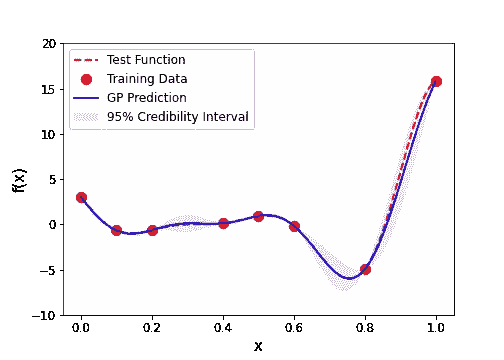**

**图 6 GP 预测设法捕捉潜在的测试函数。(图片由作者提供)**

**因此，我们可以得出结论，开发的 GP 类工作正常，GP 模型足够精确，可以近似当前的 1D 测试函数。**

## **10.2 2D 试验**

**在这个案例研究中，我们的目标是训练一个 GP 模型，它可以精确地逼近 2D·罗森布罗克函数:**

**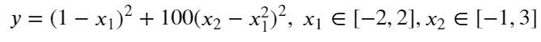**

**这个函数绘制如下。**

**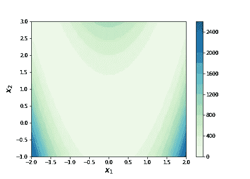**

**图 7 2D 测试函数。(图片由作者提供)**

**为了训练这个 GP 模型，我们总共选择了 25 个训练实例，如下所示。这些训练样本由拉丁超立方体采样器生成。**

**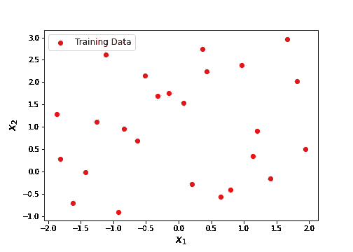**

**图 8 训练样本。(图片由作者提供)**

**下面的代码为 GP 模型定型，并对测试数据网格进行预测。通常在[0，1]范围内调整 GP 输入特性。因此，我们采用一个`MinMaxScaler`来进行缩放，并将其集成到一个流水线中。**

**最后，利用`.score`方法对模型预测精度进行了检验。计算的 RMSE 误差是 2.44，考虑到我们的目标函数从 0 到 2400 变化，这是相当低的。为了直观地评估模型的准确性，我们可以在等值线图中绘制 GP 预测:**

**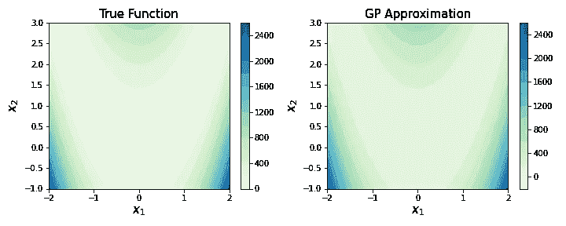**

**图 9 GP 预测成功地恢复了真实的 2D 测试函数。(图片由作者提供)**

**事实上，GP 近似值与底层的真实函数几乎相同，这表明经过训练的 GP 模型非常准确，并且我们对`GaussianProcess`类的实现工作正常。**

# **11.外卖食品**

**在本文中，我们已经讨论了高斯过程建模方法的基本理论。通过从头构建一个原型，我们将理论转化为代码，并从实际实现的角度深入到本质。**

**肯定有更多关于如何从基础 GP 到更高级版本并实现迷人分析的内容。这篇文章涵盖了一些高级概念:**

** [## 代理建模介绍，第三部分:超越基础

### 加速工程设计的机器学习方法

towardsdatascience.com](/an-introduction-to-surrogate-modeling-part-iii-beyond-basics-a60125767271) 

# 关于作者

> 我是一名博士研究员，从事航空航天应用的不确定性分析和可靠性分析。统计学和数据科学是我日常工作的核心。我喜欢分享我在迷人的统计世界中学到的东西。查看我以前的帖子以了解更多信息，并在 [*中*](https://shuaiguo.medium.com/) *和*[*Linkedin*](https://www.linkedin.com/in/shuaiguo16/)*上与我联系。***