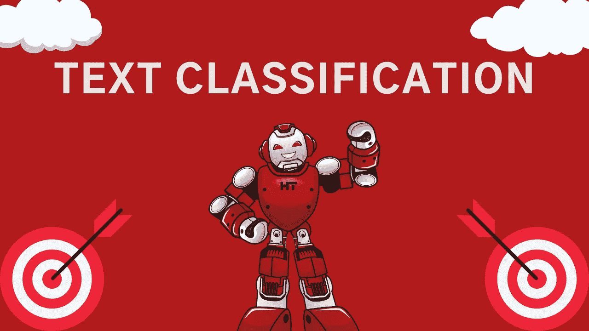
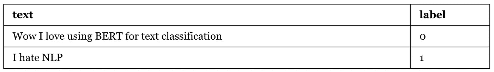

# 实现和训练文本分类转换器模型——简单的方法

> 原文：<https://towardsdatascience.com/implement-and-train-text-classification-transformer-models-the-easy-way-432ca3492608?source=collection_archive---------40----------------------->

## *了解如何用几行代码实现和训练文本分类转换器模型，如 BERT、DistilBERT 等*



作者图片

文本分类无疑是自然语言处理最常见的应用。而且，像大多数 NLP 应用一样，变压器模型近年来在该领域占据了主导地位。在本文中，我们将讨论如何使用一个 Python 包(我是名为[快乐转换器](https://happytransformer.com/)的主要维护者)用几行代码实现和训练文本分类转换器模型。Happy Transformer 建立在 Hugging Face 的 transformers 库之上，允许程序员只需几行代码就可以实现和训练 Transformer 模型。

# 预训练模型

在[拥抱脸的模型分发网络](https://huggingface.co/models?pipeline_tag=text-classification)上有 100 种预训练的文本分类模型可供选择。因此，我建议在你花太多时间担心训练模型之前——看看是否有人已经为你的特定应用微调了模型。例如，我已经制作了关于如何为[情感分析](https://youtu.be/Ew72EAgM7FM)和[仇恨言论检测](https://youtu.be/jti2sPQYzeQ)实现预训练变压器模型的内容。在本教程中，我们将实现一个名为 [finbert](https://huggingface.co/ProsusAI/finbert) 的模型，它是由一家名为 Prosus 的公司创建的。该模型检测金融数据的情绪。

# 装置

PyPI 上有 Happy Transformer，因此我们可以用一行代码安装它。

```
pip install happytransformer
```

# 实例化

让我们导入一个名为 HappyTextClassification 的类，我们将使用它来加载模型。

```
from happytransformer import HappyTextClassification
```

在这里，我们可以使用 HappyTextClassification 类为模型实例化一个对象。第一个 position 参数指定模型的类型，并且全部大写。例如，“BERT”、“ROBERTA”和“ALBERT”都是有效的模型名称。第二个位置参数表示模型的名称，可以在模型的[网页](https://huggingface.co/ProsusAI/finbert)上找到。最后一个参数是一个名为“num_labels”的参数，它指定了模型拥有的类的数量。在这种情况下，模型有三个标签:“正面”、“中性”和“负面”

*重要提示:实例化模型时，不要忘记设置 num_labels。否则，可能会发生错误。*

```
happy_tc = HappyTextClassification("BERT", "ProsusAI/finbert", num_labels=3)
```

# 使用

我们可以用一行代码通过“classify_text”方法对文本进行‌begin 分类

```
result = happy_tc.classify_text("Tesla's stock just increased by 20%")
```

让我们把结果打印出来，以便更好地理解它。

```
print(result)
```

*输出:TextClassificationResult(label = ' positive '，score=0.929110586643219)*

如您所见，‌the 的输出是一个数据类，有两个变量:“标签”和“分数”标签是一个字符串，用于指示输入被分类到哪个类。“分数”变量指定模型以浮点形式分配给答案的概率。我们不能孤立这两个变量。

```
print(result.label) 
print(result.score)
```

*结果:*

*正向*

*0.929110586643219*

这是另一个显示负输入输出的例子。

```
result = happy_tc.classify_text("The price of gold just dropped by 5%") 
print(result.label)
print(result.score)
```

*输出:*

*负*

*0.8852565288543701*

# 培训—自然语言处理情感分析

现在让我们来讨论培训。我们将训练一个模型来检测与 NLP 相关的文本的情感。我们将只使用两个例子进行训练——这当然不足以稳健地训练一个模型。但是，这只是为了演示。

我们必须创建一个包含两列的 CSV 文件:文本和标签。文本列包含我们希望分类的文本。标签列包含大于或等于 0 的整数形式的标签类型。下表给出了一个培训 CSV 的示例。



下面是生成上述 CSV 文件的代码:

```
import csv

cases= [("Wow I love using BERT for text classification", 0), ("I hate NLP", 1)]

with open("train.csv", 'w', newline='') as csvfile:
        writer = csv.writer(csvfile)
        writer.writerow(["text", "label"])
        for case in cases:
            writer.writerow([case[0], case[1]])
```

首先，我们将安装一个普通版本的 DistilBERT 作为起点。您还可以使用其他模型，如 BERT、ALBERT、RoBERTa 等。访问[拥抱脸的模特分销网络](https://huggingface.co/models)获取更多模特。

```
happy_tc = HappyTextClassification(model_type="DISTILBERT", model_name="distilbert-base-uncased", num_labels=2)
```

然后，我们可以使用新实例化的类简单地调用方法“train”。

```
happy_tc.train("train.csv")
```

就是这样！我们刚刚训练了模型。我们现在可以像在上一节中一样继续使用它。所以，举个例子，你现在可以像以前一样调用“happy_tc.classify_text()”，新微调的模型就会被使用。

# 自定义参数

通过使用一个名为“TCTrainArgs”的类，我们可以很容易地修改学习参数，比如时期数、学习速率等等。让我们导入 TCTrainArgs。

```
from happytransformer import TCTrainArgs
```

现在，我们可以使用 TCTrainArgs 类创建一个对象来包含训练参数。在这里你可以修改[的参数列表。让我们将训练时期的默认数量从 3 增加到 5。](https://happytransformer.com/text-classification/finetuning/)

```
args = TCTrainArgs(num_train_epochs=5)
```

让我们像以前一样调用 happy_tc 的 train 方法，但是这次将 args 对象传递给该方法的 args 参数。

```
happy_tc.train("train.csv", args=args)
```

好了，我们刚刚修改了学习参数！

# 评价

HappyTextGeneration 对象有一个内置的方法，允许您快速评估您的模型。首先，按照培训中讨论的方式格式化数据，然后调用。eval()"方法。为了简单起见，让我们使用训练文件来评估。

```
result = happy_tc.eval("train.csv") 
print(result)
```

*结果:eval Result(loss = 0.2848379611968994)*

然后，我们可以像这样隔离损失变量:

```
print(result.loss)
```

输出:*0.284879611968994*

我建议你用总体数据的一部分来训练，另一部分来评估。然后，在训练前后评估你的模型。如果损失减少，那就意味着你的模型学会了。你也可以创建你的数据的第三部分来运行实验，以找到最佳的学习参数——但这是另一个时间的话题。

# 结论

就是这样！您刚刚学习了如何实现和训练文本分类转换器模型。使用 Happy Transformer 只用几行代码就能完成这么多工作，这真是令人惊讶。

# 相关文章

这是我最近在《走向数据科学》上发表的一篇相关文章。它涵盖了如何使用零镜头文本分类模型来标记训练数据。这样，您可以在没有任何标记数据的情况下微调小型监督模型。

[https://towards data science . com/generating-text-class ification-training-data-with-zero-shot-transformer-models-e16d 390 EEA 3 e](/generating-text-classification-training-data-with-zero-shot-transformer-models-e16d390eea3e)

# 本文中的代码:

[https://colab . research . Google . com/drive/1 jq 3o 8 whs gel 994 nos 14 qyv 98 JT 5 we-pU？usp =共享](https://colab.research.google.com/drive/1Jq3o8whsgEL994noS14qyv98jt5We-pU?usp=sharing)

*原载于 2021 年 6 月 14 日*[*https://www . vennify . ai*](https://www.vennify.ai/train-text-classification-transformers/)*。*