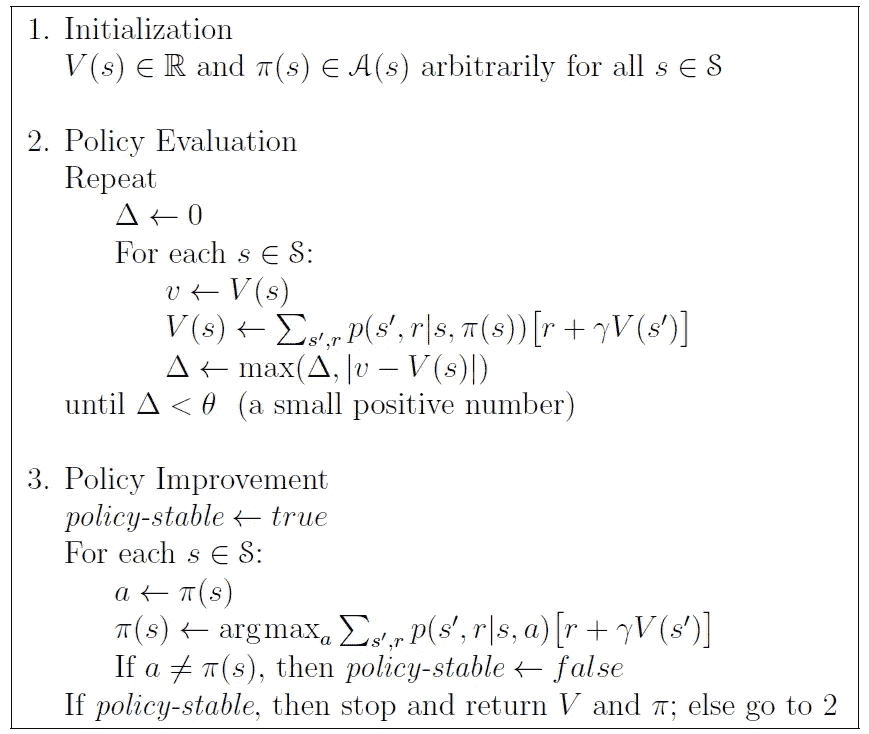
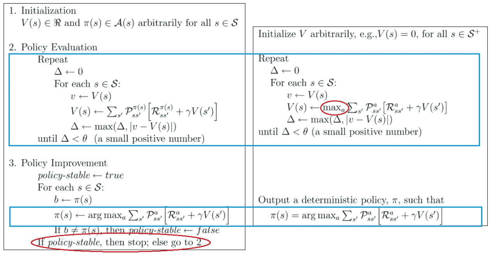
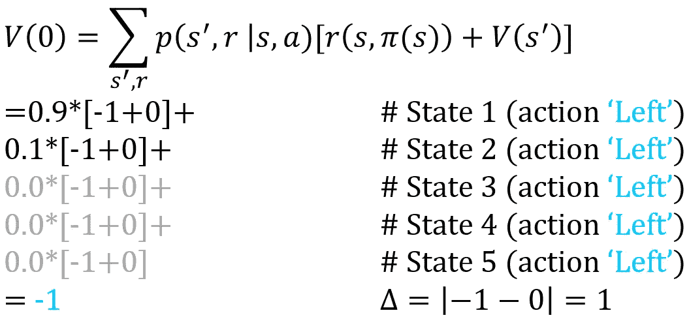
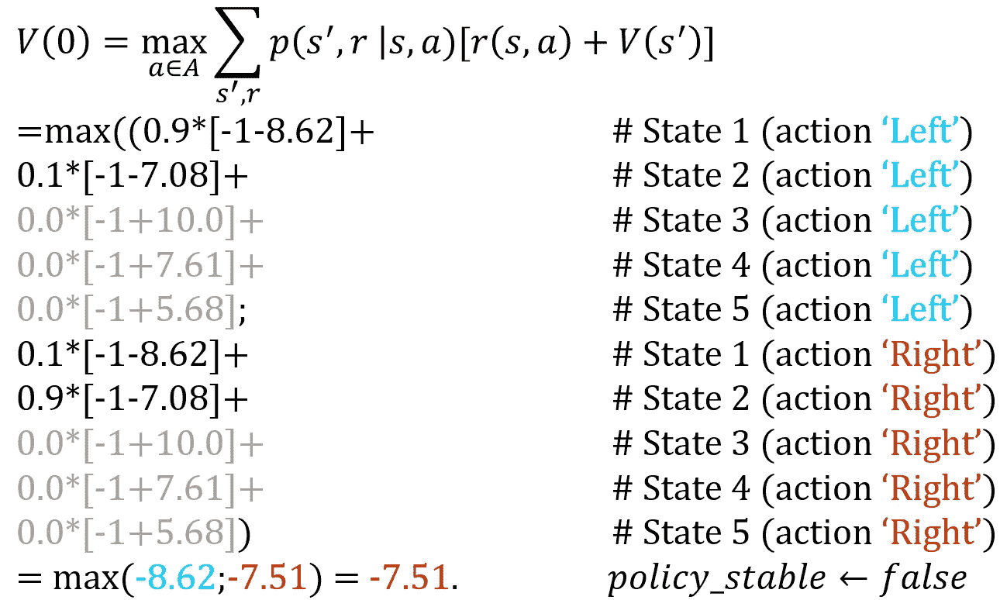

# 用 Python 实现策略迭代——一个最小的工作示例

> 原文：<https://towardsdatascience.com/implement-policy-iteration-in-python-a-minimal-working-example-6bf6cc156ca9?source=collection_archive---------2----------------------->

## 了解这个经典的动态规划算法，以优化解决马尔可夫决策过程模型

[斯科特·格雷厄姆](https://unsplash.com/@homajob?utm_source=medium&utm_medium=referral)在 [Unsplash](https://unsplash.com?utm_source=medium&utm_medium=referral) 上拍照

几天前我写了一篇关于[价值迭代](/implement-value-iteration-in-python-a-minimal-working-example-f638907f3437)(理查德·贝尔曼，1957)，今天是政策迭代的时候了(罗纳德·霍华德，1960)。**策略迭代**是求解马尔可夫决策过程模型的精确算法，保证找到最优策略。与值迭代相比，一个好处是有一个明确的停止标准——一旦策略稳定，它就是可证明的最优策略。然而，对于具有许多状态的问题，它通常具有较高的计算负担。

策略迭代是许多现代强化学习算法的基础，更具体地说是策略近似算法的[类。事实上，bertsekis(1996)将其解释为一个行动者-批评家模型，将政策更新与价值函数相结合。在讨论最接近的策略优化和自然策略梯度之前，先掌握这个基本算法是有意义的。](/the-four-policy-classes-of-reinforcement-learning-38185daa6c8a)

</the-four-policy-classes-of-reinforcement-learning-38185daa6c8a> [## 强化学习的四个策略类别

towardsdatascience.com](/the-four-policy-classes-of-reinforcement-learning-38185daa6c8a) 

# 策略迭代

与价值迭代相比，策略迭代更加广泛。萨顿和巴尔托(2019)将其分为三个步骤。

政策迭代算法[来源:萨顿&巴尔托(公开发表)，2019]

步骤 1 — **初始化** —设置(可能任意)值函数和策略。**值函数**给出了处于每个状态的感知值，**策略**是返回任何给定状态的动作的规则。

在步骤 2 — **策略评估** —以非常类似于值迭代的方式确定每个状态的值。然而，我们不是通过最大化所有操作来确定值，而是简单地使用当前策略来计算值。简而言之，我们将行动的价值`a=π(s)`(直接回报`r` +下游价值`V(s’)`)乘以转移概率`p`。更多细节——比如误差容限`θ`——请查看关于价值迭代的文章。

</implement-value-iteration-in-python-a-minimal-working-example-f638907f3437>  

步骤 3 — **策略改进** —寻求使用主流价值函数来改进策略。对于每个状态，它验证当前策略建议的行动是否确实是价值最大化行动。如果没有，则更新策略并重复步骤 2。该算法在这两个步骤之间交替，直到策略保持稳定。此时，达到了最优策略，算法终止。

对于价值迭代和策略迭代之间的直接比较，请在这里并排查看它们。

策略迭代(左)和价值迭代(右)的比较。关键区别在于策略迭代分离了评估和策略更新。[改编自萨顿&巴尔托出版社(公开发行)，2019 年]

# 一个最小的工作示例

编码示例的时间到了。我喜欢用非常简单的问题来演示算法，正如下面的简要概述所证明的那样。

# 问题是

感兴趣的问题是一维世界(一排瓷砖)。在中间，有一个瓷砖作为终止状态。落在这块瓷砖上产生+10 的奖励，在瓷砖间走动每移动一次花费-1。代理可以决定向左或向右移动，但最终有 10%的时间走错了方向。有了直接回报、预期下游回报和转移概率，它就具备了 MDP 的基本要素。

# 该算法

Python 算法与前面展示的数学过程没有太大的不同。注意，最大迭代次数是为了限制计算量而进行的简化。特别是，如果两个或多个策略执行得同样好，算法可能会在它们之间无休止地循环。

# 一些实验

是时候做点实验了。我将提供一些计算示例以及对结果的一些思考。

我们设置所有的值函数`V(s)=0`，并在`π=[0,0,0,0,0]`初始化策略(即总是向左移动)。

然后，我们转向政策评估。重申:在这一步中，我们根据**当前策略** `π`确定状态值。策略评估是一个迭代步骤，重复直到所有值都低于错误阈值`θ`。在这种情况下(状态 0，迭代 1)，初始估计值`V(0)`是 0。由于直接奖励是-1，误差`Δ`也是 1，我们需要重复。

第一步政策评估。在策略评估过程中，我们根据现行策略计算每个状态的值。重复评估步骤，直到值在预定的误差范围内。

达到正确的价值观需要一些时间。如果我们取`θ= 1e-10`，对于所有状态，我们需要在`Δ<θ`之前进行不少于 185 次迭代。我们获得`V=[-8.62, -7.08, 10.00, 7.61, 5.68]`。

现在，我们继续讨论政策改进。我们测试我们的初始策略(“始终向左”)是否确实是最优的— *剧透警告:*根据我们刚刚确定的值，它不是最优的。

状态 1 的第一个政策改进步骤。给定之前确定的状态值，我们验证当前策略是否是最佳的，或者不同的操作会产生更好的结果。如果我们可以通过采取不同的措施来改进当前策略，我们就更新策略并返回到策略评估。

显然，在最左边的瓷砖上，向右比向左好。因此，不符合停止标准。我们更新`π`并返回到策略评估步骤来重新计算值。

最终，我们应该到达一个政策不再改变的点。在这种情况下，它只是一个循环。更新策略后，我们在*策略评估*期间计算新的状态值(16 次迭代),并且在随后的策略改进步骤中不进行任何策略更改。算法已经终止，产生了`π=[1,1,0,0,0]`。

除此之外，其实没什么好说的。在`θ`和步骤 2 和步骤 3 之间的循环数之间有一个计算上的权衡，但是对于这个特殊的问题，它几乎无关紧要。

虽然在许多方面与值迭代相似，但注意策略迭代返回一个*策略*，而值迭代返回一组*值函数*。当转向近似(强化学习)算法时，这种区别变得相关。你可以有一个好的政策，而不需要很好的价值函数(或者甚至不知道它们)，你也可以有准确的价值函数，而不需要对政策本身有明确的理解。

# 最后的话

与值迭代一样，策略迭代是一种基本算法，许多近似算法都是从它派生出来的。在真正进入强化学习的世界之前，确保理解策略迭代。

*您可能感兴趣的一些更简单的工作示例:*

</a-minimal-working-example-for-deep-q-learning-in-tensorflow-2-0-e0ca8a944d5e>  </a-minimal-working-example-for-continuous-policy-gradients-in-tensorflow-2-0-d3413ec38c6b>  </a-minimal-working-example-for-discrete-policy-gradients-in-tensorflow-2-0-d6a0d6b1a6d7>  

# 参考

贝尔曼河(1957 年)。马尔可夫决策过程。*数学与力学学报*， *6* (5)，679–684。

Bertsekas 博士和 Tsitsiklis，J. N. (1996 年)。*神经动态规划*。雅典娜科技公司。

霍华德，R. A. (1960)。动态规划和马尔可夫过程。

萨顿和巴尔托(2019 年)。*强化学习:简介*。麻省理工出版社。