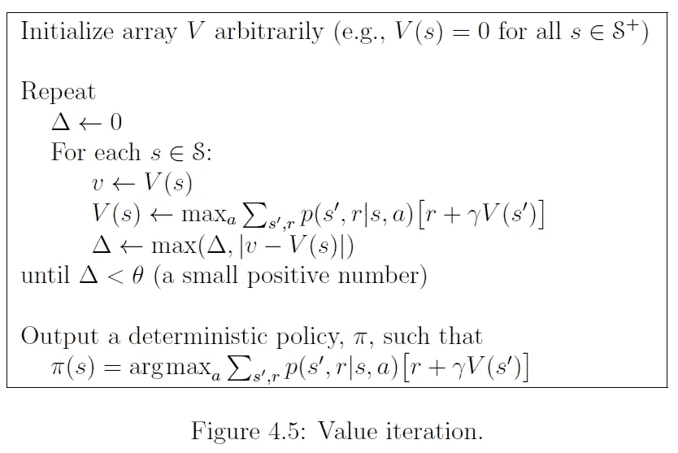
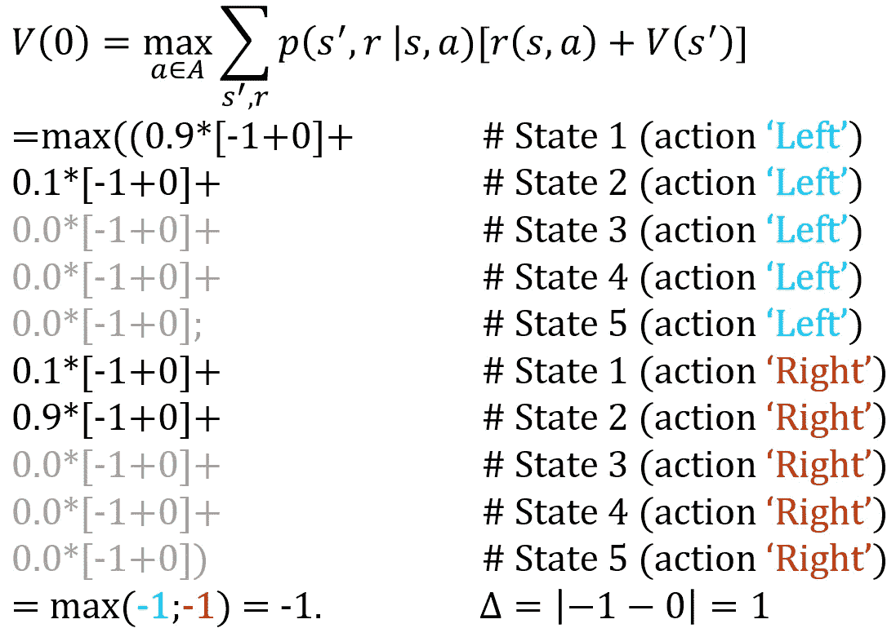

# 用 Python 实现值迭代——一个最小的工作示例

> 原文：<https://towardsdatascience.com/implement-value-iteration-in-python-a-minimal-working-example-f638907f3437?source=collection_archive---------1----------------------->

## 掌握简单和经典的动态规划算法，寻找马尔可夫决策过程模型的最优解

[莎伦·麦卡琴](https://unsplash.com/@sharonmccutcheon?utm_source=medium&utm_medium=referral)在 [Unsplash](https://unsplash.com?utm_source=medium&utm_medium=referral) 上的照片

在人工智能时代，精确算法并不完全是*热*。如果机器不能自己学习，那还有什么意义呢？为什么要费事去解决**马尔可夫决策过程**模型，而这些模型的解决方案无论如何都无法扩展呢？为什么不直接研究强化学习算法呢？

学习经典的**动态编程**技术仍然是值得的。首先，它们在实践中仍然被广泛使用。许多软件开发工作将动态编程作为面试过程的一部分。尽管您可以列举的状态和动作只有这么多，但您可能会惊讶于现实世界中的问题仍然可以通过优化来解决。

第二，即使只对强化收入感兴趣，该领域的许多算法都牢牢植根于动态编程。[在强化学习中可以区分四个策略类别](/the-four-policy-classes-of-reinforcement-learning-38185daa6c8a)，其中之一是**价值函数近似**。在使用这些方法之前，理解经典的值迭代算法是非常重要的。幸运的是，这篇文章恰好概述了这一点。

</the-four-policy-classes-of-reinforcement-learning-38185daa6c8a> [## 强化学习的四个策略类别

towardsdatascience.com](/the-four-policy-classes-of-reinforcement-learning-38185daa6c8a) 

# 价值迭代

价值迭代算法的优雅是值得钦佩的。它只需要几行数学表达式，而不是更多的代码行。让我们看看萨顿&巴尔托的开创性外延:

价值迭代算法[来源:萨顿&巴尔托(公开资料)，2019]

直觉相当简单。首先，你**为每个状态初始化**一个值，例如 0。

然后，对于每个状态，你**通过将每个动作的奖励`a`(直接奖励`r` +下游值`V(s’)`)乘以转移概率`p`来计算** **值** `V(s)`。

假设我们确实初始化为 0，并且直接奖励`r`是非零的。差异将直接在**差异**表达式`|v-V(s)|`中可见，其中`v`是旧的估计值，`V(s)`是新的估计值。因此，误差`Δ`将超过阈值`θ`(一个小值)，新的迭代随之而来。

通过执行足够多的迭代，算法将**收敛**到一点，在该点`|v-V(s)|<θ`对于每个状态。然后，您可以解析`argmax`来找到每个状态的最佳操作；知道真正的价值函数`V(s)`等同于拥有最优策略`π`。

请注意，如果`θ`设置过大，则不能保证**最优**。出于实际目的，合理的小误差容限就可以了，但是对于我们当中的数学爱好者来说，记住最优性条件是有好处的。

# 一个最小的工作示例

数学已经过时了，让我们继续编码的例子。把重点放在算法上，问题极其简单。

## 问题是

考虑一个一维世界(一排瓷砖)，只有一个终止状态。进入终结状态获得+10 奖励，其他动作花费-1。代理可以向左或向右移动，但是——为了不使它变得太微不足道——代理在 10%的时间里向错误的方向移动。这是一个非常简单的问题，但是它有(I)直接回报，(ii)预期下游回报，和(iii)转移概率。

## 该算法

Python 算法非常接近萨顿&巴尔托提供的数学大纲，所以不需要扩展太多。完整的代码符合一个要点:

## 一些实验

好吧，那就做些实验。我们首先详细展示了该算法的两次迭代。

首先，我们设置`v`等于`V(0)`，等于 0: `v=V(0)=0`

接下来，我们更新`V(0)`。注意`r`对于每个状态是固定的；我们实际上只通过`s’`对下一组状态求和。

值迭代步骤 1，状态 0[作者图片]

对于这样一个小问题来说，这似乎是很大的计算工作量。事实上，很容易理解为什么动态编程不能很好地扩展。在这种情况下，所有值`V(s)`仍然为 0——正如我们刚刚开始的那样——所以估计的状态值`V(0)`就是直接奖励-1。

让我们再尝试一个，更进一步。同样的计算，但是现在值`V(s)`已经在几次迭代中更新了。我们现在有`V=[5.17859, 7.52759, 10.0, 7.52759, 5.17859]`。同样，我们插入这些值:

值迭代步骤 4，状态 0[作者图片]

因此，我们将`V(0)`从 5.18 更新到 5.56。误差将是`Δ=(5.56–5.18)=0.38`。反过来，这将影响其他状态的更新，并且对于所有状态，该过程持续到`Δ<θ`。对于状态 0，最佳值是 5.68，在 10 次迭代内命中。

这里要测试的最有趣的参数是误差容限`θ`，它影响收敛前的迭代次数。

各种误差容差θ所需的迭代次数。容差越低，算法收敛前需要的迭代次数就越多。

# 最后的话

值迭代是强化学习的基石之一。很容易实现和理解。在转向更高级的实现之前，请确保掌握这个基本算法。

*您可能感兴趣的一些其他最小工作示例:*

</implement-policy-iteration-in-python-a-minimal-working-example-6bf6cc156ca9>  </a-minimal-working-example-for-deep-q-learning-in-tensorflow-2-0-e0ca8a944d5e>  </a-minimal-working-example-for-continuous-policy-gradients-in-tensorflow-2-0-d3413ec38c6b>  </a-minimal-working-example-for-discrete-policy-gradients-in-tensorflow-2-0-d6a0d6b1a6d7>  

# 参考

萨顿，理查德 s 和安德鲁 g 巴尔托。*强化学习:简介*。麻省理工学院出版社，2018。