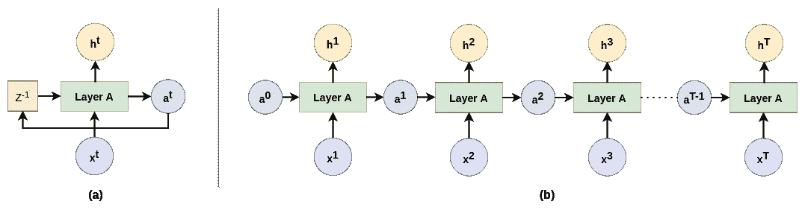
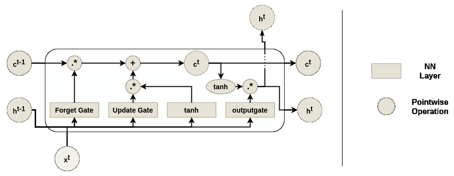
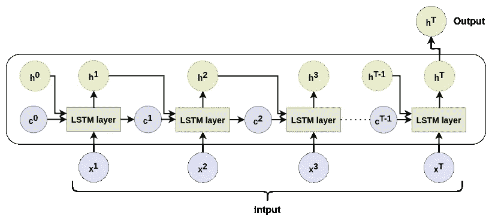
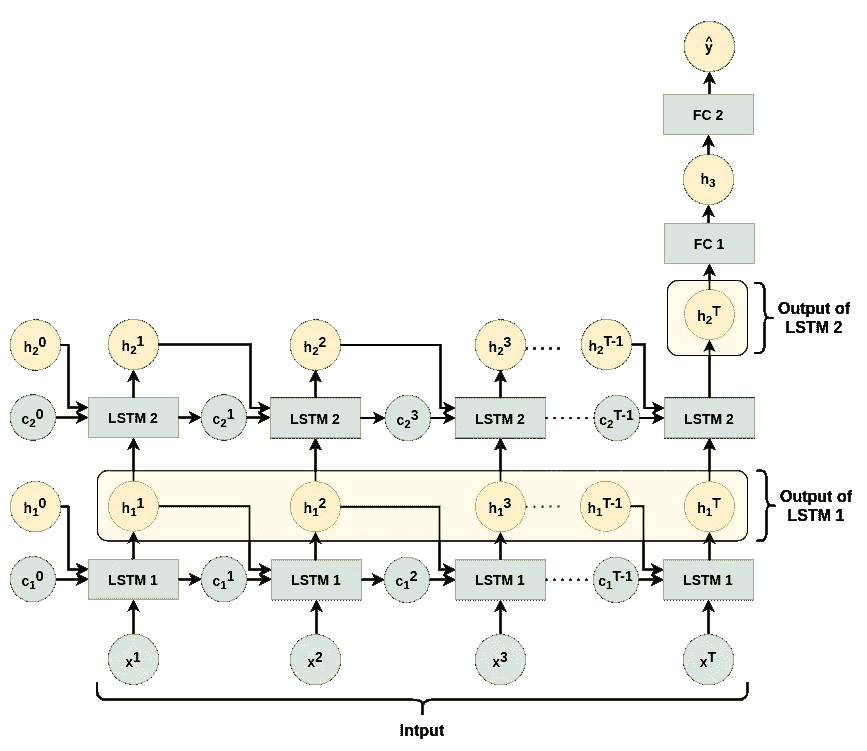

# LSTM 层的实现差异:TensorFlow 与 PyTorch

> 原文：<https://towardsdatascience.com/implementation-differences-in-lstm-layers-tensorflow-vs-pytorch-77a31d742f74?source=collection_archive---------5----------------------->

## 在张量流 LSTM 层和 PyTorch LSTM 层之间画平行线。

照片由[安娜·涅克拉舍维奇](https://www.pexels.com/@anna-nekrashevich)从[派克斯](https://www.pexels.com/photo/pen-business-eyewear-research-6801648/)拍摄

Tensorflow 和 Pytorch 是深度学习中使用最广泛的两个库。当涉及到实现神经网络时，这两个库有不同的方法。这两个库都有很大的不同。通常，TF 由于其更好的优化而更倾向于开发生产就绪的模型，Pytorch 由于其更“pythonic 化”的语法和急切的执行而更倾向于研究工作。但是有了 Torchscript 和 TF 2.0，两个库的差距缩小了。

这两个图书馆都有很好的社区支持和积极的贡献。因此，我们可以很容易地实现不同类型的神经网络，而在这两个库中没有任何重大问题。但是这两个库在架构上有所不同。因此，在实现神经网络时，我们需要关注某些差异。

其中一个区别是层 API。在这两个库中，可以使用子类方法或顺序模型 API 方法来设计神经网络(NN)。子类化方法是这两种方法中更受欢迎的，因为它是面向对象的和可扩展的。在这些库中实现神经网络时，我们可以使用已经设计好的层——线性(完全连接)层、卷积层、递归层等。并将它们扩展到我们的模型中。在 TF 中，我们使用`tensorflow.keras.layers`，在 Pytorch 中，我们使用`torch.nn`来访问这些层。正如我前面提到的，这些层的实现有细微的差别。大多数时候，它们都是次要的，直观的。但是在 LSTM(长短期记忆)层，这些差异有些主要和显著。在 LSTM 图层中，Pytorch 和 TF 的图层参数化方式、参数的默认值以及图层的默认输出都有很大不同。

在这篇文章中，我将尝试解释这两个库中 LSTM 层的区别。如果有人提到在一个库中实现的 NN(带有 LSTM 层)并试图在另一个库中复制它，我希望这能有所帮助。

# LSTM 介绍

> 我添加这一部分只是为了完善和复习(如果有人需要的话)。但是如果你正在尝试理解使用 LSTM 层时的实现差异，那么我希望你已经有了深度学习的背景，并且知道 LSTMs 的基础知识。所以你可以跳过这一部分。

递归神经网络(RNN)是一种特殊类型的神经网络，用于从序列数据中学习。传统的神经网络会接受一个输入，并仅基于该输入给出预测。它不会查看以前的输入/输出并做出决定。但是当预测序列数据中的下一个值时(例如，句子，一个城市的日平均温度)，我们不能只看当前的数据点。我们必须把这个系列的行为(到目前为止)作为一个整体来看待，并获得“系列的背景”来做出有意义的预测。这就是 rnn 的专业用途。rnn 用于诸如语言建模、机器翻译、序列预测等任务。

图 1 示出了 RNN 如何将当前值和先前的横向输出作为输入。递归机制传递前一时间步的横向输出(如`aᵗ`)。预计(并证明)RNN 层将学会捕捉横向输出中序列的“上下文”。请注意，为了更好地理解，图 1 (b)中所示的 RNN 的展开版本将**相同的** **层**描绘为副本，并不表示多个层。

图 1 — (a)具有环路的一般 rnn(z⁻表示单位时间延迟)。(b)相同的 RNN，时间序列循环展开(由作者绘制，灵感来自 [Chris](https://colah.github.io/posts/2015-08-Understanding-LSTMs/) 的作品)

RNN 的设计原则期望从系列中较早的值得到的“上下文”沿着序列持续很长一段时间。但是在实际场景中观察到，RNN 人学习序列“上下文”的能力随着距离的增加而减弱。也就是说，rnn 不足以捕获序列中的长期依赖性。长短期记忆(LSTM)网络是 RNN 的一个特殊版本，它的引入是为了在序列中保存长期的“上下文”信息。LSTMs 的固有设计使它们能够通过所谓的单元状态(用`cᵗ`表示)来捕捉长期环境。下图(图 2)显示了一个典型的 LSTM 图层。我使用的图表是基于 Chris Olah 在关于[理解 LSTMs](https://colah.github.io/posts/2015-08-Understanding-LSTMs/) 的博客文章中使用的图表。(很精彩的博文。一定要去看看。)

图 2——一个基本的 LSTM 图层(由作者绘制，灵感来自克里斯的作品)

正如 Chris 在他的博客中解释的那样，细胞状态可以被认为是一个传送带，它从序列的开始到结束携带着长期的“上下文”。在基于当前输入(`*x*ᵗ`)和先前输出(`hᵗ⁻¹`)的每个时间步，LSTM 层决定从“上下文”中忘记什么信息以及将什么信息添加到“上下文”中。遗忘由遗忘门处理(`Γ𝒻`)。`Γ𝒻`可以被认为是一个应用于`cᵗ⁻¹`的面具。如果`Γ𝒻`中某个位置的值为 0(或更接近)，当与`cᵗ⁻¹`相乘时，从上下文中删除该位置的信息。如果掩码的值在某个其他位置为 1(或更接近)，在与`cᵗ⁻¹`相乘后，它允许该位置的信息在上下文中保持不变。操作`Γ𝒻.*cᵗ⁻¹` ( *)。* —逐元素乘法*)确保上下文中不需要的部分被忽略。向单元状态添加新信息分两步处理。首先，基于`*x*ᵗ`和`hᵗ⁻¹`，通过激活`tanh`的子层创建候选向量(`c̃ᵗ`)。然后，更新门(`Γᵤ`)生成一个掩码(就像在遗忘门中一样)，该掩码决定将候选向量的哪一部分添加到单元状态中。然后将`Γᵤ.*c̃ᵗ`加到`cᵗ⁻¹`上生成`cᵗ`。最后，为了生成输出，我们让`cᵗ` 通过一个`tanh`非线性并使用它。但是为了决定给出哪一部分，我们使用了更新门(`Γₒ`)。`Γₒ.*tanh(cᵗ)`作为 LSTM 层在时间步长`t`的输出给出。

请注意，`cᵗ⁻¹`和`hᵗ⁻¹`都是作为 LSTM 层的横向输入给出的，相比之下，普通 RNN 层只给出了`aᵗ⁻¹`。

如果你需要更多关于 RNN 和 LSTM 原理的信息，我会推荐你去吴恩达的[序列模型](https://www.coursera.org/learn/nlp-sequence-models)课程的第一周(可以免费旁听)并阅读克里斯·奥拉的这篇精彩的[博客文章](https://colah.github.io/posts/2015-08-Understanding-LSTMs/)。

# 张量流中的 LSTM 层

> 在撰写本文时，Tensorflow 版本是 2.4.1

在 TF 中，我们可以使用`tf.keras.layers.LSTM`并创建一个 LSTM 层。初始化 LSTM 层时，唯一需要的参数是`units`。参数`units`对应于该层的输出特征数量。用我们的术语来说就是`units` = `nₕ`。`nₓ`将根据前一层的输出进行推断。因此，该库可以初始化 LSTM 层中的所有权重和偏置项。

TF LSTM 层期望一个三维张量作为正向传播期间的输入。这个输入应该是`(batch, timesteps, input_features)`的形状。这显示在下面的代码片段中。假设我们正在使用这个 LSTM 层来训练一个语言模型。我们的输入将是句子。第一个维度对应于我们使用多少个句子作为一批来训练模型。第二个维度对应于一个这样的句子中有多少单词。在实际设置中，每个句子的字数因句而异。因此，为了批量处理这些句子，我们可以选择训练语料库中最长句子的长度作为这个维度，并用尾随零填充其他句子。最后一个维度对应于用于表示每个单词的特征的数量。为了简单起见，如果我们说，我们正在使用一个热编码，并且在我们的词汇表中有 10000 个单词，那么这个维度将是 10000。

但是在初始化层的时候，如果我们设置了`time_major = True`，那么输入将会在 shape - `(timesteps, batch, feature)`中被期望。

从上面的代码片段可以看出，LSTM 的输出(带有默认参数)是形状`(32,4)`，它对应于`(batch, output_features)`。因此，如果我们回到语言模型的例子，输出每个句子有一个向量，每个句子有`nₕ`个特征(`nₕ` = `units` =输出特征的数量)。这一个向量(每个句子)是对应于最后时间步长`T`(句子的最后一个单词)的 LSTM 层的输出。这个输出在我们的符号中是`hᵀ`。这在图 3 中进行了描述。

图 3-tensor flow LSTM 图层的默认输出(图表由作者提供)

但是，如果我们想要堆叠多个 LSTM 图层，下一个图层也需要一个时间序列作为输入。在这种情况下，我们可以在初始化层时设置`return_sequences=True`。那么输出将是对应于`(batch, timesteps, output_features)`的形状`(32,10,4)`。如果`return_sequence`设置为`True`，那么`hᵗ : ∀t = 1,2…T`将作为输出返回。这显示在下面的代码片段和图 4 中的第一个 LSTM 层。

图 4 —一个简单的模型，包含两个 LSTM 层和两个完全连接的层。注意`LSTM 1`层输出一个序列，LSTM 2 输出一个单一矢量。(作者配图)

如果我们想获得单元状态(`cᵗ`)作为输出，我们需要在初始化层时设置`return_state=True`。然后我们得到一个 3 个张量的列表作为输出。根据[文档](https://www.tensorflow.org/api_docs/python/tf/keras/layers/LSTM)，如果我们同时设置`return_sequences=True`和`return_state=True`，那么这三个张量将是——`whole_seq_output, final_memory_state,`和`final_carry_state`。这显示在下面的代码片段中。

在我们的符号中，

*   `whole_seq_output` —所有时间步长对应的输出。
    `hᵗ : ∀t = 1,2…T`；形状— `(batch, timesteps, output_features)`
*   `final_memory_state` —对应于最后一个时间步长的输出。
    `hᵀ`；形状— `(batch, output_features)`
*   `final_carry_state` —最后一个单元格状态。
    T1；形状— `(batch, output_features)`

如果我们设置`return_sequences=False`和`return_state=True`，那么这三个张量就是——`final_memory_state, final_memory_state,` 和`final_carry_state`。

单个 LSTM 层有五个使用激活函数的地方。但是如果我们查看参数，我们只看到两个参数来设置激活函数— `activation`和`recurrent_activation`。如果我们给`activation`参数设置一个值，它会改变应用于候选向量的激活和应用于单元状态的激活，就在与输出门进行逐元素乘法之前。将值设置为`recurrent_activation`将改变忽略门、更新门和输出门的激活功能。

其他参数很容易理解或者很少使用。还有一点需要注意的是，我们可以设置`unroll=True`，网络就展开了。这将加快训练过程，但会占用大量内存(因为同一层会被复制多次)。

下面的代码片段使用 TF 实现了图 4 所示的模型。注意每层的输出形状和每层中可训练参数的数量。

图 4 中模型的张量流实现。

# Pytorch 的 LSTM 层

> 在撰写本文时，Pytorch 版本是 1.8.1

在 Pytorch 中，可以使用`torch.nn.LSTM`创建一个 LSTM 层。初始化时需要两个参数`input_size`和`hidden_size`。`input_size`和`hidden_size`分别对应于该层的输入特征数和该层的输出特征数。在我们的术语中，`hidden_size` = `nₕ`和`input_size` = `nₓ`。

在正向传播期间，Pytorch LSTM 层期望一个三维张量作为输入(类似于 TF)。但是维度的默认顺序发生了变化。输入张量的形状应该是`(timesteps, batch, input_features)`。如果想得到和 TF 一样的维数阶，就应该在层初始化的时候设置`batch_first=True`。

Pytorch LSTM API 中可以看到的另一个主要区别是，在启动时，我们可以设置`num_layers=k`并启动一个作为单个对象堆叠的`k` LSTM 层块。然而，我个人不喜欢这种方法，因为它使得整个实现可读性和可维护性更差。

下一个大的区别是 Pytorch LSTM 图层的输出。Pytorch LSTM 图层的输出是包含两个元素的元组。元组的第一个元素是形状为`(timesteps, batch, output_features)`的所有时间步长(`hᵗ : ∀t = 1,2…T`)对应的 LSTM 输出。元组的第二个元素是具有两个元素的另一个元组。这个二元组的第一个元素是对应于最后一个时间步长的输出(`hᵀ`)。它的形状是`(1, batch, output_features)`。这个第二元组的第二个元素是对应于最后一个时间步长的单元状态(`cᵀ`)。它也有形状`(1, batch, output_features)`。如果我们已经通过设置`num_layers=k`将 LSTM 初始化为堆叠层的块，那么`hᵀ`和`cᵀ`将具有形状`(k, batch, output_features)`。这里，`hᵀ`和`cᵀ`都具有堆栈中所有 k 层的最后状态。进一步在初始化时，如果我们设置了`batch_first=True`，那么`timesteps`和`batch`尺寸将在输出中交换(类似于输入)。

据我所知，在 Pytorch 中改变 LSTM 层内部的激活函数是不可能的。此外，不可能限制 LSTM 层只给出一个输出(如在 TF 中)。但是，我们可以将输出分配给变量，使用所需的输出，忽略其他输出，如下面的代码段所示。除此之外，其他参数应该是不言自明的。

注意，如果你设置 LSTM 层是双向的(我在这篇文章中没有谈到)，那么输出形状将与我上面提到的不同。请参考[文档](https://pytorch.org/docs/stable/generated/torch.nn.LSTM.html)了解这种情况。

下面的代码片段使用 Pytorch 实现了图 4 所示的模型。注意每层的输出形状和每层中可训练参数的数量。

图 4 中模型的 Pytorch 实现。

如果我们观察图 4 中模型的两种实现中的参数数量。可以观察到，LSTM 层中的参数数量存在差异。这又是一个设计选择。Pytorch 在实现 LSTM 方程(1)、(2)、(3)和(4)时做了微小的改变。TF 在每个方程中加入一个偏置向量(如我们的方程中所示)。但是 Pytorch(如这里的[所示](https://pytorch.org/docs/stable/generated/torch.nn.LSTM.html))为每个等式添加了**两个偏置向量**。由于每个偏置向量的形状是`(nₕ,1)`并且每层有四个这样的附加向量，因此 Pytorch LSTM 层中将有更多的`4*nₕ`个参数。在`LSTM1`层`nₕ=8`，所以有 32 个附加参数。在`LSTM2`层`nₕ=4`，所以多了 16 个参数。

# 参考

  <https://medium.com/analytics-vidhya/demystifying-lstm-weights-and-biases-dimensions-c47dbd39b30a> [## 揭秘 LSTM 权重和偏见维度。

medium.com](https://medium.com/analytics-vidhya/demystifying-lstm-weights-and-biases-dimensions-c47dbd39b30a)   <https://stackoverflow.com/questions/44947842/can-someone-explain-to-me-the-difference-between-activation-and-recurrent-activa> 