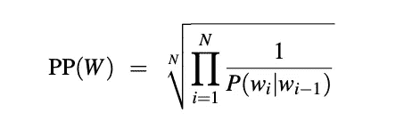

# 用 python 从头开始实现字符级三元模型语言模型

> 原文：<https://towardsdatascience.com/implementing-a-character-level-trigram-language-model-from-scratch-in-python-27ca0e1c3c3f?source=collection_archive---------7----------------------->

## 预测是困难的，但它可以在小的方面得到解决，比如预测某人将要说的下几个单词或完成正在键入的单词或句子的下几个字符。这就是我们将要尝试去做的。


作者图片

本文的完整代码可以在[这里](https://github.com/cleopatra27/Ngram-Model/blob/main/trigram_modelling.py)找到

# 什么是 N-gram

N-gram 是来自给定文本或语音样本的 N 个项目(在这种情况下是单词)的序列。例如，给定文本“Susan 是一个善良的灵魂，她会帮助你，只要这是在她的界限之内”从开头开始的上述文本的样本 n-gram 是:

**unigram** : ['苏珊'，'是'，' a '，'善良'，'灵魂'，'她'，'意志'，'帮助'…………。]

**bigram** : ['苏珊是'，'是一个'，'一个善良'，'善良的灵魂'，'灵魂她'，'她会'，'会帮助'，'帮助你'…………。]

**三元组** : ['苏珊是一个'，'是一种'，'一个善良的灵魂'，'善良的灵魂她'，'灵魂她会'，'她会帮助你'…………。]

从上面的例子中，我们可以看到 n-grams 中的 ***n*** 可以是不同的值，1 个 gram 的序列称为一元 gram，2 个 gram 的序列称为二元 gram，3 个 gram 的序列称为三元 gram。

# 三元模型

我们将在本文中讨论三元模型。

**二元模型**通过仅使用前面单词的条件概率来近似给定所有前面单词的单词的概率，而**三元模型**查看过去的两个单词。

因此，基于以上所述，为了计算给定先前单词 x，z 的单词 y 的特定三元模型概率，我们将计算三元模型 C(xzy)的计数，并通过共享相同单词 x 和 z 的所有三元模型的总和进行归一化，这可以使用以下等式来简化:


作者图片

也就是说，为了计算单词“soul”的特定三元模型概率，给定前面的单词“kind”、“hearted”，我们将计算三元模型 C(“kind hearted soul”)的计数，并通过共享相同第一单词“kind hearted”的所有三元模型的总和进行归一化。

我们总是以对数概率的形式表示和计算语言模型的概率。因为概率(根据定义)小于或等于 1，所以我们相乘的概率越多，乘积就越小。将足够多的 n 元文法相乘会导致数字下溢，所以我们使用对数概率，而不是原始概率。对数空间中的相加相当于线性空间中的相乘，所以我们通过相加来组合对数概率。

# 密码

我们将使用来自古腾堡项目的大量数据。这包含了来自不同书籍的段落。我们将以预测人物的人物级三元模型语言模型为例，考虑奥斯汀的这句话:
***艾玛·伍德豪斯，英俊、聪明、富有，拥有舒适的家庭和快乐的性情，似乎联合了一些最好的存在的祝福；在这个世界上生活了近 21 年，很少让她苦恼或烦恼。***

下面是这个句子中字符级三元组的一些例子:
***Emm，mma，Woo，ood，…***

首先，我们将对我们的数据做一些预处理，我们将把所有段落中的单词组合成一个大的语料库，删除数字值(如果有的话)，并加双空格。

```
def preprocess(self):
    output = ""
    for file in self.texts:
        with open(os.path.join(os.getcwd(), file), 'r', encoding="utf-8-sig", errors='ignore') as suffix:
            sentence = suffix.read().split('\n')
            for line in sentence:
                output += " " + line
    return output
```

接下来是生成 n 元文法的代码，我们将编写一个通用函数，它接受我们的语料库以及描述我们希望如何划分 n 元文法的值。见下文:

接下来，我们构建一个计算词频的函数，当看不到这个词时，我们将通过用一个普通字符替换频率低于 5 的词来平滑这个例子，在这个例子中， **UNK** 。

```
def UNK_treated_ngram_frequency(self, ngram_list):
    frequency = {}
    for ngram in ngram_list:
        if ngram in frequency:
            frequency[ngram] += 1
        else:
            frequency[ngram] = 1

    sup = 0
    result = {}

    for k, v in frequency.items():
        if v >= 5:
            result[k] = v
        else:
            sup += v
    result["UNK"] = sup
    return result
```

接下来，我们有了三元模型，我们将对未知概率使用拉普拉斯加一平滑，我们还将把所有概率(在对数空间中)加在一起:

# 评估我们的模型

有两种不同的方法来评估和比较语言模型，**外在评估**和**内在评估。**我们将从本质上进行评估，因为这是一种**快速**评估模型的有用方式。我们将用一种叫做**困惑的度量来评估，这是一种内在的评估方法，虽然**不如内在评估好，但是[这篇文章](/perplexity-in-language-models-87a196019a94)可以更好地解释评估概念。

我们将通过模型在一些测试数据上的表现来衡量模型的质量。语言模型在测试集上的困惑度是测试集的逆概率，用单词数归一化。因此单词序列的条件概率越高，困惑度越低，并且最大化困惑度等同于根据语言模型最大化测试集概率。

对于我们的例子，我们将使用困惑来比较我们的模型和两个测试句子，一个是英语，另一个是法语。

困惑度的计算方法如下:



作者图片

实现为:

```
def perplexity(total_log_prob, N):
    perplexity = total_log_prob ** (1 / N)
    return perplexity
```

测试下面的两个句子，我们得到以下困惑:

```
perp = self.perplexity(sum_prob, len(trigram_value))
print("perplexity ==> ", perp)
```

英语句子:0.1 的困惑。36860.68868688661

```
If we do not change our economic and social policies, we will be in danger of undermining solidarity, the very value on which the European social model is based.
The rapid drift towards an increasingly divided society is happening not only in Europe but also on a much wider scale. An entire continent, Africa - about which you made a highly relevant point in your speech, Prime Minister - has lost contact even with the developing world.
We must do everything in our power to stop this unjust development model and to give voices and rights to those who have neither.
Ladies and gentlemen, Prime Minister, the Laeken Summit and declaration are also vitally important for another reason.
Laeken must determine how we are to structure the second stage of the 'Future of Europe' debate.
```

法语句子:0.2 的困惑。56860.68868888661

```
Je suis reconnaissante à la Commission d' avoir adopté ce plan d' action.
Cependant, la condition de son applicabilité est que les personnes atteintes d' un handicap puissent disposer des moyens financiers nécessaires, et qu' elles aient la possibilité purement physique de passer les frontiÚres.
Il serait intéressant de savoir si la Commission est aussi disposée à débloquer des fonds en faveur des personnes handicapées, pour qu' elles puissent, elles aussi, parcourir le monde, aussi loin que pourra les emmener le fauteuil roulant.
J'ai mentionné la directive que la Commission a proposée pour l'aménagement des moyens de transport collectifs, afin que les handicapés puissent les utiliser.
Le Conseil n'a pas encore fait avancer cette question, qui en est au stade de la concertation.
```

不出所料，我们的模型被法语句子搞糊涂了，目前这已经足够好了，但是，我们的模型还可以改进。

欢迎评论和反馈。

不要忘记点击“关注”按钮。